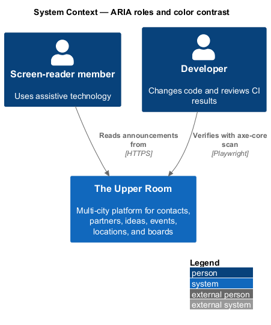
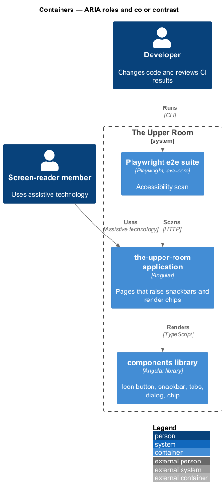
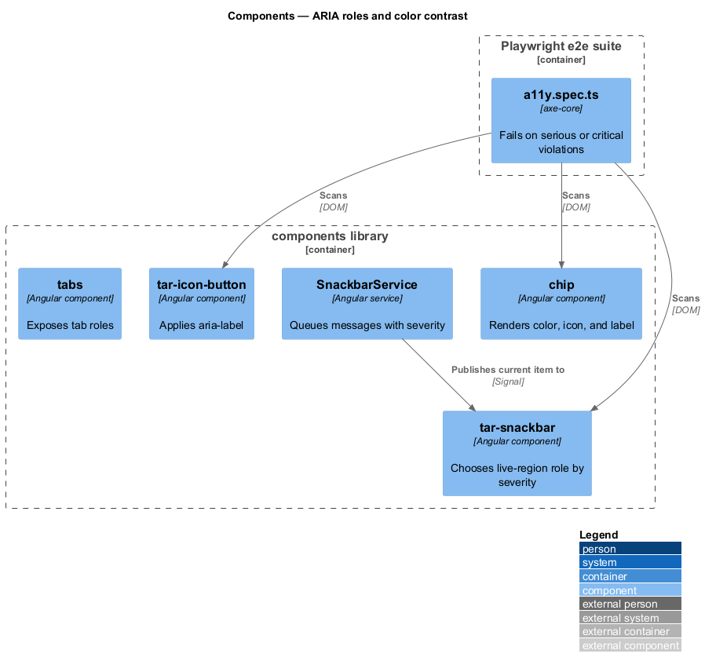
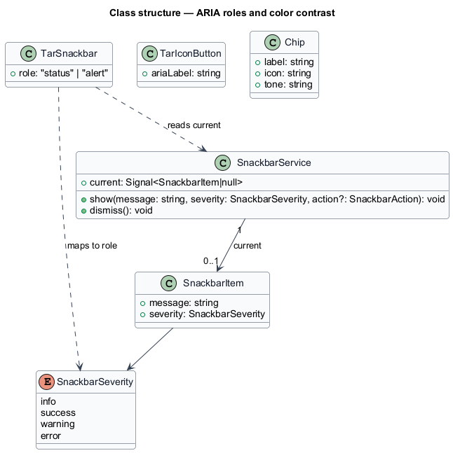
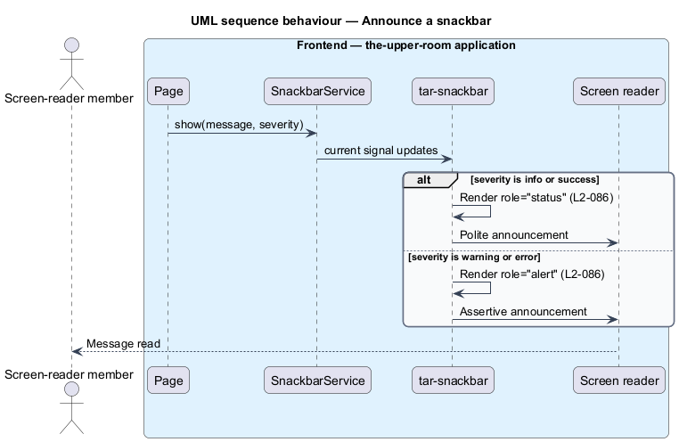
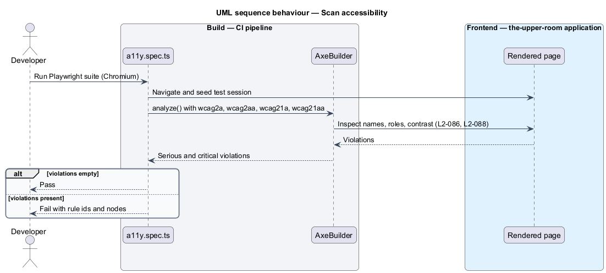

# ARIA roles and color contrast

## Overview

Screen-reader users depend on programmatic names, roles, and live regions, and low-vision users depend on sufficient contrast and cues other than color. This feature defines how the shared component library exposes those semantics.

**live region** — element whose text changes are announced by assistive technology without moving focus

**color independence** — property that no information is conveyed by color alone

The feature is cross-cutting and is realized in the shared components (icon button, snackbar, tabs, dialog, chip) and verified by an axe-core scan in the e2e suite.

## Description

### Existing implementation

The following source elements provide the current implementation points. Their presence does not establish complete requirement coverage.

| Source | Concrete elements | Observed surface |
|---|---|---|
| [frontend/projects/components/src/lib/icon-button](../../../../frontend/projects/components/src/lib/icon-button) | `tar-icon-button` with `ariaLabel` input | Shell passes `ariaLabel="Open navigation"` to the drawer toggle |
| [frontend/projects/components/src/lib/snackbar/tar-snackbar.service.ts](../../../../frontend/projects/components/src/lib/snackbar/tar-snackbar.service.ts) | `SnackbarService`, `SnackbarSeverity` | Severities `info`, `success`, `warning`, `error`; queue; durations 4000, 5000, 7000, 0 ms |
| [frontend/projects/components/src/lib/snackbar/tar-snackbar.html](../../../../frontend/projects/components/src/lib/snackbar/tar-snackbar.html) | `tar-snackbar` template | Live-region role attribute `<TO SUPPLY>`; no `role="status"` or `role="alert"` located by search |
| [frontend/projects/components/src/lib/tabs](../../../../frontend/projects/components/src/lib/tabs) | Tabs component | Tab roles `<TO SUPPLY>` |
| [frontend/projects/components/src/lib/chip](../../../../frontend/projects/components/src/lib/chip) | `chip`, `chip-set` | Status chips; icon plus label usage `<TO SUPPLY>` |
| [frontend/projects/the-upper-room/e2e/tests/hardening/a11y.spec.ts](../../../../frontend/projects/the-upper-room/e2e/tests/hardening/a11y.spec.ts) | axe-core scan | WCAG 2.0/2.1 A and AA tags; serious and critical violations fail |

### Target behavior and interfaces

Every icon-only control shall carry an `aria-label`. Every form field shall carry a visible label or an `aria-label`.

The snackbar shall render `role="status"` for `info` and `success`, and `role="alert"` for `warning` and `error`.

Tabs shall expose `tablist`, `tab`, and `tabpanel` roles. Dialogs shall expose `role="dialog"`, `aria-modal="true"`, `aria-labelledby`, and `aria-describedby`.

Status chips shall pair color with an icon and a text label. Contrast ratios follow L2-001.

### Gaps and compatibility

- The snackbar service models severity, but the template does not expose the live-region roles required by the requirement.
- The a11y e2e scan covers `/sign-in` and a protected-route list; coverage of every component state `<TO SUPPLY>`.
- The contrast rules of L2-001 belong to the design-system subsystem and are referenced, not redefined, here.

Production implementation shall follow [AGENTS.md](../../../../AGENTS.md), including incremental acceptance testing. Existing behavior shall remain compatible until an explicit change is approved.

## Requirements

The table preserves the requirement statement and all parent identifiers. The expandable source excerpts retain the complete normative text and acceptance criteria verbatim.

| L2 ID | Refines (L1) | Requirement |
|---|---|---|
| [L2-086](../../../specs/L2.md#l2-086-aria-roles-and-labels) | `L1-018` | Every icon button must have an `aria-label`. Every form field must have a label or `aria-label`. Live regions: `role="status"` for snackbars (info/success), `role="alert"` for snackbars (warning/error). Tabs use `role="tablist"`, `role="tab"`, `role="tabpanel"`. Dialogs use `role="dialog"`, `aria-modal="true"`, `aria-labelledby`, `aria-describedby`. |
| [L2-088](../../../specs/L2.md#l2-088-color-contrast-and-color-independence) | `L1-018` | Contrast ratios per L2-001. No information may be conveyed by color alone (e.g. status chips include both color and an icon/text label). |

L2-086: ARIA Roles and Labels — specification excerpt

Every icon button must have an `aria-label`. Every form field must have a label or `aria-label`. Live regions: `role="status"` for snackbars (info/success), `role="alert"` for snackbars (warning/error). Tabs use `role="tablist"`, `role="tab"`, `role="tabpanel"`. Dialogs use `role="dialog"`, `aria-modal="true"`, `aria-labelledby`, `aria-describedby`.

**Acceptance Criteria:**
1. Given an icon-only "Edit" button, when screen-reader-tested, then it announces "Edit".
2. Given an error snackbar appears, when announced, then it is read with assertive priority.

L2-088: Color Contrast and Color Independence — specification excerpt

Contrast ratios per L2-001. No information may be conveyed by color alone (e.g. status chips include both color and an icon/text label).

**Acceptance Criteria:**
1. Given a status chip "Cancelled", when rendered, then it includes the text "Cancelled" and an icon, not just a red background.

## Diagrams

### System context

The context identifies the people and external systems around this capability.

### Container view

The container view separates browser, API, build, and data responsibilities for this capability.

### Component view

The component view shows the concrete implementation points and the target responsibilities that collaborate in this slice.

### Type structure

The structure view lists the types in this slice with members where known. Dashed dependencies denote target collaboration rather than verified current dependency direction.

### Announce a snackbar by severity

The sequence shows an error snackbar rendered with assertive priority and an info snackbar rendered with polite priority.

### Scan pages for violations and color-only cues

The sequence shows the e2e scan loading a page and failing on serious or critical violations, including controls without names.

