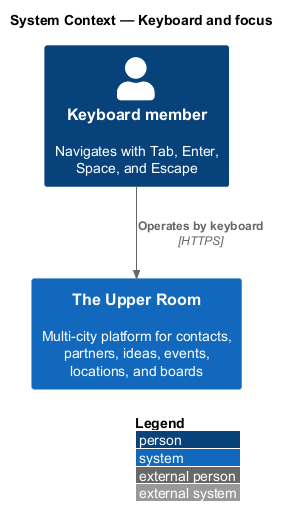
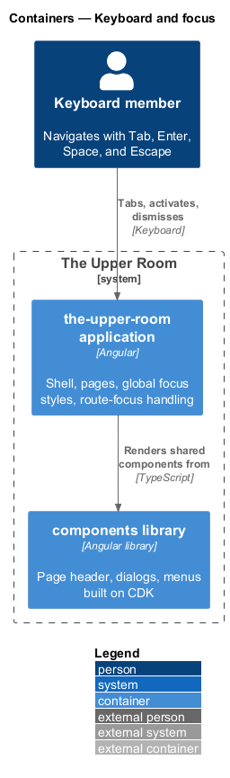
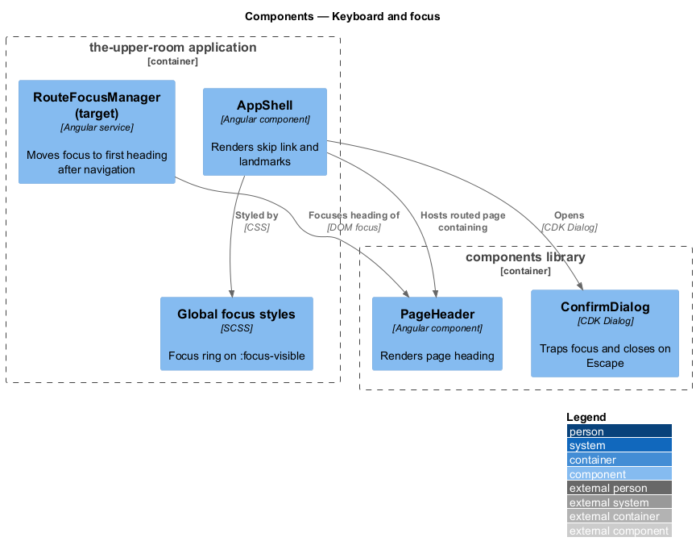
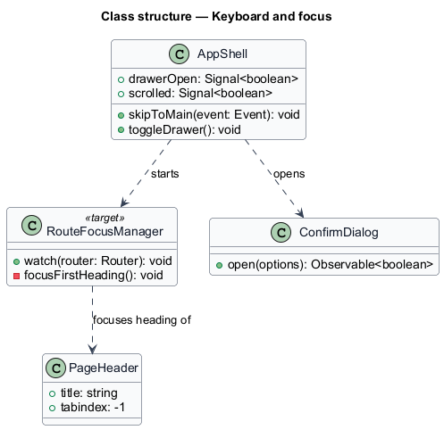
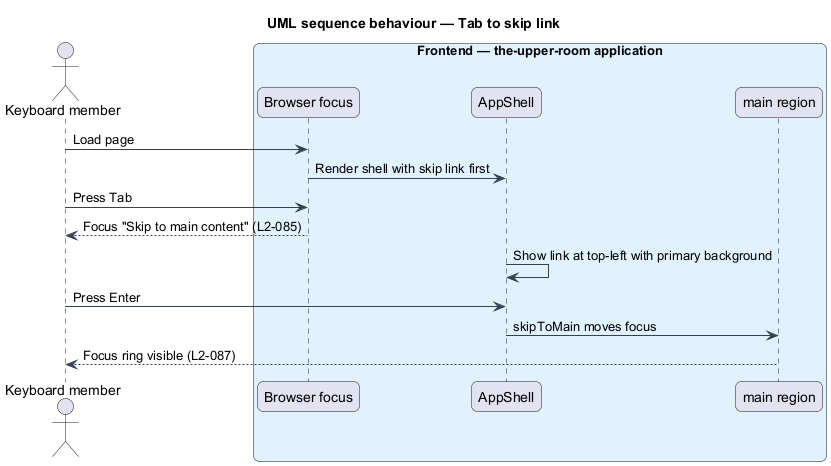
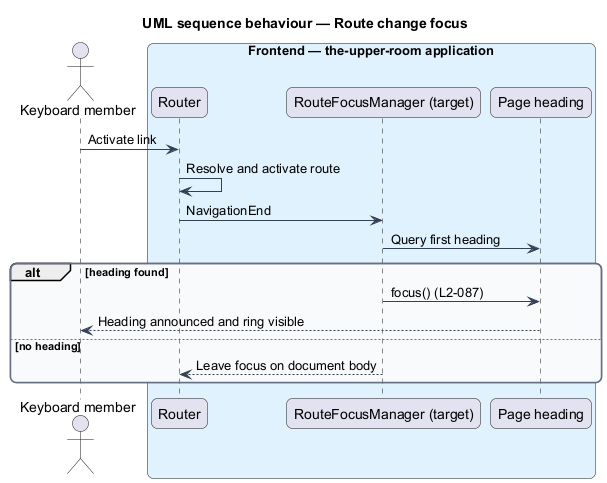
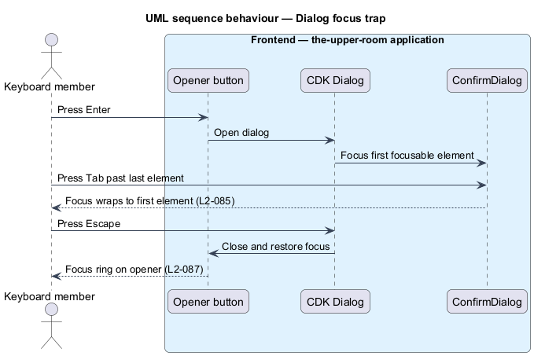

# Keyboard and focus

## Overview

The Upper Room is used by members who navigate by keyboard or assistive technology. Keyboard and focus support lets such members reach, operate, and dismiss every interactive element, and always see where focus is.

**skip link** — first focusable element of a page that moves focus past repeated navigation to the main content

**focus trap** — behavior of a modal surface that keeps Tab and Shift+Tab focus inside the surface until it closes

**focus ring** — visible outline drawn around the element that currently holds keyboard focus

The feature is cross-cutting. It lives in the application shell, the shared component library, and the global stylesheet, and it applies to every page.

## Description

### Existing implementation

The following source elements provide the current implementation points. Their presence does not establish complete requirement coverage.

| Source | Concrete elements | Observed surface |
|---|---|---|
| [frontend/projects/the-upper-room/src/app/shell/app-shell/app-shell.html](../../../../frontend/projects/the-upper-room/src/app/shell/app-shell/app-shell.html) | `data-testid="skip-link"` anchor with `href="#main"` | First element of the shell template; text "Skip to main content"; click handler `skipToMain($event)` |
| [frontend/projects/the-upper-room/src/app/shell/app-shell/app-shell.ts](../../../../frontend/projects/the-upper-room/src/app/shell/app-shell/app-shell.ts) | `AppShell` (`skipToMain`, `toggleDrawer`) | Signals `drawerOpen` and `scrolled`; drawer toggle and skip-link behavior |
| [frontend/projects/the-upper-room/src/styles.scss](../../../../frontend/projects/the-upper-room/src/styles.scss) | Global stylesheet | Shared foundations; no `:focus-visible` rule located at the time of writing |
| [frontend/projects/components/src/lib/confirm-dialog](../../../../frontend/projects/components/src/lib/confirm-dialog) | Confirm dialog built on Angular CDK Dialog | Modal behavior and focus containment delegated to CDK |
| [e2e/tests/hardening/a11y.spec.ts](../../../../e2e/tests/hardening/a11y.spec.ts) | axe-core scan with `wcag2a`, `wcag2aa`, `wcag21a`, `wcag21aa` tags | Fails on serious or critical violations; traces to L2-085 through L2-088 |

### Target behavior and interfaces

The skip link shall be the first focusable element on every page and shall become visible on focus at the top-left with padding `$space-2 $space-4` and a `--md-sys-color-primary` background.

A global focus style shall draw `2px solid --md-sys-color-primary` with a `2px` offset on `:focus-visible`. No rule shall remove an outline without an equivalent visible replacement.

A route-focus responsibility (name `<TO SUPPLY>`) shall subscribe to completed navigations and move focus to the first heading of the new page.

Dialogs and menus shall use Angular CDK Dialog and Overlay so that Tab wraps inside the surface and Escape dismisses it.

### Gaps and compatibility

- The skip link exists in the shell; its visible-on-focus styling is implemented in `app-shell.scss` and its token usage `<TO SUPPLY>` requires verification against the requirement.
- No global `:focus-visible` rule and no route-change focus management were located. Both are target changes, not existing coverage.
- Heading focus requires each page to expose a heading with `tabindex="-1"`; the page-header component contract `<TO SUPPLY>`.

Production implementation shall follow [AGENTS.md](../../../../AGENTS.md), including incremental acceptance testing. Existing behavior shall remain compatible until an explicit change is approved.

## Requirements

The table preserves the requirement statement and all parent identifiers. The expandable source excerpts retain the complete normative text and acceptance criteria verbatim.

| L2 ID | Refines (L1) | Requirement |
|---|---|---|
| [L2-085](../../../specs/L2.md#l2-085-keyboard-navigation) | `L1-018` | Every interactive element must be reachable via Tab in DOM order, activatable via Enter (links, buttons), activatable via Space (buttons, checkboxes), and dismissible via Escape (dialogs, menus, drawers). A "Skip to main content" link is the first focusable element on every page; on focus it becomes visible at top-left, padding `$space-2 $space-4`, background `--md-sys-color-primary`. |
| [L2-087](../../../specs/L2.md#l2-087-focus-visibility) | `L1-018` | Focus styles must be `2px solid --md-sys-color-primary` with `2px` offset, never `outline: none` without an equivalent visible style. Focus must be programmatically managed on route change to land on the first heading of the new page. |

L2-085: Keyboard Navigation — specification excerpt

Every interactive element must be reachable via Tab in DOM order, activatable via Enter (links, buttons), activatable via Space (buttons, checkboxes), and dismissible via Escape (dialogs, menus, drawers). A "Skip to main content" link is the first focusable element on every page; on focus it becomes visible at top-left, padding `$space-2 $space-4`, background `--md-sys-color-primary`.

**Acceptance Criteria:**
1. Given the user presses Tab from a fresh page load, when first focus moves, then "Skip to main content" is the focused element.
2. Given a dialog is open, when the user presses Tab past the last element, then focus wraps to the first focusable element (focus trap).

L2-087: Focus Visibility — specification excerpt

Focus styles must be `2px solid --md-sys-color-primary` with `2px` offset, never `outline: none` without an equivalent visible style. Focus must be programmatically managed on route change to land on the first heading of the new page.

**Acceptance Criteria:**
1. Given the user Tabs to a button, when focused, then a 2px primary outline at 2px offset is visible.

## Diagrams

### System context

The context identifies the people and external systems around this capability.

### Container view

The container view separates browser, API, build, and data responsibilities for this capability.

### Component view

The component view shows the concrete implementation points and the target responsibilities that collaborate in this slice.

### Type structure

The structure view lists the types in this slice with members where known. Dashed dependencies denote target collaboration rather than verified current dependency direction.

### Tab to skip link and main content

The sequence shows the first Tab press on a fresh page load landing on the skip link, then activation moving focus to the main region.

### Focus first heading on route change

The sequence shows a completed navigation moving focus to the first heading of the new page.

### Dialog focus trap and Escape

The sequence shows Tab wrapping inside an open dialog and Escape returning focus to the opener.

