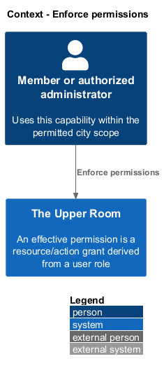
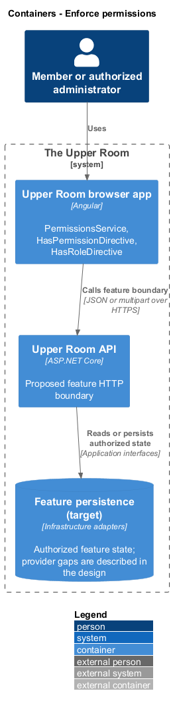
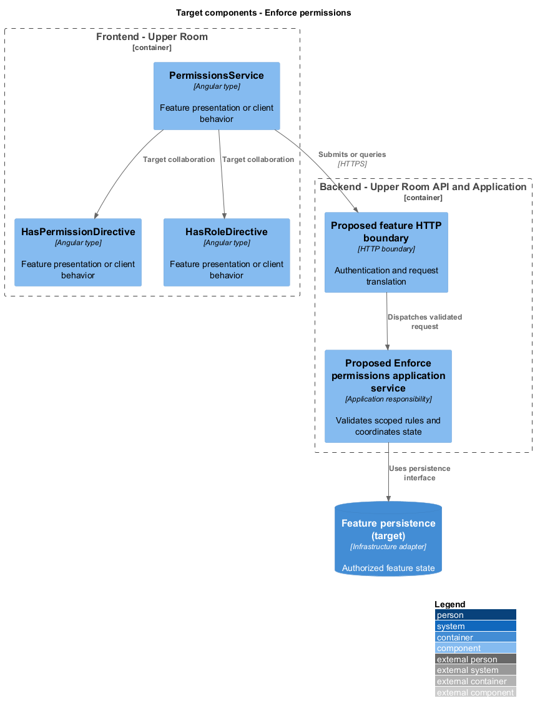
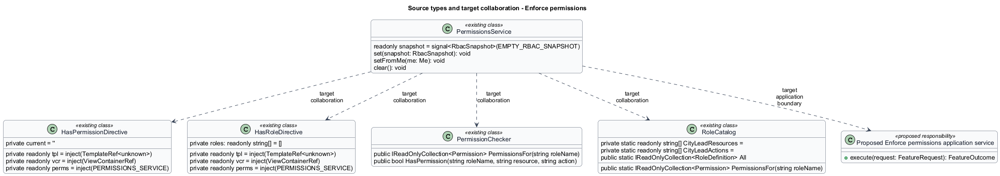
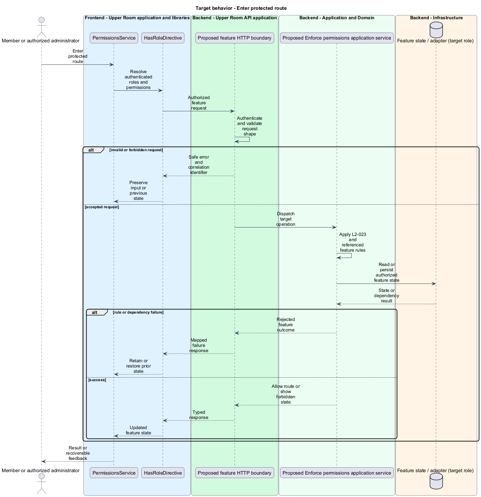
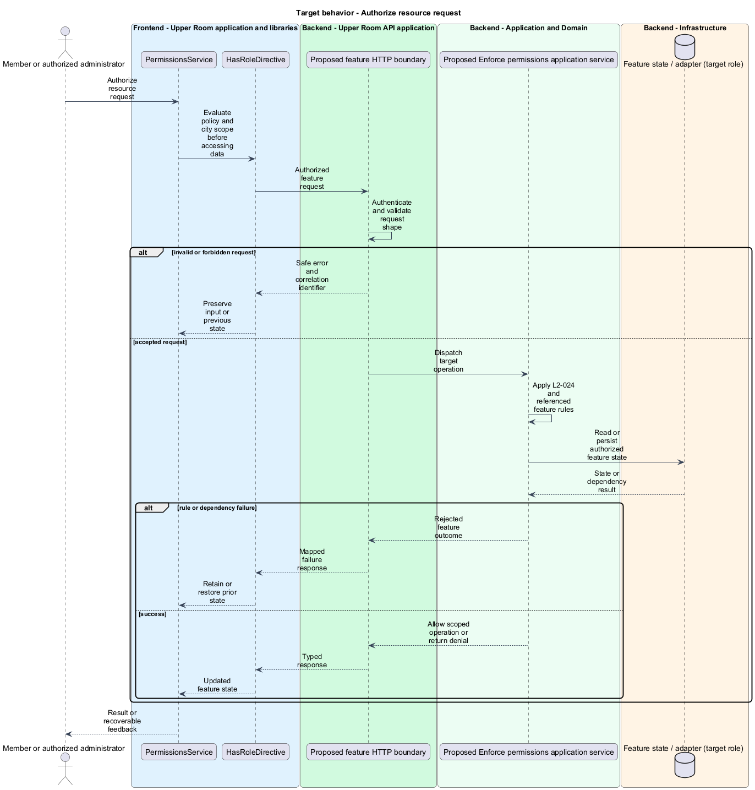

# Enforce permissions

## Overview

The Upper Room manages contacts, partners, ideas, events, locations, and boards in city-scoped workspaces.

An effective permission is a resource/action grant derived from a user role. City scope limits the records over which that grant applies.

## Description

### Existing implementation

The following source elements provide the current implementation points. Their presence does not establish complete requirement coverage.

| Source | Concrete elements | Observed surface |
|---|---|---|
| [frontend/projects/domain/src/lib/rbac/guards.ts](../../../../frontend/projects/domain/src/lib/rbac/guards.ts) | `authGuard`, `roleGuard`, `permissionGuard` | Declarations and configuration in the linked source |
| [frontend/projects/domain/src/lib/rbac/permissions.service.ts](../../../../frontend/projects/domain/src/lib/rbac/permissions.service.ts) | `PermissionsService` | readonly snapshot = signal<RbacSnapshot>(EMPTY_RBAC_SNAPSHOT); set(snapshot: RbacSnapshot): void; setFromMe(me: Me): void |
| [frontend/projects/domain/src/lib/rbac/has-permission.directive.ts](../../../../frontend/projects/domain/src/lib/rbac/has-permission.directive.ts) | `HasPermissionDirective` | private readonly tpl = inject(TemplateRef<unknown>); private readonly vcr = inject(ViewContainerRef); private readonly perms = inject(PERMISSIONS_SERVICE) |
| [frontend/projects/domain/src/lib/rbac/has-role.directive.ts](../../../../frontend/projects/domain/src/lib/rbac/has-role.directive.ts) | `HasRoleDirective` | private readonly tpl = inject(TemplateRef<unknown>); private readonly vcr = inject(ViewContainerRef); private readonly perms = inject(PERMISSIONS_SERVICE) |
| [backend/src/TheUpperRoom.Infrastructure/Rbac/PermissionChecker.cs](../../../../backend/src/TheUpperRoom.Infrastructure/Rbac/PermissionChecker.cs) | `PermissionChecker` | public IReadOnlyCollection<Permission> PermissionsFor(string roleName); public bool HasPermission(string roleName, string resource, string action) |
| [backend/src/TheUpperRoom.Domain/Rbac/RoleCatalog.cs](../../../../backend/src/TheUpperRoom.Domain/Rbac/RoleCatalog.cs) | `RoleCatalog` | private static readonly string[] CityLeadResources =; private static readonly string[] CityLeadActions =; public static IReadOnlyCollection<RoleDefinition> All |

### Target behavior and interfaces

RoleCatalog shall supply the specified seeded roles. Route guards and visibility directives shall consume one permission snapshot. Backend policies and application authorization shall enforce the same resource/action rules and city boundary before data is read or mutated. UI visibility shall improve navigation without substituting for server checks.

- **Enter protected route:** Resolve authenticated roles and permissions. Allow route or show forbidden state.
- **Authorize resource request:** Evaluate policy and city scope before accessing data. Allow scoped operation or return denial.

Diagrams show target collaborations. Existing source types retain their names. Participants marked as target roles or proposed responsibilities describe interfaces to introduce, not existing classes.

### Gaps and compatibility

Guards, directives, role definitions, and PermissionChecker exist. The full endpoint and handler coverage shall be reviewed; a protected route or Authorize attribute alone does not prove action-specific permissions.

Production implementation shall follow [AGENTS.md](../../../../AGENTS.md), including incremental acceptance testing. API integrations shall preserve documented behavior until an explicit compatibility change is approved.

## Requirements

The table preserves the opening requirement statement and all parent identifiers. The expandable source excerpts retain the complete normative text and acceptance criteria verbatim. Source wording is quoted rather than normalized to the design prose.

| L2 ID | Refines (L1) | Requirement |
|---|---|---|
| [L2-023](../../../specs/L2.md#l2-023-role-definitions) | `L1-003` | The system must seed four roles with the following permissions (permissions are stored as `(resource, action)` pairs): |
| [L2-024](../../../specs/L2.md#l2-024-frontend-route-guards) | `L1-003` | Every protected route must declare a `canActivate: [authGuard, roleGuard]` with `data: { roles: ['SystemAdmin', 'CityLead'] }` (or similar). Unauthorized access redirects to `/forbidden` with snackbar "You don't have permission to view this page." (severity warning, duration `5000ms`). |
| [L2-025](../../../specs/L2.md#l2-025-component-level-permission-visibility) | `L1-003` | A structural directive `*tarHasPermission="'Contact:Delete'"` must conditionally render content based on the current user's effective permissions. A directive `*tarHasRole="['SystemAdmin']"` must do the same for roles. |
| [L2-079](../../../specs/L2.md#l2-079-authorization-backend-implementation) | `L1-003`, `L1-022` | Authorization must use ASP.NET Core's policy-based authorization. A `RequirePermission("Resource:Action")` attribute and `RequireRole(...)` extension must wrap endpoints. City scoping is enforced in the `AuthorizationBehavior` MediatR pipeline by a `RequireCityScope` interface on commands/queries; the handler executes against the scoped `CityId` from the user's claims. |

L2-023: Role Definitions — specification excerpt

The system must seed four roles with the following permissions (permissions are stored as `(resource, action)` pairs):

- **SystemAdmin**: full access to all resources and actions, plus `User:Manage`, `Role:Manage`, `Audit:Read`, `City:Switch`.
- **CityLead**: `Contact:*`, `Partner:*`, `Tag:*`, `Note:*`, `KanbanBoard:*`, `Idea:*`, `Event:*`, `Location:*`, scoped to their City; cannot manage users/roles.
- **Member**: `*:Read` for everything in their City; `Note:Create`, `Idea:Create`, `Event:RSVP`.
- **Guest**: `Event:Read` and `Event:RSVP` only, no other resource access.

**Acceptance Criteria:**
1. Given a Member, when they call `POST /api/contacts`, then the API returns `403 Forbidden` with body `{ "error": "FORBIDDEN", "message": "You do not have permission to create contacts." }`.
2. Given a CityLead in city A, when they `GET /api/contacts/{id}` for a contact in city B, then the API returns `404 Not Found` (do not leak existence).

L2-024: Frontend Route Guards — specification excerpt

Every protected route must declare a `canActivate: [authGuard, roleGuard]` with `data: { roles: ['SystemAdmin', 'CityLead'] }` (or similar). Unauthorized access redirects to `/forbidden` with snackbar "You don't have permission to view this page." (severity warning, duration `5000ms`).

**Acceptance Criteria:**
1. Given a Member navigates to `/admin/users`, when the route activates, then they are redirected to `/forbidden` and the snackbar above appears.
2. Given an unauthenticated visitor navigates to `/contacts`, when the route activates, then they are redirected to `/sign-in?returnUrl=%2Fcontacts`.

L2-025: Component-Level Permission Visibility — specification excerpt

A structural directive `*tarHasPermission="'Contact:Delete'"` must conditionally render content based on the current user's effective permissions. A directive `*tarHasRole="['SystemAdmin']"` must do the same for roles.

**Acceptance Criteria:**
1. Given a Member views the contact detail page, when rendered, then the "Delete" action button is not present in the DOM.
2. Given the directive evaluates an unknown permission, when rendered, then the content is hidden and a console.warn is emitted in non-production builds.

L2-079: Authorization Backend Implementation — specification excerpt

Authorization must use ASP.NET Core's policy-based authorization. A `RequirePermission("Resource:Action")` attribute and `RequireRole(...)` extension must wrap endpoints. City scoping is enforced in the `AuthorizationBehavior` MediatR pipeline by a `RequireCityScope` interface on commands/queries; the handler executes against the scoped `CityId` from the user's claims.

**Acceptance Criteria:**
1. Given a CityLead in city A queries contacts, when handled, then the EF query has a WHERE `CityId = @cityA` clause regardless of any client-provided `cityId` parameter.

## Diagrams

### System context

The context identifies the people and application boundary used by this capability.

### Container view

The container view separates browser execution from any backend state responsibility. Provider choices remain subject to the stated gaps.

### Target component view

The component view shows target collaborations between the concrete implementation points and proposed application responsibilities.

### Type structure

The structure view lists source types with declared members where available. Dashed dependencies denote proposed collaboration rather than verified current dependency direction.

### Enter protected route

The target flow performs the following operation: Resolve authenticated roles and permissions. Its successful outcome is: Allow route or show forbidden state. Alternate branches retain prior state or return recoverable failure.

### Authorize resource request

The target flow performs the following operation: Evaluate policy and city scope before accessing data. Its successful outcome is: Allow scoped operation or return denial. Alternate branches retain prior state or return recoverable failure.

