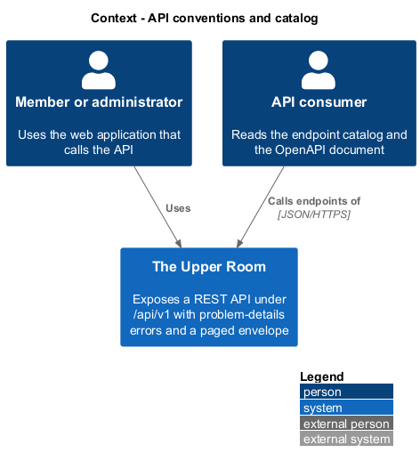
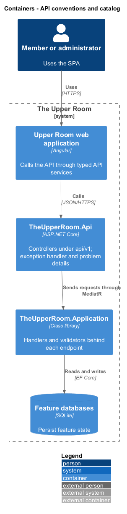
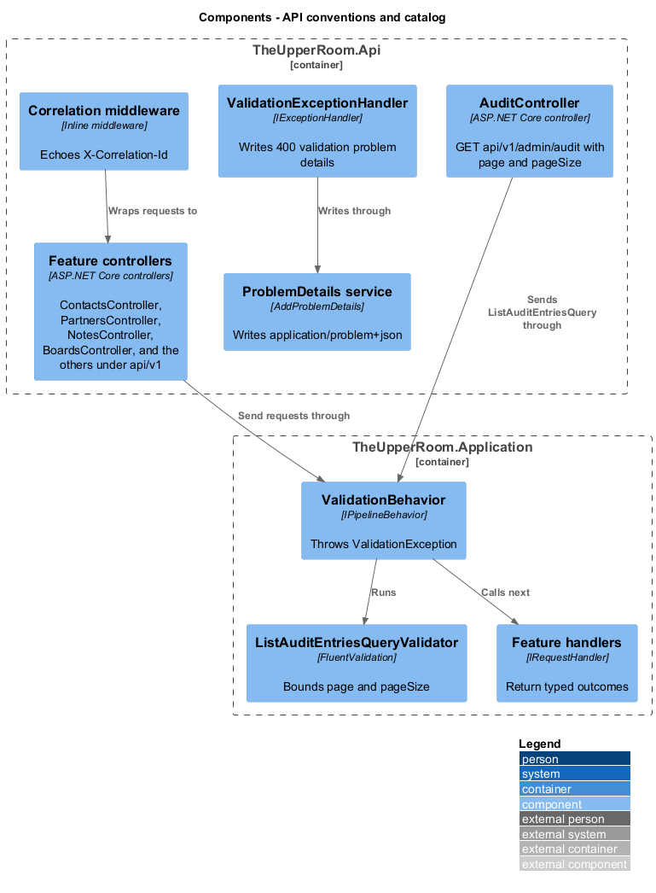
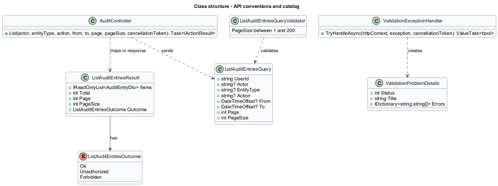
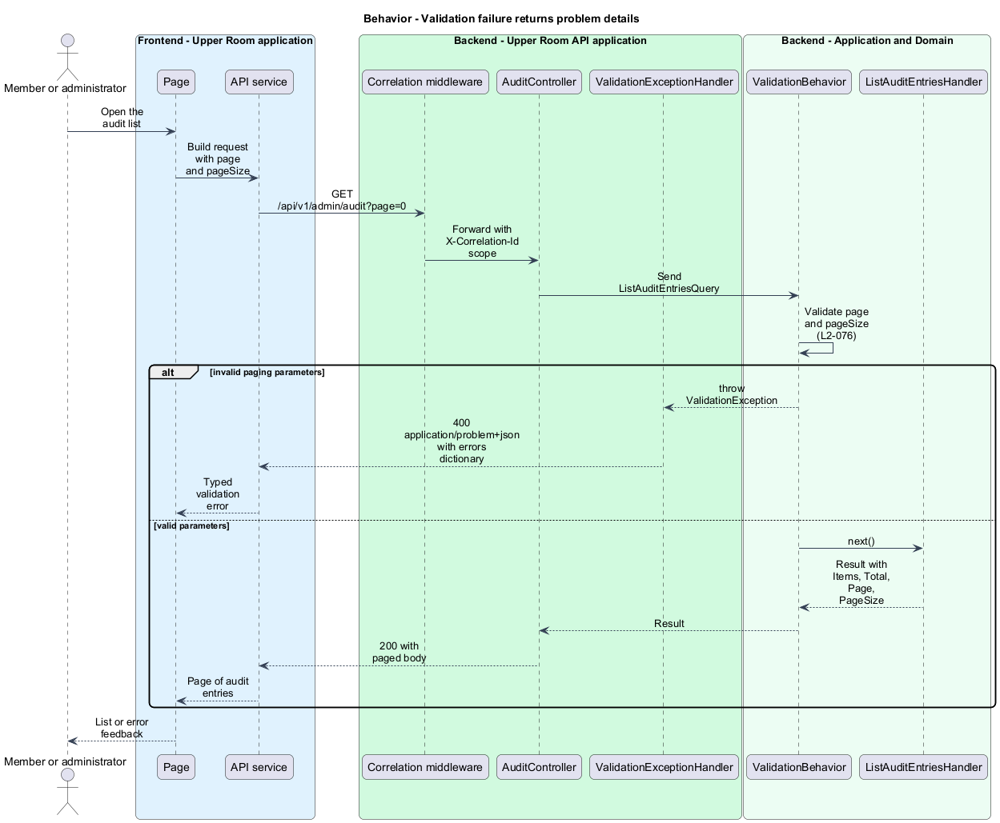
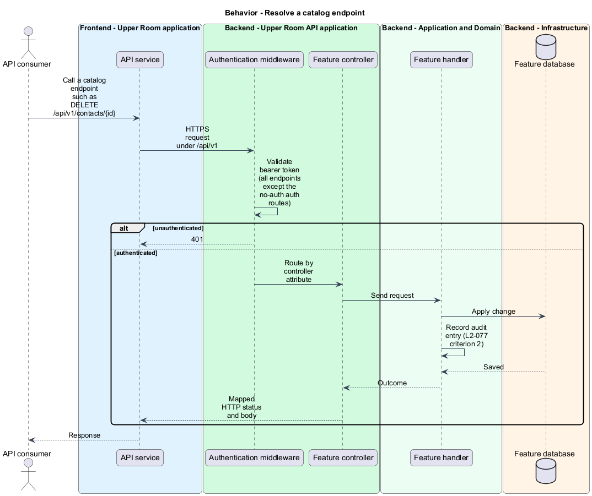

# API conventions and catalog

## Overview

The Upper Room backend exposes a REST API consumed by the Angular web application. The API follows one set of conventions for paths, verbs, errors, and paging, and publishes a catalog of endpoints per feature.

**problem details** — RFC 7807 JSON error body served as `application/problem+json`

**endpoint catalog** — enumerated list of routes the API exposes, grouped by feature (auth, users, roles, cities, tags, contacts, partners, notes, boards, ideas, events, locations, search, notifications, audit, uploads)

**paged envelope** — response object carrying one page of items with its paging metadata

This slice covers the shared conventions that every controller follows and the catalog that those controllers realize.

## Description

### Existing implementation

| Source | Concrete elements | Observed surface |
|---|---|---|
| [backend/src/TheUpperRoom.Api/Contacts/ContactsController.cs](../../../../backend/src/TheUpperRoom.Api/Contacts/ContactsController.cs) | `ContactsController` | Route `api/v1/contacts`; GET, GET `{id}`, POST, PUT `{id}`, PATCH `{id}`, POST `{id}/archive`, POST `{id}/unarchive`, DELETE `{id}` |
| [backend/src/TheUpperRoom.Api/Audit/AuditController.cs](../../../../backend/src/TheUpperRoom.Api/Audit/AuditController.cs) | `AuditController` | Route `api/v1/admin/audit`; query parameters `page` (default 1) and `pageSize` (default 20); returns `{ items, total, page, pageSize }` |
| [backend/src/TheUpperRoom.Application/Audit/ListAuditEntriesQueryValidator.cs](../../../../backend/src/TheUpperRoom.Application/Audit/ListAuditEntriesQueryValidator.cs) | `ListAuditEntriesQueryValidator` | Rejects `PageSize` outside 1 to 200 |
| [backend/src/TheUpperRoom.Api/ExceptionHandling/ValidationExceptionHandler.cs](../../../../backend/src/TheUpperRoom.Api/ExceptionHandling/ValidationExceptionHandler.cs) | `ValidationExceptionHandler` | Returns `ValidationProblemDetails` with status 400 and an `errors` dictionary |
| [backend/src/TheUpperRoom.Api/Program.cs](../../../../backend/src/TheUpperRoom.Api/Program.cs) | `AddControllers`, `AddExceptionHandler`, `AddProblemDetails`, correlation middleware | Echoes `X-Correlation-Id` on each response |
| [backend/tests/TheUpperRoom.Api.Tests/Contacts/ContactsValidationProblemDetailsTests.cs](../../../../backend/tests/TheUpperRoom.Api.Tests/Contacts/ContactsValidationProblemDetailsTests.cs) | Validation problem-details test | Exercises the 400 response shape |

Controllers registered under `api/v1`: `auth`, `auth/me`, `users`, `cities`, `contacts`, `partners`, `partners/{partnerId}/contacts`, `notes`, `boards`, `cards`, `ideas`, `events`, `events/{eventId}/rsvp`, `events/{id}/cancel`, `events/{id}/ics`, `locations`, `search`, `notifications`, `push`, `dashboard`, `uploads`, `sanitize`, and `admin/audit`. `HealthController` serves `health` and `IdpController` serves `__idp`.

### Target behavior and interfaces

- **Paths and verbs:** Resources are plural and kebab-case under `/api/v1/`, using GET, POST, PUT, PATCH, and DELETE (L2-076).
- **Errors:** Failures return `application/problem+json` with extensions `correlationId`, `errors`, and `code` (L2-076).
- **Paging:** Lists accept `?page=1&pageSize=25`, cap `pageSize` at 100, and return `{ data, page, pageSize, total, totalPages }` (L2-076).
- **Catalog:** Controllers expose the endpoint groups listed in L2-077, and an OpenAPI document at `/openapi/v1.json` describes each one.

### Gaps and compatibility

- The existing validation response carries `errors` but not `correlationId` or `code`. Adding both is a target change. The source of machine codes (L2-066) is `<TO SUPPLY>` for the backend.
- `AuditController` returns `items` and `total` without `totalPages`, and `page` and `pageSize` bounds are 1 to 200 through a validator instead of a cap at 100. Aligning to the envelope is a target change.
- Several catalog routes differ from the existing source: audit lives at `/api/v1/admin/audit`, the current user at `/api/v1/auth/me`, and contacts use `unarchive` where the catalog names `restore`. Reconciling names is `<TO SUPPLY>`.
- No OpenAPI middleware is registered in `Program.cs`. Publishing `/openapi/v1.json` is a target change.
- Role, tag, and several other catalog endpoints have no controller yet.
- A concurrency conflict mapping to HTTP 409 is not present in the exception pipeline.

Production implementation shall follow [AGENTS.md](../../../../AGENTS.md), including incremental acceptance testing. API integrations shall preserve documented behavior until an explicit compatibility change is approved.

## Requirements

The table preserves the requirement statement and parent identifiers. L2-077 lists endpoint groups; the full list and acceptance criteria remain in the linked specification.

| L2 ID | Refines (L1) | Requirement |
|---|---|---|
| [L2-076](../../../specs/L2.md#l2-076-api-conventions) | `L1-022` | The API uses REST verbs (`GET`, `POST`, `PUT`, `PATCH`, `DELETE`), JSON over HTTPS, paths in kebab-case under `/api/v1/`. Resources are plural (`/api/v1/contacts`). Responses use Problem Details (RFC 7807) for errors with extensions `correlationId`, `errors` (dictionary), `code` (machine string from L2-066). Pagination uses `?page=1&pageSize=25` with response envelope `{ data: [], page, pageSize, total, totalPages }`. |
| [L2-077](../../../specs/L2.md#l2-077-api-endpoint-catalog) | `L1-022`, `L1-004`, `L1-005`, `L1-006`, `L1-007`, `L1-008`, `L1-009`, `L1-010`, `L1-011` | The system must expose at minimum the endpoints below; all require auth except where noted (the specification enumerates Auth, Users, Roles, Cities, Tags, Contacts, Partners, Notes, Boards, Ideas, Events, Locations, Search, Notifications, Audit, and Uploads endpoints). |

## Diagrams

### System context

The context shows the consumers of the API: the web application on behalf of members, and integrators who read the catalog.

### Container view

The container view places the API between the web application and the Application layer.

### Component view

The component view shows controllers, the exception handler, problem-details service, and the validation behavior that cooperate to apply the conventions.

### Type structure

The structure view uses the audit list as the existing example of a paged endpoint with validation.

### Validation failure returns problem details

An invalid paging parameter fails validation. The exception handler writes a 400 `application/problem+json` response with an `errors` dictionary. Valid requests return a paged body.

### Resolve a catalog endpoint

A consumer calls a catalog endpoint. The pipeline authenticates the request, routes it to the controller, applies the change through a handler, and records an audit entry.

