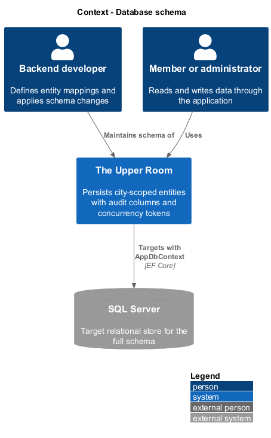
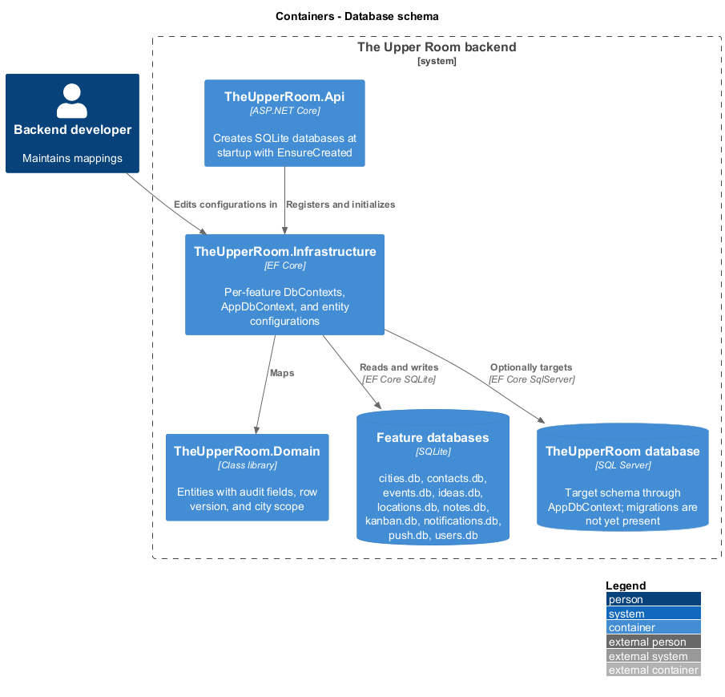
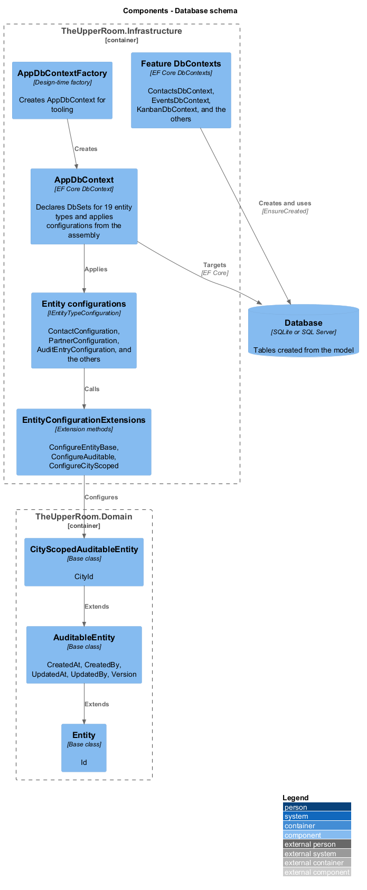
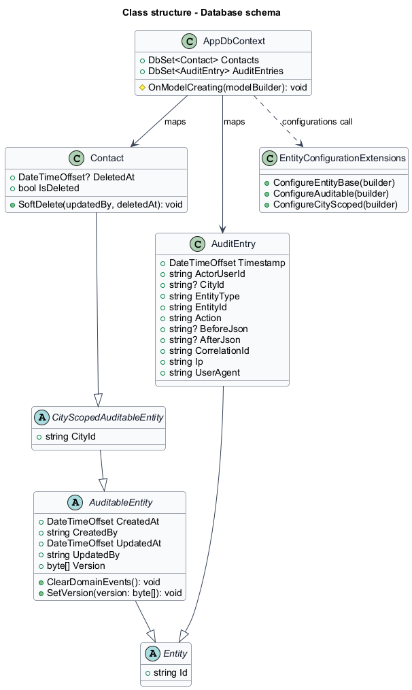
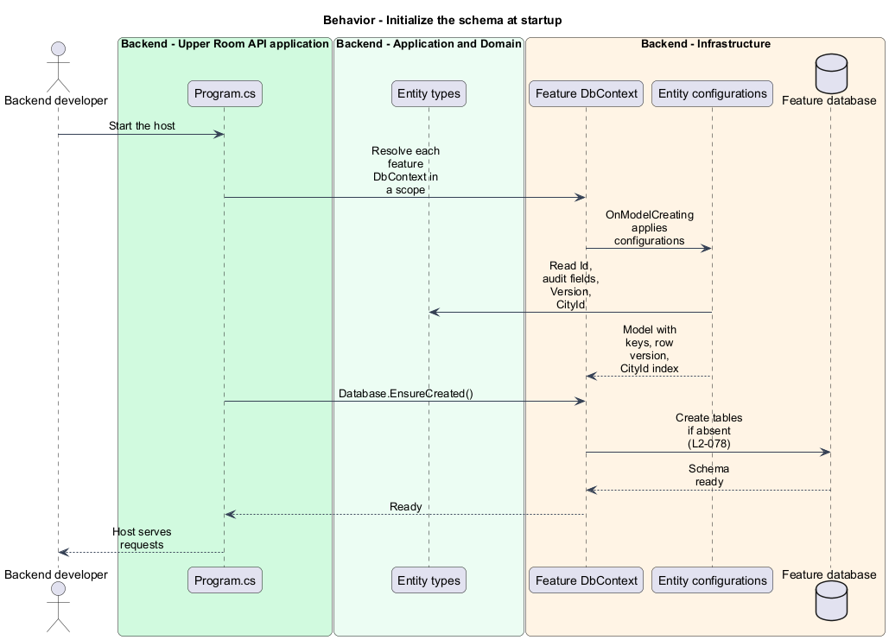
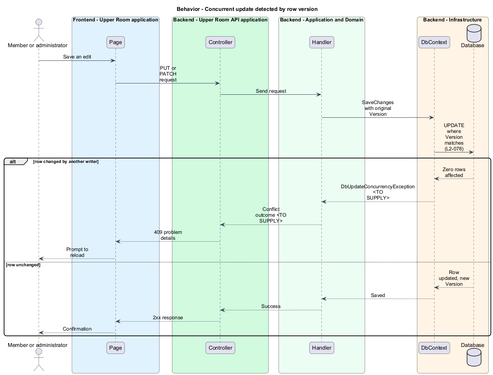

# Database schema

## Overview

The Upper Room stores its entities in relational tables mapped with Entity Framework Core. The schema carries common columns for audit, concurrency, and city scoping so that every feature behaves consistently.

**row version** — `rowversion` column used as an optimistic concurrency token

**city-scoped table** — table whose rows belong to one city and carry a `CityId` column with a non-clustered index

**soft delete** — deletion that sets a `DeletedAt` timestamp and keeps the row

This slice describes the entity base types, the mappings, and how the schema is created.

## Description

### Existing implementation

| Source | Concrete elements | Observed surface |
|---|---|---|
| [backend/src/TheUpperRoom.Domain/Common/Entity.cs](../../../../backend/src/TheUpperRoom.Domain/Common/Entity.cs) | `Entity` | `string Id` generated by `DomainId.New()` |
| [backend/src/TheUpperRoom.Domain/Common/AuditableEntity.cs](../../../../backend/src/TheUpperRoom.Domain/Common/AuditableEntity.cs) | `AuditableEntity` | `CreatedAt`, `CreatedBy`, `UpdatedAt`, `UpdatedBy`, `byte[] Version`, and domain events |
| [backend/src/TheUpperRoom.Domain/Common/CityScopedAuditableEntity.cs](../../../../backend/src/TheUpperRoom.Domain/Common/CityScopedAuditableEntity.cs) | `CityScopedAuditableEntity` | `CityId` |
| [backend/src/TheUpperRoom.Infrastructure/Data/Configurations/EntityConfigurationExtensions.cs](../../../../backend/src/TheUpperRoom.Infrastructure/Data/Configurations/EntityConfigurationExtensions.cs) | `ConfigureEntityBase`, `ConfigureAuditable`, `ConfigureCityScoped` | Key on `Id` (max length 100), required audit columns, `IsRowVersion()` on `Version`, index on `CityId` |
| [backend/src/TheUpperRoom.Infrastructure/Data/AppDbContext.cs](../../../../backend/src/TheUpperRoom.Infrastructure/Data/AppDbContext.cs) | `AppDbContext` | `DbSet` for `City`, `Tag`, `Contact`, `Partner`, `Location`, `Event`, `EventAttendee`, `Idea`, `KanbanBoard`, `KanbanColumn`, `KanbanSwimlane`, `KanbanCard`, `Note`, `User`, `UserSession`, `Invitation`, `Notification`, `NotificationPreference`, `AuditEntry`; value objects ignored at model root |
| [backend/src/TheUpperRoom.Infrastructure/Data/Configurations](../../../../backend/src/TheUpperRoom.Infrastructure/Data/Configurations) | 18 `IEntityTypeConfiguration` classes | One configuration per aggregate |
| [backend/src/TheUpperRoom.Infrastructure/DependencyInjection.cs](../../../../backend/src/TheUpperRoom.Infrastructure/DependencyInjection.cs) | `AddAppDbContextSqlServer` | Registers `AppDbContext` against SQL Server using connection string `TheUpperRoom` |
| [backend/src/TheUpperRoom.Api/Program.cs](../../../../backend/src/TheUpperRoom.Api/Program.cs) | Per-feature `DbContext` registration | One SQLite file per feature, created with `Database.EnsureCreated()` |
| [backend/tests/TheUpperRoom.Infrastructure.Tests/Persistence/AppDbContextModelTests.cs](../../../../backend/tests/TheUpperRoom.Infrastructure.Tests/Persistence/AppDbContextModelTests.cs) | Model tests | Exercise the `AppDbContext` model |

`Contact` has a nullable `DeletedAt` and a `SoftDelete` method. Phones, emails, addresses, social links, and note versions are value objects persisted as JSON on their owning aggregate rather than as separate tables.

### Target behavior and interfaces

- **Migrations:** The Infrastructure project defines EF Core migrations that produce the tables listed in L2-078 on SQL Server.
- **Common columns:** Each entity table has `Id`, `CreatedAt`, `CreatedBy`, `UpdatedAt`, `UpdatedBy`, and a `rowversion` `RowVersion`. City-scoped tables have an indexed `CityId`. Soft-deletable tables have nullable `DeletedAt`.
- **Concurrency:** A stale update raises `DbUpdateConcurrencyException`, surfaced as HTTP 409.

### Gaps and compatibility

- The repository contains no EF Core migrations. The running API uses SQLite and `EnsureCreated()`; SQL Server is optional through `AddAppDbContextSqlServer`.
- `Id` is a string with maximum length 100, not `uniqueidentifier`. Changing the key type is `<TO SUPPLY>`.
- The row-version property is named `Version` in the model, not `RowVersion`. Renaming the column is `<TO SUPPLY>`.
- `AppDbContext` lacks `Roles`, `Permissions`, `RolePermissions`, `UserRoles`, `RefreshTokens`, `Files`, `NoteVersions`, `IdeaVotes`, `IdeaPartners`, `EventTags`, `EventPartners`, `LocationPhotos`, and the separate contact and partner child tables. Whether child data stays as JSON or becomes tables is `<TO SUPPLY>`.
- `DeletedAt` exists on `Contact` only among the inspected entities. Extending it to other soft-deletable tables is `<TO SUPPLY>`.
- No handler maps `DbUpdateConcurrencyException` to HTTP 409.

Production implementation shall follow [AGENTS.md](../../../../AGENTS.md), including incremental acceptance testing. Schema changes shall preserve existing data until an explicit compatibility change is approved.

## Requirements

The table preserves the opening requirement statement and parent identifier. The full table list and acceptance criteria remain in the linked specification.

| L2 ID | Refines (L1) | Requirement |
|---|---|---|
| [L2-078](../../../specs/L2.md#l2-078-database-schema-sql-server) | `L1-022` | The Infrastructure project must define EF Core migrations producing tables: `Cities`, `Users`, `Roles`, `Permissions`, `RolePermissions`, `UserRoles`, `Invitations`, `RefreshTokens`, `Contacts`, `ContactPhones`, `ContactEmails`, `ContactAddresses`, `Partners`, `PartnerPhones`, `PartnerEmails`, `PartnerAddresses`, `PartnerSocialLinks`, `PartnerContacts`, `Tags`, `EntityTags` (polymorphic), `Notes`, `NoteVersions`, `KanbanBoards`, `KanbanColumns`, `KanbanSwimlanes`, `KanbanCards`, `KanbanCardComments`, `Ideas`, `IdeaVotes`, `IdeaPartners`, `Locations`, `LocationPhotos`, `Events`, `EventTags`, `EventPartners`, `EventAttendees`, `Notifications`, `NotificationPreferences`, `Files`, `AuditEntries`. Every entity table has `Id (uniqueidentifier)`, `CreatedAt`, `CreatedBy`, `UpdatedAt`, `UpdatedBy`, `RowVersion (rowversion)`. City-scoped tables have `CityId` with non-clustered index. Soft-deletable tables have `DeletedAt` (nullable). |

## Diagrams

### System context

The context shows the developers who maintain the schema and the SQL Server target.

### Container view

The container view contrasts the SQLite feature databases the API uses today with the optional SQL Server target.

### Component view

The component view shows `AppDbContext`, the shared configuration extensions, and the three domain base types that supply the common columns.

### Type structure

The structure view shows the entity inheritance chain and the contexts that map it.

### Initialize the schema at startup

At startup the host resolves each feature context, applies the entity configurations, and calls `EnsureCreated()`.

### Concurrent update conflict

An update carries the original `Version`. A mismatch yields a concurrency exception that the API surfaces as HTTP 409. The conflict mapping is a target behavior.

