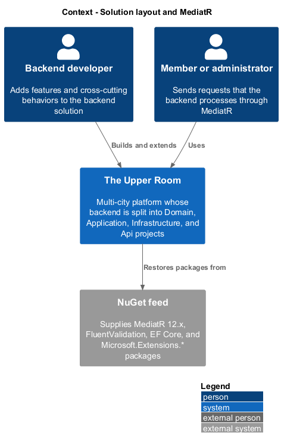
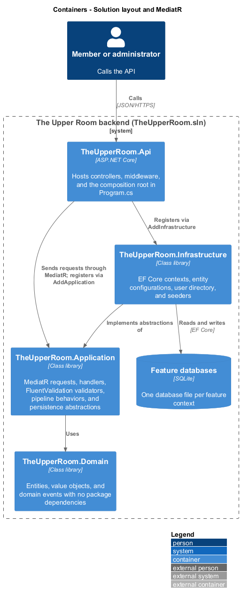
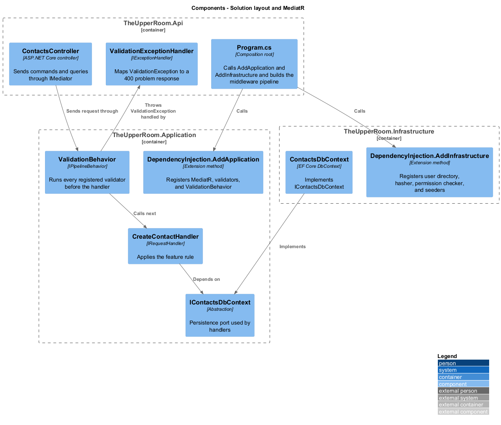
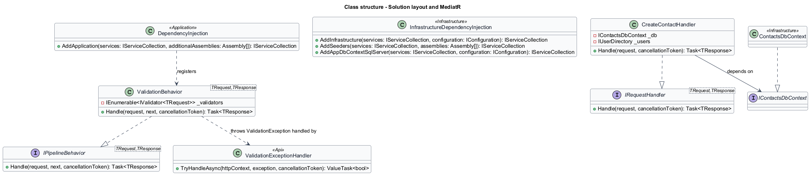
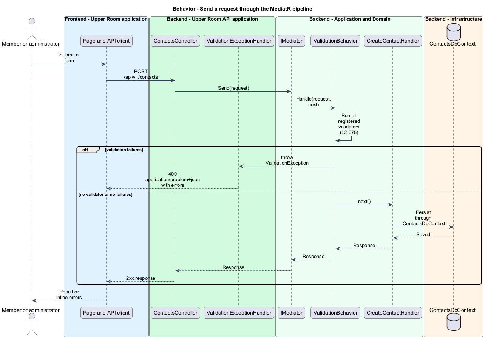
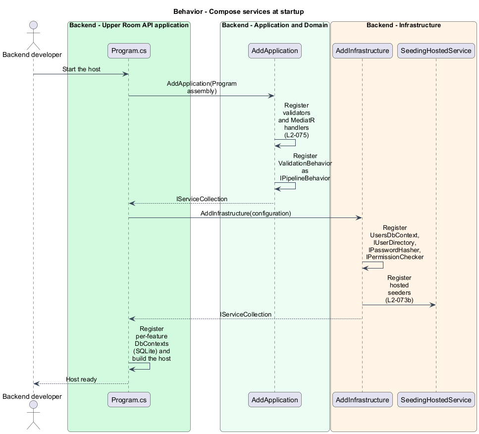

# Solution layout and MediatR

## Overview

The Upper Room is a multi-city platform for managing contacts, partners, ideas, events, locations, and Kanban boards. Its backend is a .NET solution split into four source projects and four test projects.

**solution layout** — arrangement of backend projects into Domain, Application, Infrastructure, and Api layers with dependencies pointing inward

**MediatR** — in-process mediator library that dispatches a request object to exactly one handler through an ordered chain of pipeline behaviors

**pipeline behavior** — `IPipelineBehavior<TRequest, TResponse>` implementation that wraps every handler to add one cross-cutting concern

This slice defines how the projects relate, how services are composed at startup, and how a request travels through MediatR. It is the structural basis for every other backend feature.

## Description

### Existing implementation

| Source | Concrete elements | Observed surface |
|---|---|---|
| [backend/TheUpperRoom.sln](../../../../backend/TheUpperRoom.sln) | Solution file | Old-style (format version 12.00) solution referencing `TheUpperRoom.Api`, `.Application`, `.Domain`, `.Infrastructure`, and the four matching `.Tests` projects |
| [backend/src/TheUpperRoom.Domain/TheUpperRoom.Domain.csproj](../../../../backend/src/TheUpperRoom.Domain/TheUpperRoom.Domain.csproj) | Domain project | No `PackageReference` and no `ProjectReference` entries |
| [backend/src/TheUpperRoom.Application/TheUpperRoom.Application.csproj](../../../../backend/src/TheUpperRoom.Application/TheUpperRoom.Application.csproj) | Application project | References Domain, MediatR 12.4.1, FluentValidation 11, EF Core, HtmlSanitizer, and the `Microsoft.Extensions` DI and logging abstractions |
| [backend/src/TheUpperRoom.Infrastructure/TheUpperRoom.Infrastructure.csproj](../../../../backend/src/TheUpperRoom.Infrastructure/TheUpperRoom.Infrastructure.csproj) | Infrastructure project | References Application, EF Core (SQLite and SQL Server providers), and the `Microsoft.Extensions` configuration, DI, hosting, identity, and logging abstractions |
| [backend/src/TheUpperRoom.Api/TheUpperRoom.Api.csproj](../../../../backend/src/TheUpperRoom.Api/TheUpperRoom.Api.csproj) | Api project | References Application and Infrastructure directly |
| [backend/src/TheUpperRoom.Application/DependencyInjection.cs](../../../../backend/src/TheUpperRoom.Application/DependencyInjection.cs) | `AddApplication` | Registers FluentValidation validators, MediatR handlers from the Application and supplied assemblies, and `ValidationBehavior<,>` as the only open-generic pipeline behavior |
| [backend/src/TheUpperRoom.Application/Common/ValidationBehavior.cs](../../../../backend/src/TheUpperRoom.Application/Common/ValidationBehavior.cs) | `ValidationBehavior<TRequest, TResponse>` | Runs all registered validators; throws `ValidationException` on failures; calls `next()` directly when no validator exists |
| [backend/src/TheUpperRoom.Infrastructure/DependencyInjection.cs](../../../../backend/src/TheUpperRoom.Infrastructure/DependencyInjection.cs) | `AddInfrastructure`, `AddSeeders`, `AddAppDbContextSqlServer` | Registers `UsersDbContext`, `IUserDirectory`, `IPasswordHasher`, `IPermissionChecker`, and seeders |
| [backend/src/TheUpperRoom.Api/Program.cs](../../../../backend/src/TheUpperRoom.Api/Program.cs) | Composition root | Calls `AddApplication(typeof(Program).Assembly)` and `AddInfrastructure(builder.Configuration)`, then registers per-feature SQLite `DbContext` types |
| [backend/src/TheUpperRoom.Api/ExceptionHandling/ValidationExceptionHandler.cs](../../../../backend/src/TheUpperRoom.Api/ExceptionHandling/ValidationExceptionHandler.cs) | `ValidationExceptionHandler` | Converts `ValidationException` to a `ValidationProblemDetails` response with status 400 |

Handlers live in `Application/{Feature}/` and are named `{Verb}{Entity}Handler` (for example `CreateContactHandler`, `ListAuditEntriesHandler`). Request records follow `{Verb}{Entity}Request` or `{Verb}{Entity}Query`.

### Target behavior and interfaces

- **Layer direction:** Domain references no other project. Application references only Domain. Infrastructure references Application. Api composes both through `AddApplication` and `AddInfrastructure` (L2-073a, L2-074).
- **Abstractions:** Handlers depend on narrow abstractions such as `IContactsDbContext`, `IUserDirectory`, and `IPermissionChecker`; Infrastructure supplies the implementations (L2-073a).
- **Pipeline:** `LoggingBehavior`, `ValidationBehavior`, `AuthorizationBehavior`, and `TransactionBehavior` register as `IPipelineBehavior<,>`. Each new cross-cutting concern is a new behavior (L2-073a, L2-075).
- **Standard primitives:** Logging uses `ILogger<T>`, configuration uses `IConfiguration` and strongly typed options validated on start, dependency injection uses `IServiceCollection`, and outbound HTTP uses `IHttpClientFactory` (L2-073b).

### Gaps and compatibility

- Only `ValidationBehavior` exists. `LoggingBehavior`, `AuthorizationBehavior`, and `TransactionBehavior` are target additions. Handlers currently enforce authorization and persistence rules inline.
- `ValidationBehavior` passes a request through when no validator exists. The DEBUG-build short-circuit with "No validator registered for {commandType}." is a target change.
- `TheUpperRoom.Api` references `TheUpperRoom.Infrastructure` and uses its `DbContext` types in `Program.cs`. Restricting that use to DI registration extension methods is a target change.
- The Application project references EF Core. Whether that is acceptable under the inward dependency rule is `<TO SUPPLY>`.
- `Program.cs` reads settings through `builder.Configuration["..."]` and does not bind options with `ValidateDataAnnotations().ValidateOnStart()`. Options binding is a target change.
- The Infrastructure project exposes three public registration extensions, not exactly one. Consolidation is `<TO SUPPLY>`.
- Handler folders `Commands` and `Queries` and the `{Verb}{Entity}{Command|Query}.cs` file naming are not yet used.
- The `TheUpperRoom.Architecture.Tests` project from L2-073a does not exist. The enforcement mechanism for dependency direction is `<TO SUPPLY>`; repository rules in [AGENTS.md](../../../../AGENTS.md) exclude tests that assert code structure.

Production implementation shall follow [AGENTS.md](../../../../AGENTS.md), including incremental acceptance testing.

## Requirements

The table preserves the opening requirement statement and parent identifier of each L2 requirement. Acceptance criteria remain in the linked specification.

| L2 ID | Refines (L1) | Requirement |
|---|---|---|
| [L2-073a](../../../specs/L2.md#l2-073a-solid-design-principles) | `L1-022` | All backend production code (`backend/src/**`) must adhere to the S.O.L.I.D. design principles (Single Responsibility, Open/Closed, Liskov Substitution, Interface Segregation, Dependency Inversion, each elaborated in the specification). |
| [L2-073b](../../../specs/L2.md#l2-073b-microsoftextensions-as-standard-primitives) | `L1-022` | The backend must use the Microsoft.Extensions.* libraries as the sole primitives for the listed cross-cutting concerns (the specification lists logging, configuration, dependency injection, options, hosting, and HTTP). No bespoke or third-party replacement may be introduced for any of them. |
| [L2-074](../../../specs/L2.md#l2-074-solution-layout) | `L1-022` | Repository layout: `backend/TheUpperRoom.sln` (old-style format, non-SDK) referencing `src/TheUpperRoom.Api`, `src/TheUpperRoom.Application`, `src/TheUpperRoom.Domain`, `src/TheUpperRoom.Infrastructure`, and `tests/TheUpperRoom.{Domain,Application,Infrastructure,Api}.Tests`. The .sln must reference all projects above; no SDK-style solution-level pieces. |
| [L2-075](../../../specs/L2.md#l2-075-mediatr-free-version) | `L1-022` | The Application project must use MediatR v12.x (the last MIT-licensed version) for `IRequest<TResponse>` commands and queries. Each handler lives in `Application/{Feature}/Commands` or `Application/{Feature}/Queries` named `{Verb}{Entity}{Command\|Query}.cs`. Pipeline behaviors: `LoggingBehavior`, `ValidationBehavior` (FluentValidation), `AuthorizationBehavior`, `TransactionBehavior` (for commands). |

## Diagrams

### System context

The context shows the developers who extend the backend and the users whose requests the layered solution serves.

### Container view

The container view shows the four source projects and the direction of their references. Api composes Application and Infrastructure; Infrastructure implements abstractions declared by Application.

### Component view

The component view shows the composition root, the two registration extensions, the validation behavior, and a representative handler with its persistence abstraction.

### Type structure

The structure view lists the registration extensions, the pipeline behavior contract, and the handler-to-abstraction dependency used by each feature.

### Send a request through the MediatR pipeline

A controller sends a request through MediatR. `ValidationBehavior` runs validators first. Failures raise `ValidationException`, which `ValidationExceptionHandler` maps to a 400 problem response. Valid requests reach the handler.

### Compose services at startup

`Program.cs` calls `AddApplication` and `AddInfrastructure`, then registers per-feature contexts and builds the host.

