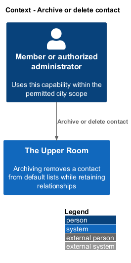
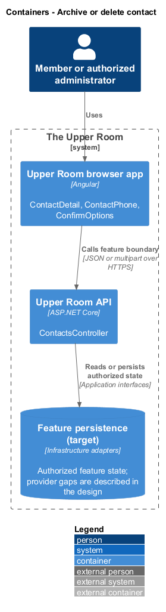
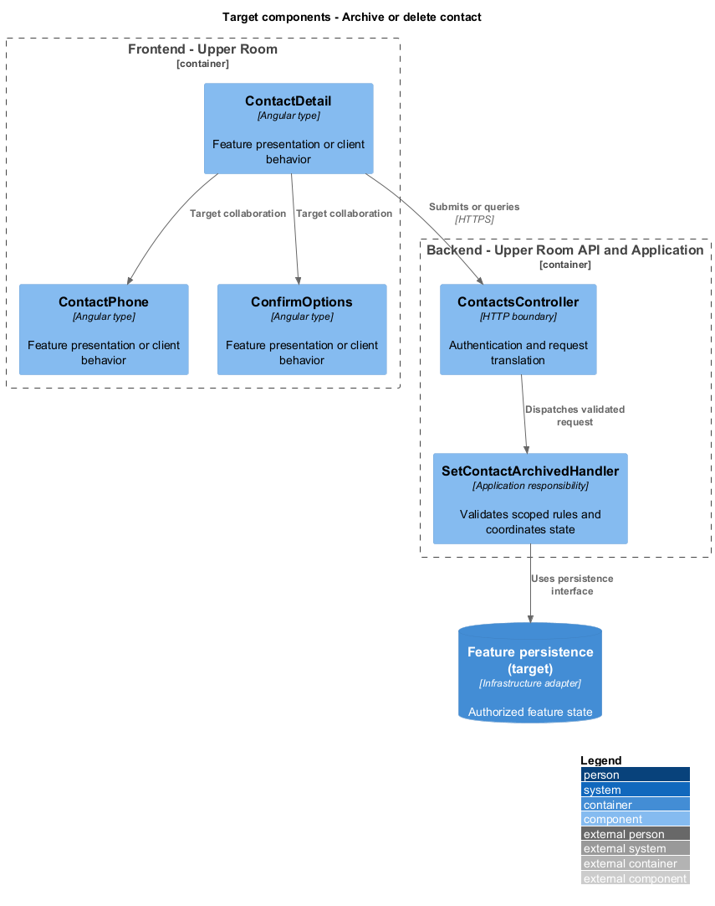
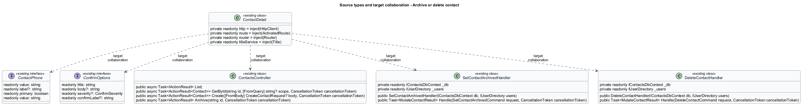
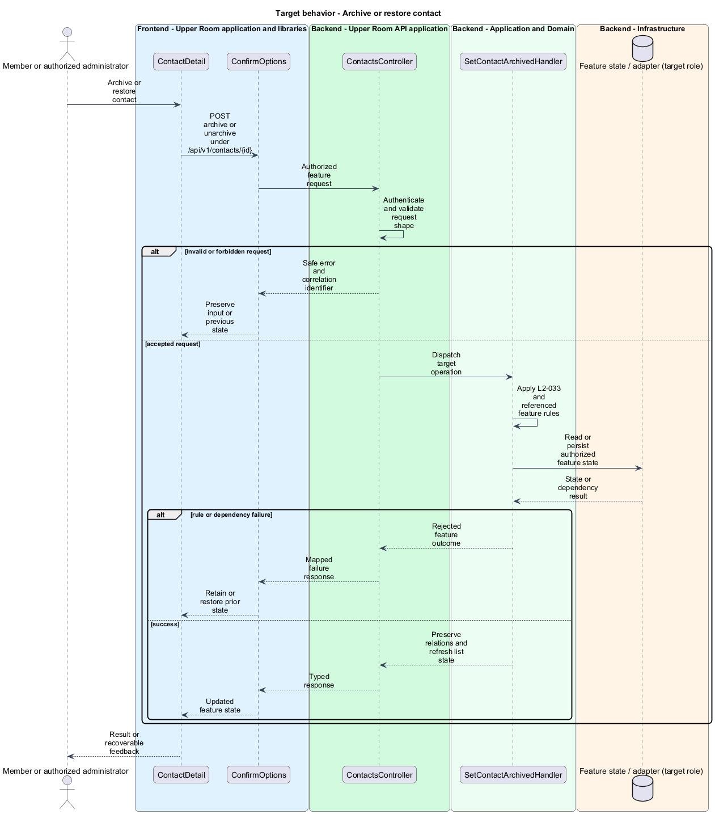
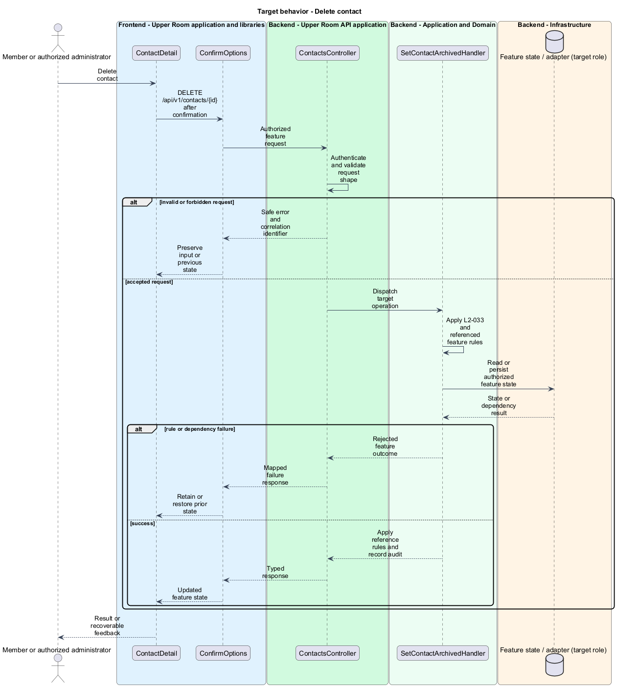

# Archive or delete contact

## Overview

The Upper Room manages contacts, partners, ideas, events, locations, and boards in city-scoped workspaces.

Archiving removes a contact from default lists while retaining relationships. Deletion removes the record after a deliberate typed confirmation.

## Description

### Existing implementation

The following source elements provide the current implementation points. Their presence does not establish complete requirement coverage.

| Source | Concrete elements | Observed surface |
|---|---|---|
| [frontend/projects/the-upper-room/src/app/contacts/contact-detail/contact-detail.ts](../../../../frontend/projects/the-upper-room/src/app/contacts/contact-detail/contact-detail.ts) | `ContactDetail` | private readonly http = inject(HttpClient); private readonly route = inject(ActivatedRoute); private readonly router = inject(Router) |
| [frontend/projects/the-upper-room/src/app/contacts/contact-list/contact-list.ts](../../../../frontend/projects/the-upper-room/src/app/contacts/contact-list/contact-list.ts) | `ContactPhone`, `ContactEmail`, `Contact`, `ContactList` | readonly value: string; readonly label?: string; readonly primary: boolean |
| [frontend/projects/components/src/lib/confirm-dialog/confirm.service.ts](../../../../frontend/projects/components/src/lib/confirm-dialog/confirm.service.ts) | `ConfirmOptions`, `ConfirmService` | readonly title: string; readonly body?: string; readonly severity?: ConfirmSeverity |
| [backend/src/TheUpperRoom.Api/Contacts/ContactsController.cs](../../../../backend/src/TheUpperRoom.Api/Contacts/ContactsController.cs) | `ContactsController` | Route api/v1/contacts; HttpGet; HttpGet {id}; HttpPost; HttpPut {id}; HttpPatch {id}; HttpPost {id}/archive; HttpPost {id}/unarchive; HttpDelete {id} |
| [backend/src/TheUpperRoom.Application/Contacts/SetContactArchivedHandler.cs](../../../../backend/src/TheUpperRoom.Application/Contacts/SetContactArchivedHandler.cs) | `SetContactArchivedHandler` | private readonly IContactsDbContext _db; private readonly IUserDirectory _users; public SetContactArchivedHandler(IContactsDbContext db, IUserDirectory users) |
| [backend/src/TheUpperRoom.Application/Contacts/DeleteContactHandler.cs](../../../../backend/src/TheUpperRoom.Application/Contacts/DeleteContactHandler.cs) | `DeleteContactHandler` | private readonly IContactsDbContext _db; private readonly IUserDirectory _users; public DeleteContactHandler(IContactsDbContext db, IUserDirectory users) |

### Target behavior and interfaces

SetContactArchivedHandler shall preserve relations and support reversal. Default list queries shall exclude archived rows. DeleteContactHandler shall reject forbidden or referenced operations consistently and record the deletion audit. The UI shall require the displayed contact name before sending DELETE.

- **Archive or restore contact:** POST archive or unarchive under /api/v1/contacts/{id}. Preserve relations and refresh list state.
- **Delete contact:** DELETE /api/v1/contacts/{id} after confirmation. Apply reference rules and record audit.

Diagrams show target collaborations. Existing source types retain their names. Participants marked as target roles or proposed responsibilities describe interfaces to introduce, not existing classes.

### Gaps and compatibility

Archive, unarchive, and delete actions exist. Typed confirmation is a frontend interaction; the backend shall independently enforce permissions and reference rules.

Production implementation shall follow [AGENTS.md](../../../../AGENTS.md), including incremental acceptance testing. API integrations shall preserve documented behavior until an explicit compatibility change is approved.

## Requirements

The table preserves the opening requirement statement and all parent identifiers. The expandable source excerpts retain the complete normative text and acceptance criteria verbatim. Source wording is quoted rather than normalized to the design prose.

| L2 ID | Refines (L1) | Requirement |
|---|---|---|
| [L2-033](../../../specs/L2.md#l2-033-archive-vs-delete-contacts) | `L1-004` | Archiving a contact sets `archived=true` and excludes it from default lists, but keeps relations intact and is reversible from the Archived filter. Deleting requires a confirmation dialog with the contact's display name typed by the user; deletion soft-deletes (sets `deletedAt`, redacts PII fields) for 30 days and then hard-deletes. |

L2-033: Archive vs Delete Contacts — specification excerpt

Archiving a contact sets `archived=true` and excludes it from default lists, but keeps relations intact and is reversible from the Archived filter. Deleting requires a confirmation dialog with the contact's display name typed by the user; deletion soft-deletes (sets `deletedAt`, redacts PII fields) for 30 days and then hard-deletes.

**Acceptance Criteria:**
1. Given the user clicks Delete for "Alice Smith", when the confirm dialog opens, then it has a text field with placeholder "Type Alice Smith to confirm" and the Delete button is disabled until the input matches exactly.
2. Given a contact is deleted today, when 31 days pass, then a daily background job removes the row entirely.

## Diagrams

### System context

The context identifies the people and application boundary used by this capability.

### Container view

The container view separates browser execution from any backend state responsibility. Provider choices remain subject to the stated gaps.

### Target component view

The component view shows target collaborations between the concrete implementation points and proposed application responsibilities.

### Type structure

The structure view lists source types with declared members where available. Dashed dependencies denote proposed collaboration rather than verified current dependency direction.

### Archive or restore contact

The target flow performs the following operation: POST archive or unarchive under /api/v1/contacts/{id}. Its successful outcome is: Preserve relations and refresh list state. Alternate branches retain prior state or return recoverable failure.

### Delete contact

The target flow performs the following operation: DELETE /api/v1/contacts/{id} after confirmation. Its successful outcome is: Apply reference rules and record audit. Alternate branches retain prior state or return recoverable failure.

