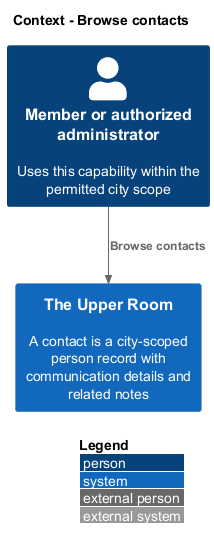
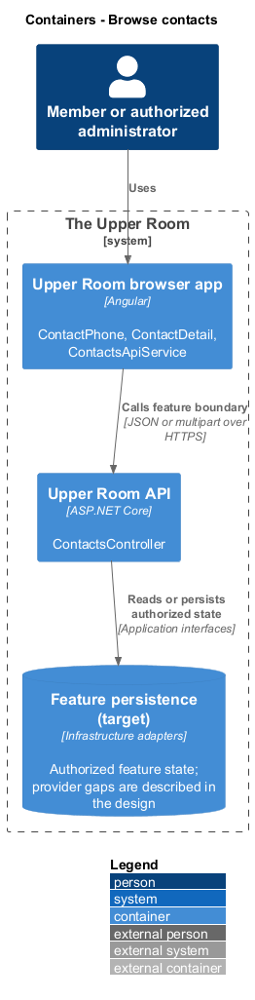
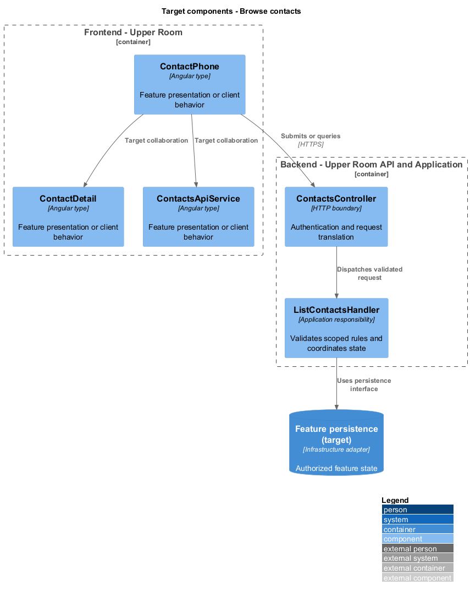
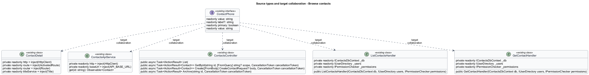
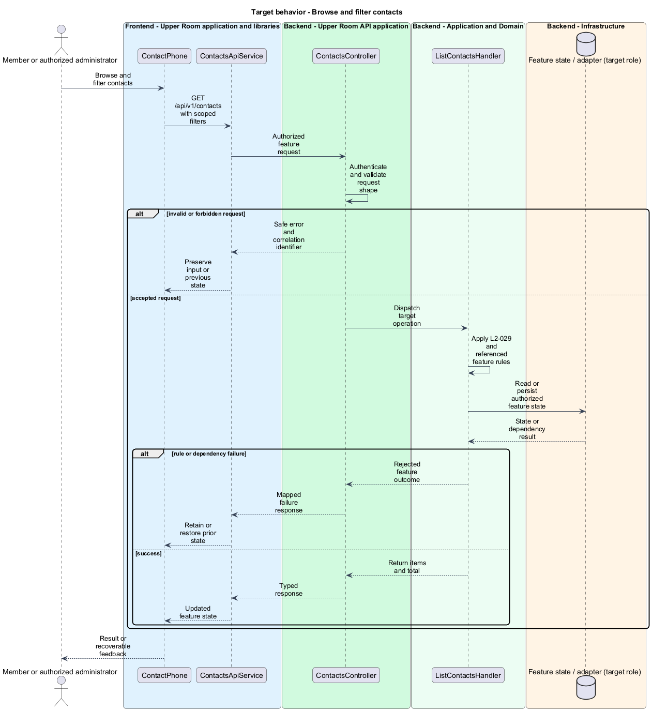
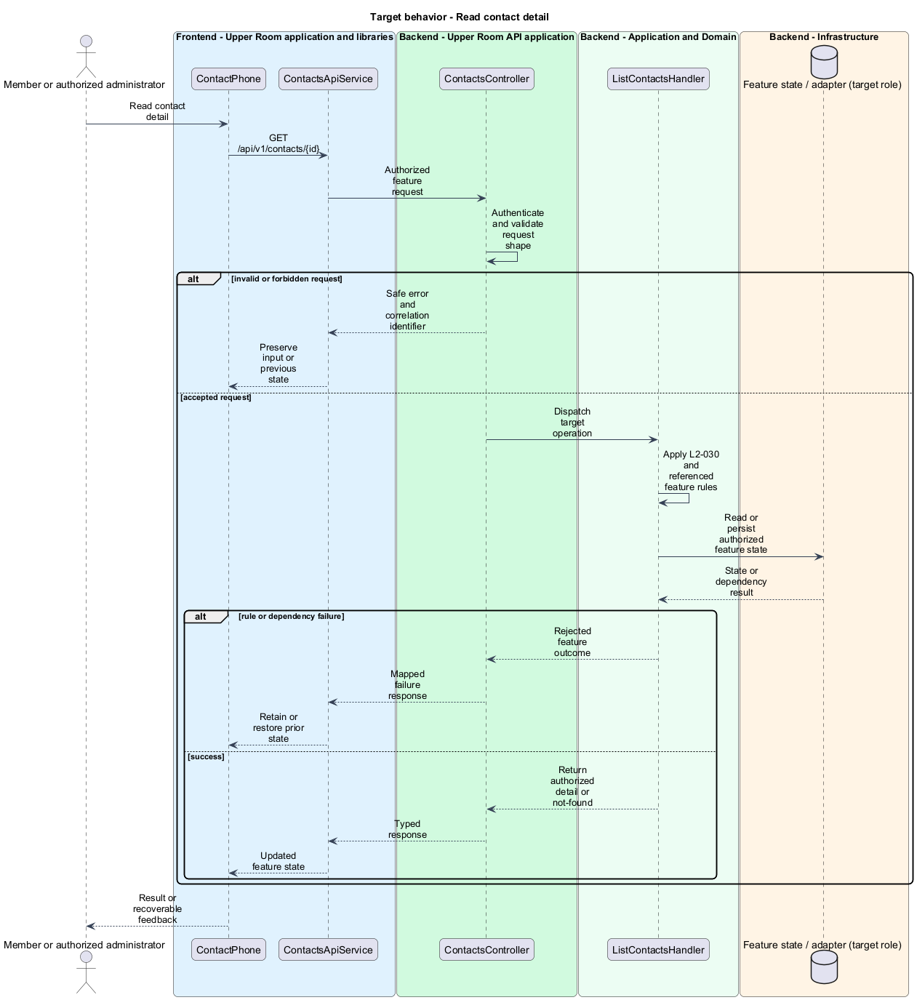
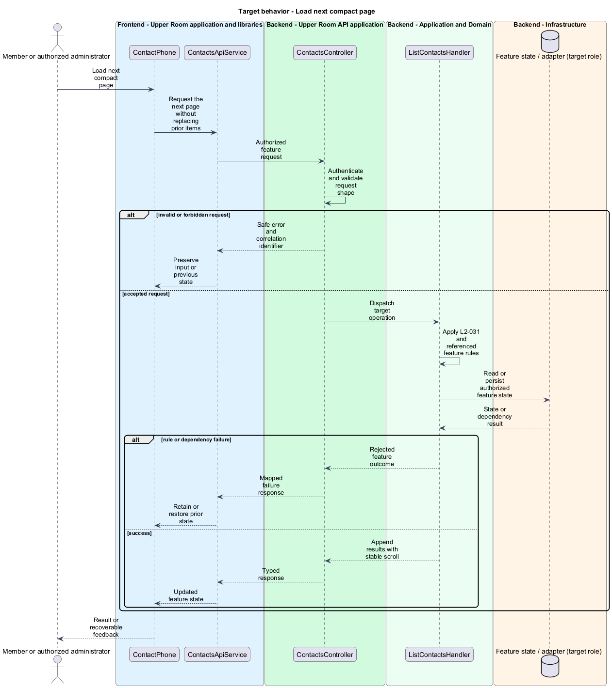

# Browse contacts

## Overview

The Upper Room manages contacts, partners, ideas, events, locations, and boards in city-scoped workspaces.

A contact is a city-scoped person record with communication details and related notes. Browsing finds a contact and exposes the detail needed for follow-up.

## Description

### Existing implementation

The following source elements provide the current implementation points. Their presence does not establish complete requirement coverage.

| Source | Concrete elements | Observed surface |
|---|---|---|
| [frontend/projects/the-upper-room/src/app/contacts/contact-list/contact-list.ts](../../../../frontend/projects/the-upper-room/src/app/contacts/contact-list/contact-list.ts) | `ContactPhone`, `ContactEmail`, `Contact`, `ContactList` | readonly value: string; readonly label?: string; readonly primary: boolean |
| [frontend/projects/the-upper-room/src/app/contacts/contact-detail/contact-detail.ts](../../../../frontend/projects/the-upper-room/src/app/contacts/contact-detail/contact-detail.ts) | `ContactDetail` | private readonly http = inject(HttpClient); private readonly route = inject(ActivatedRoute); private readonly router = inject(Router) |
| [frontend/projects/api/src/lib/contacts/contacts-api.service.ts](../../../../frontend/projects/api/src/lib/contacts/contacts-api.service.ts) | `ContactsApiService` | private readonly http = inject(HttpClient); private readonly baseUrl = inject(API_BASE_URL); get(id: string): Observable<Contact> |
| [backend/src/TheUpperRoom.Api/Contacts/ContactsController.cs](../../../../backend/src/TheUpperRoom.Api/Contacts/ContactsController.cs) | `ContactsController` | Route api/v1/contacts; HttpGet; HttpGet {id}; HttpPost; HttpPut {id}; HttpPatch {id}; HttpPost {id}/archive; HttpPost {id}/unarchive; HttpDelete {id} |
| [backend/src/TheUpperRoom.Application/Contacts/ListContactsHandler.cs](../../../../backend/src/TheUpperRoom.Application/Contacts/ListContactsHandler.cs) | `ListContactsHandler` | private readonly IContactsDbContext _db; private readonly IUserDirectory _users; private readonly IPermissionChecker _permissions |
| [backend/src/TheUpperRoom.Application/Contacts/GetContactHandler.cs](../../../../backend/src/TheUpperRoom.Application/Contacts/GetContactHandler.cs) | `GetContactHandler` | private readonly IContactsDbContext _db; private readonly IUserDirectory _users; private readonly IPermissionChecker _permissions |
| [backend/src/TheUpperRoom.Application/Contacts/ContactRow.cs](../../../../backend/src/TheUpperRoom.Application/Contacts/ContactRow.cs) | `ContactRow` | public string Id; public string Name; public string CityId |

### Target behavior and interfaces

ContactList shall use IContactsApi and retain search, tags, archive filters, and pagination as query state. ListContactsHandler and GetContactHandler shall apply authorization and city scope before projection. Compact lists shall append the next page without losing scroll position. ContactDetail shall show the required tabs and actions.

- **Browse and filter contacts:** GET /api/v1/contacts with scoped filters. Return items and total.
- **Read contact detail:** GET /api/v1/contacts/{id}. Return authorized detail or not-found.
- **Load next compact page:** Request the next page without replacing prior items. Append results with stable scroll.

Diagrams show target collaborations. Existing source types retain their names. Participants marked as target roles or proposed responsibilities describe interfaces to introduce, not existing classes.

### Gaps and compatibility

The controller returns list items and total counts. CreateContactHandler assigns an eight-character ID, while L2-029 specifies UUID v7. Full contact schema parity and identifier compatibility are gaps; the migration policy is <TO SUPPLY>.

Production implementation shall follow [AGENTS.md](../../../../AGENTS.md), including incremental acceptance testing. API integrations shall preserve documented behavior until an explicit compatibility change is approved.

Shared capability designs: [L2-064](../../notifications/configure-notifications/README.md).

## Requirements

The table preserves the opening requirement statement and all parent identifiers. The expandable source excerpts retain the complete normative text and acceptance criteria verbatim. Source wording is quoted rather than normalized to the design prose.

| L2 ID | Refines (L1) | Requirement |
|---|---|---|
| [L2-029](../../../specs/L2.md#l2-029-contact-data-model) | `L1-004` | A Contact must have: `id` (uuid v7), `cityId` (FK), `firstName` (required, 1-100), `lastName` (required, 1-100), `displayName` (computed `firstName + ' ' + lastName`, override-able), `pronouns` (optional, max 30), `title` (optional, max 100), `organization` (optional, max 200, free text or partner FK), `addresses` (0..n: street1, street2, city, region, postalCode, country), `phones` (0..n: label e.g. Mobile/Work/Home, e164 number, isPrimary), `emails` (0..n: label, address, isPrimary), `tags` (m..n), `notes` (1..n via L2-064), `avatarUrl` (optional), `archived` (bool), `createdAt`, `createdBy`, `updatedAt`, `updatedBy`, `version` (rowversion). |
| [L2-030](../../../specs/L2.md#l2-030-contact-list-page) | `L1-004`, `L1-027` | Route `/contacts` shows a responsive list: - XS/SM: vertically stacked `mat-card`s, 1 per row, gap `$space-3`, padded `$space-3` from viewport edges. - MD: 2-column grid, gap `$space-4`. - LG: 3-column grid, gap `$space-4`. - XL: 4-column grid, gap `$space-6`. |
| [L2-031](../../../specs/L2.md#l2-031-contact-detail-page) | `L1-004` | Route `/contacts/:id` shows a header (avatar 96px, display name `headline-medium`, title @ organization `title-medium`, action row with buttons "Edit", "Archive", "Delete", `more_vert`), then a tabbed view with tabs "Overview", "Notes", "Activity". The Overview tab is two columns on MD+ (left 2fr "Contact info" card with phones, emails, addresses; right 1fr "Tags" card and "Linked Partners" card) and single column on XS/SM. Each card has padding `$space-6` and `level1` elevation. |
| [L2-112](../../../specs/L2.md#l2-112-pagination-infinite-scroll) | `L1-019`, `L1-027` | List pages default to paginated mode with `mat-paginator` (page sizes 25/50/100). On XS/SM, list pages use infinite scroll (load next page when user scrolls within 200px of the bottom) with a "Load more" fallback button if the IntersectionObserver fails. |

L2-029: Contact Data Model — specification excerpt

A Contact must have: `id` (uuid v7), `cityId` (FK), `firstName` (required, 1-100), `lastName` (required, 1-100), `displayName` (computed `firstName + ' ' + lastName`, override-able), `pronouns` (optional, max 30), `title` (optional, max 100), `organization` (optional, max 200, free text or partner FK), `addresses` (0..n: street1, street2, city, region, postalCode, country), `phones` (0..n: label e.g. Mobile/Work/Home, e164 number, isPrimary), `emails` (0..n: label, address, isPrimary), `tags` (m..n), `notes` (1..n via L2-064), `avatarUrl` (optional), `archived` (bool), `createdAt`, `createdBy`, `updatedAt`, `updatedBy`, `version` (rowversion).

**Acceptance Criteria:**
1. Given a contact with no firstName, when persisted, then the API returns 400 with `{ "errors": { "firstName": ["First name is required."] } }`.
2. Given a phone number `not-a-number`, when validated server-side, then the API returns 400 with `phones[0].number: "Enter a valid phone number, e.g. +1 555 123 4567"`.

L2-030: Contact List Page — specification excerpt

Route `/contacts` shows a responsive list:
- XS/SM: vertically stacked `mat-card`s, 1 per row, gap `$space-3`, padded `$space-3` from viewport edges.
- MD: 2-column grid, gap `$space-4`.
- LG: 3-column grid, gap `$space-4`.
- XL: 4-column grid, gap `$space-6`.

Each card shows: avatar (48px), display name (`title-medium`), title @ organization (`body-small`, ellipsis), primary phone, primary email, up to 3 tag chips (overflow indicator "+N"). Right-side `more_vert` opens a menu (Edit, Archive, Delete).

A toolbar above the grid contains: search (left, full-width on XS), filter chip row (right): Tag, City, Archived (toggle), Sort. A FAB (`add`) is anchored bottom-right `$space-6` from edges on XS/SM; on MD+ a filled "New contact" button is placed in the toolbar instead.

**Acceptance Criteria:**
1. Given there are zero non-archived contacts, when the page loads, then the empty state shows icon `person_add` (size `xl`), heading "No contacts yet", body "Add your first contact to get started.", and a "New contact" filled button.
2. Given the user types "bob" in search, when 300ms passes, then results filter to contacts where any of firstName, lastName, displayName, email, organization contains "bob" (case-insensitive).
3. Given the viewport is 768px wide, when the grid renders, then exactly 2 columns are shown.

L2-031: Contact Detail Page — specification excerpt

Route `/contacts/:id` shows a header (avatar 96px, display name `headline-medium`, title @ organization `title-medium`, action row with buttons "Edit", "Archive", "Delete", `more_vert`), then a tabbed view with tabs "Overview", "Notes", "Activity". The Overview tab is two columns on MD+ (left 2fr "Contact info" card with phones, emails, addresses; right 1fr "Tags" card and "Linked Partners" card) and single column on XS/SM. Each card has padding `$space-6` and `level1` elevation.

**Acceptance Criteria:**
1. Given a contact has 3 phone numbers, when the Overview tab is open, then all 3 phones are listed with their labels and click-to-call `tel:` links.
2. Given an XS viewport, when the Overview tab is open, then cards stack vertically with `$space-3` gap.

L2-112: Pagination &amp; Infinite Scroll — specification excerpt

List pages default to paginated mode with `mat-paginator` (page sizes 25/50/100). On XS/SM, list pages use infinite scroll (load next page when user scrolls within 200px of the bottom) with a "Load more" fallback button if the IntersectionObserver fails.

**Acceptance Criteria:**
1. Given XS viewport at the bottom of a 25-row list, when scrolled, then the next page is requested and appended without scroll-position jump.

## Diagrams

### System context

The context identifies the people and application boundary used by this capability.

### Container view

The container view separates browser execution from any backend state responsibility. Provider choices remain subject to the stated gaps.

### Target component view

The component view shows target collaborations between the concrete implementation points and proposed application responsibilities.

### Type structure

The structure view lists source types with declared members where available. Dashed dependencies denote proposed collaboration rather than verified current dependency direction.

### Browse and filter contacts

The target flow performs the following operation: GET /api/v1/contacts with scoped filters. Its successful outcome is: Return items and total. Alternate branches retain prior state or return recoverable failure.

### Read contact detail

The target flow performs the following operation: GET /api/v1/contacts/{id}. Its successful outcome is: Return authorized detail or not-found. Alternate branches retain prior state or return recoverable failure.

### Load next compact page

The target flow performs the following operation: Request the next page without replacing prior items. Its successful outcome is: Append results with stable scroll. Alternate branches retain prior state or return recoverable failure.

