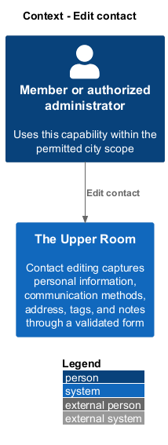
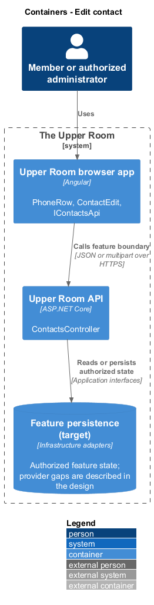
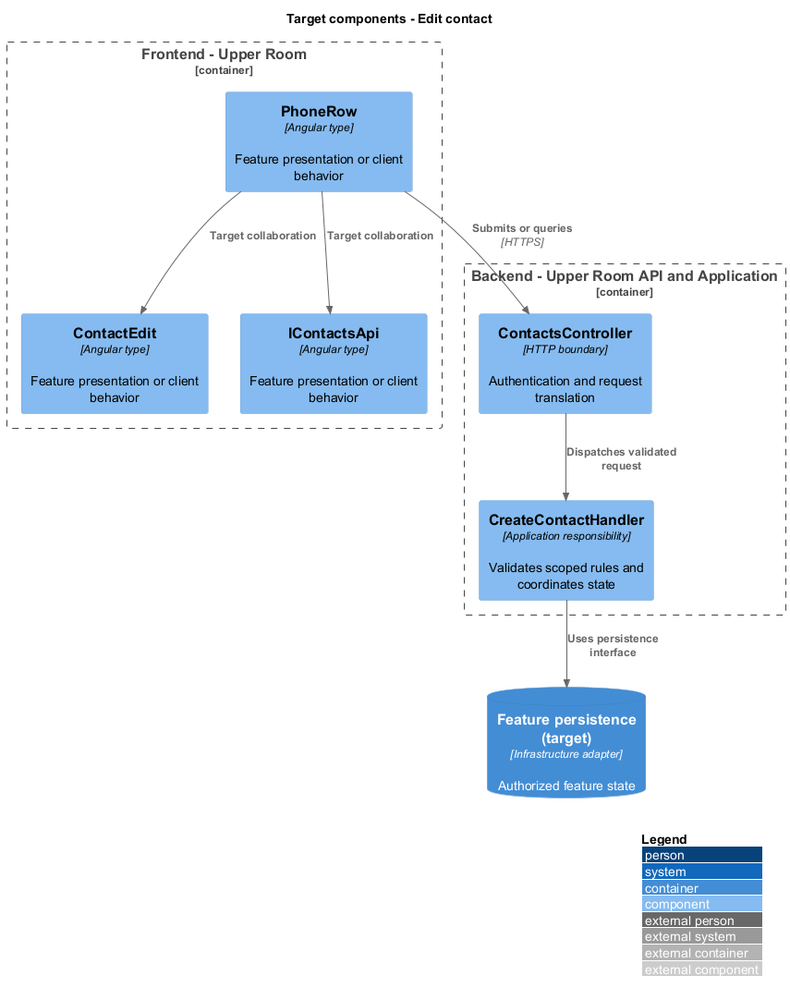
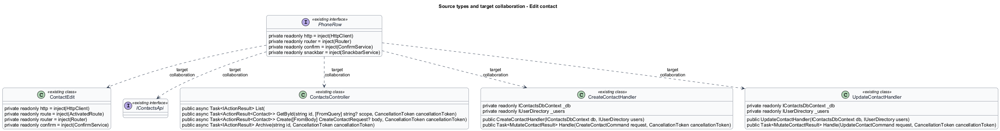
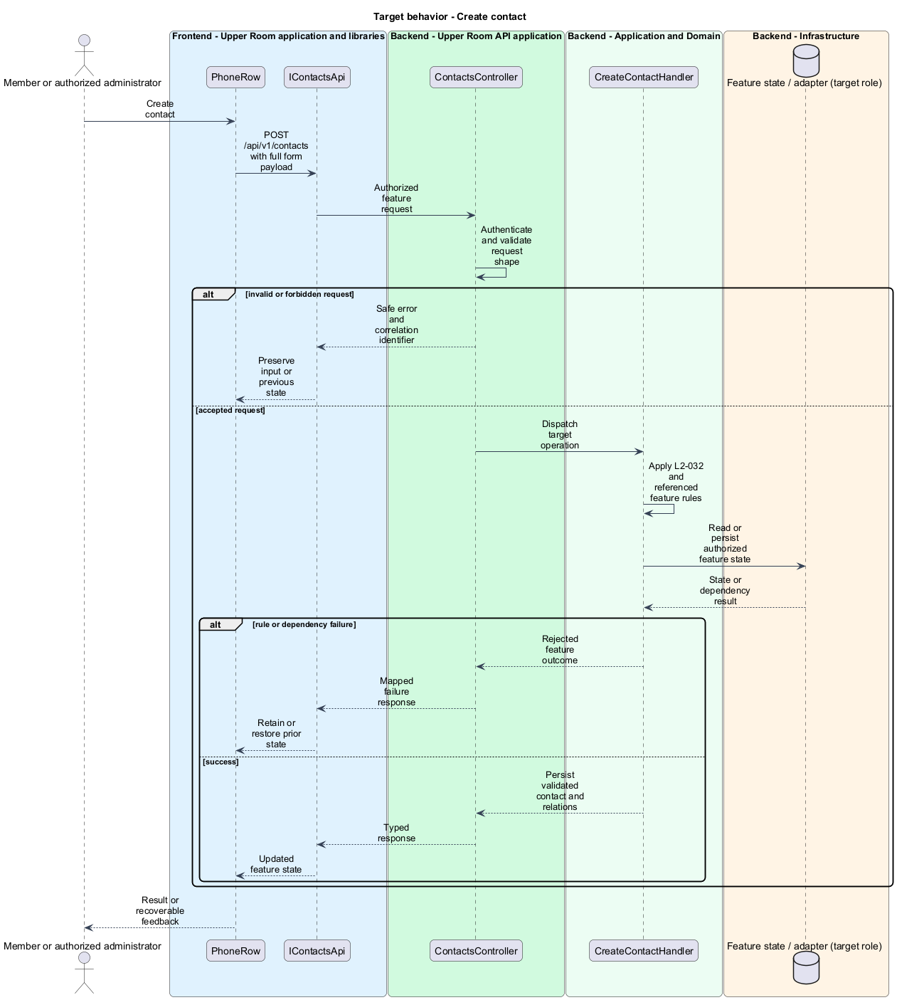
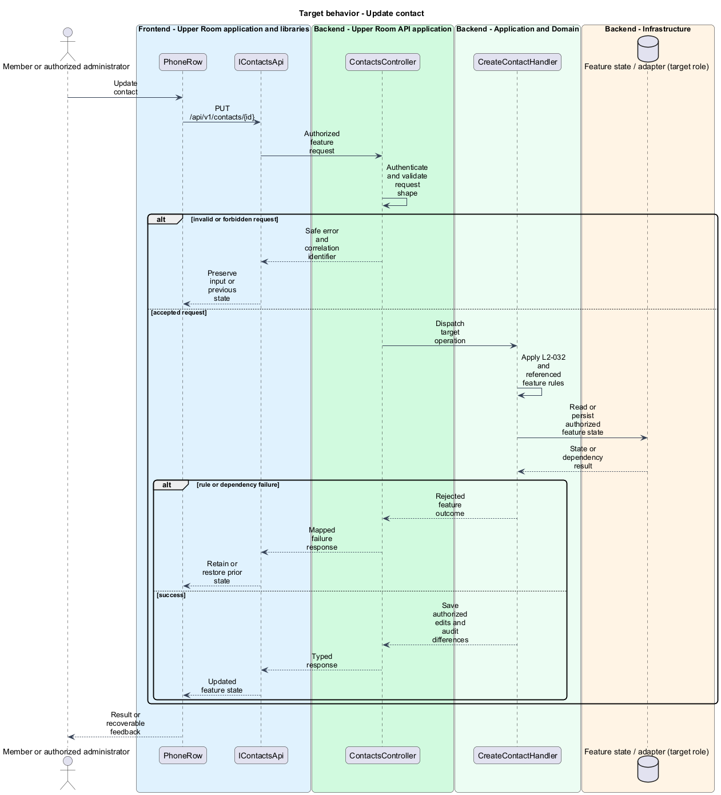

# Edit contact

## Overview

The Upper Room manages contacts, partners, ideas, events, locations, and boards in city-scoped workspaces.

Contact editing captures personal information, communication methods, address, tags, and notes through a validated form.

## Description

### Existing implementation

The following source elements provide the current implementation points. Their presence does not establish complete requirement coverage.

| Source | Concrete elements | Observed surface |
|---|---|---|
| [frontend/projects/the-upper-room/src/app/contacts/contact-create/contact-create.ts](../../../../frontend/projects/the-upper-room/src/app/contacts/contact-create/contact-create.ts) | `PhoneRow`, `EmailRow`, `AddressRow`, `ContactCreate` | private readonly http = inject(HttpClient); private readonly router = inject(Router); private readonly confirm = inject(ConfirmService) |
| [frontend/projects/the-upper-room/src/app/contacts/contact-edit/contact-edit.ts](../../../../frontend/projects/the-upper-room/src/app/contacts/contact-edit/contact-edit.ts) | `ContactEdit` | private readonly http = inject(HttpClient); private readonly route = inject(ActivatedRoute); private readonly router = inject(Router) |
| [frontend/projects/api/src/lib/contacts/contacts-api.contract.ts](../../../../frontend/projects/api/src/lib/contacts/contacts-api.contract.ts) | `IContactsApi` | Declarations and configuration in the linked source |
| [backend/src/TheUpperRoom.Api/Contacts/ContactsController.cs](../../../../backend/src/TheUpperRoom.Api/Contacts/ContactsController.cs) | `ContactsController` | Route api/v1/contacts; HttpGet; HttpGet {id}; HttpPost; HttpPut {id}; HttpPatch {id}; HttpPost {id}/archive; HttpPost {id}/unarchive; HttpDelete {id} |
| [backend/src/TheUpperRoom.Application/Contacts/CreateContactHandler.cs](../../../../backend/src/TheUpperRoom.Application/Contacts/CreateContactHandler.cs) | `CreateContactHandler` | private readonly IContactsDbContext _db; private readonly IUserDirectory _users; public CreateContactHandler(IContactsDbContext db, IUserDirectory users) |
| [backend/src/TheUpperRoom.Application/Contacts/UpdateContactHandler.cs](../../../../backend/src/TheUpperRoom.Application/Contacts/UpdateContactHandler.cs) | `UpdateContactHandler` | private readonly IContactsDbContext _db; private readonly IUserDirectory _users; public UpdateContactHandler(IContactsDbContext db, IUserDirectory users) |
| [backend/src/TheUpperRoom.Application/Contacts/CreateContactRequest.cs](../../../../backend/src/TheUpperRoom.Application/Contacts/CreateContactRequest.cs) | `CreateContactRequest` | Declarations and configuration in the linked source |

### Target behavior and interfaces

ContactCreate and ContactEdit shall share field rules and collection editing for phones and email addresses. IContactsApi shall submit typed requests. Handlers shall validate the complete payload, enforce city permissions, persist the contact and related data, and record an audit change. Failed submissions shall retain input.

- **Create contact:** POST /api/v1/contacts with full form payload. Persist validated contact and relations.
- **Update contact:** PUT /api/v1/contacts/{id}. Save authorized edits and audit differences.

Diagrams show target collaborations. Existing source types retain their names. Participants marked as target roles or proposed responsibilities describe interfaces to introduce, not existing classes.

### Gaps and compatibility

CreateContactHandler currently builds a row from the name and city, despite the wider form payload. Persisting all required contact fields and related collections is a target change, not existing coverage.

Production implementation shall follow [AGENTS.md](../../../../AGENTS.md), including incremental acceptance testing. API integrations shall preserve documented behavior until an explicit compatibility change is approved.

## Requirements

The table preserves the opening requirement statement and all parent identifiers. The expandable source excerpts retain the complete normative text and acceptance criteria verbatim. Source wording is quoted rather than normalized to the design prose.

| L2 ID | Refines (L1) | Requirement |
|---|---|---|
| [L2-032](../../../specs/L2.md#l2-032-contact-create-edit-form) | `L1-004`, `L1-028` | Route `/contacts/new` and `/contacts/:id/edit` use the same reactive form. Layout: a single column on XS/SM, two columns on MD+ (max-width `960px`, padding `$space-6`). Fields grouped into "Personal", "Contact methods", "Address", "Organization", "Tags & Notes". Each field has label, helper text, and inline error. The "Contact methods" group uses a `mat-list` with rows that include a "Remove" icon button and an "Add phone"/"Add email" stroked button below. Form footer is sticky on scroll, height `72px`, contains "Cancel" (text) and "Save" (filled) right-aligned, with an "unsaved changes" indicator (icon `circle` size 8px, `--md-sys-color-tertiary`) when the form is dirty. |

L2-032: Contact Create/Edit Form — specification excerpt

Route `/contacts/new` and `/contacts/:id/edit` use the same reactive form. Layout: a single column on XS/SM, two columns on MD+ (max-width `960px`, padding `$space-6`). Fields grouped into "Personal", "Contact methods", "Address", "Organization", "Tags & Notes". Each field has label, helper text, and inline error. The "Contact methods" group uses a `mat-list` with rows that include a "Remove" icon button and an "Add phone"/"Add email" stroked button below. Form footer is sticky on scroll, height `72px`, contains "Cancel" (text) and "Save" (filled) right-aligned, with an "unsaved changes" indicator (icon `circle` size 8px, `--md-sys-color-tertiary`) when the form is dirty.

**Acceptance Criteria:**
1. Given the user clicks Cancel with a dirty form, when clicked, then a confirmation dialog "Discard changes?" with body "Your changes will be lost. This cannot be undone." and buttons "Keep editing"/"Discard" appears.
2. Given the user adds a phone, when the row appears, then focus moves to the new phone-number input.

## Diagrams

### System context

The context identifies the people and application boundary used by this capability.

### Container view

The container view separates browser execution from any backend state responsibility. Provider choices remain subject to the stated gaps.

### Target component view

The component view shows target collaborations between the concrete implementation points and proposed application responsibilities.

### Type structure

The structure view lists source types with declared members where available. Dashed dependencies denote proposed collaboration rather than verified current dependency direction.

### Create contact

The target flow performs the following operation: POST /api/v1/contacts with full form payload. Its successful outcome is: Persist validated contact and relations. Alternate branches retain prior state or return recoverable failure.

### Update contact

The target flow performs the following operation: PUT /api/v1/contacts/{id}. Its successful outcome is: Save authorized edits and audit differences. Alternate branches retain prior state or return recoverable failure.

