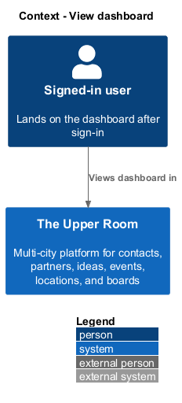
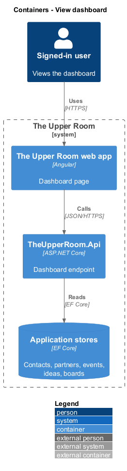
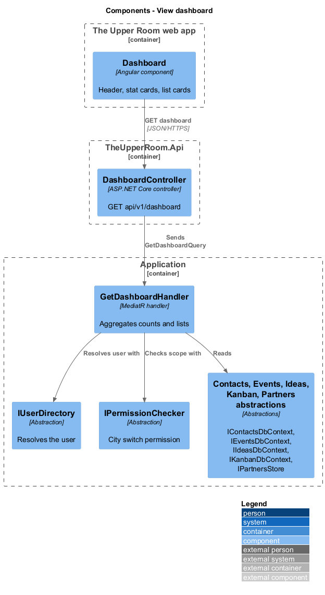
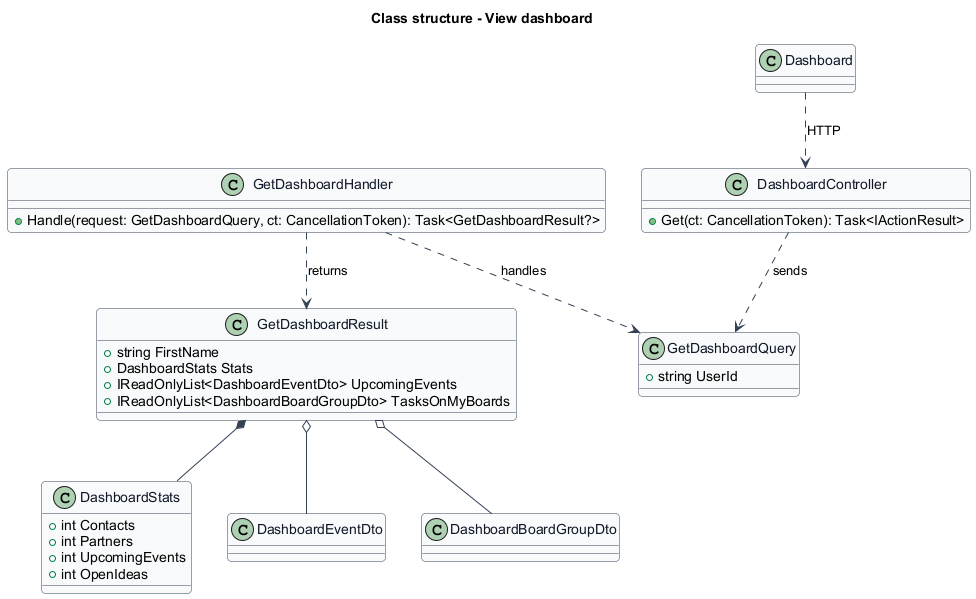
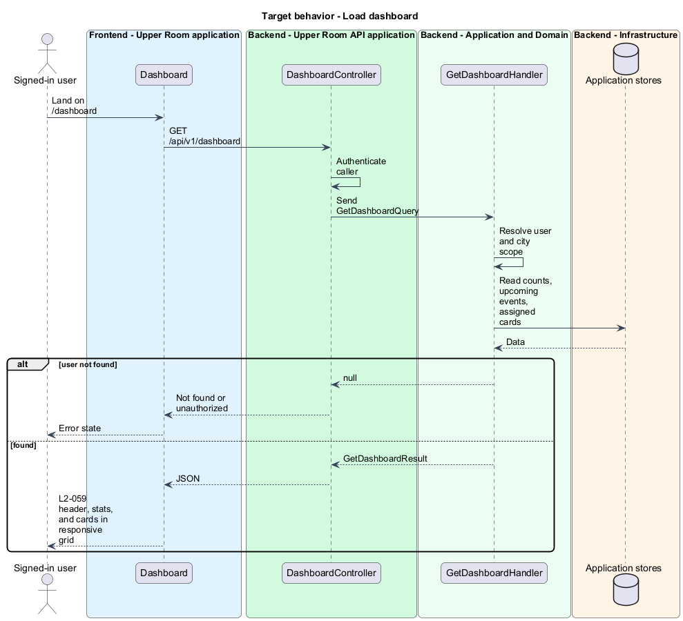

# View dashboard

## Overview

The Upper Room is a multi-city platform in which each city has its own workspace of contacts, partners, ideas, events, locations, and boards.

The dashboard is the default landing page after sign-in. It summarizes the state of the active city: counts of contacts, partners, upcoming events, and open ideas, plus lists of what needs the attention of the user.

**stat card** — tile that shows one count with an icon and a label

**audit-log item** — recorded change to an entity, used here as an activity entry

The dashboard reads data from several subsystems and presents it in one responsive grid.

## Description

### Existing implementation

The following source elements provide the current implementation points. Their presence does not establish complete requirement coverage.

| Source | Concrete elements | Observed surface |
|---|---|---|
| [frontend/projects/the-upper-room/src/app/dashboard/dashboard.ts](../../../../frontend/projects/the-upper-room/src/app/dashboard/dashboard.ts) | `Dashboard` | `HttpClient` injected; implements `OnInit` |
| [backend/src/TheUpperRoom.Api/Dashboard/DashboardController.cs](../../../../backend/src/TheUpperRoom.Api/Dashboard/DashboardController.cs) | `DashboardController` | Route `api/v1/dashboard`; `HttpGet` |
| [backend/src/TheUpperRoom.Application/Dashboard/GetDashboardHandler.cs](../../../../backend/src/TheUpperRoom.Application/Dashboard/GetDashboardHandler.cs) | `GetDashboardQuery`, `GetDashboardHandler` | Reads `IContactsDbContext`, `IEventsDbContext`, `IIdeasDbContext`, `IKanbanDbContext`, `IPartnersStore`, `IUserDirectory`, `IPermissionChecker` |
| [backend/src/TheUpperRoom.Application/Dashboard/GetDashboardResult.cs](../../../../backend/src/TheUpperRoom.Application/Dashboard/GetDashboardResult.cs) | `GetDashboardResult`, `DashboardStats`, `DashboardEventDto`, `DashboardBoardGroupDto` | `FirstName`, `Stats`, `UpcomingEvents`, `TasksOnMyBoards` |

### Target behavior and interfaces

`GetDashboardHandler` resolves the user, scopes counts to the city of the user (all cities when the role holds the city switch permission), and returns the first name, the four counts, the next upcoming events, and the cards assigned to the user grouped by board. `Dashboard` renders the header "Welcome, {firstName}" with the subtitle "Here's what's happening in {city} today.", a stats row (2x2 on XS, 4x1 on MD and wider), and the cards "Upcoming events" (next 5, "View calendar" link), "Recent activity" (last 10 audit-log items relevant to the user), "My ideas" (with status chips), and "Tasks on my boards". On LG and wider the grid has 12 columns: stats span 12 and each card spans 6.

### Gaps and compatibility

`GetDashboardResult` has no recent-activity or my-ideas members. Adding them is a target change; the audit-log source for recent activity is `<TO SUPPLY>`. The number of upcoming events returned (5) and its enforcement location are `<TO SUPPLY>`. The `Dashboard` page calls `HttpClient` directly; a contract and token are target work.

## Requirements

| L2 ID | Refines (L1) | Requirement |
|---|---|---|
| [L2-059](../../../specs/L2.md#l2-059-dashboard-page) | `L1-013`, `L1-026` | Route `/dashboard` is the default landing page after sign-in. Layout (responsive grid, gap `$space-4`): - "Welcome, {firstName}" header (`headline-medium`), subtitle "Here's what's happening in {city} today." (`body-large`, color `on-surface-variant`). - Stats row: 4 cards (Contacts, Partners, Upcoming Events, Open Ideas) each `mat-card` `level1`, `120px` tall, with icon (size lg, in colored circle), big number (`display-small`), label (`label-large`). XS 2x2, MD 4x1. - "Upcoming events" card: list of next 5 events, "View calendar" link. - "Recent activity" card: last 10 audit-log items relevant to the user. - "My ideas" card: ideas the user proposed, with status chips. - "Tasks on my boards" card: cards assigned to the user across all boards, grouped by board. |

**Acceptance criteria**

1. Given XS viewport, when the dashboard renders, then stat cards arrange 2 wide x 2 tall.
2. Given LG+ viewport, when the dashboard renders, then it is a 12-column grid: stats span 12, upcoming events 6, recent activity 6, my ideas 6, my tasks 6.

## Diagrams

### System context

### Container view

### Component view

The component view shows the handler and the data sources it reads.

### Type structure

### Load dashboard

The flow aggregates counts and lists for the signed-in user.

