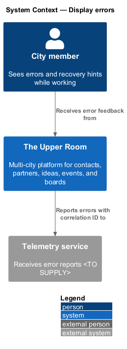
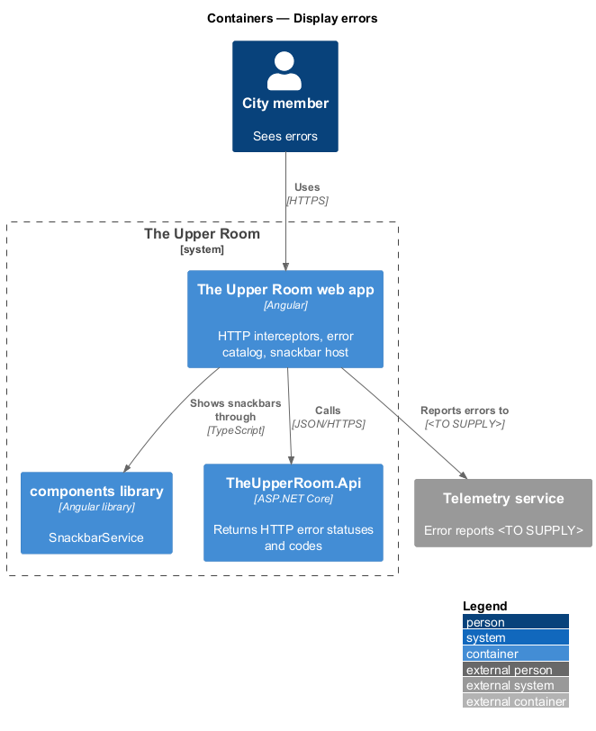
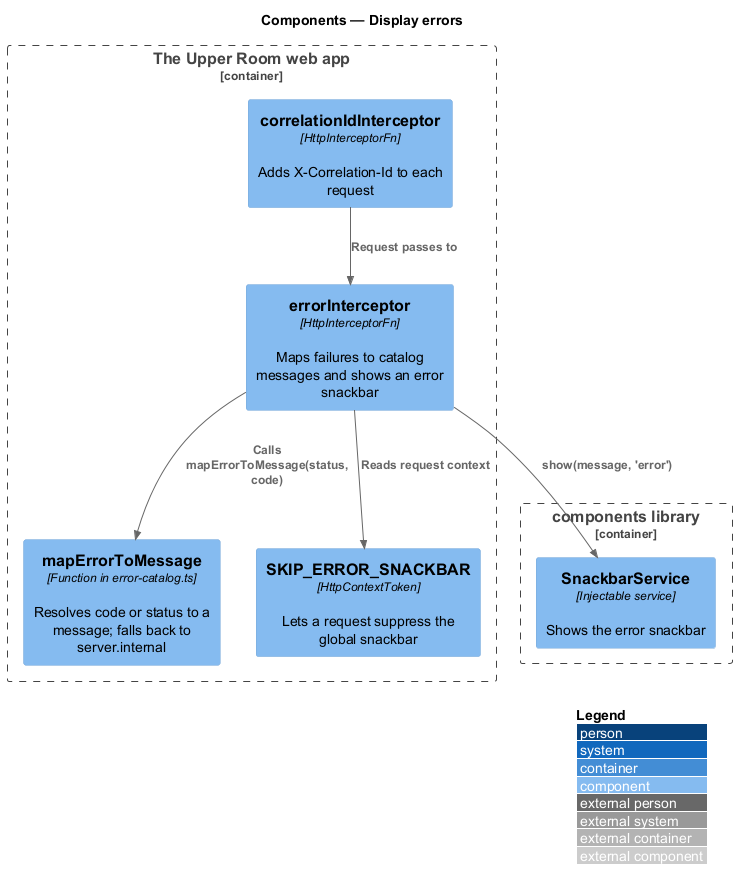
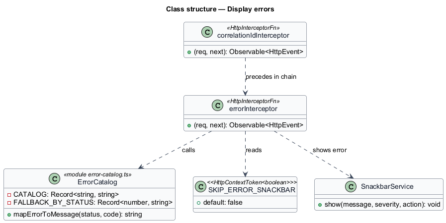
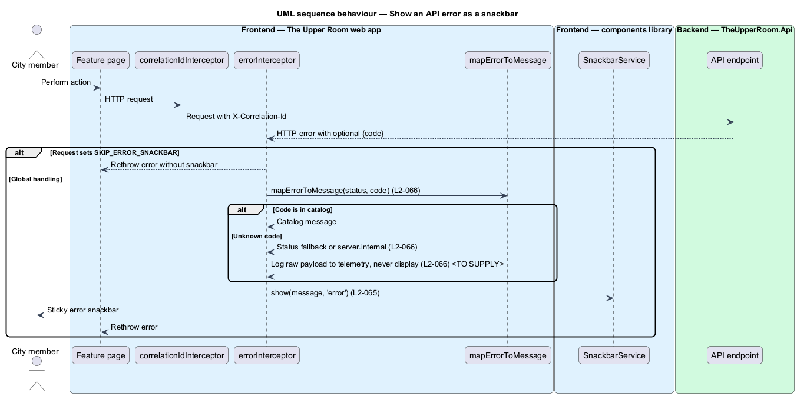
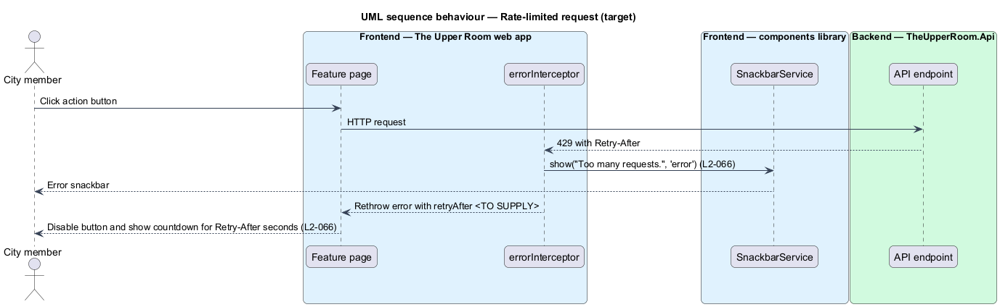

# Display errors

## Overview

The Upper Room manages contacts, partners, ideas, events, locations, and boards in city-scoped workspaces.

**correlation ID** — unique identifier attached to a request and its error reports so that a failure can be traced end to end

**error catalog** — fixed set of error codes with user-facing messages and recovery hints, keyed `error.{code}`

Failures reach users at different scopes, from a single invalid field to a blocking session expiry. The error display hierarchy fixes which surface presents each scope. The error catalog fixes the wording. Each error is written to the console with its correlation ID and sent to telemetry.

## Description

### Existing implementation

| Source | Concrete elements | Observed surface |
|---|---|---|
| [frontend/projects/the-upper-room/src/app/interceptors/error.interceptor.ts](../../../../frontend/projects/the-upper-room/src/app/interceptors/error.interceptor.ts) | `errorInterceptor` | On `HttpErrorResponse` without `SKIP_ERROR_SNACKBAR`, reads `error.code`, maps the message, and calls `SnackbarService.show(message, 'error')`; rethrows the error |
| [frontend/projects/the-upper-room/src/app/interceptors/error-catalog.ts](../../../../frontend/projects/the-upper-room/src/app/interceptors/error-catalog.ts) | `CATALOG`, `FALLBACK_BY_STATUS`, `mapErrorToMessage` | Maps 19 codes to messages; falls back by status, then to `server.internal` |
| [frontend/projects/the-upper-room/src/app/interceptors/correlation-id.interceptor.ts](../../../../frontend/projects/the-upper-room/src/app/interceptors/correlation-id.interceptor.ts) | `correlationIdInterceptor` | Adds `X-Correlation-Id` with a new UUID to each request |
| [frontend/projects/api/src/lib/http-context-tokens.ts](../../../../frontend/projects/api/src/lib/http-context-tokens.ts) | `SKIP_ERROR_SNACKBAR` | `HttpContextToken<boolean>` defaulting to `false` |
| [frontend/projects/the-upper-room/src/app/app.config.ts](../../../../frontend/projects/the-upper-room/src/app/app.config.ts) | `ApplicationConfig` | Registers interceptors in the order `correlationIdInterceptor`, `authInterceptor`, `csrfInterceptor`, `retryInterceptor`, `errorInterceptor` |
| [frontend/projects/components/src/lib/states/tar-list-error.ts](../../../../frontend/projects/components/src/lib/states/tar-list-error.ts) | `TarListError` | List-level error state |

### Target behavior and interfaces

Errors shall surface at the narrowest applicable scope: field, form, page, global, or critical. An HTTP 500 shall show a sticky error snackbar reading "Something went wrong. (ID: {correlationId})" with the action "Copy ID". An unknown error code shall resolve to `server.internal`, and the raw payload shall go to telemetry and not to the screen.

### Gaps and compatibility

- The catalog is a TypeScript constant. The requirement places messages in `i18n/en-CA.json` keyed `error.{code}`. Moving the catalog is `<TO SUPPLY>`.
- The catalog lacks the `validation.too_short`, `validation.too_long`, `upload.too_large`, and `upload.unsupported_type` codes and all recovery hints. `validation.required` has different wording from the requirement ("{field} is required.").
- The interceptor does not include the correlation ID in the snackbar message, does not add the "Copy ID" action, and does not send errors to telemetry. The telemetry endpoint is `<TO SUPPLY>`.
- The `correlationIdInterceptor` generates the ID but does not retain it for display. Sharing the ID between the request and the error surface is `<TO SUPPLY>`.
- `Retry-After` handling for HTTP 429, with a disabled button and countdown, is not implemented. The design is `<TO SUPPLY>`.
- The form-level banner, field-level messages, and the blocking critical dialog (for example `auth.session_expired`) are `<TO SUPPLY>`. The critical dialog shall use the CDK Dialog.

Production implementation shall follow [AGENTS.md](../../../../AGENTS.md), including incremental acceptance testing.

## Requirements

| L2 ID | Refines (L1) | Requirement |
|---|---|---|
| [L2-065](../../../specs/L2.md#l2-065-error-display-hierarchy) | `L1-017` | Errors are surfaced in priority order: Field validation (inline below the input, color `--md-sys-color-error`, icon `error` (sm), `body-small`); Form-level (red banner above the form, icon `error`, dismissable, lists each error); Page-level (full-page error component with icon, heading, description, primary action); Global / API (snackbar (severity error) or banner if persistent (e.g. offline)); Critical (blocking modal dialog (e.g. session expired)). Each error emits to console with the correlation ID and is sent to telemetry. |
| [L2-066](../../../specs/L2.md#l2-066-error-message-catalog) | `L1-017`, `L1-028` | The system must use this catalog. Each message is in `i18n/en-CA.json` keyed by `error.{code}`. (Full catalog in the excerpt below.) |

L2-065: Error Display Hierarchy — specification excerpt

**Acceptance Criteria:**
1. Given an HTTP 500 from the API, when received, then a sticky error snackbar "Something went wrong. (ID: {correlationId})" with action "Copy ID" appears.

L2-066: Error Message Catalog — specification excerpt

| Code | HTTP | Message | Recovery hint |
|------|------|---------|---------------|
| `network.offline` | n/a | You're offline. | Check your internet connection. |
| `network.timeout` | n/a | The request timed out. | Try again in a moment. |
| `auth.invalid_credentials` | 401 | The email or password is incorrect. | Try again or reset your password. |
| `auth.account_locked` | 423 | Your account is locked. | Reset your password or contact support. |
| `auth.session_expired` | 401 | Your session has expired. | Sign in again to continue. |
| `auth.email_not_verified` | 403 | Verify your email to continue. | Check your inbox for the verification link. |
| `forbidden` | 403 | You don't have permission to do that. | Contact your city lead if this is unexpected. |
| `not_found` | 404 | We couldn't find what you're looking for. | Check the link or go back. |
| `conflict` | 409 | That action conflicts with another change. | Refresh and try again. |
| `validation.required` | 400 | {field} is required. | — |
| `validation.too_short` | 400 | {field} must be at least {min} characters. | — |
| `validation.too_long` | 400 | {field} must be {max} characters or fewer. | — |
| `validation.email` | 400 | Enter a valid email address. | — |
| `validation.phone` | 400 | Enter a valid phone number, e.g. +1 555 123 4567. | — |
| `validation.url` | 400 | Enter a valid URL, e.g. https://example.com. | — |
| `validation.password_weak` | 400 | Password is too weak. | Use 12+ characters with letters, numbers, and symbols. |
| `validation.duplicate` | 409 | A record with this value already exists. | — |
| `rate_limited` | 429 | Too many requests. | Wait a moment and try again. |
| `server.internal` | 500 | Something went wrong on our end. | We've been notified. Try again shortly. |
| `server.unavailable` | 503 | Service temporarily unavailable. | Try again in a few minutes. |
| `upload.too_large` | 413 | File is too large. | Max size is {maxMb}MB. |
| `upload.unsupported_type` | 415 | Unsupported file type. | Upload a {allowedTypes} file. |
| `csrf.invalid` | 403 | Your action could not be verified. | Refresh the page and try again. |

**Acceptance Criteria:**
1. Given an HTTP 429 response, when received, then the rate_limited snackbar appears and the originating button is disabled for `Retry-After` seconds with a countdown.
2. Given a server returns an unknown error code, when received, then the generic `server.internal` message is used and the raw payload is logged to telemetry but never displayed.

## Diagrams

### System context

The context shows the member who sees errors and the telemetry service that receives reports.

### Container view

The web app intercepts HTTP failures from the API, shows them through the `components` library, and reports them to telemetry.

### Component view

The interceptor chain adds the correlation ID, then `errorInterceptor` resolves a catalog message and raises the error snackbar.

### Type structure

`errorInterceptor` depends on the catalog function, the context token, and `SnackbarService`.

### Show an API error

The sequence shows catalog resolution, the unknown-code fallback, and the opt-out token.

### Rate-limited request

The target flow for HTTP 429 adds a button lock with a `Retry-After` countdown, which the existing source does not implement.

