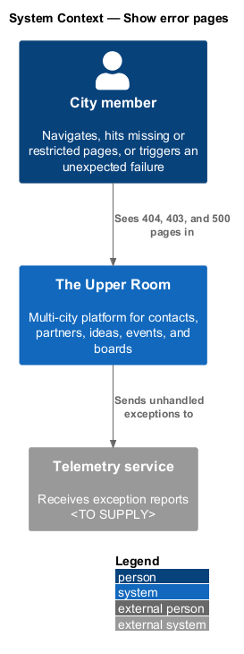
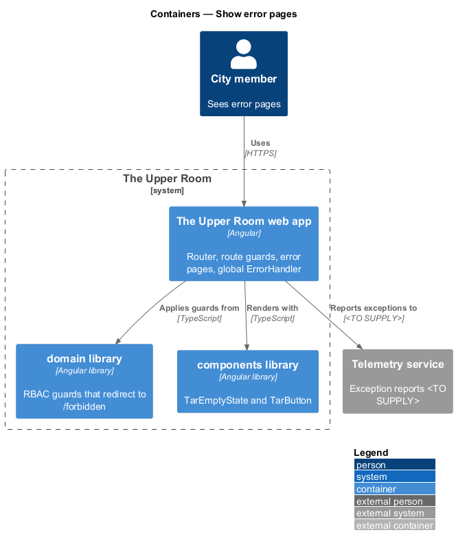
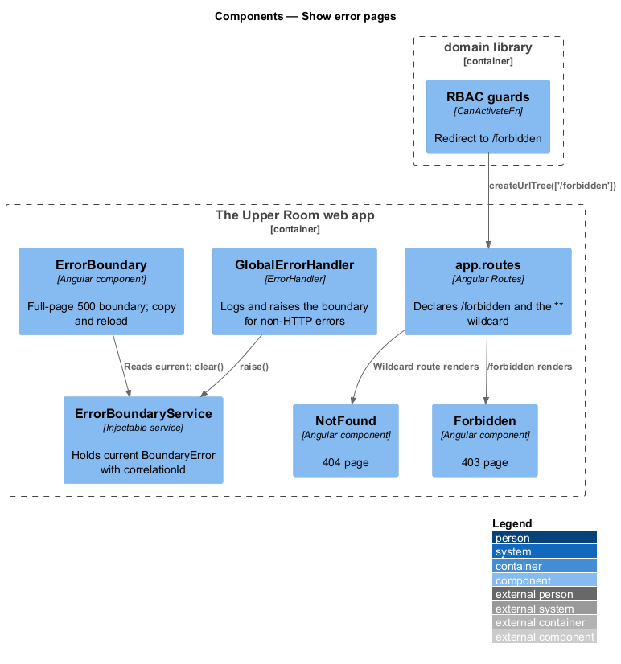
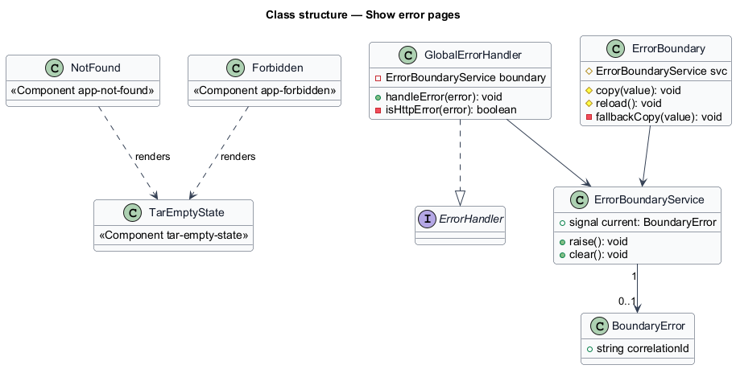
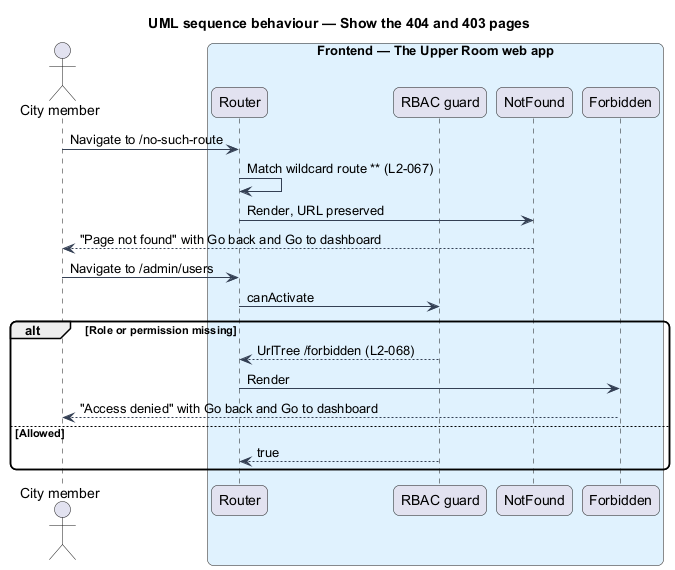
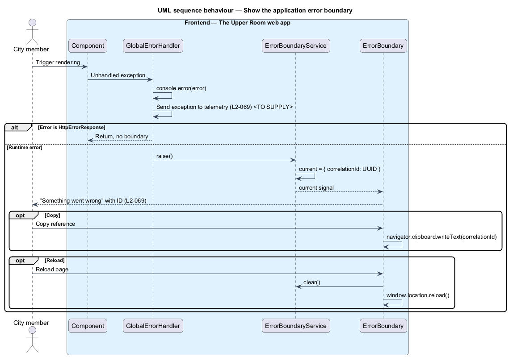

# Show error pages

## Overview

The Upper Room manages contacts, partners, ideas, events, locations, and boards in city-scoped workspaces.

**error page** — full-page view that replaces normal content when navigation or rendering cannot continue

**error boundary** — global catch point that converts an unhandled exception into a full-page error view

Three conditions replace the page content: a route that does not exist (404), a route the user may not open (403), and an unexpected runtime failure (500). Each page offers a way back, either to the previous page or to the dashboard. The 500 boundary also shows a correlation ID that the user can copy for support.

## Description

### Existing implementation

| Source | Concrete elements | Observed surface |
|---|---|---|
| [frontend/projects/the-upper-room/src/app/error/not-found/not-found.ts](../../../../frontend/projects/the-upper-room/src/app/error/not-found/not-found.ts) | `NotFound` | `app-not-found`; renders `tar-empty-state` with heading "Page not found" and body "The page you were looking for doesn't exist." |
| [frontend/projects/the-upper-room/src/app/error/forbidden/forbidden.ts](../../../../frontend/projects/the-upper-room/src/app/error/forbidden/forbidden.ts) | `Forbidden` | `app-forbidden`; renders `tar-empty-state` with icon `block`, heading "You don't have permission", and a "Go to dashboard" link |
| [frontend/projects/the-upper-room/src/app/app.routes.ts](../../../../frontend/projects/the-upper-room/src/app/app.routes.ts) | Routes | `{ path: 'forbidden', component: Forbidden }`; `{ path: '**', component: NotFound }` |
| [frontend/projects/domain/src/lib/rbac/guards.ts](../../../../frontend/projects/domain/src/lib/rbac/guards.ts) | RBAC guards | Return `createUrlTree(['/forbidden'])` when a role or permission is missing |
| [frontend/projects/the-upper-room/src/app/error/global-error-handler.ts](../../../../frontend/projects/the-upper-room/src/app/error/global-error-handler.ts) | `GlobalErrorHandler` | Logs with `console.error`; ignores `HttpErrorResponse`; otherwise calls `ErrorBoundaryService.raise()` |
| [frontend/projects/the-upper-room/src/app/error/error-boundary.service.ts](../../../../frontend/projects/the-upper-room/src/app/error/error-boundary.service.ts) | `ErrorBoundaryService`, `BoundaryError` | `current` signal; `raise()` assigns a new `crypto.randomUUID()`; `clear()` |
| [frontend/projects/the-upper-room/src/app/error/error-boundary/error-boundary.ts](../../../../frontend/projects/the-upper-room/src/app/error/error-boundary/error-boundary.ts) | `ErrorBoundary` | Hosted in `App`; shows the correlation ID; `copy` and `reload` actions |
| [frontend/projects/the-upper-room/src/app/app.config.ts](../../../../frontend/projects/the-upper-room/src/app/app.config.ts) | `ApplicationConfig` | Provides `ErrorHandler` with `GlobalErrorHandler` |

### Target behavior and interfaces

The wildcard route shall render the 404 page without changing the URL. Guards shall redirect unauthorized navigation to `/forbidden`. The global `ErrorHandler` shall render the boundary and shall send the exception to telemetry.

### Gaps and compatibility

- The 404 page offers no "Go back" and "Go to dashboard" buttons, and the 96 px icon and typography tokens are `<TO SUPPLY>` against the `tar-empty-state` styling. The icon name `search-off` differs from `search_off`.
- The 403 page lacks the "Go back" button. Its heading "You don't have permission" and body differ from "Access denied" and "You don't have permission to view this page. If you think this is a mistake, contact your city lead."
- The 500 boundary heading matches. The body reads "We've been notified. Please try again." without "(ID: {correlationId})" inline, and the buttons are "Copy reference" and "Reload page". The "Go to dashboard" button is missing.
- The boundary correlation ID is generated at the time of the error. Relating it to the request correlation ID is `<TO SUPPLY>`.
- Telemetry is not sent. The service is `<TO SUPPLY>`.

Production implementation shall follow [AGENTS.md](../../../../AGENTS.md), including incremental acceptance testing.

## Requirements

| L2 ID | Refines (L1) | Requirement |
|---|---|---|
| [L2-067](../../../specs/L2.md#l2-067-404-page) | `L1-017` | Route `**` (wildcard) renders a centered card: large icon `search_off` (96px, `--md-sys-color-on-surface-variant`), heading "Page not found" (`headline-medium`), body "The page you're looking for doesn't exist or has moved." (`body-large`, color `on-surface-variant`), buttons "Go back" (text) and "Go to dashboard" (filled). |
| [L2-068](../../../specs/L2.md#l2-068-403--forbidden-page) | `L1-017`, `L1-003` | Route `/forbidden` renders a centered card: icon `block` (96px, `--md-sys-color-error`), heading "Access denied", body "You don't have permission to view this page. If you think this is a mistake, contact your city lead.", buttons "Go back" and "Go to dashboard". |
| [L2-069](../../../specs/L2.md#l2-069-500--application-error-boundary) | `L1-017` | A global `ErrorHandler` must catch unhandled exceptions and render a full-page boundary: icon `error` (96px, `--md-sys-color-error`), heading "Something went wrong", body "We've been notified and are looking into it. (ID: {correlationId})", buttons "Reload page" (filled) and "Go to dashboard". Exceptions are sent to telemetry. |

L2-067: 404 Page — specification excerpt

**Acceptance Criteria:**
1. Given the user navigates to `/no-such-route`, when rendered, then the 404 page appears and the URL is preserved (no redirect).

L2-068: 403 / Forbidden Page — specification excerpt

**Acceptance Criteria:**
1. Given an unauthorized user navigates to `/admin/users`, when redirected, then the URL becomes `/forbidden` and the page above is shown.

L2-069: 500 / Application Error Boundary — specification excerpt

**Acceptance Criteria:**
1. Given a component throws a runtime error during rendering, when caught, then the boundary above is shown and the correlation ID is copyable.

## Diagrams

### System context

The context shows the member who meets error pages and the telemetry service that receives exception reports.

### Container view

The pages, guards, and global handler run in the web app and use shared components from the `components` and `domain` libraries.

### Component view

Routes select `NotFound` or `Forbidden`. `GlobalErrorHandler` raises `ErrorBoundaryService`, which `ErrorBoundary` reads.

### Type structure

`GlobalErrorHandler` implements `ErrorHandler`. `ErrorBoundary` and `GlobalErrorHandler` share `ErrorBoundaryService` state.

### Show the 404 and 403 pages

The sequence shows the wildcard match with the URL preserved and the guard redirect to `/forbidden`.

### Show the application error boundary

The sequence shows how an unhandled exception becomes the boundary, and how copy and reload act on it.

