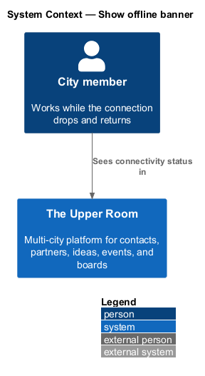
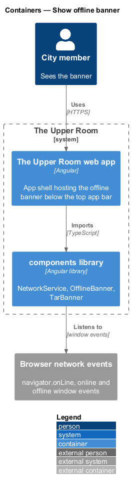
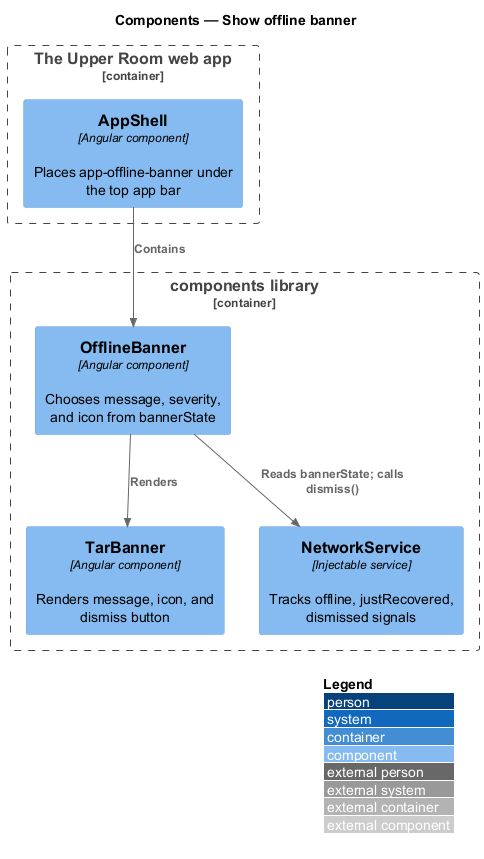
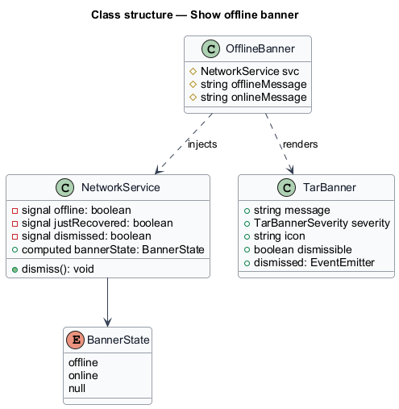
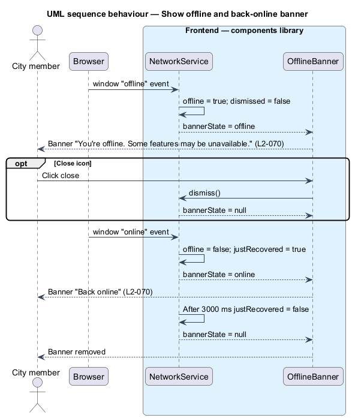

# Show offline banner

## Overview

The Upper Room manages contacts, partners, ideas, events, locations, and boards in city-scoped workspaces.

**offline banner** — sticky strip below the top app bar that reports loss and recovery of network connectivity

When the connection drops, requests fail and some features stop working. The banner tells the user that the application is offline, so that failures are not mistaken for defects. When the connection returns, the banner confirms recovery briefly and then disappears.

## Description

### Existing implementation

| Source | Concrete elements | Observed surface |
|---|---|---|
| [frontend/projects/components/src/lib/network/network.service.ts](../../../../frontend/projects/components/src/lib/network/network.service.ts) | `NetworkService`, `BannerState` | Initial `offline` from `navigator.onLine`; listens to window `offline` and `online`; `bannerState` is `'offline'`, `'online'`, or `null`; `justRecovered` resets after 3000 ms; `dismiss()` |
| [frontend/projects/components/src/lib/network/offline-banner/offline-banner.ts](../../../../frontend/projects/components/src/lib/network/offline-banner/offline-banner.ts) | `OfflineBanner` | `app-offline-banner`; messages "You're offline. Some features may be unavailable." and "Back online"; renders `tar-banner` with severity `error` and icon `wifi_off`, or severity `success` and icon `check_circle` |
| [frontend/projects/components/src/lib/banner/banner.ts](../../../../frontend/projects/components/src/lib/banner/banner.ts) | `TarBanner` | Inputs `message`, `severity`, `icon`, `dismissible`; output `dismissed` |
| [frontend/projects/the-upper-room/src/app/shell/app-shell/app-shell.ts](../../../../frontend/projects/the-upper-room/src/app/shell/app-shell/app-shell.ts) | `AppShell` | Imports `OfflineBanner` |

### Target behavior and interfaces

`NetworkService` shall expose the offline state when `navigator.onLine` is `false` or three consecutive network errors occur. The banner shall appear within 2000 ms of detection. On recovery the banner shall switch to "Back online" for 3 s and then dismiss.

### Gaps and compatibility

- The existing service reacts only to browser `online` and `offline` events. Detection of three consecutive network errors, for example from an HTTP interceptor, is `<TO SUPPLY>`.
- The 40 px height and the token colors (`--md-sys-color-error-container`, `--md-sys-color-tertiary-container`) are `<TO SUPPLY>` against `offline-banner.scss` and `TarBanner`; the existing recovery state uses severity `success`.
- Placement as a sticky element directly below the top app bar is `<TO SUPPLY>` against the shell template.
- A manual dismiss hides the banner until the next `offline` or `online` event.

Production implementation shall follow [AGENTS.md](../../../../AGENTS.md), including incremental acceptance testing.

## Requirements

| L2 ID | Refines (L1) | Requirement |
|---|---|---|
| [L2-070](../../../specs/L2.md#l2-070-offline-banner) | `L1-029` | When `navigator.onLine === false` or three consecutive network errors occur, a sticky banner appears just below the top app bar (height `40px`, background `--md-sys-color-error-container`, text `--md-sys-color-on-error-container`, leading icon `wifi_off`, message "You're offline. Some features may be unavailable.", trailing close icon). When connection restores, the banner becomes `--md-sys-color-tertiary-container` for 3 seconds with message "Back online" then dismisses. |

L2-070: Offline Banner — specification excerpt

**Acceptance Criteria:**
1. Given the network drops, when detected, then the offline banner appears within `2000ms`.
2. Given the network restores while the banner is open, when detected, then the banner switches to "Back online" and auto-dismisses after 3s.

## Diagrams

### System context

The context shows the member who sees connectivity status.

### Container view

The banner logic lives in the `components` library and listens to browser network events. No backend call is involved.

### Component view

`OfflineBanner` reads `bannerState` from `NetworkService` and renders `TarBanner`.

### Type structure

`NetworkService` exposes `bannerState` as a computed signal over three private signals.

### Offline and recovery

The sequence shows the offline banner, optional manual dismissal, and the 3 s recovery message.

