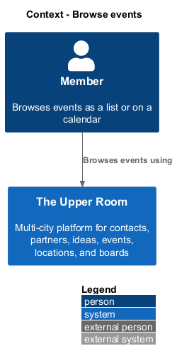
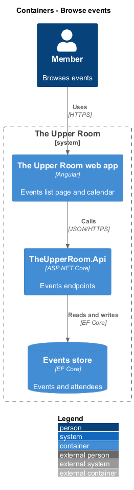
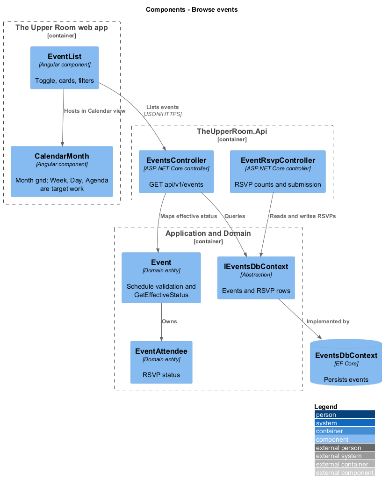
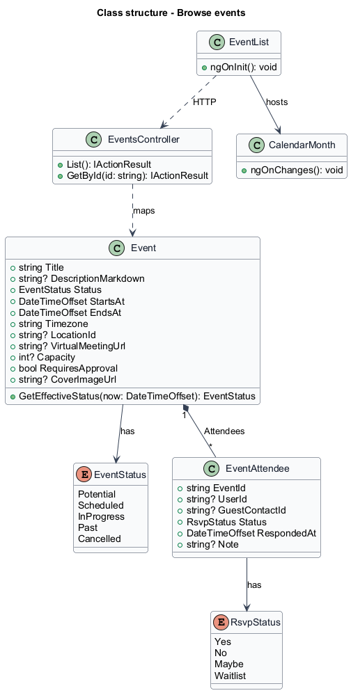
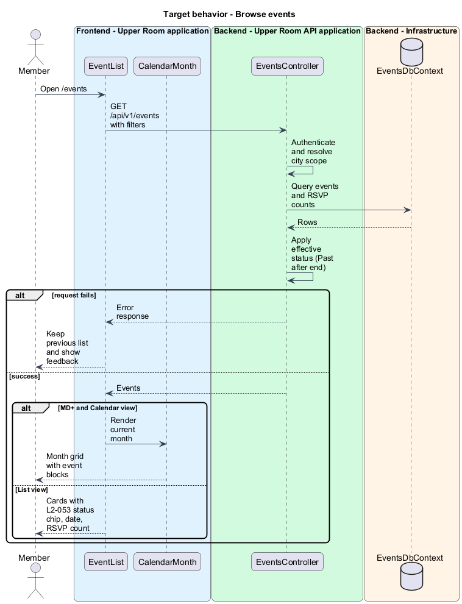
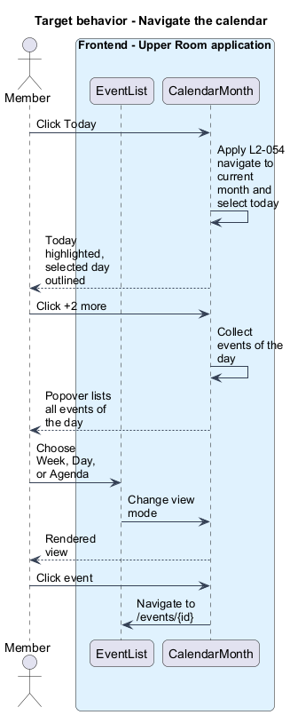
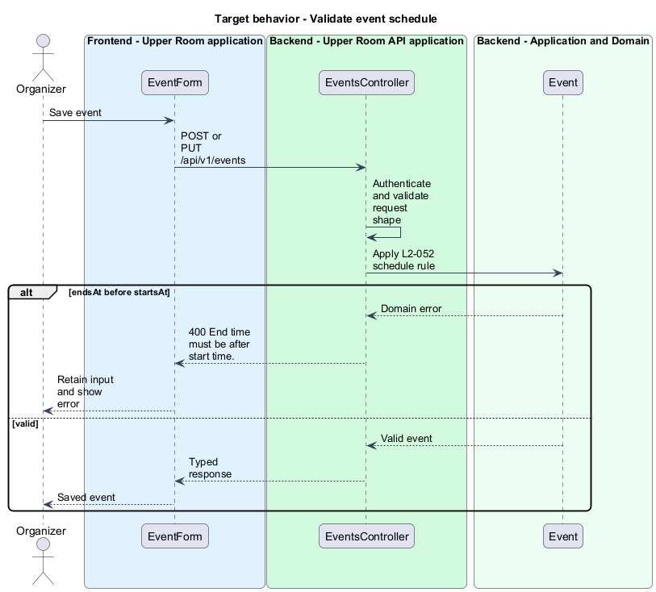

# Browse events

## Overview

The Upper Room is a multi-city platform in which each city has its own workspace of contacts, partners, ideas, events, locations, and boards.

An event is a meetup or gathering with a start, an end, a time zone, an optional location, and attendees who respond with an RSVP. Members browse events as a card list or on a calendar to decide what to attend.

**RSVP** — response of a user to an event invitation, one of Yes, No, Maybe, or Waitlist

**effective status** — status of an event after the system marks it Past when its end time has passed

This feature covers the event data model, the list page with its filters, and the calendar component that offers Month, Week, Day, and Agenda views.

## Description

### Existing implementation

The following source elements provide the current implementation points. Their presence does not establish complete requirement coverage.

| Source | Concrete elements | Observed surface |
|---|---|---|
| [backend/src/TheUpperRoom.Domain/Events/Event.cs](../../../../backend/src/TheUpperRoom.Domain/Events/Event.cs) | `Event`, `EventStatus`, `GetEffectiveStatus(now)` | Title 1-200, description max 10000, `StartsAt`, `EndsAt`, `Timezone`, `LocationId`, `VirtualMeetingUrl`, `Capacity`, `RequiresApproval`, `TagIds`, `PartnerIds` |
| [backend/src/TheUpperRoom.Domain/Events/EventAttendee.cs](../../../../backend/src/TheUpperRoom.Domain/Events/EventAttendee.cs) | `EventAttendee`, `RsvpStatus` | `UserId` or `GuestContactId`, `Status`, `RespondedAt`, `Note` |
| [backend/src/TheUpperRoom.Application/Events/IEventsDbContext.cs](../../../../backend/src/TheUpperRoom.Application/Events/IEventsDbContext.cs) | `IEventsDbContext`, `EventRow`, `RsvpRow`, `EventDto`, `EventsMapping` | Persistence abstraction and mapping |
| [backend/src/TheUpperRoom.Application/Events/SubmitRsvpHandler.cs](../../../../backend/src/TheUpperRoom.Application/Events/SubmitRsvpHandler.cs) | `SubmitRsvpCommand`, `SubmitRsvpHandler`, `RsvpOutcome` | RSVP submission including waitlist outcome |
| [backend/src/TheUpperRoom.Api/Events/EventsController.cs](../../../../backend/src/TheUpperRoom.Api/Events/EventsController.cs) | `EventsController` | Route `api/v1/events`; `HttpGet` list; `HttpGet {id}` |
| [backend/src/TheUpperRoom.Api/Events/EventRsvpController.cs](../../../../backend/src/TheUpperRoom.Api/Events/EventRsvpController.cs) | `EventRsvpController` | Route `api/v1/events/{eventId}/rsvp` |
| [frontend/projects/the-upper-room/src/app/events/event-list/event-list.ts](../../../../frontend/projects/the-upper-room/src/app/events/event-list/event-list.ts) | `EventList`, `EventDto` | `HttpClient` injected |
| [frontend/projects/the-upper-room/src/app/events/calendar-month/calendar-month.ts](../../../../frontend/projects/the-upper-room/src/app/events/calendar-month/calendar-month.ts) | `CalendarMonth` | `Router` injected; implements `OnChanges`; Month view only |

### Target behavior and interfaces

`Event` shall reject `endsAt` earlier than `startsAt` and the API shall return 400 with "End time must be after start time.". `Event.GetEffectiveStatus(now)` shall return Past when the end has passed. When capacity is reached, `SubmitRsvpHandler` shall place an additional Yes responder on the Waitlist and the page shall show "You're on the waitlist (#1)".

`EventList` shall render a List/Calendar toggle, defaulting to Calendar on MD and wider and to List on XS. List cards show the cover image, status chip, locale-aware date and time with timezone abbreviation, location or virtual indicator, and RSVP count against capacity. Cancelled cards show a `--md-sys-color-error-container` ribbon and a struck-through title. Filters are Status, Tag, Partner, Date range, and "My events".

The calendar shall offer Month, Week, Day, and Agenda views, show at most 3 events per Month cell with a "+N more" popover, highlight today with `--md-sys-color-secondary-container`, and outline the selected day with `2px solid --md-sys-color-primary`.

### Gaps and compatibility

`CalendarMonth` implements only the Month view; Week (including drag to create), Day, and Agenda are target work. The query parameter names of `GET /api/v1/events` for filters are `<TO SUPPLY>`. The `/api/v1/events` list reads `EventRow` whose field names (`StartAt`) differ from the domain `StartsAt`; the reconciliation is `<TO SUPPLY>`. The events API contract and token are `<TO SUPPLY>`.

## Requirements

| L2 ID | Refines (L1) | Requirement |
|---|---|---|
| [L2-052](../../../specs/L2.md#l2-052-event-data-model) | `L1-010` | An Event has: `id`, `cityId`, `title` (1-200), `descriptionMarkdown` (max 10000), `status` (Potential, Scheduled, InProgress, Past, Cancelled — Past is set automatically when end is in the past), `startsAt` (UTC), `endsAt` (UTC), `timezone` (IANA), `locationId` (FK, optional), `virtualMeetingUrl` (optional), `capacity` (optional, 1-10000), `requiresApproval` (bool), `coverImageUrl`, `tags`, `partnerIds` (0..n), audit fields. An `EventAttendee` has `eventId`, `userId` or guest contact, `rsvpStatus` (Yes/No/Maybe/Waitlist), `respondedAt`, `note`. |
| [L2-053](../../../specs/L2.md#l2-053-events-list-page) | `L1-010`, `L1-012` | Route `/events` shows a toggle for List/Calendar view (default Calendar on MD+, List on XS). List view: cards with cover image, status chip (Potential gray, Scheduled blue, InProgress green, Past gray subdued, Cancelled red strikethrough), date+time (locale-aware, includes timezone abbrev), location/virtual indicator, RSVP count + capacity. Filters: Status, Tag, Partner, Date range, "My events" (RSVP'd or organized). |
| [L2-054](../../../specs/L2.md#l2-054-event-calendar-component) | `L1-012` | The calendar supports Month, Week, Day, Agenda views (segmented buttons in header). Month: 7-column grid, day cells height min `120px` on MD+ and `80px` on XS, max 3 events visible per cell with "+N more" link. Week: hour rows from 06:00-23:00 default, drag to create. Day: hour rows full-day. Agenda: chronological list. Today is highlighted with `--md-sys-color-secondary-container`. Selected day is outlined `2px solid --md-sys-color-primary`. |

**Acceptance criteria**

- L2-052: Given `endsAt` is before `startsAt`, when validated, then the API returns 400 with "End time must be after start time.".
- L2-052: Given an event with `capacity=10` and 10 confirmed RSVPs, when an 11th user RSVPs Yes, then they are placed on the Waitlist and a snackbar "You're on the waitlist (#1)" appears.
- L2-053: Given the user toggles to Calendar, when MD+, then the calendar component renders the current month with event blocks.
- L2-053: Given an event is Cancelled, when displayed, then the card has a `--md-sys-color-error-container` ribbon along the top edge and the title is rendered with `text-decoration: line-through`.
- L2-054: Given the calendar is at March 2026, when the user clicks "Today" in April 2026, then the calendar navigates to April 2026 and selects today's date.
- L2-054: Given the user clicks `+2 more` on a day, when clicked, then a popover lists all events for that day.

## Diagrams

### System context

### Container view

### Component view

The component view shows the list page, the calendar, and the backend elements that supply and validate events.

### Type structure

### Browse events

The flow loads events with filters and renders List or Calendar.

### Navigate the calendar

The flow covers view switching, the Today action, and the "+N more" popover.

### Validate event schedule

The flow shows the end-before-start rejection on the data model.

