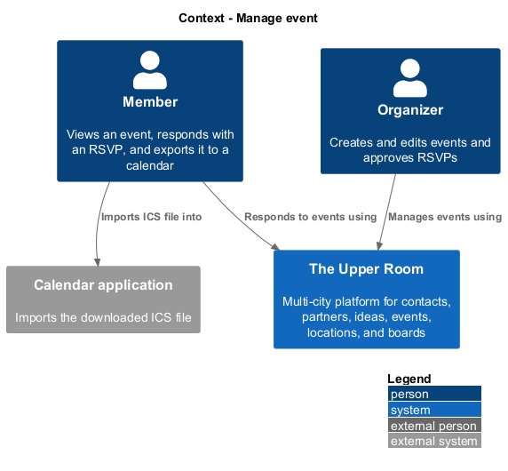
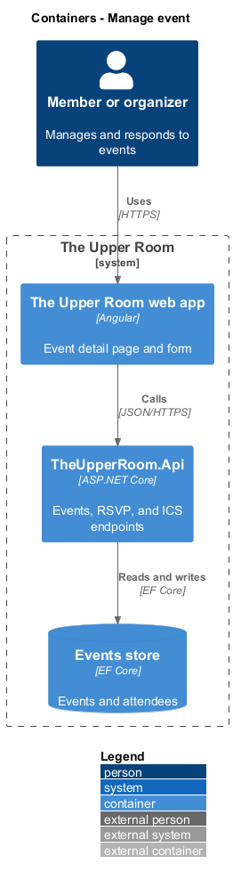
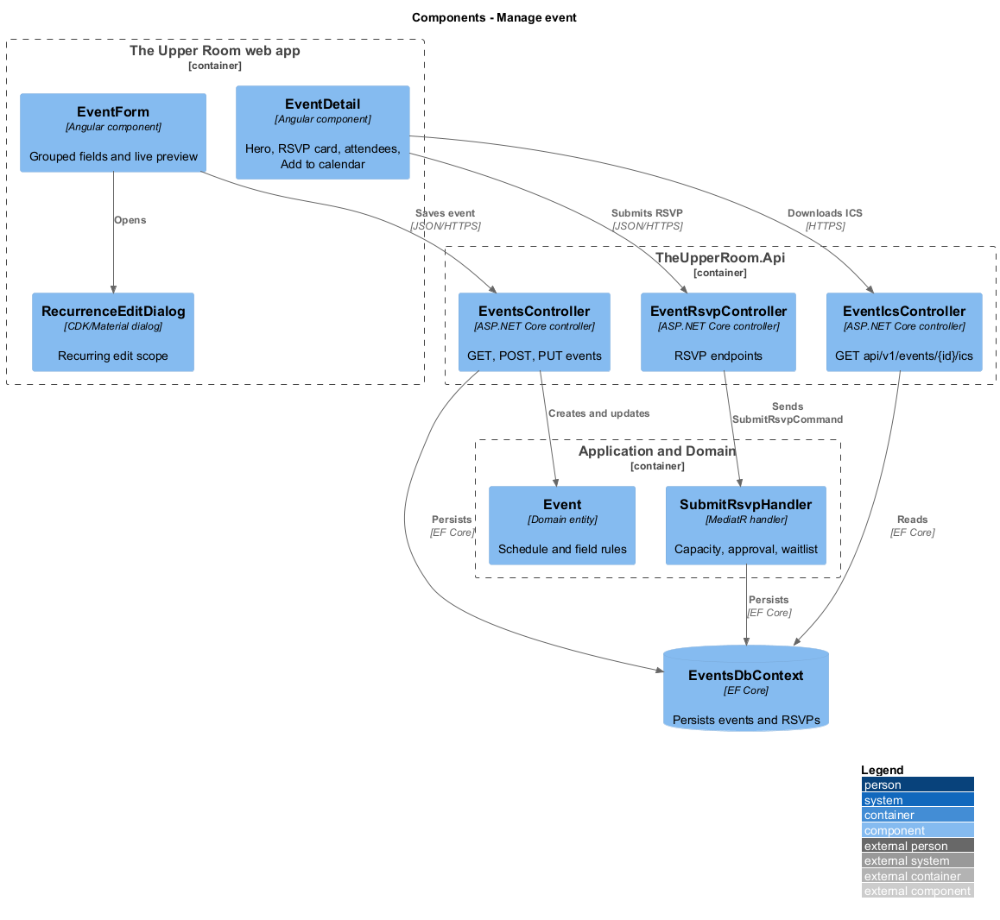
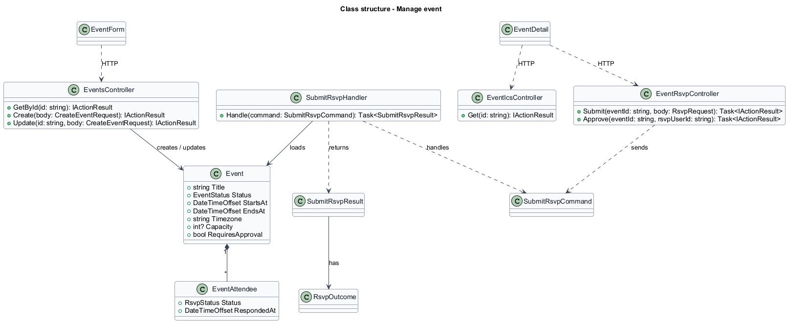
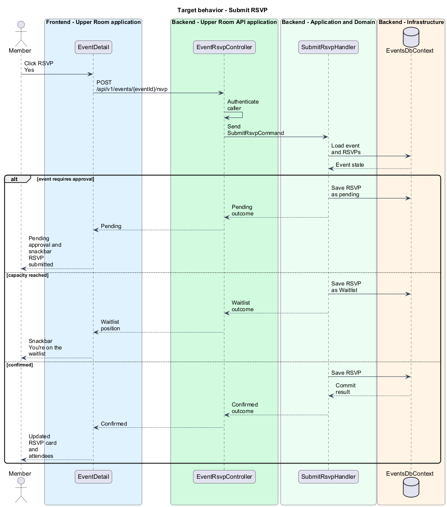
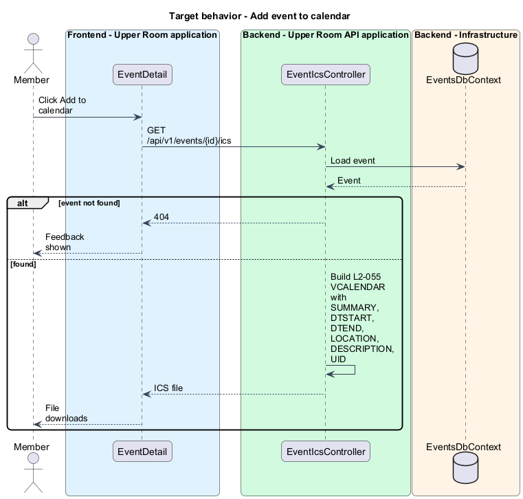
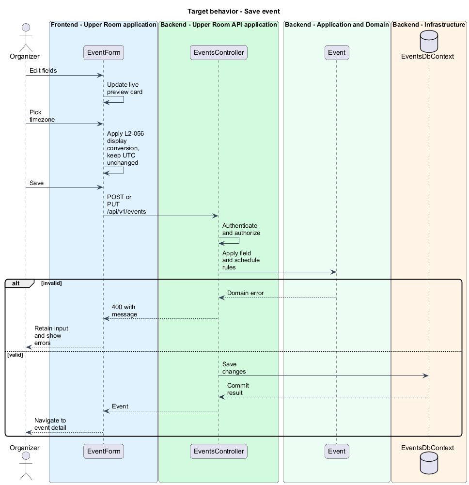

# Manage event

## Overview

The Upper Room is a multi-city platform in which each city has its own workspace of contacts, partners, ideas, events, locations, and boards.

Managing an event covers viewing its detail page, responding with an RSVP, exporting it to a personal calendar, and creating or editing it through a form.

**RSVP** — response of a user to an event invitation, one of Yes, No, Maybe, or Waitlist

**ICS file** — iCalendar text file that calendar applications import

**recurrence** — rule that repeats an event daily, weekly, monthly, or on a custom pattern

Attendees use the detail page. Organizers use the form and approve RSVPs when an event requires approval.

## Description

### Existing implementation

The following source elements provide the current implementation points. Their presence does not establish complete requirement coverage.

| Source | Concrete elements | Observed surface |
|---|---|---|
| [frontend/projects/the-upper-room/src/app/events/event-detail/event-detail.ts](../../../../frontend/projects/the-upper-room/src/app/events/event-detail/event-detail.ts) | `EventDetail`, `EventDetailDto`, `AttendeeDto` | `HttpClient`, `ActivatedRoute`, `SnackbarService`, `PermissionsService`, `MatDialog` injected |
| [frontend/projects/the-upper-room/src/app/events/event-detail/event-attendees-dialog.ts](../../../../frontend/projects/the-upper-room/src/app/events/event-detail/event-attendees-dialog.ts) | `EventAttendeesDialog` | Dialog listing attendees |
| [frontend/projects/the-upper-room/src/app/events/event-detail/event-cancel-dialog.ts](../../../../frontend/projects/the-upper-room/src/app/events/event-detail/event-cancel-dialog.ts) | `EventCancelDialog` | Cancellation dialog |
| [frontend/projects/the-upper-room/src/app/events/event-form/event-form.ts](../../../../frontend/projects/the-upper-room/src/app/events/event-form/event-form.ts) | `EventForm` | Implements `OnInit`, `OnDestroy`; `HttpClient`, `Router`, `MatDialog` injected |
| [frontend/projects/the-upper-room/src/app/events/event-form/recurrence-edit-dialog.ts](../../../../frontend/projects/the-upper-room/src/app/events/event-form/recurrence-edit-dialog.ts) | `RecurrenceEditDialog` | Scope choice for recurring edits |
| [backend/src/TheUpperRoom.Api/Events/EventsController.cs](../../../../backend/src/TheUpperRoom.Api/Events/EventsController.cs) | `EventsController`, `CreateEventRequest` | `HttpGet {id}`, `HttpPost`, `HttpPut {id}`, `HttpPost {id}/occurrences/{date}/cancel` |
| [backend/src/TheUpperRoom.Api/Events/EventIcsController.cs](../../../../backend/src/TheUpperRoom.Api/Events/EventIcsController.cs) | `EventIcsController` | `GET api/v1/events/{id}/ics` |
| [backend/src/TheUpperRoom.Api/Events/EventRsvpController.cs](../../../../backend/src/TheUpperRoom.Api/Events/EventRsvpController.cs) | `EventRsvpController` | `GET`, `POST`, `requests`, `approve`, `deny` |
| [backend/src/TheUpperRoom.Application/Events/SubmitRsvpHandler.cs](../../../../backend/src/TheUpperRoom.Application/Events/SubmitRsvpHandler.cs) | `SubmitRsvpHandler`, `ApproveRsvpHandler`, `DenyRsvpHandler`, `GetMyRsvpHandler`, `GetRsvpRequestsHandler` | RSVP use cases |
| [backend/src/TheUpperRoom.Application/Events/CancelEventHandler.cs](../../../../backend/src/TheUpperRoom.Application/Events/CancelEventHandler.cs) | `CancelEventHandler` | Event cancellation |

### Target behavior and interfaces

`EventDetail` shall render a hero with the cover image, gradient overlay, status chip, and share icon. On MD and wider it shall show a left column (description, location, partners, comments) and a right column (date and time card, RSVP card, attendees grid, "Add to calendar"). "Add to calendar" shall download the `.ics` file produced by `EventIcsController`, which contains `SUMMARY`, `DTSTART`, `DTEND`, `LOCATION`, `DESCRIPTION`, and `UID`. When the event requires approval, `SubmitRsvpHandler` shall record the RSVP as pending and the page shall show "RSVP submitted. The organizer will confirm shortly.".

`EventForm` shall group fields as Basics, When, Where, Who, and Tags, and shall show a live preview card on MD and wider. Selecting Weekly recurrence shall reveal a "Repeats every {N} weeks on {days}" sub-form. Changing the timezone shall change displayed times and shall leave the stored UTC values unchanged.

### Gaps and compatibility

The pending state is stored as a status string `<TO SUPPLY>`. The recurrence storage model is `<TO SUPPLY>`. The `.ics` generation is in the controller rather than the application layer; relocation is `<TO SUPPLY>`. Pages call `HttpClient` directly; contract and token introduction is a target change. The editing form shall remain a routed screen per [AGENTS.md](../../../../AGENTS.md).

## Requirements

| L2 ID | Refines (L1) | Requirement |
|---|---|---|
| [L2-055](../../../specs/L2.md#l2-055-event-detail-page) | `L1-010` | Route `/events/:id` shows hero (cover image overlay with title and gradient `linear-gradient(180deg, transparent, rgba(0,0,0,0.6))`, status chip top-left, share icon top-right), then a two-column layout on MD+: left (description, location, partners, comments), right (date/time card, RSVP card with primary button "RSVP Yes"/"RSVP Maybe"/"RSVP No" segmented, attendees grid with avatars, "Add to calendar" button generating .ics). |
| [L2-056](../../../specs/L2.md#l2-056-event-createedit-form) | `L1-010` | Fields grouped: "Basics" (title, description, cover image), "When" (start, end, timezone, "All day" toggle, recurrence — None/Daily/Weekly/Monthly/Custom), "Where" (Location autocomplete OR Virtual URL OR both, "TBD" toggle), "Who" (Capacity, Requires approval, Partner picker), "Tags". A live preview card on the right (MD+) reflects edits in real time. |

**Acceptance criteria**

- L2-055: Given the user clicks "Add to calendar", when clicked, then a `.ics` file downloads with `BEGIN:VCALENDAR ... END:VCALENDAR` containing `SUMMARY`, `DTSTART`, `DTEND`, `LOCATION`, `DESCRIPTION`, `UID`.
- L2-055: Given an event requires approval, when a user clicks "RSVP Yes", then status becomes "Pending approval" and the snackbar "RSVP submitted. The organizer will confirm shortly." appears.
- L2-056: Given the user picks "Weekly" recurrence, when shown, then a "Repeats every {N} weeks on {days}" sub-form appears.
- L2-056: Given the user changes timezone, when changed, then the displayed start/end times update to that timezone but the underlying UTC stays the same.

## Diagrams

### System context

### Container view

### Component view

### Type structure

### Submit RSVP

The flow records the RSVP and handles approval and waitlist outcomes.

### Add event to calendar

The flow downloads the `.ics` file.

### Save event

The flow saves a new or edited event from the form.

