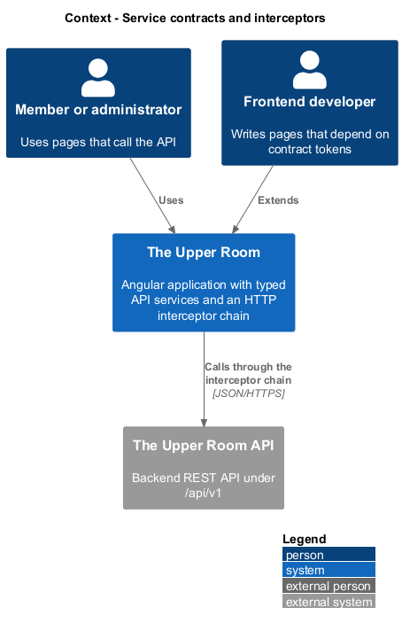
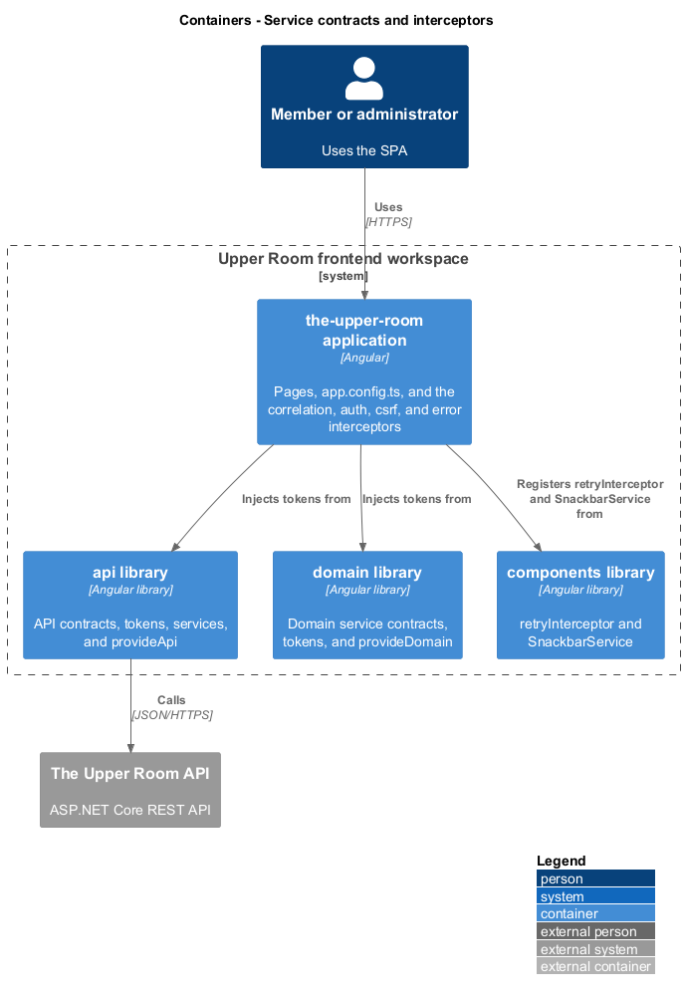
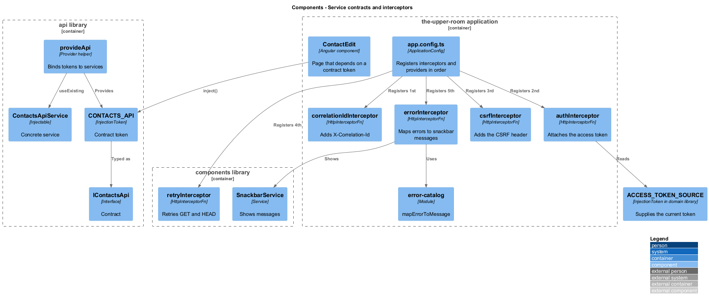
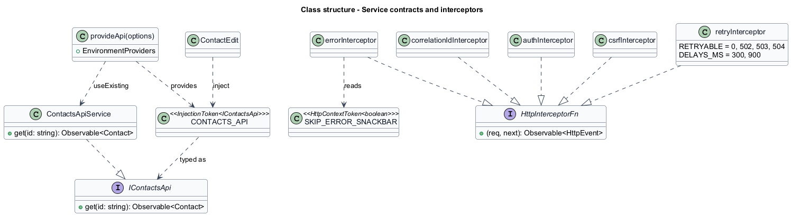
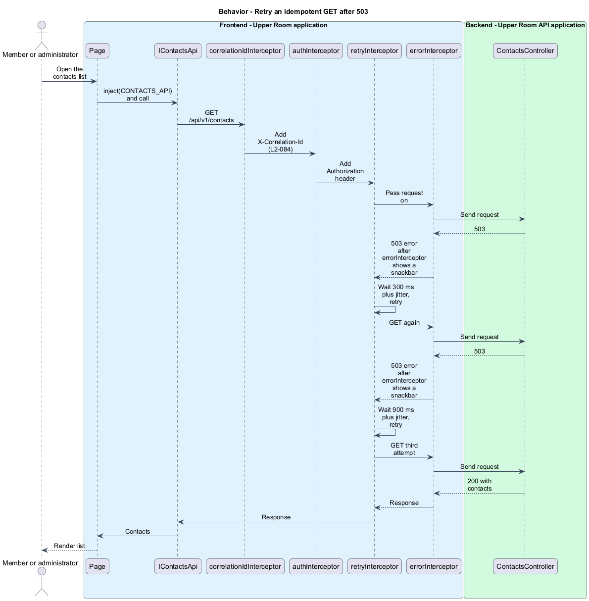
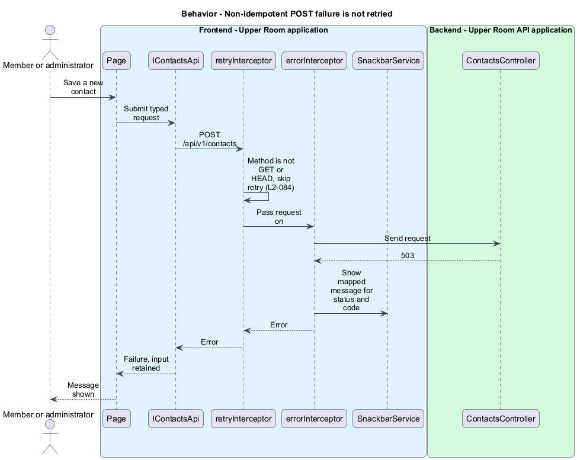

# Service contracts and interceptors

## Overview

Pages in the Upper Room frontend call the backend through typed API services and a chain of HTTP interceptors. Contracts separate what a page needs from the concrete class that fulfils it.

**service contract** — TypeScript interface paired with an `InjectionToken` that consumers inject instead of a concrete class

**HTTP interceptor** — function of type `HttpInterceptorFn` that observes or alters each outgoing request and incoming response

This slice covers the contract and token pattern (L2-083) and the interceptor chain registered in `app.config.ts` (L2-084).

## Description

### Existing implementation

| Source | Concrete elements | Observed surface |
|---|---|---|
| [frontend/projects/api/src/lib/contacts/contacts-api.contract.ts](../../../../frontend/projects/api/src/lib/contacts/contacts-api.contract.ts) | `IContactsApi`, `CONTACTS_API` | Interface and `InjectionToken<IContactsApi>` |
| [frontend/projects/api/src/lib/api.providers.ts](../../../../frontend/projects/api/src/lib/api.providers.ts) | `provideApi` | Binds `AUTH_API`, `USERS_API`, `PROFILE_API`, `INVITATIONS_API`, and `CONTACTS_API` to concrete services with `useExisting` |
| [frontend/projects/domain/src/lib/provide-domain.ts](../../../../frontend/projects/domain/src/lib/provide-domain.ts) | `provideDomain` | Binds `PERMISSIONS_SERVICE`, `ME_BOOTSTRAP`, `CITY_SCOPE_SERVICE`, `IDLE_SERVICE`, `SIGN_OUT_SERVICE`, and `THEME_SERVICE`; runs `ME_BOOTSTRAP.load()` at app initialization |
| [frontend/projects/api/src/lib/http-context-tokens.ts](../../../../frontend/projects/api/src/lib/http-context-tokens.ts) | `SKIP_ERROR_SNACKBAR` | `HttpContextToken<boolean>` read by the error interceptor |
| [frontend/projects/the-upper-room/src/app/app.config.ts](../../../../frontend/projects/the-upper-room/src/app/app.config.ts) | `appConfig` | `withInterceptors([correlationIdInterceptor, authInterceptor, csrfInterceptor, retryInterceptor, errorInterceptor])` |
| [frontend/projects/the-upper-room/src/app/interceptors/correlation-id.interceptor.ts](../../../../frontend/projects/the-upper-room/src/app/interceptors/correlation-id.interceptor.ts) | `correlationIdInterceptor` | Sets `X-Correlation-Id` to `crypto.randomUUID()` |
| [frontend/projects/the-upper-room/src/app/interceptors/auth.interceptor.ts](../../../../frontend/projects/the-upper-room/src/app/interceptors/auth.interceptor.ts) | `authInterceptor` | Reads `ACCESS_TOKEN_SOURCE` and attaches an `Authorization` header when a token exists |
| [frontend/projects/the-upper-room/src/app/interceptors/csrf.interceptor.ts](../../../../frontend/projects/the-upper-room/src/app/interceptors/csrf.interceptor.ts) | `csrfInterceptor` | Additional interceptor not named in L2-084 |
| [frontend/projects/components/src/lib/interceptors/retry.interceptor.ts](../../../../frontend/projects/components/src/lib/interceptors/retry.interceptor.ts) | `retryInterceptor` | Retries GET and HEAD for status 0, 502, 503, and 504; two retries after 300 ms and 900 ms plus up to 100 ms of jitter |
| [frontend/projects/the-upper-room/src/app/interceptors/error.interceptor.ts](../../../../frontend/projects/the-upper-room/src/app/interceptors/error.interceptor.ts) | `errorInterceptor` | Maps `status` and `error.code` through `mapErrorToMessage` and shows a snackbar unless `SKIP_ERROR_SNACKBAR` is set |

### Target behavior and interfaces

- **Contracts:** Each service in `api` and `domain` has a contract file exporting an interface and an `InjectionToken`. Components call `inject(TOKEN)`. The library provider helper binds the concrete class (L2-083).
- **Interceptors:** The chain registers in the order correlation id, auth, retry, error. Auth silently refreshes once on 401 and then redirects to sign-in. Retry applies to idempotent GET only, with two retries (L2-084).

### Gaps and compatibility

- API contracts use `I{Name}Api` and `{NAME}_API`, and files are named `{name}-api.contract.ts`. Domain contracts use `{name}.service.contract.ts` with `*_SERVICE` tokens in some cases. L2-083 names `I{Name}Service` and `{NAME}_SERVICE`; reconciling is `<TO SUPPLY>`.
- `IContactsApi` declares only `get`. Pages such as `ContactEdit` still inject `HttpClient` directly rather than the token.
- `provideApi` binds five tokens; `notes-api.contract.ts` exists without a binding in `provideApi`.
- `csrfInterceptor` sits between auth and retry and is not in L2-084. Its place in the requirement is `<TO SUPPLY>`.
- `authInterceptor` does not handle 401 or refresh tokens. Silent refresh and the redirect are `<TO SUPPLY>`.
- `retryInterceptor` also retries HEAD and status 0, 502, and 504, and sits outside `errorInterceptor`, so each failed attempt shows a snackbar.
- `errorInterceptor` produces snackbar messages and rethrows the original error; typed errors are a target change.
- The `contract-token-import` lint rule inspects only `*.component.ts` files.

Production implementation shall follow [AGENTS.md](../../../../AGENTS.md), including incremental acceptance testing.

## Requirements

The table preserves the requirement statement and parent identifiers. Acceptance criteria remain in the linked specification.

| L2 ID | Refines (L1) | Requirement |
|---|---|---|
| [L2-083](../../../specs/L2.md#l2-083-service-contracts) | `L1-023` | Each service in `api` and `domain` libraries must have a `{name}.service.contract.ts` file exporting both a TypeScript interface (`I{Name}Service`) and an `InjectionToken<I{Name}Service>` named `{NAME}_SERVICE`. Components consume the token via `inject({NAME}_SERVICE)` -- never the concrete class. The concrete class binds to the token in the library's `provideXyz()` provider helper. |
| [L2-084](../../../specs/L2.md#l2-084-http-interceptors) | `L1-001`, `L1-017`, `L1-029` | The application registers, in order: `correlationIdInterceptor` (adds `X-Correlation-Id` UUID v4 to every request), `authInterceptor` (attaches Authorization header from in-memory access token; handles 401 by attempting silent refresh once, then redirecting to sign-in), `retryInterceptor` (idempotent GET only, max 2 retries, exponential backoff 300ms/900ms, jittered), `errorInterceptor` (maps server problem-details to typed errors and triggers snackbars). |

## Diagrams

### System context

The context shows members, developers, and the API that the interceptor chain protects and observes.

### Container view

The container view shows the application consuming tokens from the two libraries and registering interceptors from the application and the components library.

### Component view

The component view shows a page resolving a contract token and the order in which `app.config.ts` registers the interceptors.

### Type structure

The structure view shows the contract, token, provider helper, concrete service, and interceptor functions.

### Retry an idempotent GET after 503

A GET that returns 503 twice is retried after about 300 ms and 900 ms and succeeds on the third attempt.

### Non-idempotent POST failure is not retried

A POST that returns 503 is not retried. The error interceptor shows a mapped message and the page retains its input.

