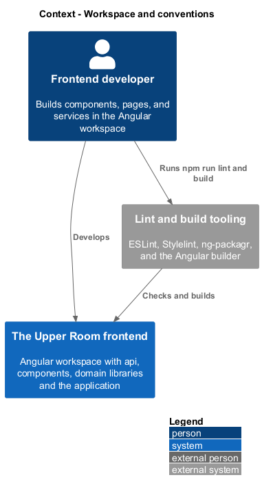
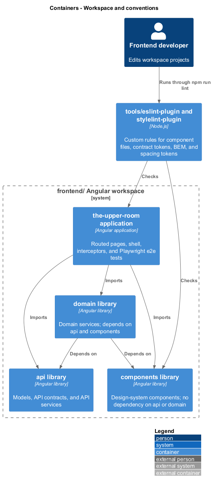
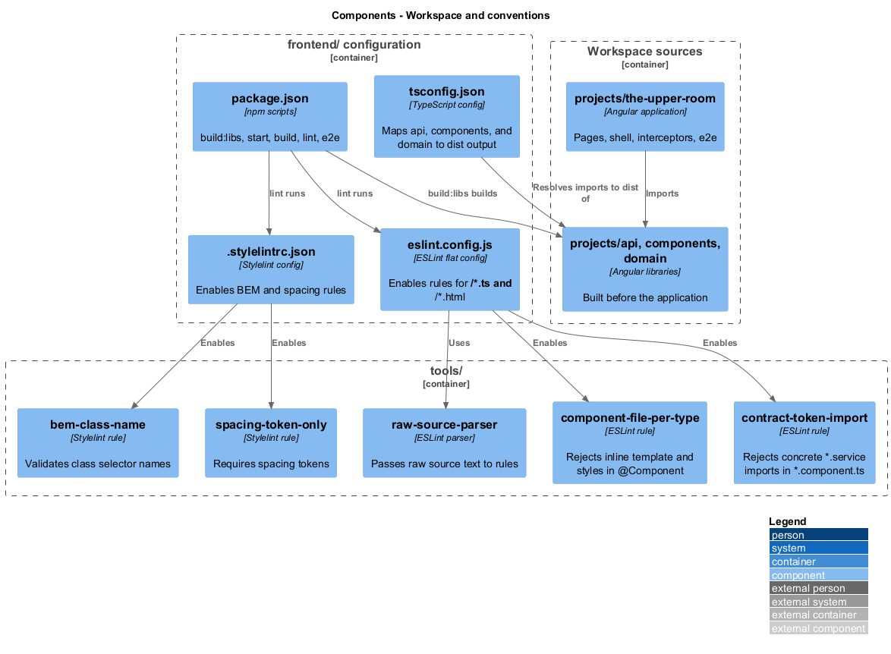
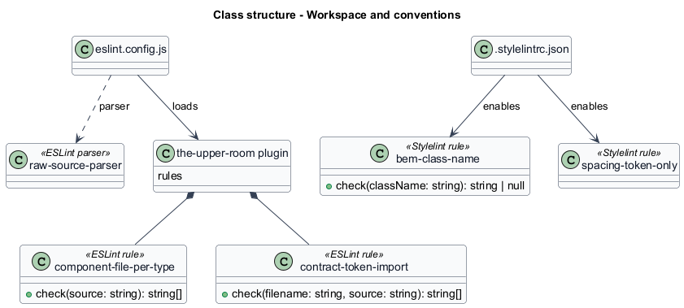
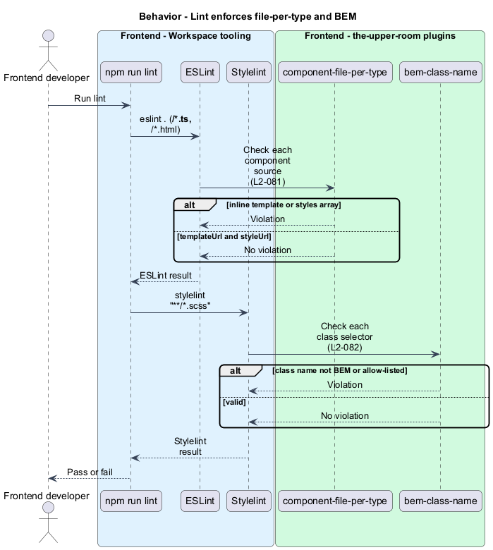
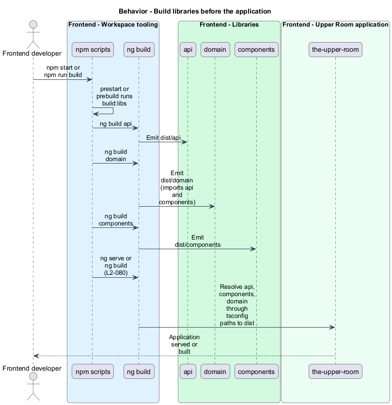

# Workspace and conventions

## Overview

The Upper Room frontend is an Angular workspace made of three libraries and one application. Conventions for file layout and class naming are enforced by lint rules so that every contributor produces the same structure.

**workspace** — Angular CLI project set defined by `angular.json` that builds libraries and an application together

**BEM** — class naming convention of block, element, and modifier segments (`block__element--modifier`)

**file-per-type rule** — convention that a component keeps its TypeScript, template, and stylesheet in separate files

This slice covers the workspace structure (L2-080), the component file rule (L2-081), and the BEM class naming rule (L2-082).

## Description

### Existing implementation

| Source | Concrete elements | Observed surface |
|---|---|---|
| [frontend/angular.json](../../../../frontend/angular.json) | Workspace projects | `api`, `components`, `domain`, and `the-upper-room` |
| [frontend/package.json](../../../../frontend/package.json) | Scripts | `build:libs`, `prestart`, `prebuild`, `start`, `build`, `test`, `e2e`, `typecheck`, `lint` (`eslint . && stylelint "**/*.scss"`) |
| [frontend/tsconfig.json](../../../../frontend/tsconfig.json) | Path mappings | `api`, `components`, and `domain` resolve to `./dist/*` |
| [frontend/projects/api/src/public-api.ts](../../../../frontend/projects/api/src/public-api.ts) | Public API of `api` | Exports models, contracts, API services, `provideApi`, and HTTP context tokens |
| [frontend/projects/components/src/public-api.ts](../../../../frontend/projects/components/src/public-api.ts) | Public API of `components` | Design-system components such as `button`, `card`, `chip`, `snackbar`, `confirm-dialog`, plus `retryInterceptor` |
| [frontend/projects/domain/src/public-api.ts](../../../../frontend/projects/domain/src/public-api.ts) | Public API of `domain` | Auth, bootstrap, cities, notifications, RBAC, tags, theme, and users services and `provideDomain` |
| [frontend/projects/the-upper-room/src/app](../../../../frontend/projects/the-upper-room/src/app) | Application | One folder per feature (`contacts`, `partners`, `events`, ...), plus `shell`, `interceptors`, `services`, `auth`, and `error` |
| [e2e](../../../../e2e) | Playwright tests | `pages` (page objects), `components`, and `tests` |
| [frontend/eslint.config.js](../../../../frontend/eslint.config.js) | ESLint flat config | Enables `component-file-per-type`, `contract-token-import`, `playwright-no-raw-locators`, and `i18n-no-literal` |
| [tools/eslint-plugin-the-upper-room/lib/component-file-per-type.js](../../../../tools/eslint-plugin-the-upper-room/lib/component-file-per-type.js) | `check` | Flags inline `template:`, inline `styles:` arrays, and multiple `styleUrls` entries |
| [frontend/.stylelintrc.json](../../../../frontend/.stylelintrc.json) | Stylelint config | Enables `bem-class-name` and `spacing-token-only` |
| [tools/stylelint-plugin-the-upper-room/lib/bem-class-name.js](../../../../tools/stylelint-plugin-the-upper-room/lib/bem-class-name.js) | `check` | Accepts BEM names plus the `mat-`, `mdc-`, `cdk-`, and `u-` prefixes |

A component such as `ContactEdit` consists of `contact-edit.ts`, `contact-edit.html`, and `contact-edit.scss` in one folder.

### Target behavior and interfaces

- **Libraries:** `components` has no dependency on `api` or `domain`. `domain` depends on `api` and `components`. The application imports all three (L2-080).
- **Components:** Each component has sibling `.ts`, `.html`, and `.scss` files, and lint fails on inline templates or styles (L2-081).
- **Class names:** Every class selector matches the BEM pattern. Material, CDK, and `u-*` utility classes are exempt (L2-082).

### Gaps and compatibility

- The application folder layout differs from L2-080: features sit directly under `app/` rather than `features/`, and there is no `guards/` folder. Whether to restructure is `<TO SUPPLY>`.
- No module-boundary lint rule exists for "components must not depend on api". The tooling to enforce it is `<TO SUPPLY>`.
- Component files are named `{name}.ts`, not `{name}.component.ts`. The `contract-token-import` rule only inspects `*.component.ts`, so it does not reach the current file names.
- The `component-file-per-type` rule detects inline `template:` and `styles:` inside the `@Component` source; it does not verify that the three sibling files exist.
- The BEM check permits digits within segments and the `mat-`, `mdc-`, `cdk-`, and `u-` prefixes with any suffix. The spec regex is stricter. Aligning the regex is `<TO SUPPLY>`.
- Libraries build before the application because `tsconfig.json` maps them to `dist`.

Production implementation shall follow [AGENTS.md](../../../../AGENTS.md), including incremental acceptance testing.

## Requirements

The table preserves the requirement statement and parent identifier. Acceptance criteria remain in the linked specification.

| L2 ID | Refines (L1) | Requirement |
|---|---|---|
| [L2-080](../../../specs/L2.md#l2-080-angular-workspace-layout) | `L1-023` | Workspace structure (the specification gives the directory tree): `frontend/` containing `angular.json`, `package.json`, `tsconfig.json`, and `projects/` with the libraries `api`, `components`, and `domain` and the application `the-upper-room`. |
| [L2-081](../../../specs/L2.md#l2-081-component-file-per-type-rule) | `L1-023` | Every Angular component must consist of three sibling files with the same base name: `{name}.component.ts`, `{name}.component.html`, `{name}.component.scss`. Inline `template:` or `styles:` arrays are forbidden. An ESLint rule must enforce this. |
| [L2-082](../../../specs/L2.md#l2-082-bem-naming) | `L1-023` | All HTML/CSS class names must follow BEM (`block`, `block__element`, `block--modifier`, `block__element--modifier`). Stylelint must enforce a regex `^[a-z]+(-[a-z]+)*(__[a-z]+(-[a-z]+)*)?(--[a-z]+(-[a-z]+)*)?$` on all class selectors. Material classes (`mat-*`, `mdc-*`, `cdk-*`) are exempt; utility tokens (e.g. `u-mt-4`) follow `^u-[a-z0-9-]+$`. |

## Diagrams

### System context

The context shows the developer, the workspace, and the lint and build tooling that applies the conventions.

### Container view

The container view shows the three libraries, the application, the custom plugins, and the allowed dependency directions.

### Component view

The component view shows the lint rules, the configuration files that enable them, and the workspace sources they check.

### Type structure

The structure view lists the custom rules and the configuration that loads them.

### Lint enforces file-per-type and BEM

`npm run lint` runs ESLint and Stylelint. The file-per-type rule rejects inline templates and styles; the BEM rule rejects non-conforming class names.

### Build libraries before the application

`prestart` and `prebuild` build the three libraries into `dist`, then the application resolves them through the `tsconfig` path mappings.

