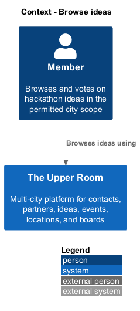
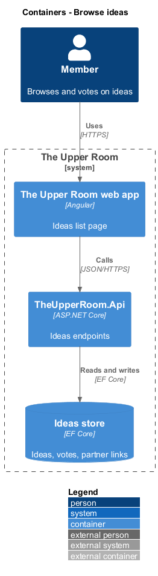
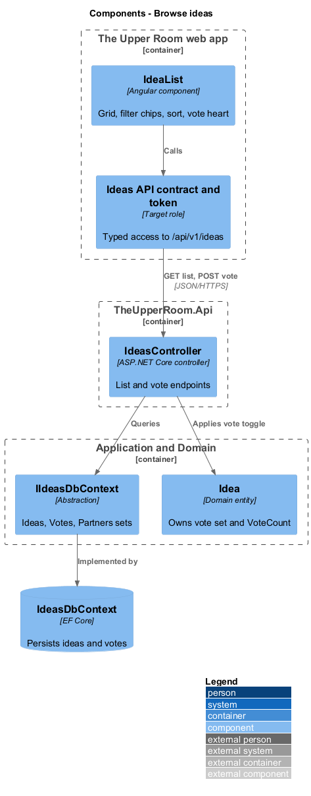
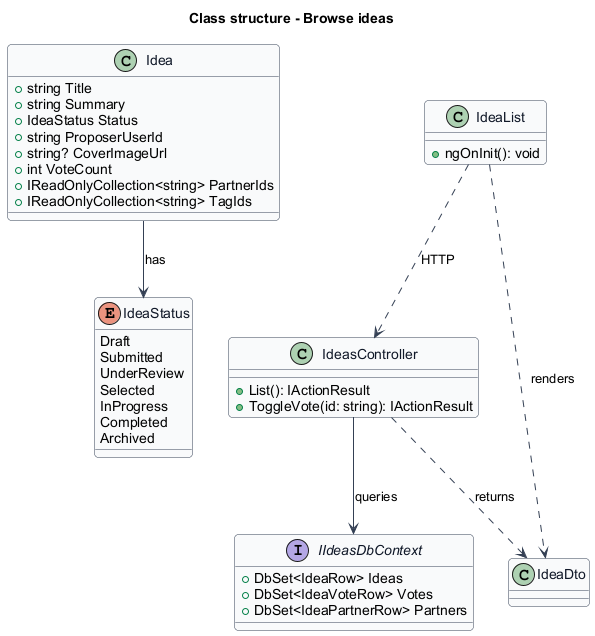
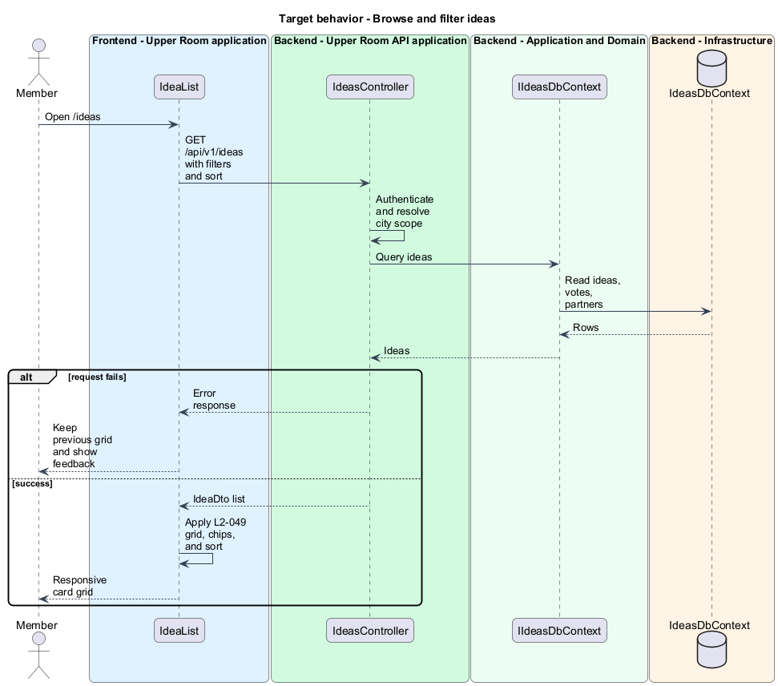
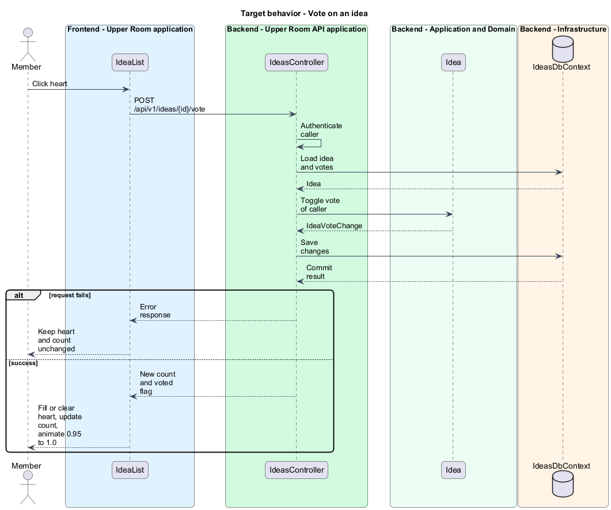

# Browse ideas

## Overview

The Upper Room is a multi-city platform in which each city has its own workspace of contacts, partners, ideas, events, locations, and boards.

An idea is a hackathon proposal that a member submits for a city, together with a summary, tags, linked partners, and a status. Members browse ideas in a card grid to find proposals worth supporting.

**vote** — single endorsement of an idea by one user, toggled on and off

**status chip** — compact label that shows the lifecycle state of an idea, such as Draft or Selected

The idea list is the entry point of the ideas subsystem. It lets a member filter by status, partner, tag, or authorship, sort by popularity or recency, and vote directly from a card.

## Description

### Existing implementation

The following source elements provide the current implementation points. Their presence does not establish complete requirement coverage.

| Source | Concrete elements | Observed surface |
|---|---|---|
| [frontend/projects/the-upper-room/src/app/ideas/idea-list/idea-list.ts](../../../../frontend/projects/the-upper-room/src/app/ideas/idea-list/idea-list.ts) | `IdeaList`, `IdeaDto`, `LinkedPartnerRef` | `HttpClient` and `SnackbarService` injected with `inject()`; implements `OnInit` |
| [backend/src/TheUpperRoom.Api/Ideas/IdeasController.cs](../../../../backend/src/TheUpperRoom.Api/Ideas/IdeasController.cs) | `IdeasController` | Route `api/v1/ideas`; `HttpGet` list; `HttpPost {id}/vote` |
| [backend/src/TheUpperRoom.Api/Ideas/IdeaDto.cs](../../../../backend/src/TheUpperRoom.Api/Ideas/IdeaDto.cs) | `IdeaDto`, `LinkedPartnerRefDto` | Response contract for each card |
| [backend/src/TheUpperRoom.Application/Ideas/IIdeasDbContext.cs](../../../../backend/src/TheUpperRoom.Application/Ideas/IIdeasDbContext.cs) | `IIdeasDbContext`, `IdeaRow`, `IdeaVoteRow`, `IdeaPartnerRow` | `DbSet` properties `Ideas`, `Votes`, `Partners`, `Comments` |
| [backend/src/TheUpperRoom.Domain/Ideas/Idea.cs](../../../../backend/src/TheUpperRoom.Domain/Ideas/Idea.cs) | `Idea`, `IdeaStatus`, `IdeaVoteChange` | `VoteCount`, `VoteUserIds`, `PartnerIds`, `TagIds` |
| [backend/src/TheUpperRoom.Infrastructure/Ideas/IdeasDbContext.cs](../../../../backend/src/TheUpperRoom.Infrastructure/Ideas/IdeasDbContext.cs) | `IdeasDbContext` | Persistence implementation of `IIdeasDbContext` |

### Target behavior and interfaces

`IdeaList` renders a responsive grid of cards and sends filter and sort selections to `GET /api/v1/ideas`. `IdeasController` returns `IdeaDto` items scoped to the city of the caller. `POST /api/v1/ideas/{id}/vote` toggles the vote of the caller and returns the new count and voted flag. The card then updates the heart icon and count and plays the scale animation.

Page code shall depend on an ideas API contract and injection token as described in [AGENTS.md](../../../../AGENTS.md). The contract name is `<TO SUPPLY>`.

### Gaps and compatibility

`IdeaList` calls `HttpClient` directly. The design introduces the contract and token as a target change. The query parameter names for filter and sort are `<TO SUPPLY>`. Whether filtering runs on the server or the client is `<TO SUPPLY>`.

## Requirements

| L2 ID | Refines (L1) | Requirement |
|---|---|---|
| [L2-049](../../../specs/L2.md#l2-049-ideas-list-page) | `L1-009` | Route `/ideas` shows a responsive grid (XS 1-col, MD 2-col, LG 3-col) of `mat-card`s with cover image (16:9, fallback `lightbulb` icon on `--md-sys-color-tertiary-container`), title, summary (2 lines, ellipsis), partner chips, tags, vote count + heart icon (filled if voted), proposer avatar+name, and status chip. Filter chips: Status (multi), Partner, Tag, "My ideas". Sort: Most votes, Newest, Updated. |

**Acceptance criteria**

1. Given the user clicks the heart, when the request succeeds, then the heart fills, count increments, and the card animates with a `0.95 -> 1.0` scale over `short3`.

## Diagrams

### System context

The context shows the member and the application boundary.

### Container view

The container view shows the browser application, the API, and the database.

### Component view

The component view shows the list page, the controller, and the persistence abstraction. Components marked as target roles are not yet present in source.

### Type structure

The structure view lists the source types and their relationships.

### Browse and filter ideas

The flow loads the grid with the selected filters and sort order. Failures keep the previous grid and show feedback.

### Vote on an idea

The flow toggles the vote of the caller and updates the card on success.

