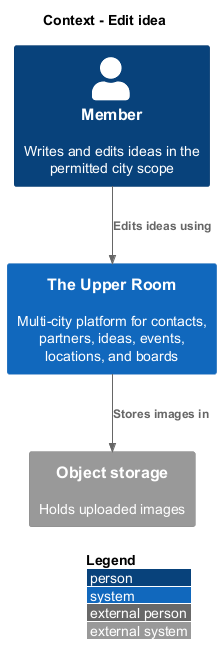
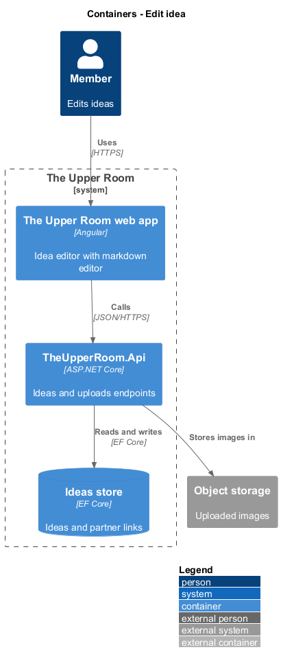
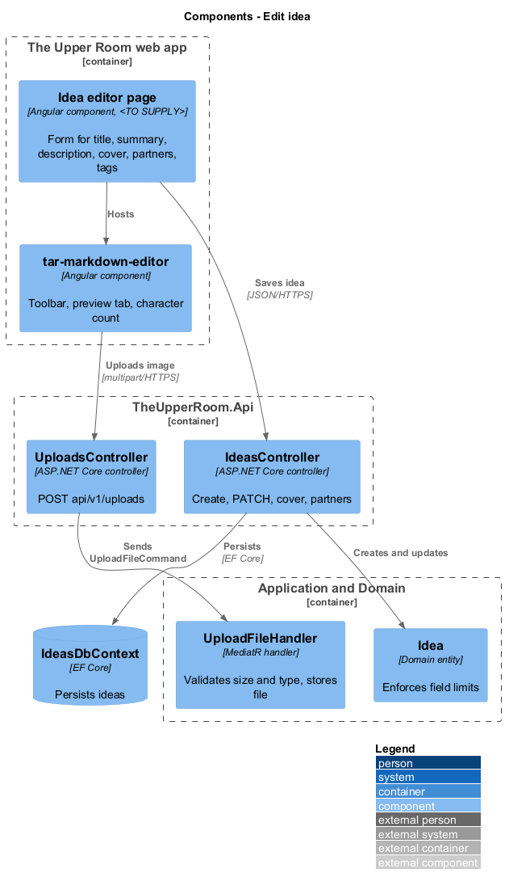
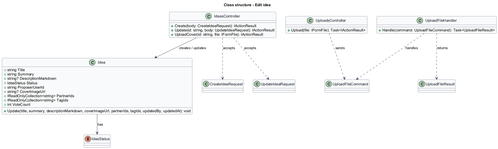
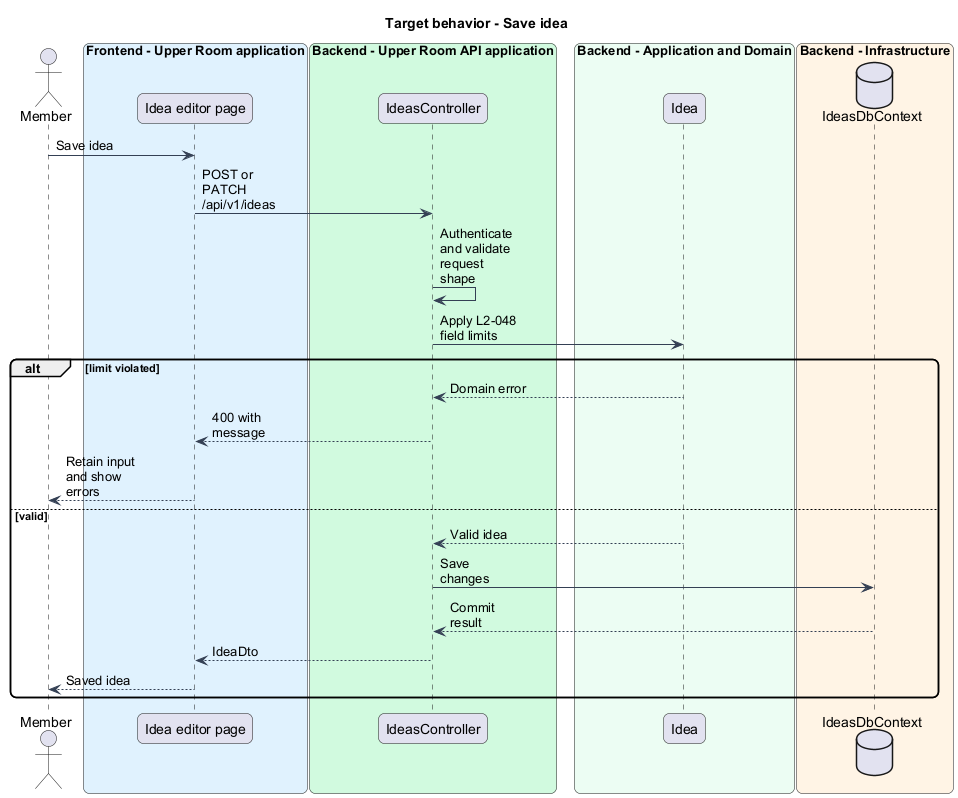
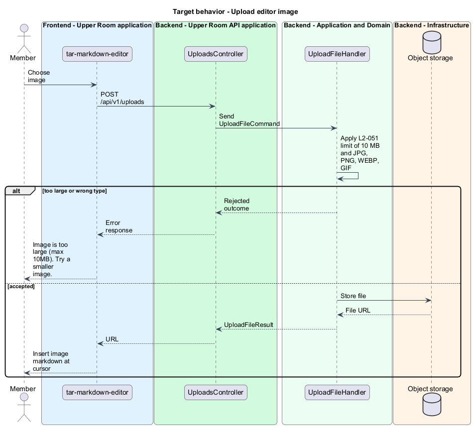

# Edit idea

## Overview

The Upper Room is a multi-city platform in which each city has its own workspace of contacts, partners, ideas, events, locations, and boards.

An idea is a hackathon proposal. Creating and editing an idea captures its title, summary, markdown description, cover image, linked partners, and tags, and stores them under the rules of the idea data model.

**markdown editor** — text area with a formatting toolbar and a live preview tab

**object storage** — external store that holds uploaded image files and returns a URL for each

The feature covers the data model that the API enforces and the editor that members use to write the description and attach images.

## Description

### Existing implementation

The following source elements provide the current implementation points. Their presence does not establish complete requirement coverage.

| Source | Concrete elements | Observed surface |
|---|---|---|
| [backend/src/TheUpperRoom.Domain/Ideas/Idea.cs](../../../../backend/src/TheUpperRoom.Domain/Ideas/Idea.cs) | `Idea` | Guards: title 1-200, summary 1-500, description max 10000; `Update(...)`; vote set |
| [backend/src/TheUpperRoom.Domain/Ideas/IdeaStatus.cs](../../../../backend/src/TheUpperRoom.Domain/Ideas/IdeaStatus.cs) | `IdeaStatus` | Draft, Submitted, UnderReview, Selected, InProgress, Completed, Archived |
| [backend/src/TheUpperRoom.Api/Ideas/IdeasController.cs](../../../../backend/src/TheUpperRoom.Api/Ideas/IdeasController.cs) | `IdeasController` | `HttpPost` create; `HttpPatch {id}`; `HttpPost {id}/cover`; partner link and unlink endpoints |
| [backend/src/TheUpperRoom.Api/Ideas/CreateIdeaRequest.cs](../../../../backend/src/TheUpperRoom.Api/Ideas/CreateIdeaRequest.cs) | `CreateIdeaRequest`, `UpdateIdeaRequest`, `LinkIdeaPartnerRequest` | Request contracts |
| [backend/src/TheUpperRoom.Api/Uploads/UploadsController.cs](../../../../backend/src/TheUpperRoom.Api/Uploads/UploadsController.cs) | `UploadsController` | `HttpPost` on `api/v1/uploads` |
| [backend/src/TheUpperRoom.Application/Uploads/UploadFileHandler.cs](../../../../backend/src/TheUpperRoom.Application/Uploads/UploadFileHandler.cs) | `UploadFileCommand`, `UploadFileHandler`, `UploadFileOutcome`, `UploadFileResult` | File validation and storage |
| [frontend/projects/components/src/lib/markdown-editor/tar-markdown-editor.ts](../../../../frontend/projects/components/src/lib/markdown-editor/tar-markdown-editor.ts) | `tar-markdown-editor` | Reusable markdown editor |
| [backend/src/TheUpperRoom.Application/Ideas/IIdeasDbContext.cs](../../../../backend/src/TheUpperRoom.Application/Ideas/IIdeasDbContext.cs) | `IIdeasDbContext` | Persistence abstraction |

### Target behavior and interfaces

`Idea` shall enforce the field limits of the data model. A vote toggle shall remove an existing vote and shall return a "Vote removed" signal that the page turns into a snackbar. The editor page shall host `tar-markdown-editor` with toolbar actions bold, italic, link, list, heading, code, and image upload; a preview tab; and a character count against 10000. Image upload shall call `POST /api/v1/uploads` and shall reject files over 10 MB or outside JPG, PNG, WEBP, and GIF with the message "Image is too large (max 10MB). Try a smaller image." for size violations.

The editor opens as a routed screen or CDK dialog per [AGENTS.md](../../../../AGENTS.md). The choice is `<TO SUPPLY>`.

### Gaps and compatibility

No idea editor page exists in `frontend/projects/the-upper-room/src/app/ideas`; the list and detail pages exist. The page and its route are `<TO SUPPLY>`. The requirement names `/api/uploads`; the source route is `api/v1/uploads`. The object storage provider is `<TO SUPPLY>`. Whether `tags`, `votes` and `proposerUserId` all persist as listed in the data model is `<TO SUPPLY>`, because `Idea` stores `TagIds` and a vote set.

## Requirements

| L2 ID | Refines (L1) | Requirement |
|---|---|---|
| [L2-048](../../../specs/L2.md#l2-048-idea-data-model) | `L1-009` | An Idea has: `id`, `cityId`, `title` (1-200), `summary` (1-500), `descriptionMarkdown` (max 10000), `status` (Draft, Submitted, UnderReview, Selected, InProgress, Completed, Archived), `partnerIds` (0..n FK), `proposerUserId`, `tags`, `votes` (1 per user, no negative), `coverImageUrl`, audit fields. |
| [L2-051](../../../specs/L2.md#l2-051-idea-editor) | `L1-009` | The editor uses a markdown editor (textarea with toolbar: bold, italic, link, list, heading, code, image upload), live preview tab, max 10000 chars with character count. Image uploads go to `/api/uploads` and are stored in object storage; max 10MB, types JPG/PNG/WEBP/GIF. |

**Acceptance criteria**

- L2-048: Given a user attempts to vote twice, when the second click occurs, then the vote is removed (toggle) and a snackbar "Vote removed" appears.
- L2-051: Given a 11MB upload, when attempted, then the editor shows the error "Image is too large (max 10MB). Try a smaller image."

## Diagrams

### System context

### Container view

The container view adds object storage for uploaded images.

### Component view

### Type structure

### Save idea

The flow validates the payload against the data model and persists the idea.

### Upload editor image

The flow validates size and type, stores the file, and inserts the returned URL into the markdown.

