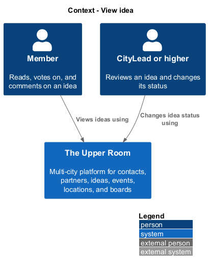
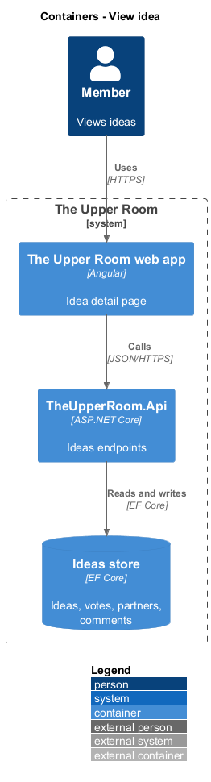
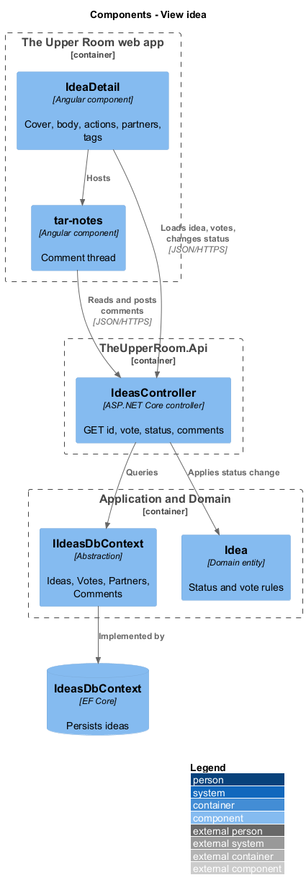
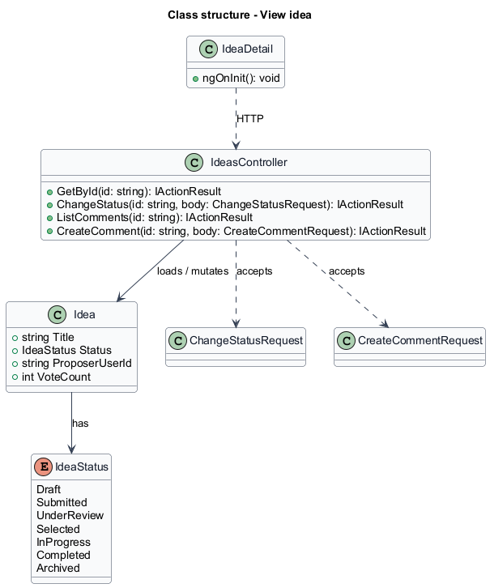
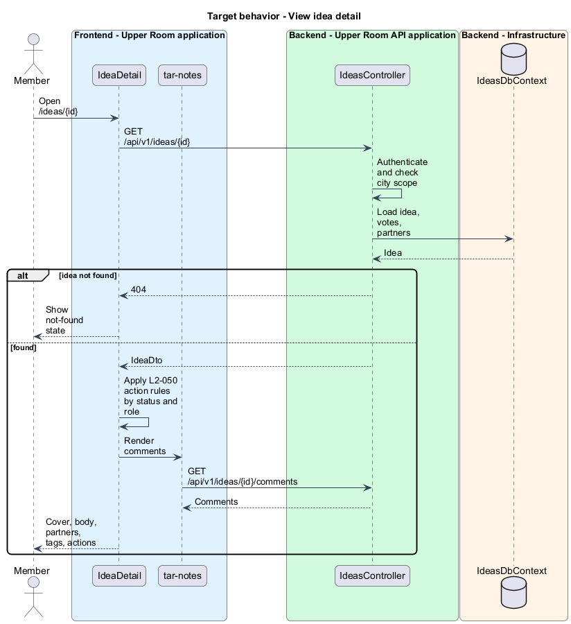
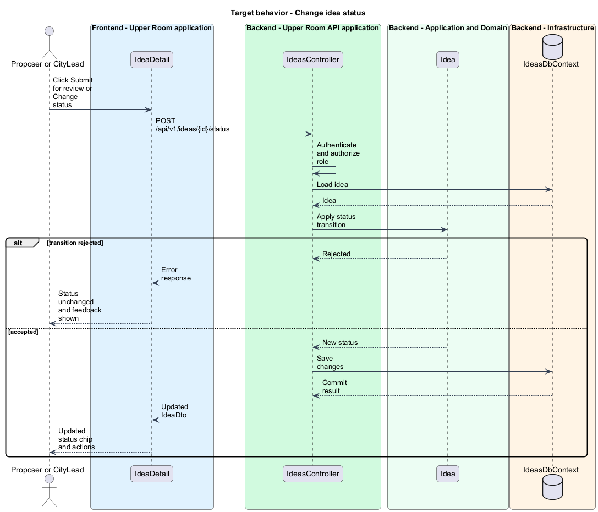

# View idea

## Overview

The Upper Room is a multi-city platform in which each city has its own workspace of contacts, partners, ideas, events, locations, and boards.

An idea is a hackathon proposal with a lifecycle that runs from Draft to Completed. The idea detail page presents one idea in full and offers the actions that move it through that lifecycle.

**proposer** — member who created an idea

**CityLead** — role that may change the status of any idea in the city

The page serves two audiences. The proposer submits a Draft for review. A CityLead or higher reviews the idea and changes its status. Every member can vote and comment.

## Description

### Existing implementation

The following source elements provide the current implementation points. Their presence does not establish complete requirement coverage.

| Source | Concrete elements | Observed surface |
|---|---|---|
| [frontend/projects/the-upper-room/src/app/ideas/idea-detail/idea-detail.ts](../../../../frontend/projects/the-upper-room/src/app/ideas/idea-detail/idea-detail.ts) | `IdeaDetail` | `HttpClient`, `ActivatedRoute`, `Router`, `SnackbarService` injected with `inject()` |
| [frontend/projects/components/src/lib/notes](../../../../frontend/projects/components/src/lib/notes) | `tar-notes` | Comment component named by the requirement |
| [backend/src/TheUpperRoom.Api/Ideas/IdeasController.cs](../../../../backend/src/TheUpperRoom.Api/Ideas/IdeasController.cs) | `IdeasController` | `GET {id}`, `POST {id}/vote`, `POST {id}/status`, `GET {id}/partners`, `GET {id}/comments`, `POST {id}/comments` |
| [backend/src/TheUpperRoom.Api/Ideas/ChangeStatusRequest.cs](../../../../backend/src/TheUpperRoom.Api/Ideas/ChangeStatusRequest.cs) | `ChangeStatusRequest` | Body of the status endpoint |
| [backend/src/TheUpperRoom.Api/Ideas/CreateCommentRequest.cs](../../../../backend/src/TheUpperRoom.Api/Ideas/CreateCommentRequest.cs) | `CreateCommentRequest` | Body of the comment endpoint |
| [backend/src/TheUpperRoom.Domain/Ideas/Idea.cs](../../../../backend/src/TheUpperRoom.Domain/Ideas/Idea.cs) | `Idea`, `IdeaStatus` | Status transitions and vote set |

### Target behavior and interfaces

`IdeaDetail` loads `GET /api/v1/ideas/{id}` and renders the cover image, title, proposer, vote button, body, partner cards, tag chips, and comments. The page decides which action buttons to show from the idea status, the identity of the caller, and the role of the caller. For a proposer viewing a Draft, "Submit for review" is the filled primary button and "Change status" is hidden. "Change status" is visible to CityLead and above.

The status transition table (which status may follow which) is `<TO SUPPLY>`. The permission lookup uses the existing permission service pattern `<TO SUPPLY>`.

### Gaps and compatibility

`IdeaDetail` calls `HttpClient` directly; the target design routes calls through a contract and injection token. Markdown rendering and sanitisation for the body are `<TO SUPPLY>`.

## Requirements

| L2 ID | Refines (L1) | Requirement |
|---|---|---|
| [L2-050](../../../specs/L2.md#l2-050-idea-detail-page) | `L1-009` | Route `/ideas/:id` shows cover image (full width, max height `360px`), title (`headline-medium`), proposer + date, vote button (large, leading icon `favorite`/`favorite_border`, count), action buttons "Edit", "Submit for review", "Change status" (CityLead+). Body: rendered markdown, partner cards, tag chips, comments via `<tar-notes>`. |

**Acceptance criteria**

1. Given the proposer views their idea in Draft status, when rendered, then the "Submit for review" button is filled and primary; the "Change status" button is hidden.

## Diagrams

### System context

### Container view

### Component view

The component view shows the detail page, the comment component, and the controller operations the page uses.

### Type structure

### View idea detail

The flow loads the idea and renders actions according to status and role.

### Change idea status

The flow submits a status change and refreshes the page. Invalid transitions return an error and leave the status unchanged.

