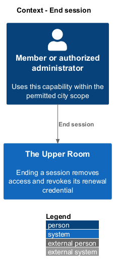
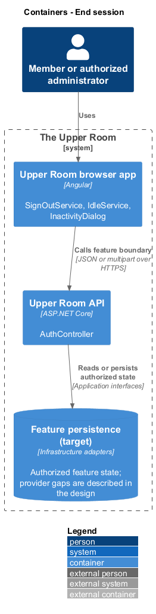
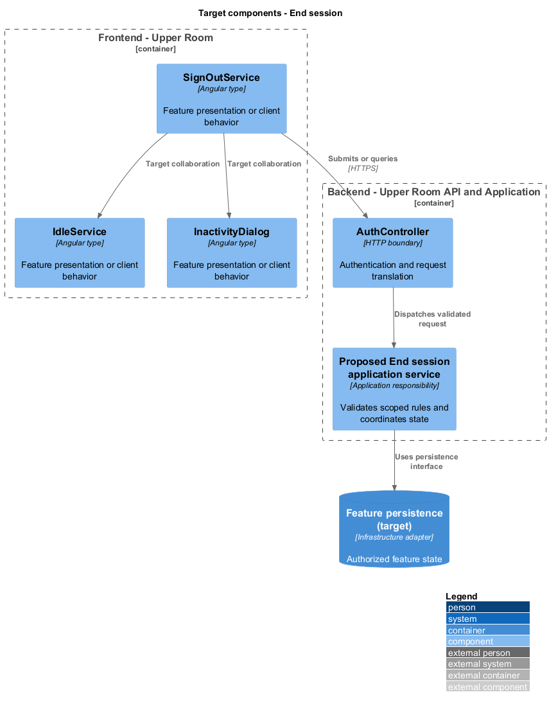
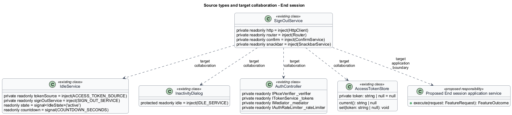
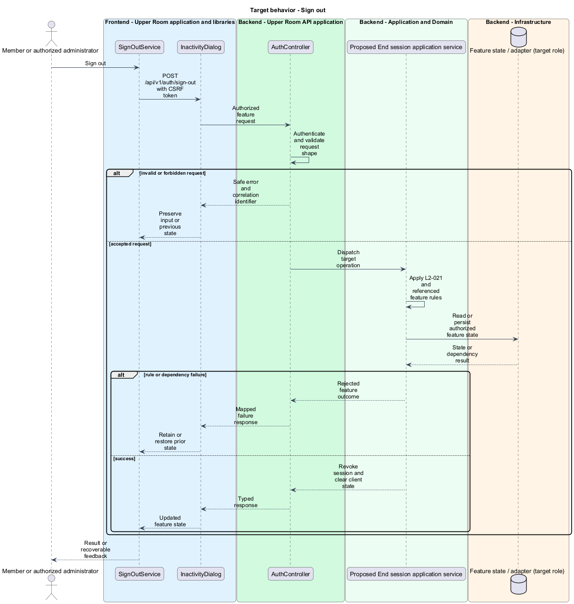
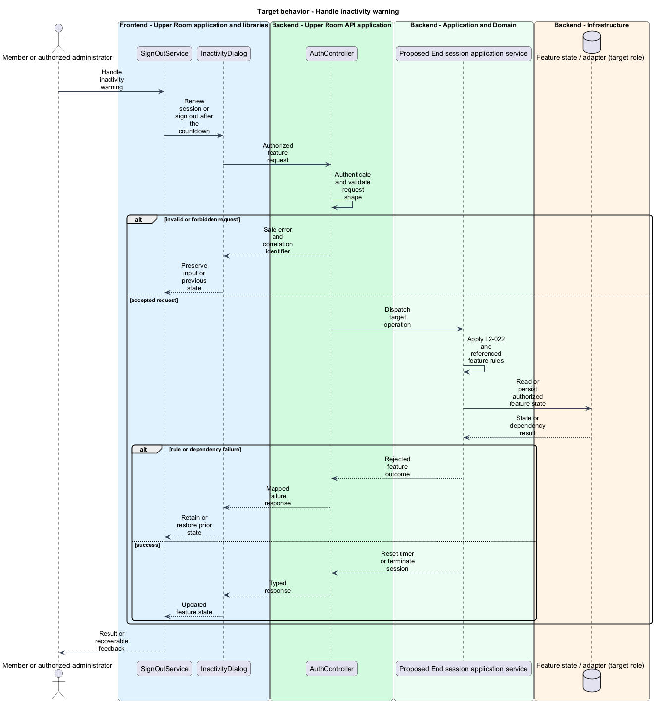

# End session

## Overview

The Upper Room manages contacts, partners, ideas, events, locations, and boards in city-scoped workspaces.

Ending a session removes access and revokes its renewal credential. The inactivity warning offers a short opportunity to continue before automatic sign-out.

## Description

### Existing implementation

The following source elements provide the current implementation points. Their presence does not establish complete requirement coverage.

| Source | Concrete elements | Observed surface |
|---|---|---|
| [frontend/projects/domain/src/lib/auth/sign-out.service.ts](../../../../frontend/projects/domain/src/lib/auth/sign-out.service.ts) | `SignOutService` | private readonly http = inject(HttpClient); private readonly router = inject(Router); private readonly confirm = inject(ConfirmService) |
| [frontend/projects/domain/src/lib/auth/idle.service.ts](../../../../frontend/projects/domain/src/lib/auth/idle.service.ts) | `IdleService` | private readonly tokenSource = inject(ACCESS_TOKEN_SOURCE); private readonly signOutService = inject(SIGN_OUT_SERVICE); readonly state = signal<IdleState>('active') |
| [frontend/projects/domain/src/lib/auth/inactivity-dialog/inactivity-dialog.ts](../../../../frontend/projects/domain/src/lib/auth/inactivity-dialog/inactivity-dialog.ts) | `InactivityDialog` | protected readonly idle = inject(IDLE_SERVICE) |
| [backend/src/TheUpperRoom.Api/Auth/AuthController.cs](../../../../backend/src/TheUpperRoom.Api/Auth/AuthController.cs) | `AuthController` | Route api/v1/auth; HttpPost register; HttpPost sign-in; HttpPost forgot-password; HttpPost reset-password; HttpPost verify-email; HttpPost change-password; HttpDelete account; HttpPost sign-out; HttpPost exchange |
| [frontend/projects/the-upper-room/src/app/auth/access-token-store.ts](../../../../frontend/projects/the-upper-room/src/app/auth/access-token-store.ts) | `AccessTokenStore` | private token: string \| null = null; current(): string \| null; set(token: string \| null): void |

### Target behavior and interfaces

IdleService shall track the specified activity events and open InactivityDialog at the timeout. Staying signed in shall reset activity and renew the session. SignOutService shall invoke the protected sign-out endpoint, revoke the persisted refresh session, clear user-specific state, and redirect with feedback.

- **Sign out:** POST /api/v1/auth/sign-out with CSRF token. Revoke session and clear client state.
- **Handle inactivity warning:** Renew session or sign out after the countdown. Reset timer or terminate session.

Diagrams show target collaborations. Existing source types retain their names. Participants marked as target roles or proposed responsibilities describe interfaces to introduce, not existing classes.

### Gaps and compatibility

AuthController.SignOut deletes the refresh cookie but does not revoke a persisted refresh-token record. Cookie removal alone does not establish session revocation. The proposed renewal and revocation interface shall be shared with sign-in and profile security.

Production implementation shall follow [AGENTS.md](../../../../AGENTS.md), including incremental acceptance testing. API integrations shall preserve documented behavior until an explicit compatibility change is approved.

## Requirements

The table preserves the opening requirement statement and all parent identifiers. The expandable source excerpts retain the complete normative text and acceptance criteria verbatim. Source wording is quoted rather than normalized to the design prose.

| L2 ID | Refines (L1) | Requirement |
|---|---|---|
| [L2-021](../../../specs/L2.md#l2-021-sign-out) | `L1-001` | Sign out must revoke the refresh token at the IdP, clear the cookie, clear in-memory tokens, clear all NgRx state, redirect to `/sign-in?signedOut=1`, and show a snackbar "You've been signed out." for `4000ms`. |
| [L2-022](../../../specs/L2.md#l2-022-session-inactivity-timeout) | `L1-020` | After 30 minutes of inactivity (no mouse, keyboard, or focus events), a dialog must appear titled "Are you still there?" with body "You'll be signed out in {seconds}s for your security." and buttons "Sign out" (text) and "Stay signed in" (filled). After 60 additional seconds without response, the user is signed out automatically. |

L2-021: Sign Out — specification excerpt

Sign out must revoke the refresh token at the IdP, clear the cookie, clear in-memory tokens, clear all NgRx state, redirect to `/sign-in?signedOut=1`, and show a snackbar "You've been signed out." for `4000ms`.

**Acceptance Criteria:**
1. Given the user clicks "Sign out" and confirms, when complete, then no in-memory token is reachable from `window` and a network call to the revocation endpoint succeeded.

L2-022: Session Inactivity Timeout — specification excerpt

After 30 minutes of inactivity (no mouse, keyboard, or focus events), a dialog must appear titled "Are you still there?" with body "You'll be signed out in {seconds}s for your security." and buttons "Sign out" (text) and "Stay signed in" (filled). After 60 additional seconds without response, the user is signed out automatically.

**Acceptance Criteria:**
1. Given 30 minutes of zero user input, when the timer fires, then the inactivity dialog appears with the countdown starting at 60.
2. Given the user clicks "Stay signed in", when the dialog closes, then the inactivity timer resets to 30 minutes and the access token is silently refreshed.

## Diagrams

### System context

The context identifies the people and application boundary used by this capability.

### Container view

The container view separates browser execution from any backend state responsibility. Provider choices remain subject to the stated gaps.

### Target component view

The component view shows target collaborations between the concrete implementation points and proposed application responsibilities.

### Type structure

The structure view lists source types with declared members where available. Dashed dependencies denote proposed collaboration rather than verified current dependency direction.

### Sign out

The target flow performs the following operation: POST /api/v1/auth/sign-out with CSRF token. Its successful outcome is: Revoke session and clear client state. Alternate branches retain prior state or return recoverable failure.

### Handle inactivity warning

The target flow performs the following operation: Renew session or sign out after the countdown. Its successful outcome is: Reset timer or terminate session. Alternate branches retain prior state or return recoverable failure.

