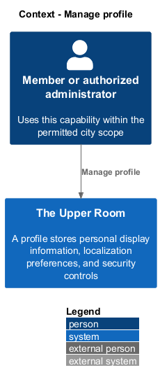
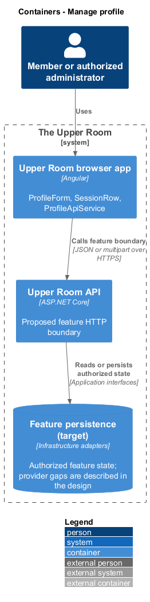
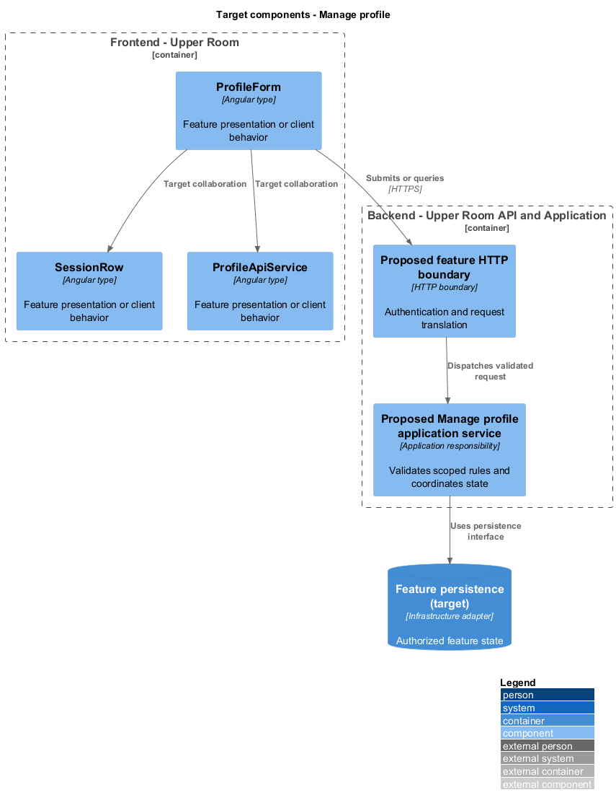
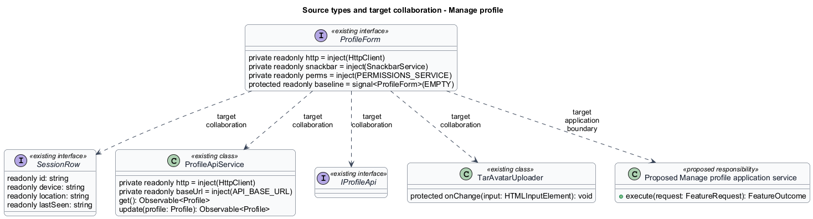
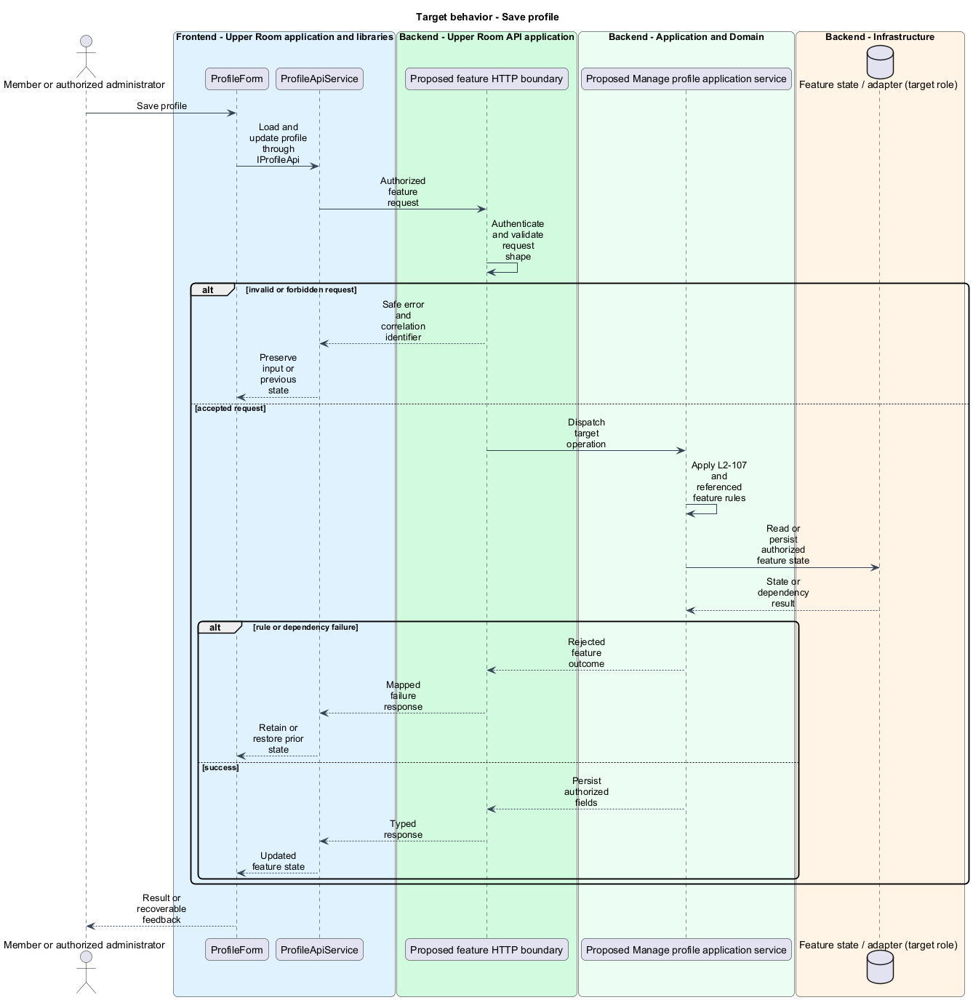
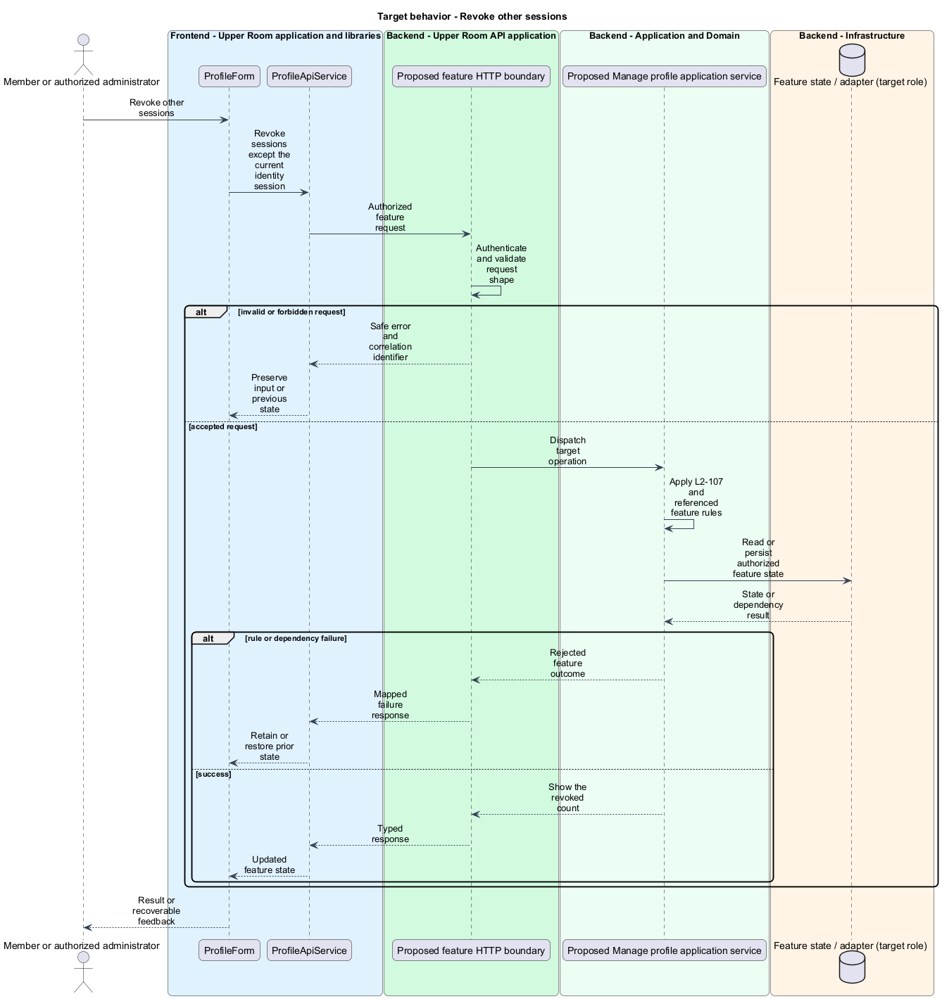

# Manage profile

## Overview

The Upper Room manages contacts, partners, ideas, events, locations, and boards in city-scoped workspaces.

A profile stores personal display information, localization preferences, and security controls. Active sessions represent devices holding renewable access.

## Description

### Existing implementation

The following source elements provide the current implementation points. Their presence does not establish complete requirement coverage.

| Source | Concrete elements | Observed surface |
|---|---|---|
| [frontend/projects/the-upper-room/src/app/users/my-profile/my-profile.ts](../../../../frontend/projects/the-upper-room/src/app/users/my-profile/my-profile.ts) | `ProfileForm`, `MyProfile` | private readonly http = inject(HttpClient); private readonly snackbar = inject(SnackbarService); private readonly perms = inject(PERMISSIONS_SERVICE) |
| [frontend/projects/the-upper-room/src/app/users/sessions-card/sessions-card.ts](../../../../frontend/projects/the-upper-room/src/app/users/sessions-card/sessions-card.ts) | `SessionRow`, `SessionsCard` | readonly id: string; readonly device: string; readonly location: string |
| [frontend/projects/api/src/lib/profile/profile-api.service.ts](../../../../frontend/projects/api/src/lib/profile/profile-api.service.ts) | `ProfileApiService` | private readonly http = inject(HttpClient); private readonly baseUrl = inject(API_BASE_URL); get(): Observable<Profile> |
| [frontend/projects/api/src/lib/profile/profile-api.contract.ts](../../../../frontend/projects/api/src/lib/profile/profile-api.contract.ts) | `IProfileApi` | Declarations and configuration in the linked source |
| [frontend/projects/components/src/lib/avatar/tar-avatar-uploader.ts](../../../../frontend/projects/components/src/lib/avatar/tar-avatar-uploader.ts) | `TarAvatarUploader` | protected onChange(input: HTMLInputElement): void |

### Target behavior and interfaces

MyProfile shall use IProfileApi for profile loading and updates. City edits shall follow administrator permissions. Avatar changes shall use the upload capability. SessionsCard shall list persisted sessions and revoke all except the current session after confirmation. Profile updates shall show field-level failures without discarding edited values.

- **Save profile:** Load and update profile through IProfileApi. Persist authorized fields.
- **Revoke other sessions:** Revoke sessions except the current identity session. Show the revoked count.

Diagrams show target collaborations. Existing source types retain their names. Participants marked as target roles or proposed responsibilities describe interfaces to introduce, not existing classes.

### Gaps and compatibility

MyProfile, SessionsCard, and a profile API contract exist. A list in the UI does not prove refresh-token revocation; the target session repository and revocation behavior belong to the identity design.

Production implementation shall follow [AGENTS.md](../../../../AGENTS.md), including incremental acceptance testing. API integrations shall preserve documented behavior until an explicit compatibility change is approved.

## Requirements

The table preserves the opening requirement statement and all parent identifiers. The expandable source excerpts retain the complete normative text and acceptance criteria verbatim. Source wording is quoted rather than normalized to the design prose.

| L2 ID | Refines (L1) | Requirement |
|---|---|---|
| [L2-107](../../../specs/L2.md#l2-107-profile-page) | `L1-002` | Route `/profile` shows a card with avatar uploader, fields First Name, Last Name, Display Name, Pronouns, Title, City (read-only for non-admin), Time Zone, Locale (en-CA only at launch, but selectable for future). "Save" button. A separate "Security" section with "Change password", "Sign out other sessions" buttons and a list of active sessions. |

L2-107: Profile Page — specification excerpt

Route `/profile` shows a card with avatar uploader, fields First Name, Last Name, Display Name, Pronouns, Title, City (read-only for non-admin), Time Zone, Locale (en-CA only at launch, but selectable for future). "Save" button. A separate "Security" section with "Change password", "Sign out other sessions" buttons and a list of active sessions.

**Acceptance Criteria:**
1. Given the user clicks "Sign out other sessions", when confirmed, then all refresh tokens for this user except the current one are revoked and a snackbar "Signed out from {N} other devices" is shown.

## Diagrams

### System context

The context identifies the people and application boundary used by this capability.

### Container view

The container view separates browser execution from any backend state responsibility. Provider choices remain subject to the stated gaps.

### Target component view

The component view shows target collaborations between the concrete implementation points and proposed application responsibilities.

### Type structure

The structure view lists source types with declared members where available. Dashed dependencies denote proposed collaboration rather than verified current dependency direction.

### Save profile

The target flow performs the following operation: Load and update profile through IProfileApi. Its successful outcome is: Persist authorized fields. Alternate branches retain prior state or return recoverable failure.

### Revoke other sessions

The target flow performs the following operation: Revoke sessions except the current identity session. Its successful outcome is: Show the revoked count. Alternate branches retain prior state or return recoverable failure.

