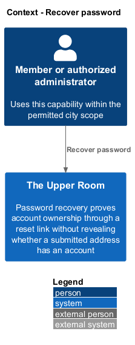
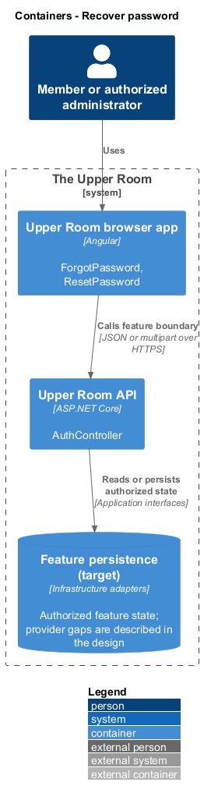
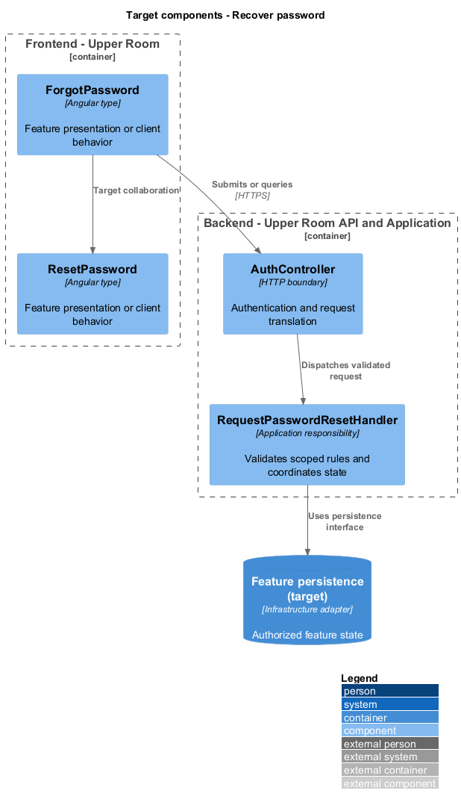
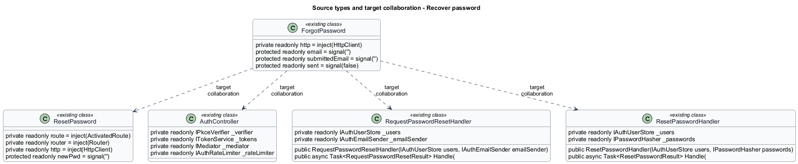
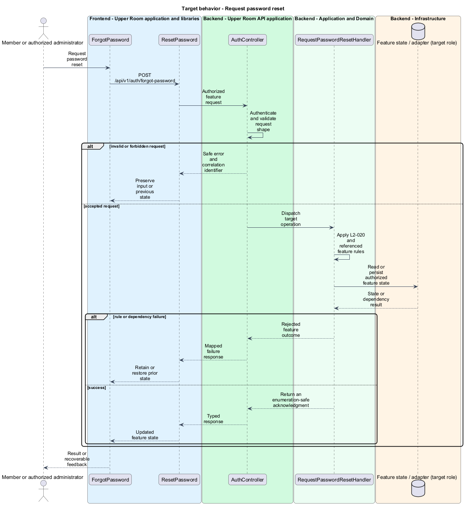
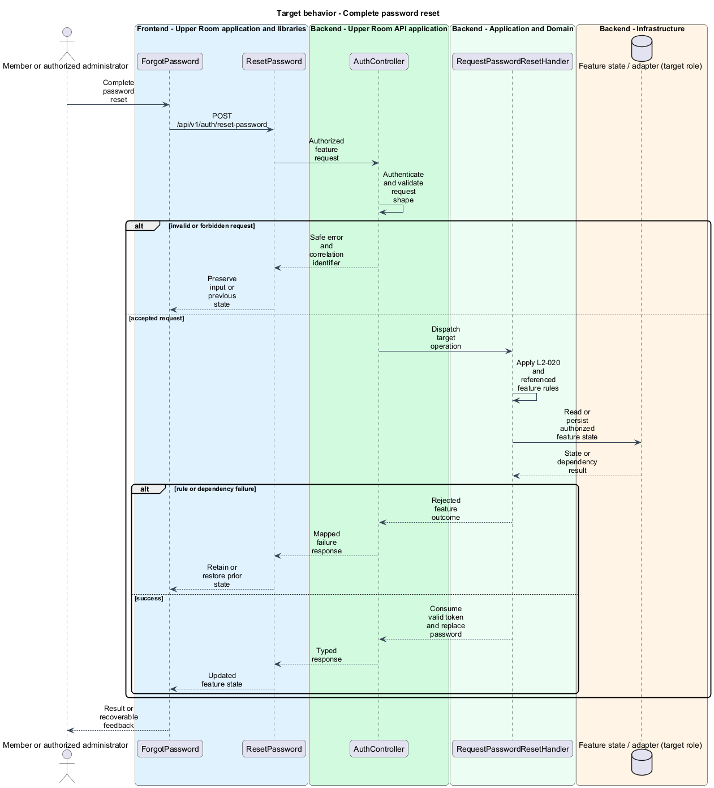

# Recover password

## Overview

The Upper Room manages contacts, partners, ideas, events, locations, and boards in city-scoped workspaces.

Password recovery proves account ownership through a reset link without revealing whether a submitted address has an account.

## Description

### Existing implementation

The following source elements provide the current implementation points. Their presence does not establish complete requirement coverage.

| Source | Concrete elements | Observed surface |
|---|---|---|
| [frontend/projects/the-upper-room/src/app/auth/forgot-password/forgot-password.ts](../../../../frontend/projects/the-upper-room/src/app/auth/forgot-password/forgot-password.ts) | `ForgotPassword` | private readonly http = inject(HttpClient); protected readonly email = signal(''); protected readonly submittedEmail = signal('') |
| [frontend/projects/the-upper-room/src/app/auth/reset-password/reset-password.ts](../../../../frontend/projects/the-upper-room/src/app/auth/reset-password/reset-password.ts) | `ResetPassword` | private readonly route = inject(ActivatedRoute); private readonly router = inject(Router); private readonly http = inject(HttpClient) |
| [backend/src/TheUpperRoom.Api/Auth/AuthController.cs](../../../../backend/src/TheUpperRoom.Api/Auth/AuthController.cs) | `AuthController` | Route api/v1/auth; HttpPost register; HttpPost sign-in; HttpPost forgot-password; HttpPost reset-password; HttpPost verify-email; HttpPost change-password; HttpDelete account; HttpPost sign-out; HttpPost exchange |
| [backend/src/TheUpperRoom.Application/Auth/RequestPasswordResetHandler.cs](../../../../backend/src/TheUpperRoom.Application/Auth/RequestPasswordResetHandler.cs) | `RequestPasswordResetHandler` | private readonly IAuthUserStore _users; private readonly IAuthEmailSender _emailSender; public RequestPasswordResetHandler(IAuthUserStore users, IAuthEmailSender emailSender) |
| [backend/src/TheUpperRoom.Application/Auth/ResetPasswordHandler.cs](../../../../backend/src/TheUpperRoom.Application/Auth/ResetPasswordHandler.cs) | `ResetPasswordHandler` | private readonly IAuthUserStore _users; private readonly IPasswordHasher _passwords; public ResetPasswordHandler(IAuthUserStore users, IPasswordHasher passwords) |

### Target behavior and interfaces

ForgotPassword shall show the same completion message for known and unknown email addresses. RequestPasswordResetHandler shall rate-limit requests and create an expiring token for eligible accounts. ResetPasswordHandler shall validate token expiry and password policy, consume the token, and invalidate affected sessions.

- **Request password reset:** POST /api/v1/auth/forgot-password. Return an enumeration-safe acknowledgment.
- **Complete password reset:** POST /api/v1/auth/reset-password. Consume valid token and replace password.

Diagrams show target collaborations. Existing source types retain their names. Participants marked as target roles or proposed responsibilities describe interfaces to introduce, not existing classes.

### Gaps and compatibility

Request and reset handlers exist. Real reset-mail delivery and the persisted refresh-session lifecycle are not established by the current controller. Delivery provider and session invalidation integration are <TO SUPPLY>.

Production implementation shall follow [AGENTS.md](../../../../AGENTS.md), including incremental acceptance testing. API integrations shall preserve documented behavior until an explicit compatibility change is approved.

Shared capability designs: [L2-019](../sign-in/README.md).

## Requirements

The table preserves the opening requirement statement and all parent identifiers. The expandable source excerpts retain the complete normative text and acceptance criteria verbatim. Source wording is quoted rather than normalized to the design prose.

| L2 ID | Refines (L1) | Requirement |
|---|---|---|
| [L2-020](../../../specs/L2.md#l2-020-forgot-reset-password) | `L1-002` | Route `/forgot-password` shows email field and "Send reset link" button. After submit, regardless of whether the email exists, the page shows "If an account exists for {email}, a reset link has been sent." (prevents account enumeration). Reset email link `/reset-password?token=...` shows New Password and Confirm Password fields with the policy in L2-019. |

L2-020: Forgot / Reset Password — specification excerpt

Route `/forgot-password` shows email field and "Send reset link" button. After submit, regardless of whether the email exists, the page shows "If an account exists for {email}, a reset link has been sent." (prevents account enumeration). Reset email link `/reset-password?token=...` shows New Password and Confirm Password fields with the policy in L2-019.

**Acceptance Criteria:**
1. Given an unknown email, when submitted, then the response is the same generic message and no enumeration is possible.
2. Given a reset token older than 1 hour, when used, then the page shows "This reset link has expired. Please request a new one." and a button to return to forgot-password.

## Diagrams

### System context

The context identifies the people and application boundary used by this capability.

### Container view

The container view separates browser execution from any backend state responsibility. Provider choices remain subject to the stated gaps.

### Target component view

The component view shows target collaborations between the concrete implementation points and proposed application responsibilities.

### Type structure

The structure view lists source types with declared members where available. Dashed dependencies denote proposed collaboration rather than verified current dependency direction.

### Request password reset

The target flow performs the following operation: POST /api/v1/auth/forgot-password. Its successful outcome is: Return an enumeration-safe acknowledgment. Alternate branches retain prior state or return recoverable failure.

### Complete password reset

The target flow performs the following operation: POST /api/v1/auth/reset-password. Its successful outcome is: Consume valid token and replace password. Alternate branches retain prior state or return recoverable failure.

