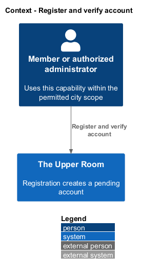
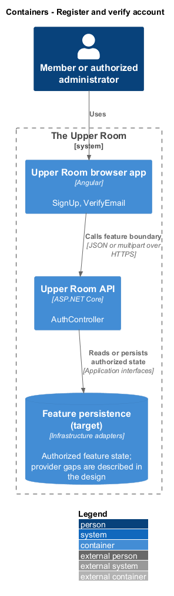
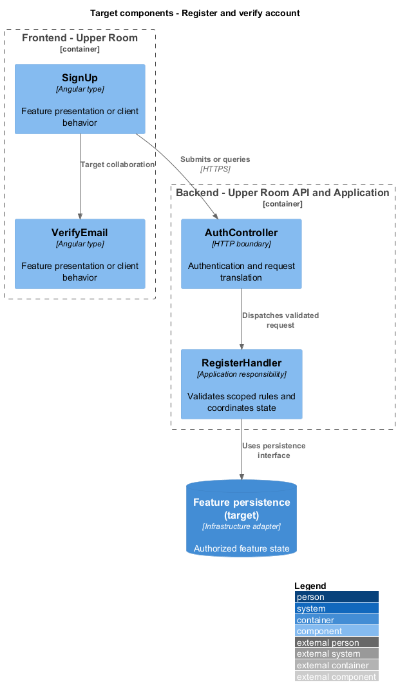
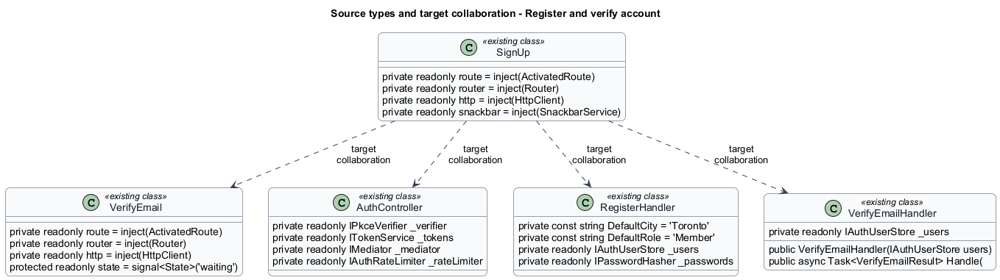
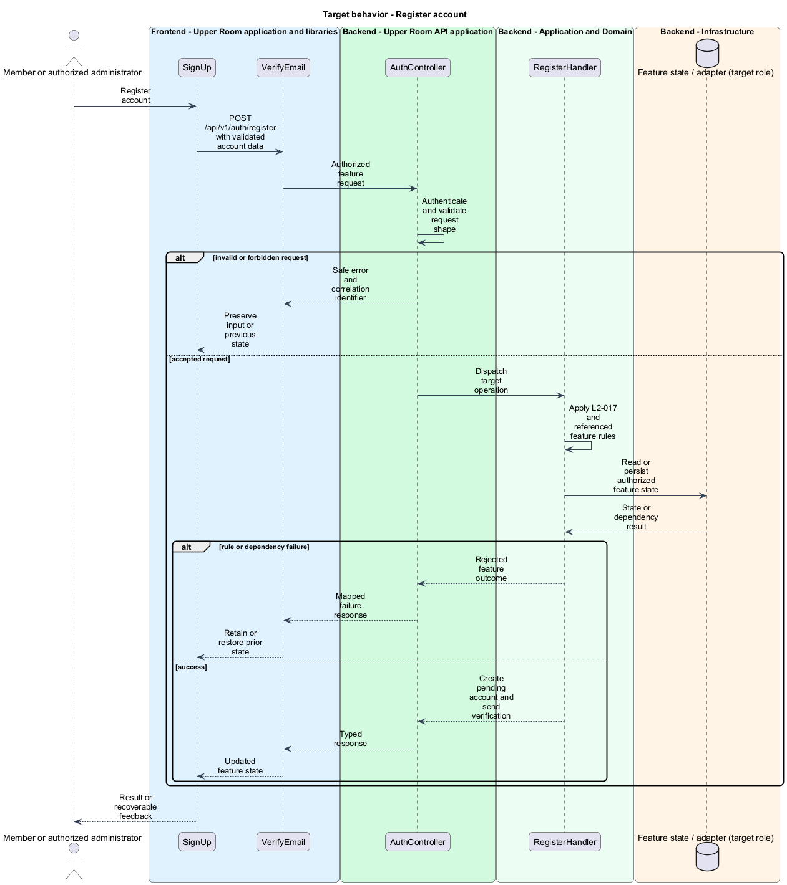
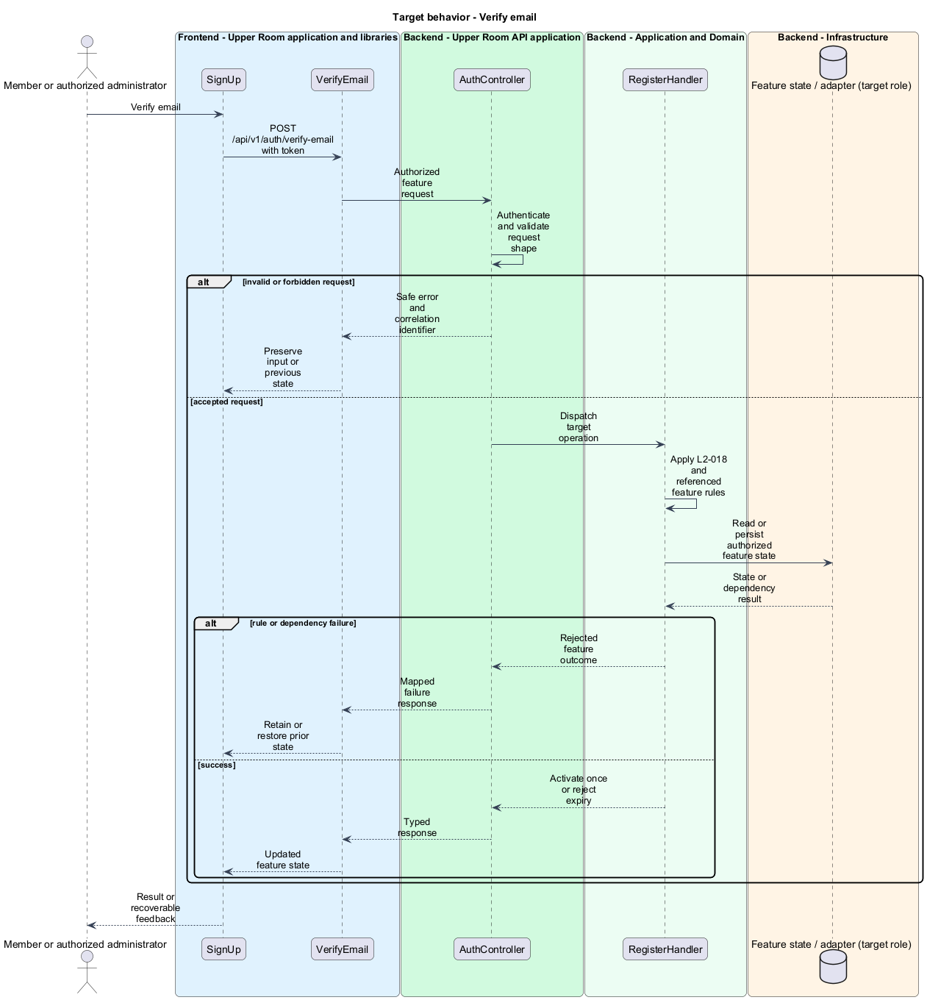
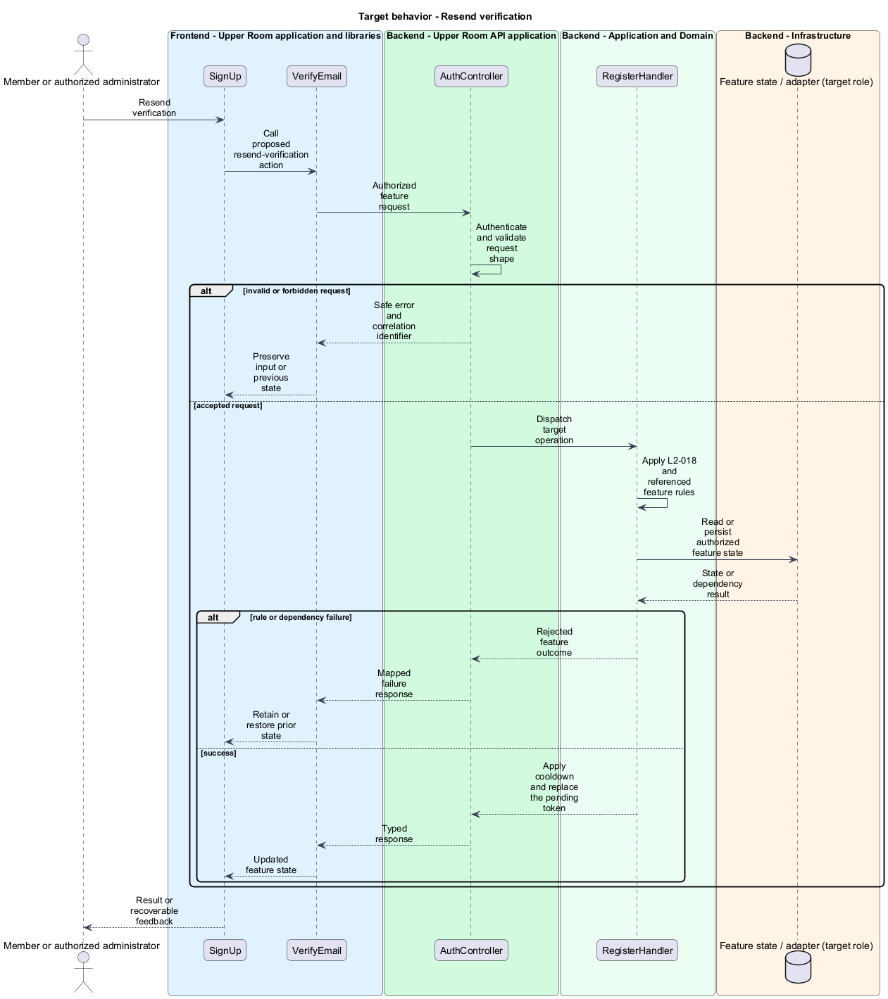

# Register and verify account

## Overview

The Upper Room manages contacts, partners, ideas, events, locations, and boards in city-scoped workspaces.

Registration creates a pending account. Email verification demonstrates access to the address before account activation.

## Description

### Existing implementation

The following source elements provide the current implementation points. Their presence does not establish complete requirement coverage.

| Source | Concrete elements | Observed surface |
|---|---|---|
| [frontend/projects/the-upper-room/src/app/auth/sign-up/sign-up.ts](../../../../frontend/projects/the-upper-room/src/app/auth/sign-up/sign-up.ts) | `SignUp` | private readonly route = inject(ActivatedRoute); private readonly router = inject(Router); private readonly http = inject(HttpClient) |
| [frontend/projects/the-upper-room/src/app/auth/verify-email/verify-email.ts](../../../../frontend/projects/the-upper-room/src/app/auth/verify-email/verify-email.ts) | `VerifyEmail` | private readonly route = inject(ActivatedRoute); private readonly router = inject(Router); private readonly http = inject(HttpClient) |
| [backend/src/TheUpperRoom.Api/Auth/AuthController.cs](../../../../backend/src/TheUpperRoom.Api/Auth/AuthController.cs) | `AuthController` | Route api/v1/auth; HttpPost register; HttpPost sign-in; HttpPost forgot-password; HttpPost reset-password; HttpPost verify-email; HttpPost change-password; HttpDelete account; HttpPost sign-out; HttpPost exchange |
| [backend/src/TheUpperRoom.Application/Auth/RegisterHandler.cs](../../../../backend/src/TheUpperRoom.Application/Auth/RegisterHandler.cs) | `RegisterHandler` | private const string DefaultCity = "Toronto"; private const string DefaultRole = "Member"; private readonly IAuthUserStore _users |
| [backend/src/TheUpperRoom.Application/Auth/VerifyEmailHandler.cs](../../../../backend/src/TheUpperRoom.Application/Auth/VerifyEmailHandler.cs) | `VerifyEmailHandler` | private readonly IAuthUserStore _users; public VerifyEmailHandler(IAuthUserStore users); public async Task<VerifyEmailResult> Handle( |

### Target behavior and interfaces

SignUp shall validate names, city, matching passwords, and terms acceptance. RegisterHandler shall enforce uniqueness and password policy. Verification shall use expiring single-use tokens and support a resend action with cooldown. VerifyEmail shall distinguish pending, success, expired, and reused-token outcomes.

- **Register account:** POST /api/v1/auth/register with validated account data. Create pending account and send verification.
- **Verify email:** POST /api/v1/auth/verify-email with token. Activate once or reject expiry.
- **Resend verification:** Call proposed resend-verification action. Apply cooldown and replace the pending token.

Diagrams show target collaborations. Existing source types retain their names. Participants marked as target roles or proposed responsibilities describe interfaces to introduce, not existing classes.

### Gaps and compatibility

Registration and verification handlers exist. AuthController exposes register rather than the sign-up naming used by parts of the specs, and no resend action is defined there. Mail delivery provider and final compatibility route policy are <TO SUPPLY>.

Production implementation shall follow [AGENTS.md](../../../../AGENTS.md), including incremental acceptance testing. API integrations shall preserve documented behavior until an explicit compatibility change is approved.

Shared capability designs: [L2-019](../sign-in/README.md).

## Requirements

The table preserves the opening requirement statement and all parent identifiers. The expandable source excerpts retain the complete normative text and acceptance criteria verbatim. Source wording is quoted rather than normalized to the design prose.

| L2 ID | Refines (L1) | Requirement |
|---|---|---|
| [L2-017](../../../specs/L2.md#l2-017-sign-up-page) | `L1-002` | Route `/sign-up` displays a card of max-width `480px` with: heading "Create your account", fields First Name (required, 1-50 chars), Last Name (required, 1-50 chars), Email (required, RFC 5322), City (required, autocomplete from `/api/cities`), Password (required, see L2-019), Confirm Password (required, must match), Terms checkbox ("I agree to the Terms of Service and Privacy Policy", required). Primary button "Create account" disabled until all fields valid. |
| [L2-018](../../../specs/L2.md#l2-018-email-verification-page) | `L1-002` | Route `/verify-email` shows a card with the icon `mark_email_unread` (size `xl`, color `primary`), heading "Verify your email" (`headline-small`), body "We sent a verification link to **{email}**. Click the link to activate your account." (`body-medium`), "Resend email" button (text variant), and "I clicked the link, refresh" button (filled). When the user clicks the email link `/verify-email/confirm?token=...`, the token is exchanged; on success the page becomes "Email verified" with icon `check_circle` (color `--md-sys-color-tertiary`) and a "Go to dashboard" button. |

L2-017: Sign-Up Page — specification excerpt

Route `/sign-up` displays a card of max-width `480px` with: heading "Create your account", fields First Name (required, 1-50 chars), Last Name (required, 1-50 chars), Email (required, RFC 5322), City (required, autocomplete from `/api/cities`), Password (required, see L2-019), Confirm Password (required, must match), Terms checkbox ("I agree to the Terms of Service and Privacy Policy", required). Primary button "Create account" disabled until all fields valid.

**Acceptance Criteria:**
1. Given the email already exists, when submit is clicked, then the email field shows the error "An account with this email already exists. Try signing in." with a "Sign in" link.
2. Given all fields valid, when submit succeeds, then the user is redirected to `/verify-email` and a success snackbar "Account created! Check your email to verify." is shown for `5000ms`.

L2-018: Email Verification Page — specification excerpt

Route `/verify-email` shows a card with the icon `mark_email_unread` (size `xl`, color `primary`), heading "Verify your email" (`headline-small`), body "We sent a verification link to **{email}**. Click the link to activate your account." (`body-medium`), "Resend email" button (text variant), and "I clicked the link, refresh" button (filled). When the user clicks the email link `/verify-email/confirm?token=...`, the token is exchanged; on success the page becomes "Email verified" with icon `check_circle` (color `--md-sys-color-tertiary`) and a "Go to dashboard" button.

**Acceptance Criteria:**
1. Given the verification token is expired, when the page loads, then the heading becomes "Link expired", body becomes "Verification links expire after 24 hours.", and a "Send a new link" button is shown.
2. Given the user clicks "Resend email" more than once in 60 seconds, when clicked, then a snackbar "Please wait {seconds}s before requesting another email" is shown and the button is disabled with a countdown.

## Diagrams

### System context

The context identifies the people and application boundary used by this capability.

### Container view

The container view separates browser execution from any backend state responsibility. Provider choices remain subject to the stated gaps.

### Target component view

The component view shows target collaborations between the concrete implementation points and proposed application responsibilities.

### Type structure

The structure view lists source types with declared members where available. Dashed dependencies denote proposed collaboration rather than verified current dependency direction.

### Register account

The target flow performs the following operation: POST /api/v1/auth/register with validated account data. Its successful outcome is: Create pending account and send verification. Alternate branches retain prior state or return recoverable failure.

### Verify email

The target flow performs the following operation: POST /api/v1/auth/verify-email with token. Its successful outcome is: Activate once or reject expiry. Alternate branches retain prior state or return recoverable failure.

### Resend verification

The target flow performs the following operation: Call proposed resend-verification action. Its successful outcome is: Apply cooldown and replace the pending token. Alternate branches retain prior state or return recoverable failure.

