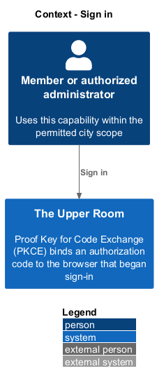
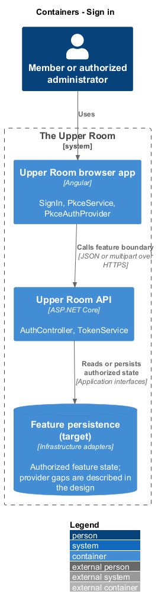
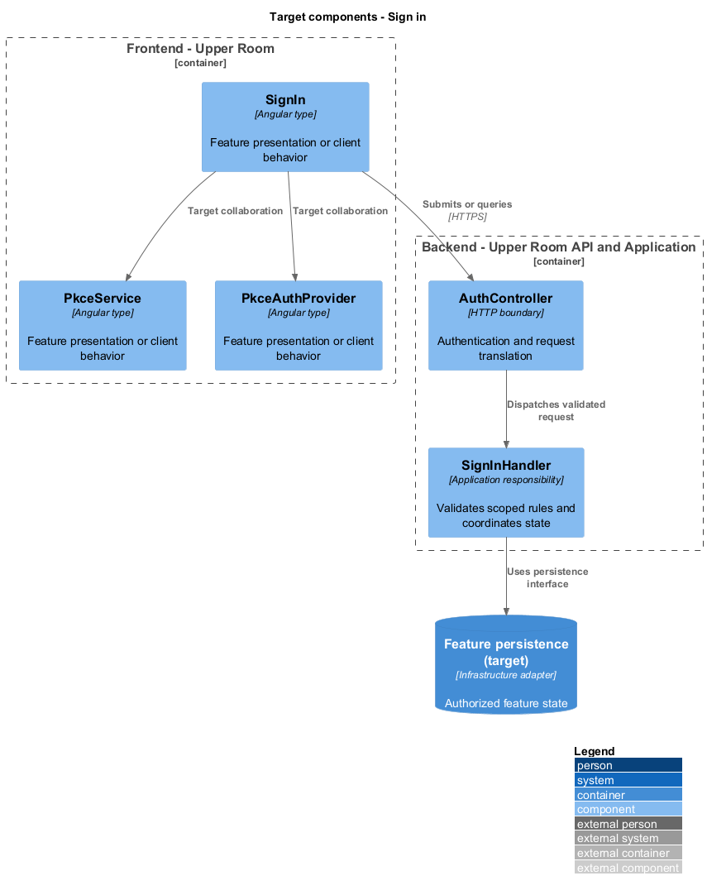
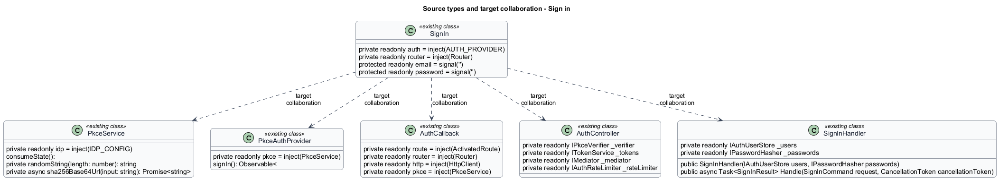
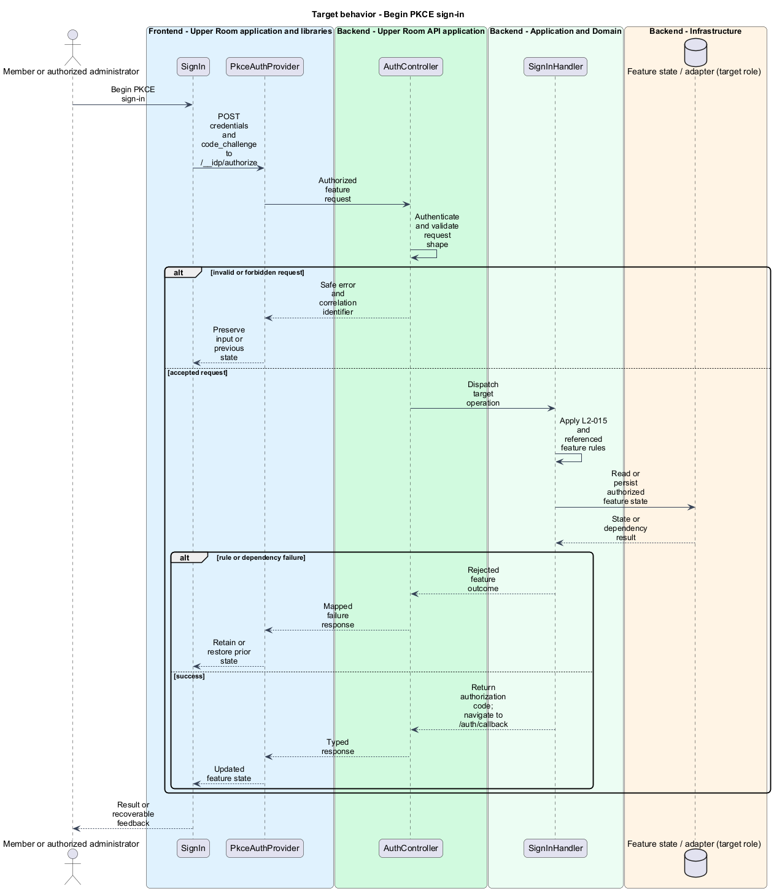
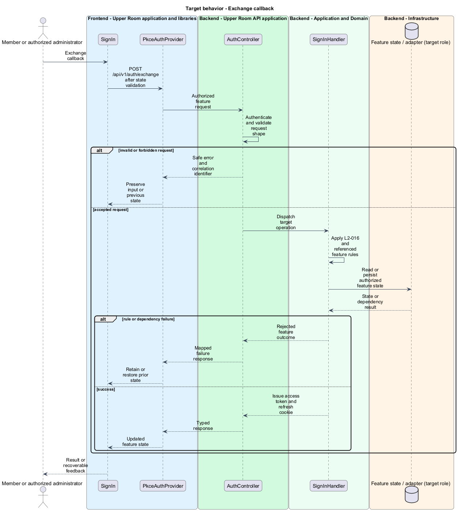
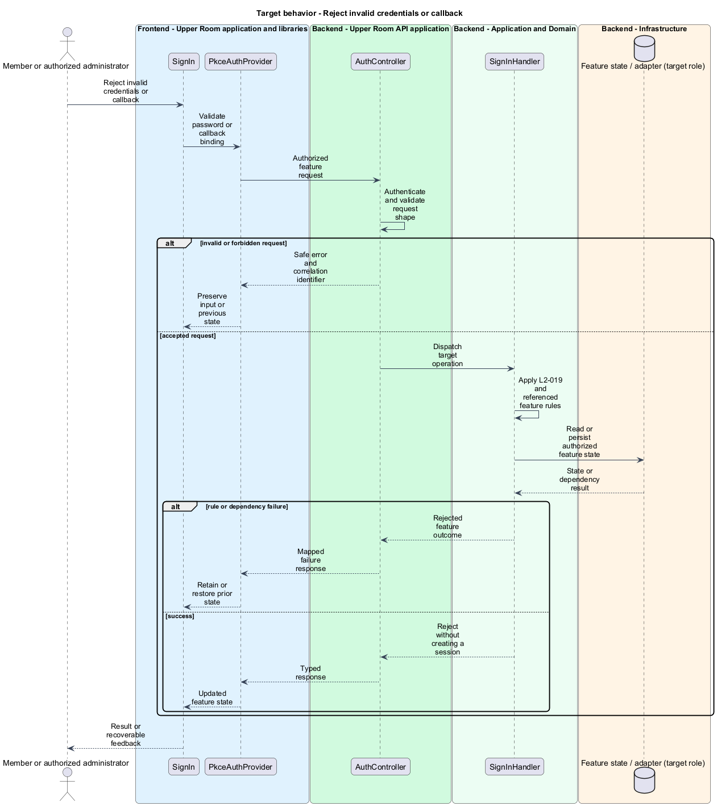

# Sign in

## Overview

The Upper Room manages contacts, partners, ideas, events, locations, and boards in city-scoped workspaces.

Proof Key for Code Exchange (PKCE) binds an authorization code to the browser that began sign-in. A session connects the authenticated identity to API requests.

## Description

### Existing implementation

The following source elements provide the current implementation points. Their presence does not establish complete requirement coverage.

| Source | Concrete elements | Observed surface |
|---|---|---|
| [frontend/projects/the-upper-room/src/app/auth/sign-in/sign-in.ts](../../../../frontend/projects/the-upper-room/src/app/auth/sign-in/sign-in.ts) | `SignIn` | private readonly auth = inject(AUTH_PROVIDER); private readonly router = inject(Router); protected readonly email = signal('') |
| [frontend/projects/the-upper-room/src/app/auth/pkce.service.ts](../../../../frontend/projects/the-upper-room/src/app/auth/pkce.service.ts) | `PkceService` | private readonly idp = inject(IDP_CONFIG); consumeState():; private randomString(length: number): string |
| [frontend/projects/the-upper-room/src/app/auth/pkce-auth-provider.ts](../../../../frontend/projects/the-upper-room/src/app/auth/pkce-auth-provider.ts) | `PkceAuthProvider` | private readonly pkce = inject(PkceService); signIn(): Observable< |
| [frontend/projects/the-upper-room/src/app/auth/auth-callback/auth-callback.ts](../../../../frontend/projects/the-upper-room/src/app/auth/auth-callback/auth-callback.ts) | `AuthCallback` | private readonly route = inject(ActivatedRoute); private readonly router = inject(Router); private readonly http = inject(HttpClient) |
| [backend/src/TheUpperRoom.Api/Auth/AuthController.cs](../../../../backend/src/TheUpperRoom.Api/Auth/AuthController.cs) | `AuthController` | Route api/v1/auth; HttpPost register; HttpPost sign-in; HttpPost forgot-password; HttpPost reset-password; HttpPost verify-email; HttpPost change-password; HttpDelete account; HttpPost sign-out; HttpPost exchange |
| [backend/src/TheUpperRoom.Application/Auth/SignInHandler.cs](../../../../backend/src/TheUpperRoom.Application/Auth/SignInHandler.cs) | `SignInHandler` | private readonly IAuthUserStore _users; private readonly IPasswordHasher _passwords; public SignInHandler(IAuthUserStore users, IPasswordHasher passwords) |
| [backend/src/TheUpperRoom.Api/Auth/TokenService.cs](../../../../backend/src/TheUpperRoom.Api/Auth/TokenService.cs) | `TokenService` | private readonly JwtSettings _settings; private readonly SigningCredentials _credentials; public TokenService(JwtSettings settings) |

### Target behavior and interfaces

PkceService shall generate the verifier, state, nonce, and S256 challenge. AuthCallback shall reject mismatched state before exchange. AuthController shall exchange a validated code, issue a memory-held access token and secure refresh cookie, and support refresh through a persisted session record. PasswordPolicy shall enforce the specified rules and compromised-password check.

- **Begin PKCE sign-in:** The SPA posts the credentials and the `code_challenge` to the identity provider's `/__idp/authorize` endpoint and receives a single-use authorization code, then navigates to `/auth/callback?code=...&state=...`.
- **Exchange callback:** POST /api/v1/auth/exchange after state validation. Issue access token and refresh cookie.
- **Reject invalid credentials or callback:** Validate password or callback binding. Reject without creating a session.

Diagrams show target collaborations. Existing source types retain their names. Participants marked as target roles or proposed responsibilities describe interfaces to introduce, not existing classes.

### Gaps and compatibility

The local IdpController and code store support a development authorization flow. AccessTokenStore includes a sessionStorage-based e2e token path, and AuthController has no refresh action. Production IdP selection and compromised-password provider are <TO SUPPLY>; test token storage shall remain isolated from production.

Production implementation shall follow [AGENTS.md](../../../../AGENTS.md), including incremental acceptance testing. API integrations shall preserve documented behavior until an explicit compatibility change is approved.

## Requirements

The table preserves the opening requirement statement and all parent identifiers. The expandable source excerpts retain the complete normative text and acceptance criteria verbatim. Source wording is quoted rather than normalized to the design prose.

| L2 ID | Refines (L1) | Requirement |
|---|---|---|
| [L2-015](../../../specs/L2.md#l2-015-pkce-authorization-code-flow) | `L1-001` | The frontend must initiate sign-in via PKCE: generate a `code_verifier` (43-128 chars, base64url, cryptographically random), derive `code_challenge = BASE64URL(SHA256(code_verifier))`, send `response_type=code`, `client_id`, `redirect_uri`, `scope=openid profile email offline_access`, `state` (random, 32 bytes base64url), `nonce`, `code_challenge`, `code_challenge_method=S256`. After redirect to `/auth/callback?code=...&state=...`, exchange `code` and `code_verifier` for tokens at the token endpoint. Tokens are stored in memory + a secure, HttpOnly, SameSite=Strict refresh-token cookie issued by the backend's BFF token endpoint. No tokens are stored in localStorage. |
| [L2-016](../../../specs/L2.md#l2-016-sign-in-page) | `L1-001`, `L1-002` | Route `/sign-in` displays a full-viewport centered card, max-width `400px` on MD+ and full-width with `$space-4` padding on XS. Card contents: logo (64px), heading "Welcome back" (`headline-small`, margin-top `$space-4`), subhead "Sign in to The Upper Room" (`body-medium`, color `on-surface-variant`, margin-top `$space-1`, margin-bottom `$space-6`), email field (outlined, label "Email", autocomplete `email`, leading icon `mail`), password field (outlined, label "Password", autocomplete `current-password`, leading icon `lock`, trailing icon `visibility`/`visibility_off` toggle), "Forgot password?" link (right-aligned, `label-large`, `--md-sys-color-primary`), primary button "Sign in" (filled, full-width on XS, min 240px on MD+), divider with text "or" centered, "Continue with Google" button (outlined, leading Google logo svg). Below card: "New to The Upper Room?" (`body-medium`) followed by "Create an account" link to `/sign-up`. |
| [L2-019](../../../specs/L2.md#l2-019-password-policy) | `L1-020`, `L1-002` | Passwords must be 12-128 characters, contain at least one uppercase, one lowercase, one digit, and one symbol from `!@#$%^&*()_+-=[]{}\|;:'",.<>/?`. The system must reject any password found in the top 1,000,000 of HaveIBeenPwned (k-anonymity API or local list), and must reject passwords containing the user's email local part or display name. |

L2-015: PKCE Authorization Code Flow — specification excerpt

The frontend must initiate sign-in via PKCE: generate a `code_verifier` (43-128 chars, base64url, cryptographically random), derive `code_challenge = BASE64URL(SHA256(code_verifier))`, send `response_type=code`, `client_id`, `redirect_uri`, `scope=openid profile email offline_access`, `state` (random, 32 bytes base64url), `nonce`, `code_challenge`, `code_challenge_method=S256`. After redirect to `/auth/callback?code=...&state=...`, exchange `code` and `code_verifier` for tokens at the token endpoint. Tokens are stored in memory + a secure, HttpOnly, SameSite=Strict refresh-token cookie issued by the backend's BFF token endpoint. No tokens are stored in localStorage.

**Acceptance Criteria:**
1. Given an unauthenticated user navigates to `/contacts`, when the route guard runs, then the user is redirected to the OIDC authorize endpoint with all PKCE parameters present and `response_type=code`.
2. Given the OIDC callback returns with a non-matching `state`, when received, then sign-in fails with the error toast "Sign-in failed. Please try again." (severity error, action "Retry") and the user is redirected to `/sign-in`.
3. Given a successful token exchange, when complete, then `localStorage` and `sessionStorage` contain no JWTs or refresh tokens.

L2-016: Sign-In Page — specification excerpt

Route `/sign-in` displays a full-viewport centered card, max-width `400px` on MD+ and full-width with `$space-4` padding on XS. Card contents: logo (64px), heading "Welcome back" (`headline-small`, margin-top `$space-4`), subhead "Sign in to The Upper Room" (`body-medium`, color `on-surface-variant`, margin-top `$space-1`, margin-bottom `$space-6`), email field (outlined, label "Email", autocomplete `email`, leading icon `mail`), password field (outlined, label "Password", autocomplete `current-password`, leading icon `lock`, trailing icon `visibility`/`visibility_off` toggle), "Forgot password?" link (right-aligned, `label-large`, `--md-sys-color-primary`), primary button "Sign in" (filled, full-width on XS, min 240px on MD+), divider with text "or" centered, "Continue with Google" button (outlined, leading Google logo svg). Below card: "New to The Upper Room?" (`body-medium`) followed by "Create an account" link to `/sign-up`.

**Acceptance Criteria:**
1. Given the email field is empty, when the user clicks Sign in, then the field shows error "Email is required" in `--md-sys-color-error`, focus moves to the email field, and no network call is made.
2. Given valid credentials are entered, when Sign in is clicked, then a loading spinner replaces the button label, the button is disabled, and the redirect to OIDC begins within `300ms`.

L2-019: Password Policy — specification excerpt

Passwords must be 12-128 characters, contain at least one uppercase, one lowercase, one digit, and one symbol from `!@#$%^&*()_+-=[]{}|;:'",.<>/?`. The system must reject any password found in the top 1,000,000 of HaveIBeenPwned (k-anonymity API or local list), and must reject passwords containing the user's email local part or display name.

**Acceptance Criteria:**
1. Given the user types `Password1!`, when the password field loses focus, then the helper text shows "Password is too common. Choose a stronger password." and the field has error styling.
2. Given a 12-character compliant password, when typed, then a strength meter (5 bars, color from `--md-sys-color-error` to `--md-sys-color-tertiary`) fills proportionally and shows "Strong" once all rules pass.

## Diagrams

### System context

The context identifies the people and application boundary used by this capability.

### Container view

The container view separates browser execution from any backend state responsibility. Provider choices remain subject to the stated gaps.

### Target component view

The component view shows target collaborations between the concrete implementation points and proposed application responsibilities.

### Type structure

The structure view lists source types with declared members where available. Dashed dependencies denote proposed collaboration rather than verified current dependency direction.

### Begin PKCE sign-in

The target flow performs the following operation: the SPA posts the credentials and the PKCE `code_challenge` to `/__idp/authorize`. Its successful outcome is a single-use authorization code and navigation to `/auth/callback`. Invalid credentials return `401 auth.invalid_credentials`, which the form displays. Alternate branches retain prior state or return recoverable failure.

### Exchange callback

The target flow performs the following operation: POST /api/v1/auth/exchange after state validation. Its successful outcome is: Issue access token and refresh cookie. Alternate branches retain prior state or return recoverable failure.

### Reject invalid credentials or callback

The target flow performs the following operation: Validate password or callback binding. Its successful outcome is: Reject without creating a session. Alternate branches retain prior state or return recoverable failure.

