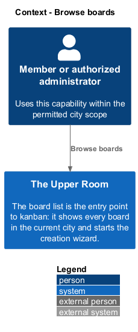
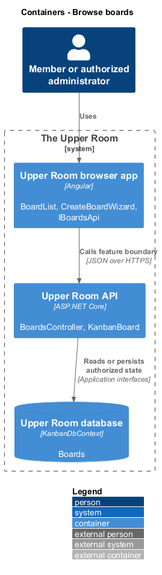
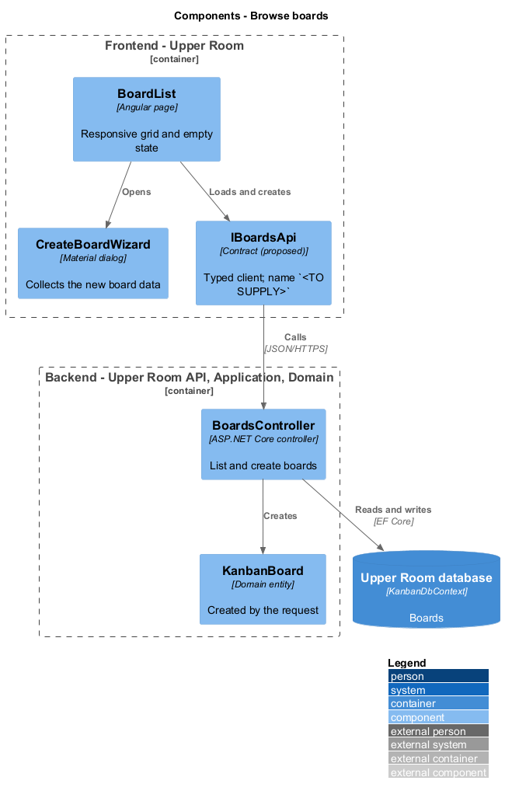
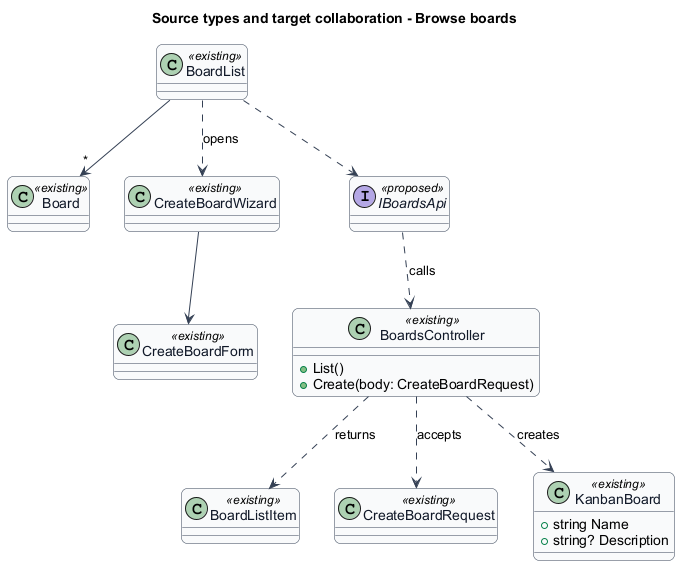
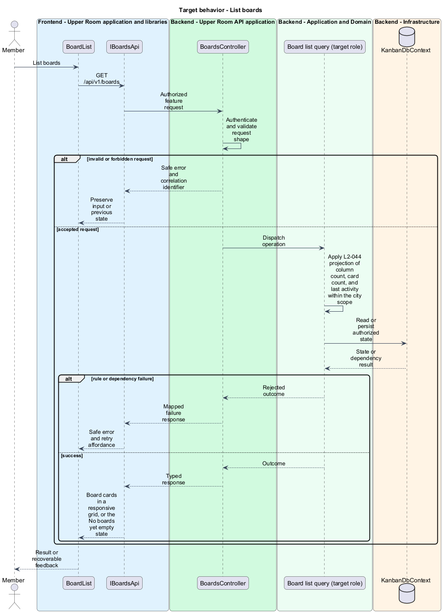
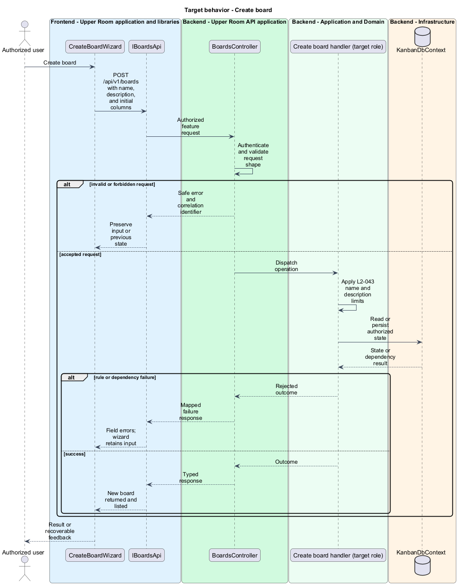

# Browse boards

## Overview

The board list is the entry point to kanban: it shows every board in the current city and starts the creation wizard.

**board card** — summary tile on the list showing name, description, column count, card count, and last activity.

**create board wizard** — dialog sequence that collects name, description, and initial columns for a new board.

The feature covers the `/boards` route, its responsive grid, the empty state, and board creation.

## Description

### Existing implementation

The following source elements provide the current implementation points. Their presence does not establish complete requirement coverage.

| Source | Concrete elements | Observed surface |
|---|---|---|
| [frontend/projects/the-upper-room/src/app/kanban/board-list/board-list.ts](../../../../frontend/projects/the-upper-room/src/app/kanban/board-list/board-list.ts) | `Board`, `BoardList` | Injects `HttpClient`, `PERMISSIONS_SERVICE`, `MatDialog`, `Router` |
| [frontend/projects/the-upper-room/src/app/kanban/create-board-wizard/create-board-wizard.ts](../../../../frontend/projects/the-upper-room/src/app/kanban/create-board-wizard/create-board-wizard.ts) | `CreateBoardWizard`, `CreateBoardForm` | Wizard dialog |
| [backend/src/TheUpperRoom.Api/Kanban/BoardsController.cs](../../../../backend/src/TheUpperRoom.Api/Kanban/BoardsController.cs) | `BoardsController` | `HttpGet` list and `HttpPost` create on `api/v1/boards` |
| [backend/src/TheUpperRoom.Api/Kanban/BoardListItem.cs](../../../../backend/src/TheUpperRoom.Api/Kanban/BoardListItem.cs) | `BoardListItem`, `CreateBoardRequest` | List projection and create request |
| [backend/src/TheUpperRoom.Domain/Kanban/KanbanBoard.cs](../../../../backend/src/TheUpperRoom.Domain/Kanban/KanbanBoard.cs) | `KanbanBoard` | Aggregate created by the wizard |

### Target behavior and interfaces

`BoardList` shall call `IBoardsApi` (`<TO SUPPLY>`) to load boards and to create one. The list shall render 1, 2, 3, or 4 columns at XS, MD, LG, and XL, and shall show the empty state when no boards exist.

- **List boards:** `GET /api/v1/boards` returns name, description, column count, card count, and last activity.
- **Create board:** `POST /api/v1/boards` from the wizard.

Diagrams show target collaborations. Existing source types retain their names. Participants marked as proposed or target roles describe interfaces to introduce, not existing classes.

### Gaps and compatibility

`BoardList` calls `HttpClient` directly. Whether `BoardListItem` carries the last-activity value is `<TO SUPPLY>`. The permission that shows the "New board" button is `<TO SUPPLY>`.

Production implementation shall follow [AGENTS.md](../../../../AGENTS.md), including incremental acceptance testing. API integrations shall preserve documented behavior until an explicit compatibility change is approved.

## Requirements

The table preserves each requirement statement and all parent identifiers. The expandable source excerpts retain the acceptance criteria verbatim.

| L2 ID | Refines (L1) | Requirement |
|---|---|---|
| [L2-044](../../../specs/L2.md#l2-044-kanban-board-list-page) | `L1-008` | Route `/boards` lists boards as cards (name, description, column count, card count, last activity). XS 1-col, MD 2-col, LG 3-col, XL 4-col, gap `$space-4`. "New board" filled button opens a wizard. |

L2-044: Kanban Board List Page — specification excerpt

Route `/boards` lists boards as cards (name, description, column count, card count, last activity). XS 1-col, MD 2-col, LG 3-col, XL 4-col, gap `$space-4`. "New board" filled button opens a wizard.

**Acceptance Criteria:**
1. Given there are zero boards, when rendered, then the empty state shows icon `view_kanban`, heading "No boards yet", body "Create a board to organize your work.", and a "New board" button.

## Diagrams

### System context

The context identifies the people and application boundary used by this capability.

### Container view

The container view separates browser execution from backend state responsibility.

### Target component view

The component view shows target collaborations between the concrete implementation points and proposed responsibilities.

### Type structure

The structure view lists source types with declared members where available. Types marked proposed describe interfaces to introduce.

### List boards

The flow performs the following operation: GET /api/v1/boards. Its successful outcome is: Board cards in a responsive grid, or the No boards yet empty state. The alternate branch yields: Safe error and retry affordance.

### Create board

The flow performs the following operation: POST /api/v1/boards with name, description, and initial columns. Its successful outcome is: New board returned and listed. The alternate branch yields: Field errors; wizard retains input.

