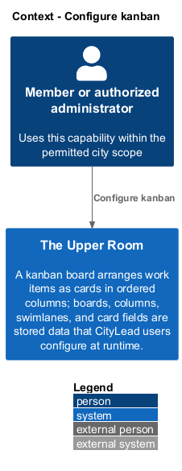
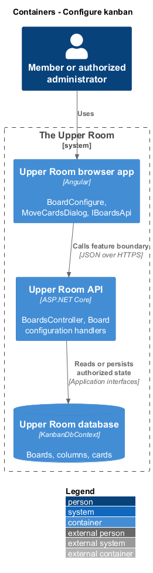
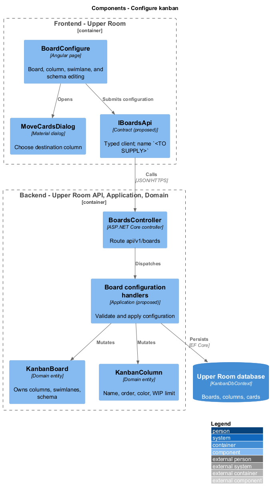
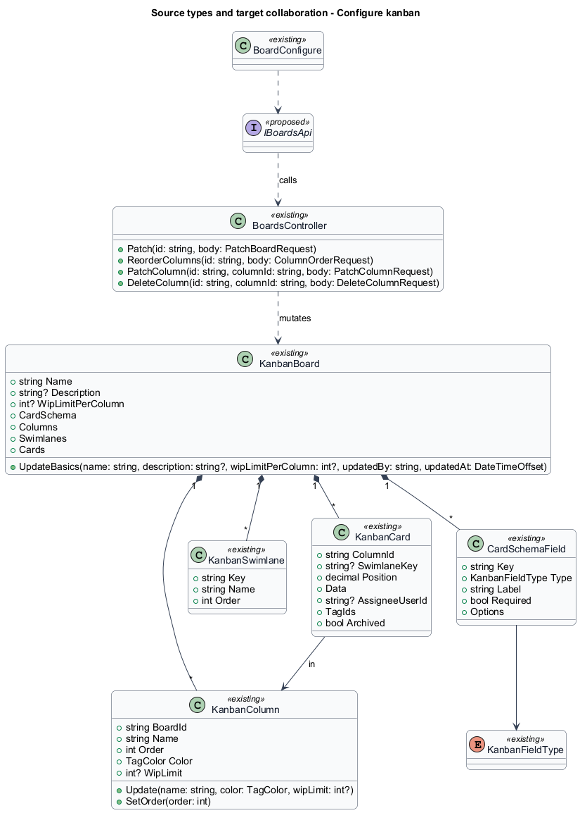
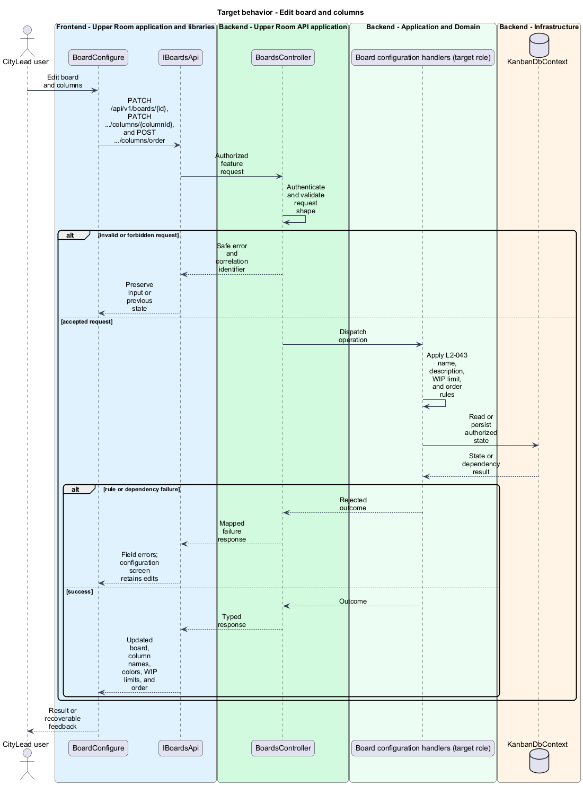
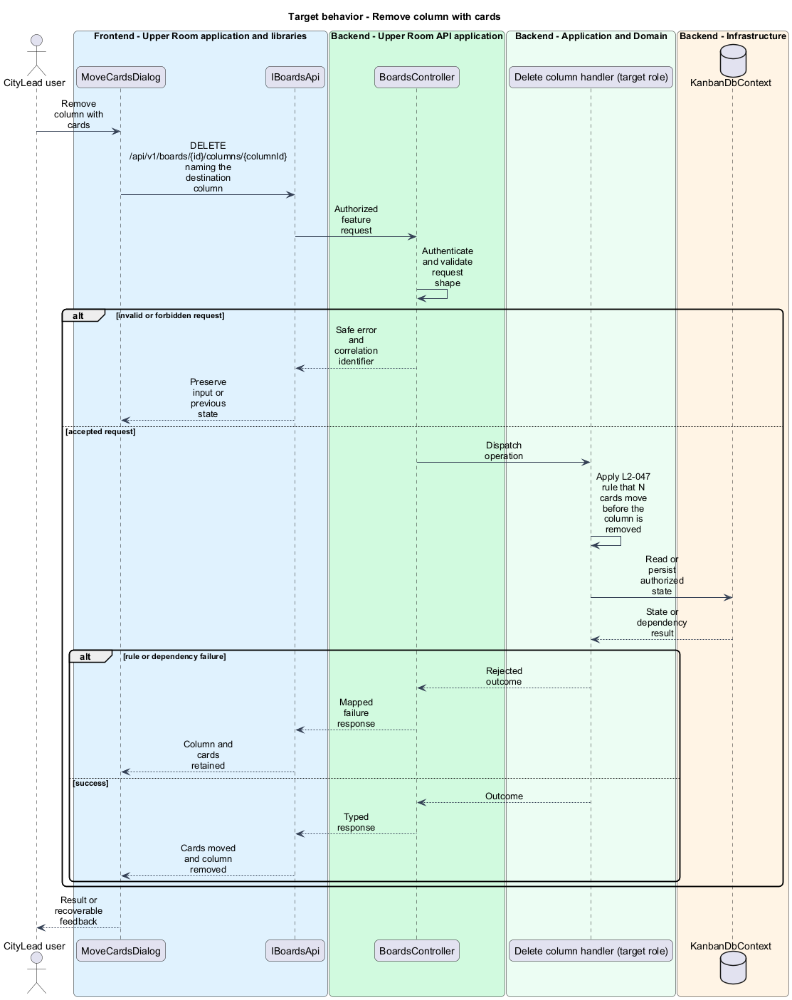
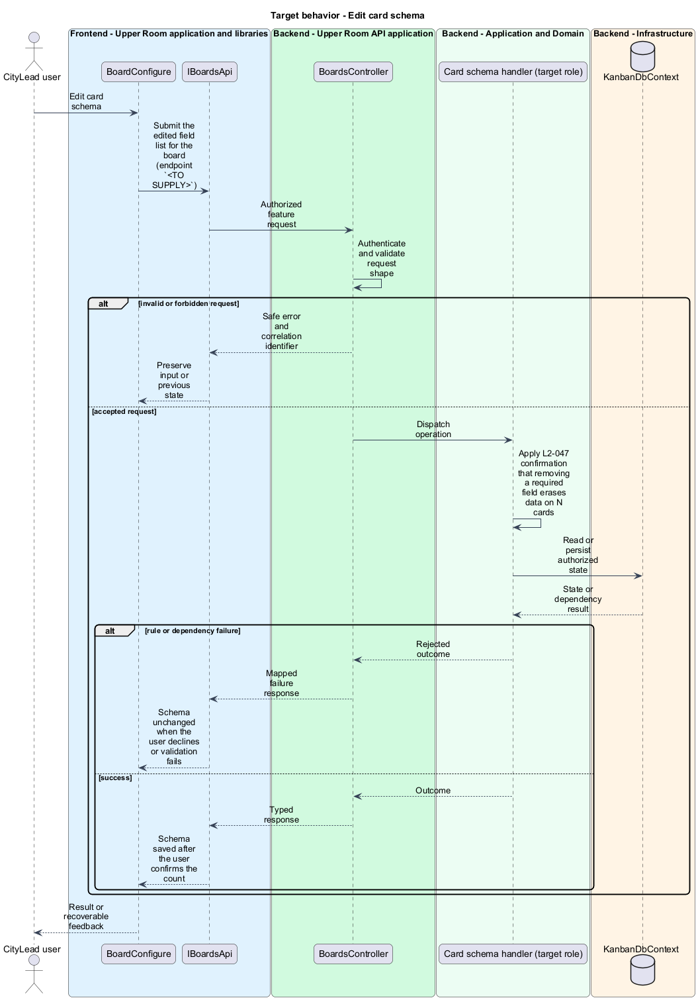

# Configure kanban

## Overview

A kanban board arranges work items as cards in ordered columns; boards, columns, swimlanes, and card fields are stored data that CityLead users configure at runtime.

**card schema** — ordered list of typed fields (`text`, `textarea`, `number`, `date`, `select`, `tags`, `assignee`, `url`, `partnerRef`) that defines the data each card holds.

**swimlane** — optional horizontal grouping of cards on a board, such as by assignee or priority.

**WIP limit** — maximum number of cards a column accepts.

The feature covers the board, column, swimlane, and card data model (L2-043) and the configuration screen (L2-047).

## Description

### Existing implementation

The following source elements provide the current implementation points. Their presence does not establish complete requirement coverage.

| Source | Concrete elements | Observed surface |
|---|---|---|
| [backend/src/TheUpperRoom.Domain/Kanban/KanbanBoard.cs](../../../../backend/src/TheUpperRoom.Domain/Kanban/KanbanBoard.cs) | `KanbanBoard` | `Name` up to 100, `Description` up to 500, `WipLimitPerColumn`, `CardSchema`, `Columns`, `Swimlanes`, `Cards`; `UpdateBasics` |
| [backend/src/TheUpperRoom.Domain/Kanban/KanbanColumn.cs](../../../../backend/src/TheUpperRoom.Domain/Kanban/KanbanColumn.cs) | `KanbanColumn` | `Name`, `Order`, `Color` (`TagColor`), `WipLimit` 1 to 10000; `Update`, `SetOrder` |
| [backend/src/TheUpperRoom.Domain/Kanban/KanbanCard.cs](../../../../backend/src/TheUpperRoom.Domain/Kanban/KanbanCard.cs) | `KanbanCard` | `BoardId`, `ColumnId`, `SwimlaneKey`, `Position` (decimal), `Data`, `AssigneeUserId`, `TagIds`, `Archived` |
| [backend/src/TheUpperRoom.Domain/Kanban/CardSchemaField.cs](../../../../backend/src/TheUpperRoom.Domain/Kanban/CardSchemaField.cs) | `CardSchemaField`, `KanbanFieldType`, `KanbanSwimlane` | Field `Key`, `Type`, `Label`, `Required`, `Options` |
| [backend/src/TheUpperRoom.Api/Kanban/BoardsController.cs](../../../../backend/src/TheUpperRoom.Api/Kanban/BoardsController.cs) | `BoardsController` | Route `api/v1/boards`; `Patch`, `ReorderColumns` (`POST {id}/columns/order`), `PatchColumn`, `DeleteColumn` |
| [backend/src/TheUpperRoom.Api/Kanban/PatchBoardRequest.cs](../../../../backend/src/TheUpperRoom.Api/Kanban/PatchBoardRequest.cs) | `PatchBoardRequest`, `PatchColumnRequest`, `ColumnOrderRequest`, `DeleteColumnRequest` | Request shapes for configuration changes |
| [backend/src/TheUpperRoom.Application/Kanban/IKanbanDbContext.cs](../../../../backend/src/TheUpperRoom.Application/Kanban/IKanbanDbContext.cs) | `IKanbanDbContext`, `BoardRow`, `BoardColumnRow`, `CardRow` | Persistence interface and rows |
| [backend/src/TheUpperRoom.Infrastructure/Kanban/KanbanDbContext.cs](../../../../backend/src/TheUpperRoom.Infrastructure/Kanban/KanbanDbContext.cs) | `KanbanDbContext` | EF Core implementation |
| [frontend/projects/the-upper-room/src/app/kanban/board-configure/board-configure.ts](../../../../frontend/projects/the-upper-room/src/app/kanban/board-configure/board-configure.ts) | `BoardConfigure` | Injects `HttpClient`, `ActivatedRoute`, `MatDialog`; patches swimlane mode and posts column order |
| [frontend/projects/the-upper-room/src/app/kanban/board-configure/move-cards-dialog.ts](../../../../frontend/projects/the-upper-room/src/app/kanban/board-configure/move-cards-dialog.ts) | `MoveCardsDialog`, `MoveCardsDialogData` | Chooses the destination column for cards of a removed column |

### Target behavior and interfaces

`BoardConfigure` shall call a typed boards API contract (`IBoardsApi` with an injection token, name `<TO SUPPLY>`). The API shall restrict `/boards/:id/configure` to CityLead and above, validate WIP limits against the `KanbanColumn` rules, move or reject cards when a column is removed, and report the number of cards affected when a required schema field is removed.

- **Edit board and columns:** `PATCH /api/v1/boards/{id}`, `PATCH /api/v1/boards/{id}/columns/{columnId}`, and `POST /api/v1/boards/{id}/columns/order`.
- **Remove column with cards:** `DELETE /api/v1/boards/{id}/columns/{columnId}` with the destination column in `DeleteColumnRequest`.
- **Edit card schema:** `PATCH /api/v1/boards/{id}` carrying the field list; removal of a required field erases card data after confirmation (`<TO SUPPLY>` for the endpoint shape).

Diagrams show target collaborations. Existing source types retain their names. Participants marked as proposed or target roles describe interfaces to introduce, not existing classes.

### Gaps and compatibility

`BoardsController` applies configuration changes in the controller; moving them behind application handlers is a target change. `BoardConfigure` patches `swimlaneMode`, which does not map to the `KanbanSwimlane` entity (`<TO SUPPLY>`). The card schema editing endpoint, the CityLead authorization attribute on configuration, and the `wipLimitPerColumn` interaction with the per-column `wipLimit` are `<TO SUPPLY>`.

Production implementation shall follow [AGENTS.md](../../../../AGENTS.md), including incremental acceptance testing. API integrations shall preserve documented behavior until an explicit compatibility change is approved.

## Requirements

The table preserves each requirement statement and all parent identifiers. The expandable source excerpts retain the acceptance criteria verbatim.

| L2 ID | Refines (L1) | Requirement |
|---|---|---|
| [L2-043](../../../specs/L2.md#l2-043-kanban-configuration) | `L1-008` | A `KanbanBoard` has: `id`, `cityId`, `name` (1-100), `description` (max 500), `cardSchema` (JSON Schema-ish: list of fields with type [`text`,`textarea`,`number`,`date`,`select`,`tags`,`assignee`,`url`,`partnerRef`], label, required, options), `swimlanes` (0..n, optional, e.g. by Assignee or Priority), `wipLimitPerColumn` (optional). A `KanbanColumn` has `boardId`, `name`, `order`, `wipLimit` (optional), `color` (M3 chip color). A `KanbanCard` has `boardId`, `columnId`, `swimlaneKey`, `position` (decimal for re-ordering), `data` (JSON conforming to `cardSchema`), `assigneeUserId`, `tags`, `archived`, audit fields. |
| [L2-047](../../../specs/L2.md#l2-047-kanban-board-configuration) | `L1-008` | Route `/boards/:id/configure` (CityLead+) lets the user edit name/description, reorder columns (drag handle), edit column names/colors/WIP limits, add/remove columns, define swimlanes, and edit the card schema (add/remove/reorder/edit fields). Removing a column with cards prompts "Move {N} cards to..." with a column selector. |

L2-043: Kanban Configuration — specification excerpt

A `KanbanBoard` has: `id`, `cityId`, `name` (1-100), `description` (max 500), `cardSchema` (JSON Schema-ish: list of fields with type [`text`,`textarea`,`number`,`date`,`select`,`tags`,`assignee`,`url`,`partnerRef`], label, required, options), `swimlanes` (0..n, optional, e.g. by Assignee or Priority), `wipLimitPerColumn` (optional). A `KanbanColumn` has `boardId`, `name`, `order`, `wipLimit` (optional), `color` (M3 chip color). A `KanbanCard` has `boardId`, `columnId`, `swimlaneKey`, `position` (decimal for re-ordering), `data` (JSON conforming to `cardSchema`), `assigneeUserId`, `tags`, `archived`, audit fields.

**Acceptance Criteria:**
1. Given a column has `wipLimit=3` and 3 cards, when a 4th is dragged in, then the drop is rejected and a snackbar "WIP limit reached for {column name}" appears.

L2-047: Kanban Board Configuration — specification excerpt

Route `/boards/:id/configure` (CityLead+) lets the user edit name/description, reorder columns (drag handle), edit column names/colors/WIP limits, add/remove columns, define swimlanes, and edit the card schema (add/remove/reorder/edit fields). Removing a column with cards prompts "Move {N} cards to..." with a column selector.

**Acceptance Criteria:**
1. Given the user removes a required schema field, when applied, then a confirmation dialog "Removing this field will erase data on {N} cards. Continue?" appears with the count.

## Diagrams

### System context

The context identifies the people and application boundary used by this capability.

### Container view

The container view separates browser execution from backend state responsibility.

### Target component view

The component view shows target collaborations between the concrete implementation points and proposed responsibilities.

### Type structure

The structure view lists source types with declared members where available. Types marked proposed describe interfaces to introduce.

### Edit board and columns

The flow performs the following operation: PATCH /api/v1/boards/{id}, PATCH .../columns/{columnId}, and POST .../columns/order. Its successful outcome is: Updated board, column names, colors, WIP limits, and order. The alternate branch yields: Field errors; configuration screen retains edits.

### Remove column with cards

The flow performs the following operation: DELETE /api/v1/boards/{id}/columns/{columnId} naming the destination column. Its successful outcome is: Cards moved and column removed. The alternate branch yields: Column and cards retained.

### Edit card schema

The flow performs the following operation: Submit the edited field list for the board (endpoint `<TO SUPPLY>`). Its successful outcome is: Schema saved after the user confirms the count. The alternate branch yields: Schema unchanged when the user declines or validation fails.

