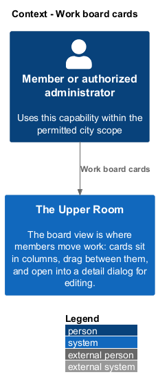
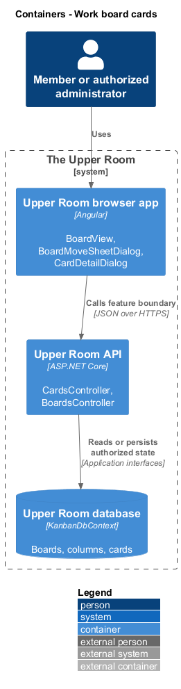
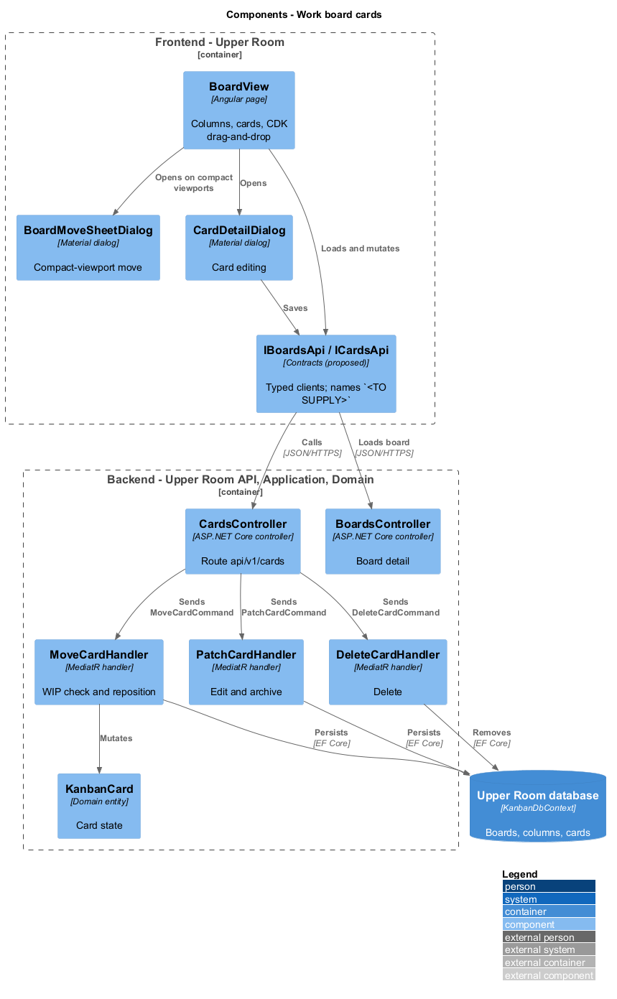
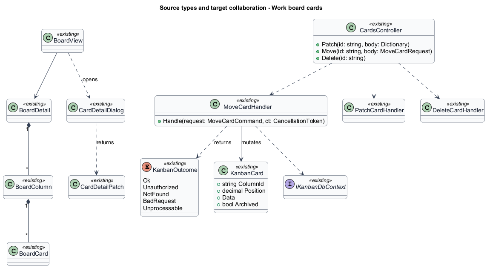
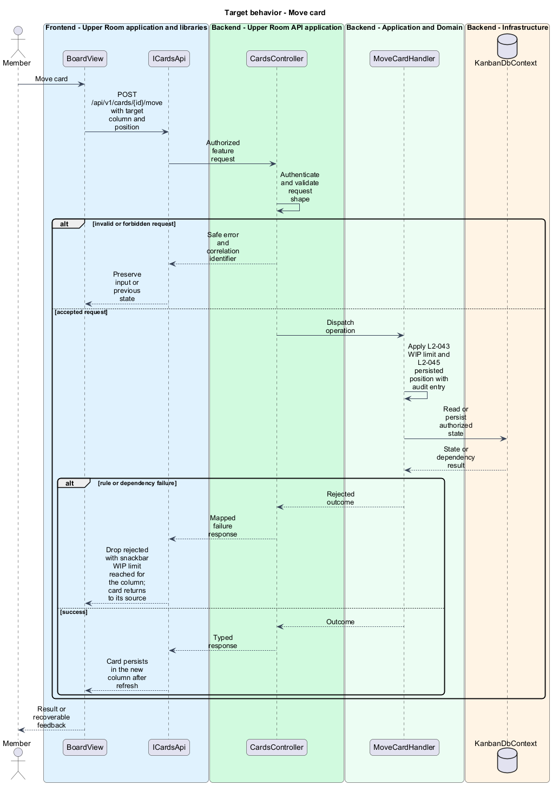
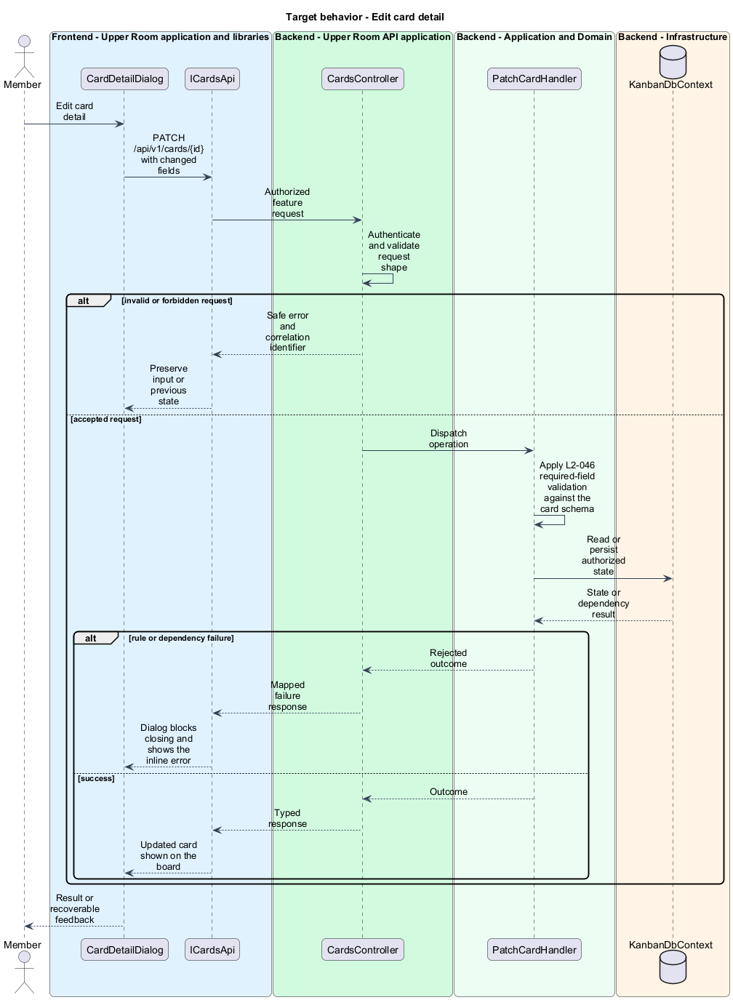
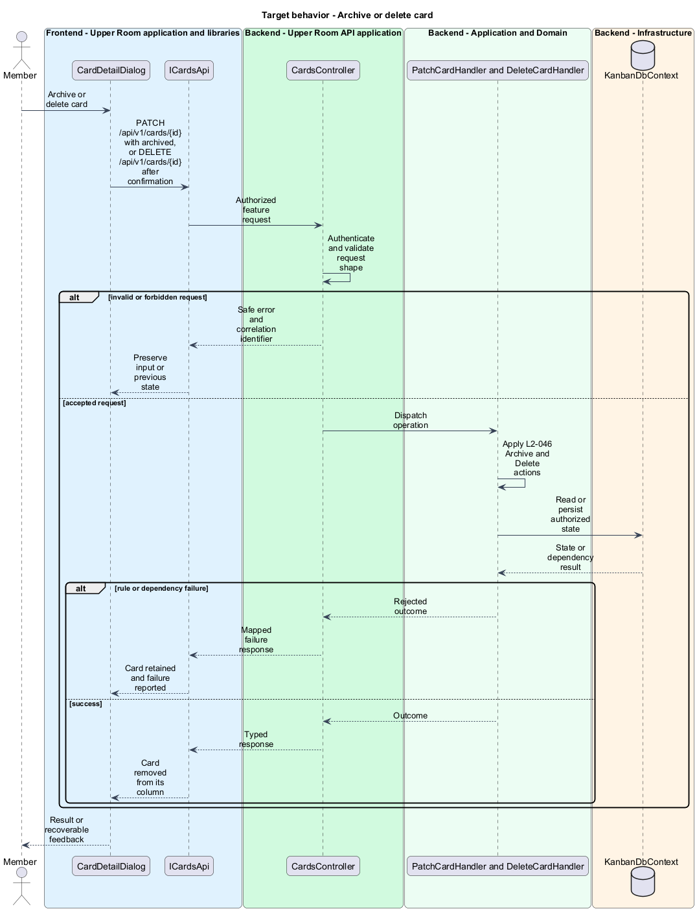

# Work board cards

## Overview

The board view is where members move work: cards sit in columns, drag between them, and open into a detail dialog for editing.

**WIP-locked column** — column whose card count equals its WIP limit and therefore rejects further drops.

**card detail dialog** — modal showing the editable title, schema-driven fields, tags, assignee, due date, attachments, comments, and activity log.

The feature covers the board view with drag-and-drop (L2-045) and the card detail dialog (L2-046).

## Description

### Existing implementation

The following source elements provide the current implementation points. Their presence does not establish complete requirement coverage.

| Source | Concrete elements | Observed surface |
|---|---|---|
| [frontend/projects/the-upper-room/src/app/kanban/board-view/board-view.ts](../../../../frontend/projects/the-upper-room/src/app/kanban/board-view/board-view.ts) | `BoardCardTag`, `BoardCard`, `BoardColumn`, `BoardDetail`, `BoardView` | Injects `HttpClient`, `ActivatedRoute`, `SnackbarService`, `MatDialog`; calls `POST /api/v1/cards/{id}/move`, `PATCH /api/v1/cards/{id}`, `DELETE /api/v1/cards/{id}` |
| [frontend/projects/the-upper-room/src/app/kanban/board-view/board-move-sheet-dialog.ts](../../../../frontend/projects/the-upper-room/src/app/kanban/board-view/board-move-sheet-dialog.ts) | `BoardMoveSheetDialog`, `BoardMoveSheetDialogData` | Move-to-column sheet for compact viewports |
| [frontend/projects/the-upper-room/src/app/kanban/card-detail-dialog/card-detail-dialog.ts](../../../../frontend/projects/the-upper-room/src/app/kanban/card-detail-dialog/card-detail-dialog.ts) | `CardDetailDialog`, `CardSchemaField`, `CardDetailPatch`, `CardDetailDialogData`, `CardDetailDialogResult` | Injects `ConfirmService` |
| [backend/src/TheUpperRoom.Api/Kanban/CardsController.cs](../../../../backend/src/TheUpperRoom.Api/Kanban/CardsController.cs) | `CardsController` | Route `api/v1/cards`; `Patch`, `Move`, `Delete` through `IMediator` |
| [backend/src/TheUpperRoom.Api/Kanban/BoardsController.cs](../../../../backend/src/TheUpperRoom.Api/Kanban/BoardsController.cs) | `BoardsController` | `GetById` returns `BoardDetailDto`; `CreateCard` on `{id}/cards` |
| [backend/src/TheUpperRoom.Application/Kanban/MoveCardHandler.cs](../../../../backend/src/TheUpperRoom.Application/Kanban/MoveCardHandler.cs) | `MoveCardHandler`, `MoveCardCommand`, `MoveCardCommandValidator`, `MoveCardResult` | Applies the move |
| [backend/src/TheUpperRoom.Application/Kanban/PatchCardHandler.cs](../../../../backend/src/TheUpperRoom.Application/Kanban/PatchCardHandler.cs) | `PatchCardHandler`, `PatchCardCommand`, `PatchCardCommandValidator`, `PatchCardResult` | Applies edits and archive |
| [backend/src/TheUpperRoom.Application/Kanban/DeleteCardHandler.cs](../../../../backend/src/TheUpperRoom.Application/Kanban/DeleteCardHandler.cs) | `DeleteCardHandler`, `DeleteCardCommand`, `DeleteCardResult`, `KanbanOutcome` | Deletes a card; outcomes `Ok`, `Unauthorized`, `NotFound`, `BadRequest`, `Unprocessable` |
| [backend/src/TheUpperRoom.Application/Kanban/IKanbanDbContext.cs](../../../../backend/src/TheUpperRoom.Application/Kanban/IKanbanDbContext.cs) | `IKanbanDbContext` | Persistence interface |
| [backend/src/TheUpperRoom.Domain/Kanban/KanbanCard.cs](../../../../backend/src/TheUpperRoom.Domain/Kanban/KanbanCard.cs) | `KanbanCard` | Card entity with `Position`, `ColumnId`, `Data` |

### Target behavior and interfaces

`BoardView` and `CardDetailDialog` shall call `IBoardsApi` and `ICardsApi` (names `<TO SUPPLY>`) instead of `HttpClient`. `MoveCardHandler` shall reject a move into a column at its WIP limit and shall record an audit entry for each successful move. `CardDetailDialog` shall block closing while a required field is empty.

- **Move card:** `POST /api/v1/cards/{id}/move` with the target column and position.
- **Edit card:** `PATCH /api/v1/cards/{id}` for title, schema fields, tags, assignee, and due date.
- **Archive or delete card:** `PATCH /api/v1/cards/{id}` with `archived`, and `DELETE /api/v1/cards/{id}`.

Diagrams show target collaborations. Existing source types retain their names. Participants marked as proposed or target roles describe interfaces to introduce, not existing classes.

### Gaps and compatibility

Attachments (up to 10 files of 10 MB), card comments, and the activity log have no source in `backend/src` or `frontend/projects` (`<TO SUPPLY>`). The audit entry for a move is not verified in `MoveCardHandler`. Which `KanbanOutcome` maps to a WIP rejection is `<TO SUPPLY>`.

Production implementation shall follow [AGENTS.md](../../../../AGENTS.md), including incremental acceptance testing. API integrations shall preserve documented behavior until an explicit compatibility change is approved.

## Requirements

The table preserves each requirement statement and all parent identifiers. The expandable source excerpts retain the acceptance criteria verbatim.

| L2 ID | Refines (L1) | Requirement |
|---|---|---|
| [L2-045](../../../specs/L2.md#l2-045-kanban-board-view) | `L1-008` | Route `/boards/:id` renders the board header (name, description, "Configure", "Add card" buttons, filter chips), then a horizontally scrolling row of columns (each column min-width `320px`, max-width `360px`, padded `$space-3`). Each column has a header (color dot, name, count, WIP limit, `more_vert`), then a vertical stack of `mat-card` cards (padding `$space-3`, gap `$space-2`). Cards show the title field, up to 2 tag chips, assignee avatar, due date, drag handle on hover (icon `drag_indicator`). Drag-and-drop uses `@angular/cdk/drag-drop`. Visual rules: dragged card has elevation `level3`, opacity `0.95`, scale `1.02`; valid drop zones highlight with a `--md-sys-color-secondary-container` background; invalid drop zones (WIP-locked) highlight with `--md-sys-color-error-container`. |
| [L2-046](../../../specs/L2.md#l2-046-card-detail-dialog) | `L1-008` | Clicking a card opens a `mat-dialog` (width `min(720px, 100vw - $space-8)`) with: title (editable inline), schema-driven fields, tags, assignee, due date, attachments (up to 10 files, 10MB each), comments (notes scoped to card), activity log. Right-aligned actions: "Archive", "Delete", `more_vert`. |

L2-045: Kanban Board View — specification excerpt

Route `/boards/:id` renders the board header (name, description, "Configure", "Add card" buttons, filter chips), then a horizontally scrolling row of columns (each column min-width `320px`, max-width `360px`, padded `$space-3`). Each column has a header (color dot, name, count, WIP limit, `more_vert`), then a vertical stack of `mat-card` cards (padding `$space-3`, gap `$space-2`). Cards show the title field, up to 2 tag chips, assignee avatar, due date, drag handle on hover (icon `drag_indicator`).

Drag-and-drop uses `@angular/cdk/drag-drop`. Visual rules: dragged card has elevation `level3`, opacity `0.95`, scale `1.02`; valid drop zones highlight with a `--md-sys-color-secondary-container` background; invalid drop zones (WIP-locked) highlight with `--md-sys-color-error-container`.

**Acceptance Criteria:**
1. Given the user drags a card from "To Do" to "In Progress", when dropped, then the card persists in "In Progress" after a page refresh and an audit entry is recorded.
2. Given the viewport is XS, when the board is open, then columns are full-width swipeable (snap pagination), one column visible at a time, with dot indicators below the row.

L2-046: Card Detail Dialog — specification excerpt

Clicking a card opens a `mat-dialog` (width `min(720px, 100vw - $space-8)`) with: title (editable inline), schema-driven fields, tags, assignee, due date, attachments (up to 10 files, 10MB each), comments (notes scoped to card), activity log. Right-aligned actions: "Archive", "Delete", `more_vert`.

**Acceptance Criteria:**
1. Given a required field is cleared, when the user clicks outside, then the dialog blocks closing and shows the inline error.

## Diagrams

### System context

The context identifies the people and application boundary used by this capability.

### Container view

The container view separates browser execution from backend state responsibility.

### Target component view

The component view shows target collaborations between the concrete implementation points and proposed responsibilities.

### Type structure

The structure view lists source types with declared members where available. Types marked proposed describe interfaces to introduce.

### Move card

The flow performs the following operation: POST /api/v1/cards/{id}/move with target column and position. Its successful outcome is: Card persists in the new column after refresh. The alternate branch yields: Drop rejected with snackbar WIP limit reached for the column; card returns to its source.

### Edit card detail

The flow performs the following operation: PATCH /api/v1/cards/{id} with changed fields. Its successful outcome is: Updated card shown on the board. The alternate branch yields: Dialog blocks closing and shows the inline error.

### Archive or delete card

The flow performs the following operation: PATCH /api/v1/cards/{id} with archived, or DELETE /api/v1/cards/{id} after confirmation. Its successful outcome is: Card removed from its column. The alternate branch yields: Card retained and failure reported.

