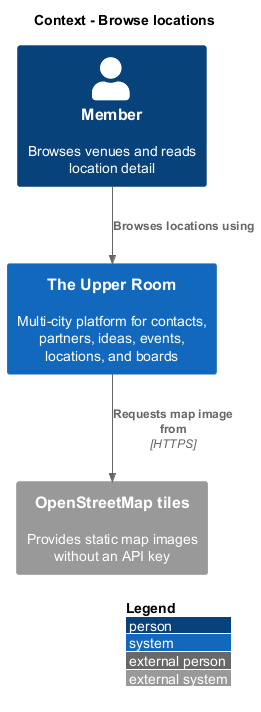
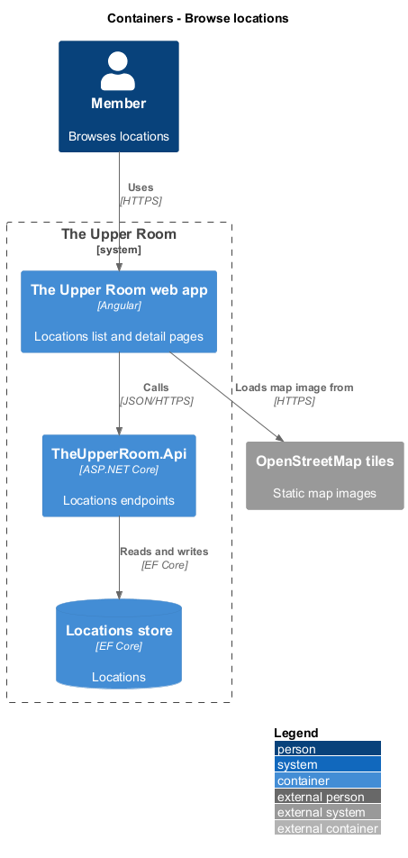
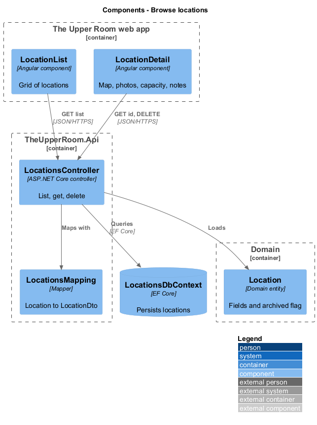
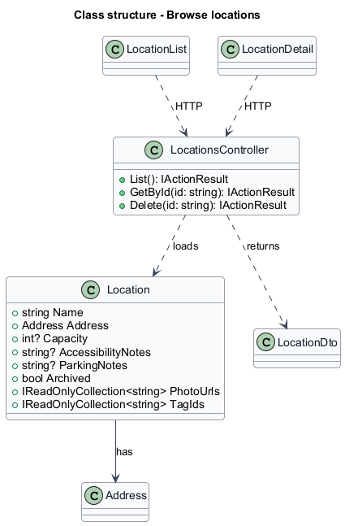
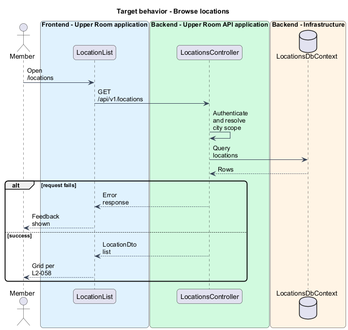
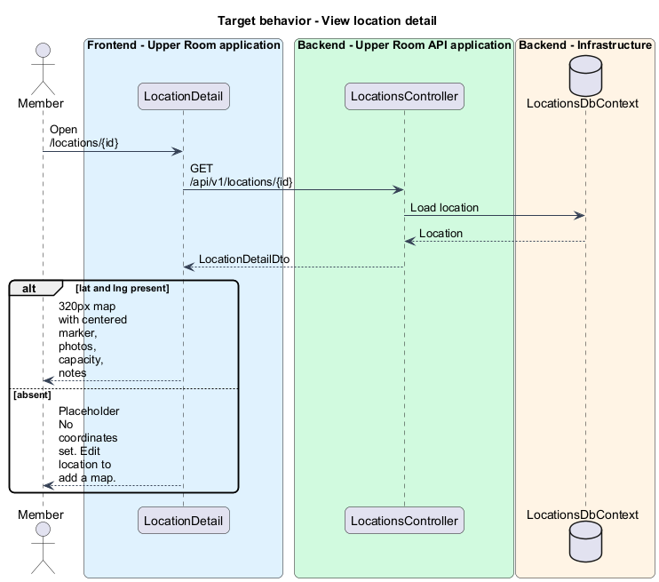
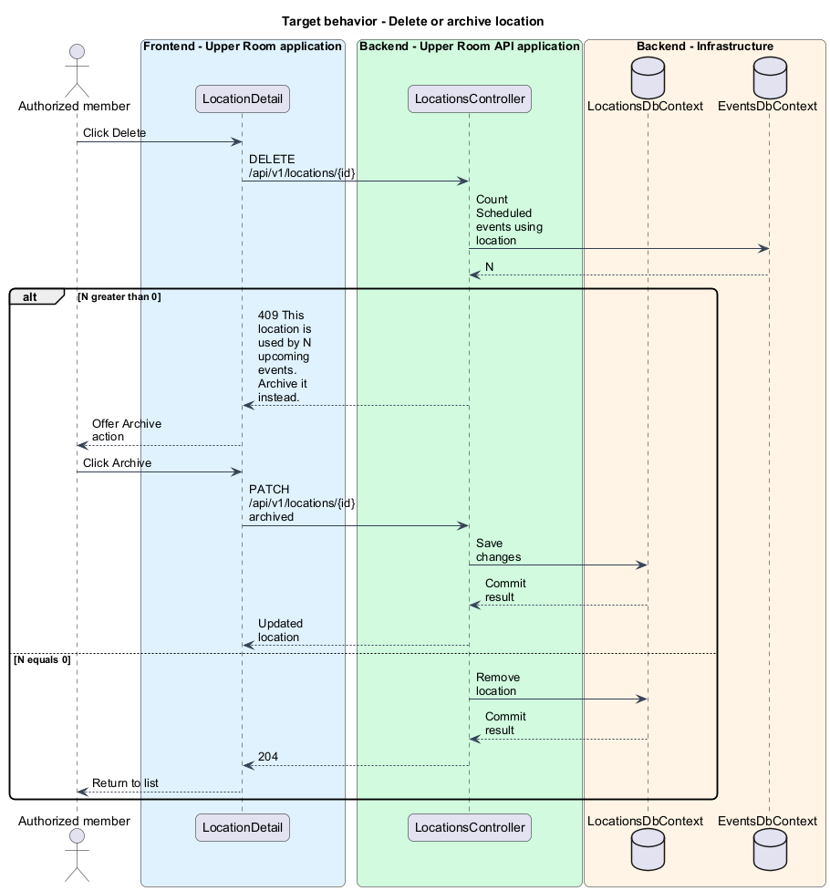

# Browse locations

## Overview

The Upper Room is a multi-city platform in which each city has its own workspace of contacts, partners, ideas, events, locations, and boards.

A location is a venue where events take place, with an address, capacity, accessibility and parking notes, and photos. Members browse locations in a grid and open a detail page to see where a venue is and which events use it.

**archived location** — location hidden from new selections but kept because past or upcoming events reference it

The feature covers the location data model and the list and detail pages.

## Description

### Existing implementation

The following source elements provide the current implementation points. Their presence does not establish complete requirement coverage.

| Source | Concrete elements | Observed surface |
|---|---|---|
| [backend/src/TheUpperRoom.Domain/Locations/Location.cs](../../../../backend/src/TheUpperRoom.Domain/Locations/Location.cs) | `Location`, `Address` | Name 1-200, `Capacity`, `AccessibilityNotes`, `ParkingNotes`, `Archived`, `PhotoUrls`, `TagIds` |
| [backend/src/TheUpperRoom.Api/Locations/LocationsController.cs](../../../../backend/src/TheUpperRoom.Api/Locations/LocationsController.cs) | `LocationsController` | Route `api/v1/locations`; `HttpGet`; `HttpGet {id}`; `HttpPost`; `HttpPost {id}/photos`; `HttpPatch {id}`; `HttpDelete {id}` |
| [backend/src/TheUpperRoom.Api/Locations/LocationDto.cs](../../../../backend/src/TheUpperRoom.Api/Locations/LocationDto.cs) | `LocationDto`, `LocationsMapping`, `UpsertLocationRequest`, `PatchLocationRequest` | Contracts and mapping |
| [backend/src/TheUpperRoom.Infrastructure/Locations/LocationsDbContext.cs](../../../../backend/src/TheUpperRoom.Infrastructure/Locations/LocationsDbContext.cs) | `LocationsDbContext`, `LocationRow` | Persistence |
| [frontend/projects/the-upper-room/src/app/locations/location-list/location-list.ts](../../../../frontend/projects/the-upper-room/src/app/locations/location-list/location-list.ts) | `LocationList`, `LocationDto` | `HttpClient`, `Router`, `SnackbarService` injected |
| [frontend/projects/the-upper-room/src/app/locations/location-detail/location-detail.ts](../../../../frontend/projects/the-upper-room/src/app/locations/location-detail/location-detail.ts) | `LocationDetail`, `LocationDetailDto` | `HttpClient`, `ActivatedRoute`, `Router`, `SnackbarService` injected |
| [frontend/projects/the-upper-room/src/app/locations/location-form/location-form.ts](../../../../frontend/projects/the-upper-room/src/app/locations/location-form/location-form.ts) | `LocationForm` | Create and edit form |

### Target behavior and interfaces

`Location` shall hold the fields of the data model. `LocationsController.Delete` shall return 409 with "This location is used by {N} upcoming events. Archive it instead." when a Scheduled event references the location, and the page shall offer an "Archive" action.

`LocationList` shall follow the grid pattern of L2-030 (see [Browse contacts](../../contacts/browse-contacts/README.md)). `LocationDetail` shall render an embedded static map as an `` using an OpenStreetMap static tile without an API key, a photo carousel, capacity, accessibility notes, and a "Used in {N} events" link. When the location has latitude and longitude, a 320 px tall map area with a centered marker renders. Otherwise a placeholder card with icon `map` and the text "No coordinates set. Edit location to add a map." replaces the map. When offline, "Map unavailable" shows.

### Gaps and compatibility

The static map tile provider URL template is `<TO SUPPLY>`. The count of events per location and its source endpoint are `<TO SUPPLY>`. The location data model lists `photos` up to 10 and `tags`; enforcement of the 10 photo limit is `<TO SUPPLY>`.

## Requirements

| L2 ID | Refines (L1) | Requirement |
|---|---|---|
| [L2-057](../../../specs/L2.md#l2-057-location-data-model) | `L1-011` | A Location has: `id`, `cityId`, `name` (1-200), `address` (street1, street2, city, region, postalCode, country, lat?, lng?), `capacity` (optional), `accessibilityNotes` (max 1000), `parkingNotes` (max 500), `photos` (0..10 urls), `tags`, `archived`, audit fields. |
| [L2-058](../../../specs/L2.md#l2-058-locations-list--detail) | `L1-011` | Route `/locations` follows the same grid pattern as L2-030. Detail page shows an embedded static map (no API key required: render an `` with OpenStreetMap static tile or "Map unavailable" placeholder if offline), photo carousel, capacity, accessibility, "Used in {N} events" link. |

**Acceptance criteria**

- L2-057: Given a Location is referenced by a Scheduled event, when the user attempts to delete it, then a 409 is returned with "This location is used by {N} upcoming events. Archive it instead." and the UI offers an "Archive" action.
- L2-058: Given a location has lat/lng, when the detail page loads, then a 320px tall map area renders with a centered marker.
- L2-058: Given lat/lng are absent, when the page loads, then the map area is replaced with a placeholder card showing icon `map` and text "No coordinates set. Edit location to add a map.".

## Diagrams

### System context

### Container view

### Component view

### Type structure

### Browse locations

### View location detail

The flow loads the location and chooses between the map and the placeholder.

### Delete or archive location

The flow rejects deletion of a location in use.

