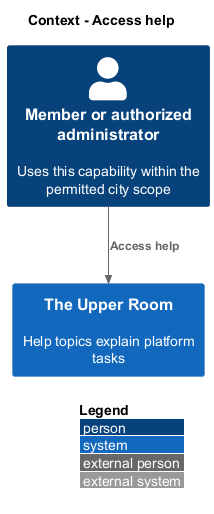
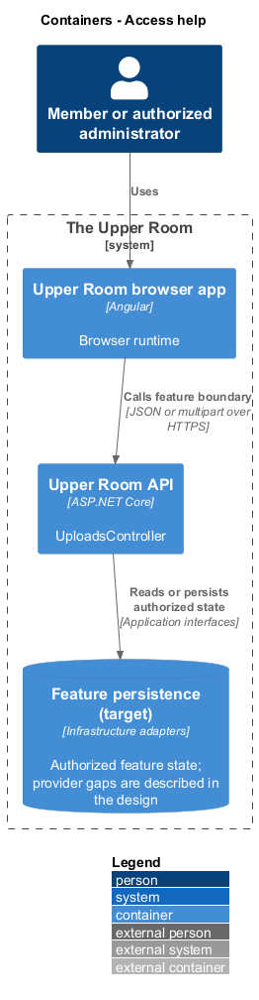
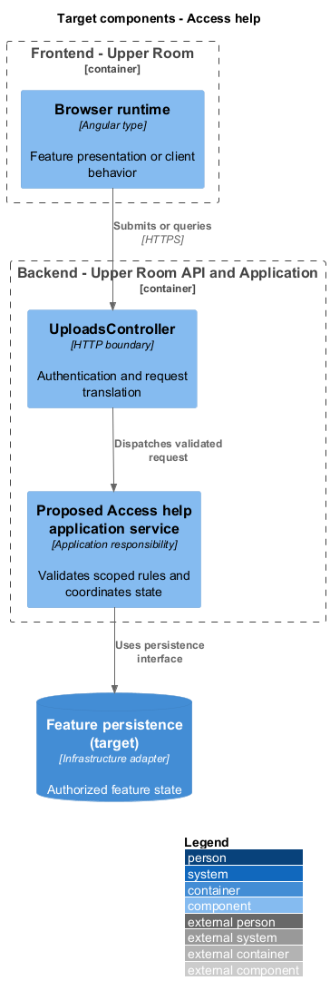
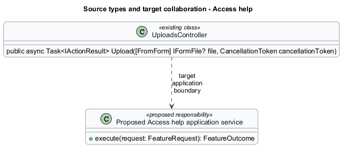
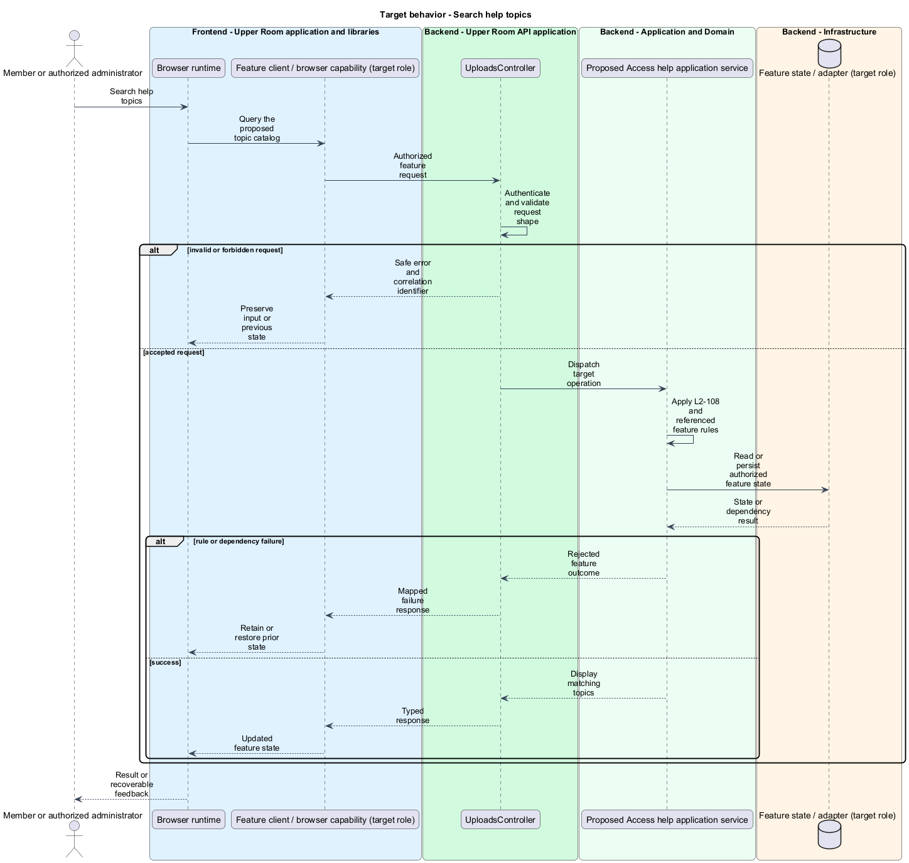
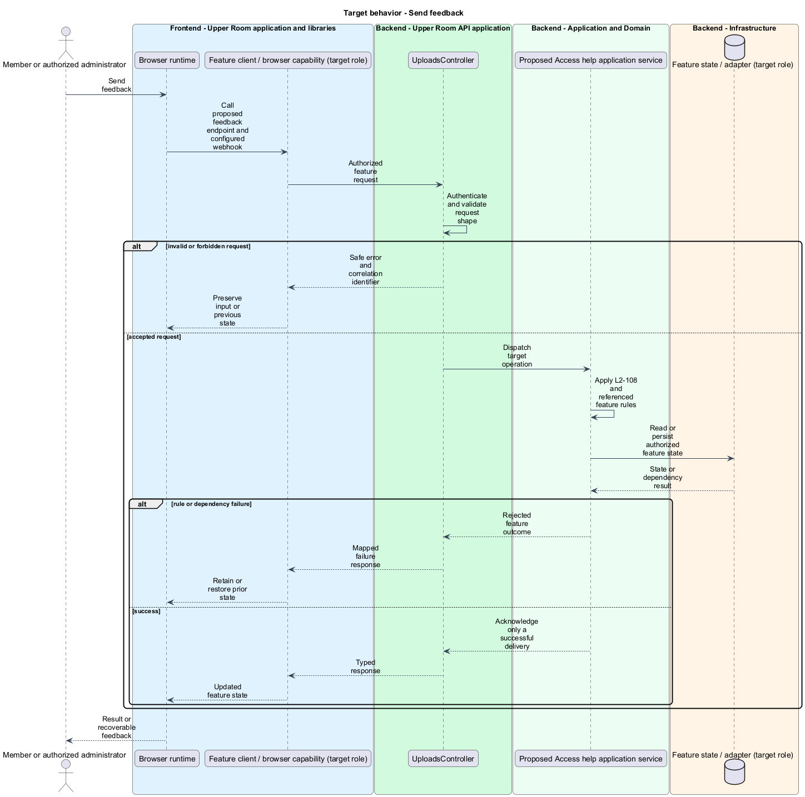

# Access help

## Overview

The Upper Room manages contacts, partners, ideas, events, locations, and boards in city-scoped workspaces.

Help topics explain platform tasks. Feedback is a user-submitted ticket containing a subject, category, body, and optional screenshot.

## Description

### Existing implementation

The following source elements provide the current implementation points. Their presence does not establish complete requirement coverage.

| Source | Concrete elements | Observed surface |
|---|---|---|
| [frontend/projects/the-upper-room/src/app/app.routes.ts](../../../../frontend/projects/the-upper-room/src/app/app.routes.ts) | `routes` | Declarations and configuration in the linked source |
| [backend/src/TheUpperRoom.Api/Uploads/UploadsController.cs](../../../../backend/src/TheUpperRoom.Api/Uploads/UploadsController.cs) | `UploadsController` | Route api/v1/uploads; HttpPost |

### Target behavior and interfaces

Proposed HelpPage shall search a topic catalog and open the feedback form in a dedicated screen or CDK Dialog. Proposed FeedbackApi shall call a protected feedback endpoint. The backend shall validate the request, use the shared upload pipeline, and invoke a configured webhook through a typed HTTP client. Acknowledgment shall follow webhook success.

- **Search help topics:** Query the proposed topic catalog. Display matching topics.
- **Send feedback:** Call proposed feedback endpoint and configured webhook. Acknowledge only a successful delivery.

Diagrams show target collaborations. Existing source types retain their names. Participants marked as target roles or proposed responsibilities describe interfaces to introduce, not existing classes.

### Gaps and compatibility

No /help route is defined in app.routes.ts. HelpPage, FeedbackApi, and the feedback endpoint are proposed. Topic source, webhook provider, endpoint contract, and delivery retry policy are <TO SUPPLY>.

Production implementation shall follow [AGENTS.md](../../../../AGENTS.md), including incremental acceptance testing. API integrations shall preserve documented behavior until an explicit compatibility change is approved.

## Requirements

The table preserves the opening requirement statement and all parent identifiers. The expandable source excerpts retain the complete normative text and acceptance criteria verbatim. Source wording is quoted rather than normalized to the design prose.

| L2 ID | Refines (L1) | Requirement |
|---|---|---|
| [L2-108](../../../specs/L2.md#l2-108-help-feedback) | `L1-026` | Route `/help` shows a search box across help topics (markdown content shipped with the app or fetched), categories of topics, and a "Send feedback" form (subject, type [Bug, Idea, Question], body, optional screenshot upload). Submitting opens a generic ticket via the configured webhook. |

L2-108: Help &amp; Feedback — specification excerpt

Route `/help` shows a search box across help topics (markdown content shipped with the app or fetched), categories of topics, and a "Send feedback" form (subject, type [Bug, Idea, Question], body, optional screenshot upload). Submitting opens a generic ticket via the configured webhook.

**Acceptance Criteria:**
1. Given feedback is submitted, when the webhook 2xxs, then a snackbar "Thanks! Your feedback has been sent." appears.

## Diagrams

### System context

The context identifies the people and application boundary used by this capability.

### Container view

The container view separates browser execution from any backend state responsibility. Provider choices remain subject to the stated gaps.

### Target component view

The component view shows target collaborations between the concrete implementation points and proposed application responsibilities.

### Type structure

The structure view lists source types with declared members where available. Dashed dependencies denote proposed collaboration rather than verified current dependency direction.

### Search help topics

The target flow performs the following operation: Query the proposed topic catalog. Its successful outcome is: Display matching topics. Alternate branches retain prior state or return recoverable failure.

### Send feedback

The target flow performs the following operation: Call proposed feedback endpoint and configured webhook. Its successful outcome is: Acknowledge only a successful delivery. Alternate branches retain prior state or return recoverable failure.

