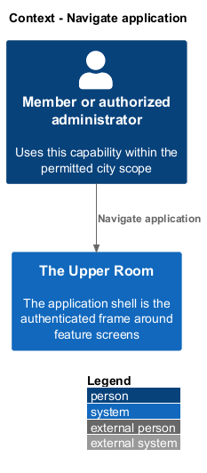
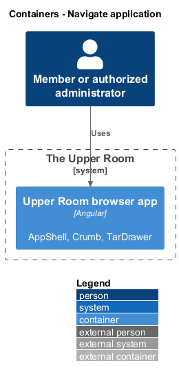
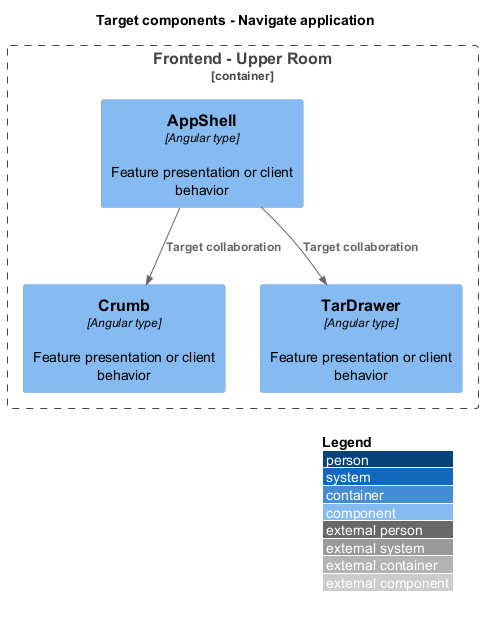
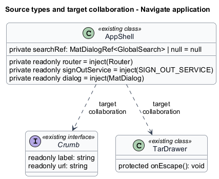
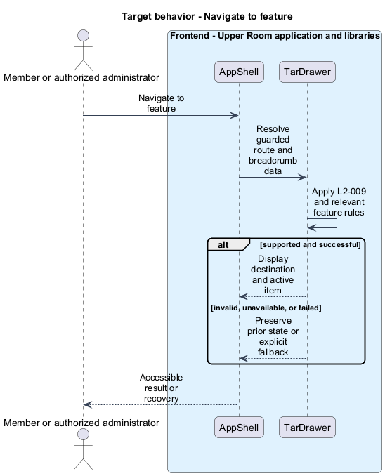
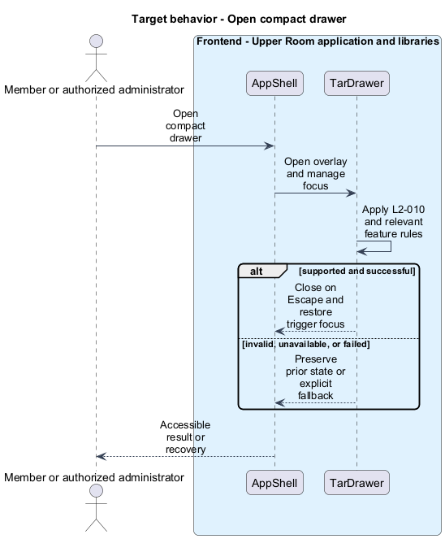

# Navigate application

## Overview

The Upper Room manages contacts, partners, ideas, events, locations, and boards in city-scoped workspaces.

The application shell is the authenticated frame around feature screens. It contains navigation, breadcrumbs, identity controls, and the footer.

## Description

### Existing implementation

The following source elements provide the current implementation points. Their presence does not establish complete requirement coverage.

| Source | Concrete elements | Observed surface |
|---|---|---|
| [frontend/projects/the-upper-room/src/app/shell/app-shell/app-shell.ts](../../../../frontend/projects/the-upper-room/src/app/shell/app-shell/app-shell.ts) | `AppShell` | private readonly router = inject(Router); private readonly signOutService = inject(SIGN_OUT_SERVICE); private readonly dialog = inject(MatDialog) |
| [frontend/projects/the-upper-room/src/app/app.routes.ts](../../../../frontend/projects/the-upper-room/src/app/app.routes.ts) | `routes` | Declarations and configuration in the linked source |
| [frontend/projects/components/src/lib/breadcrumb/breadcrumb.service.ts](../../../../frontend/projects/components/src/lib/breadcrumb/breadcrumb.service.ts) | `Crumb` | readonly label: string; readonly url: string |
| [frontend/projects/components/src/lib/drawer/drawer.ts](../../../../frontend/projects/components/src/lib/drawer/drawer.ts) | `TarDrawer` | protected onEscape(): void |
| [frontend/projects/the-upper-room/src/app/app.config.ts](../../../../frontend/projects/the-upper-room/src/app/app.config.ts) | `appConfig` | Declarations and configuration in the linked source |

### Target behavior and interfaces

AppShell shall compose the responsive drawer and toolbar. Route data shall supply breadcrumb labels and page titles. The active route shall select one navigation item. Navigation shall move focus to the destination heading and honor reduced motion. Public auth routes shall remain outside the authenticated frame.

- **Navigate to feature:** Resolve guarded route and breadcrumb data. Display destination and active item.
- **Open compact drawer:** Open overlay and manage focus. Close on Escape and restore trigger focus.

Diagrams show target collaborations. Existing source types retain their names. Participants marked as target roles or proposed responsibilities describe interfaces to introduce, not existing classes.

### Gaps and compatibility

The shell and route definitions exist. Title, manifest, favicon, transition, and responsive parity shall be verified independently; a defined route does not prove visual or accessibility conformance.

Production implementation shall follow [AGENTS.md](../../../../AGENTS.md), including incremental acceptance testing. API integrations shall preserve documented behavior until an explicit compatibility change is approved.

## Requirements

The table preserves the opening requirement statement and all parent identifiers. The expandable source excerpts retain the complete normative text and acceptance criteria verbatim. Source wording is quoted rather than normalized to the design prose.

| L2 ID | Refines (L1) | Requirement |
|---|---|---|
| [L2-009](../../../specs/L2.md#l2-009-top-app-bar-layout) | `L1-026` | The application shell must render a top app bar (`mat-toolbar`) of fixed height `64px` on MD+ and `56px` on XS/SM, with `elevation level0` at scrollY=0 and `level2` after scroll, padded `0 $space-4` on XS, `0 $space-6` on MD+, displaying left-to-right: drawer toggle button (icon `menu`, hidden on LG+), application logo (32px, links to `/dashboard`), application name "The Upper Room" (`title-large` typography, hidden on XS), spacer (flex 1), global search trigger (icon `search`, opens search dialog on click or `Ctrl+K`/`Cmd+K`), notification bell (icon `notifications`, badge with unread count), city switcher (visible only to SystemAdmin), user avatar menu trigger. |
| [L2-010](../../../specs/L2.md#l2-010-navigation-drawer) | `L1-026` | A `mat-sidenav` of width `280px` must show, in order: a header (`64px` tall, displays the user's display name and city), then sections "Workspace", "People", "Activities", "Admin" (each section title in `label-medium` color `--md-sys-color-on-surface-variant`, padding `$space-4 $space-4 $space-2`). Each item is a `mat-list-item` of height `48px`, leading icon (24px), label (`label-large`), trailing badge (optional). Active item is filled with `--md-sys-color-secondary-container`, text `--md-sys-color-on-secondary-container`, leading icon also `on-secondary-container`. Items: |
| [L2-011](../../../specs/L2.md#l2-011-breadcrumbs) | `L1-026` | A breadcrumb row must render directly under the top app bar on MD+ only, height `40px`, padding `0 $space-6`, separator the icon `chevron_right` at `--md-sys-color-outline`, last segment in `--md-sys-color-on-surface` and not clickable. Routes generate breadcrumbs from a `data: { breadcrumb: 'Contacts' }` route property. |
| [L2-012](../../../specs/L2.md#l2-012-user-avatar-menu) | `L1-026`, `L1-002` | Clicking the avatar opens a `mat-menu` panel `min-width: 240px` with: header (avatar 40px + name `title-medium` + email `body-small`, padding `$space-4`), divider, items "My Profile" (`account_circle`, route `/profile`), "Settings" (`settings`, route `/settings`), "Help & Feedback" (`help`, route `/help`), divider, "Sign out" (`logout`, color `--md-sys-color-error`). |
| [L2-013](../../../specs/L2.md#l2-013-footer-authenticated-pages) | `L1-026` | A footer of height `48px` must render below the content on every authenticated page, padded `0 $space-4` on XS, `0 $space-6` on MD+, displaying: copyright "© {year} The Upper Room" (`body-small`, color `--md-sys-color-on-surface-variant`), spacer, links "Privacy", "Terms", "Status" (each `body-small`, separator `•` with `$space-2` margin). |
| [L2-014](../../../specs/L2.md#l2-014-route-transitions) | `L1-026`, `L1-015` | Route transitions must use a fade+x-axis-translate of `8px` over `medium2` (300ms) with `emphasized` easing. Forward navigations translate from `+8px` to `0`, back navigations from `-8px` to `0`. |
| [L2-116](../../../specs/L2.md#l2-116-application-title-and-favicon) | `L1-026` | Page title format: `{pageName} · The Upper Room`. The dashboard title is "The Upper Room". Favicon set: `favicon.ico` (32px, multi-res), `favicon-16.png`, `favicon-32.png`, `apple-touch-icon.png` (180px), `android-chrome-192.png`, `android-chrome-512.png`, plus `manifest.webmanifest` declaring name "The Upper Room", short_name "Upper Room", theme_color `#6750A4`, background_color `#FFFBFE`, display `standalone`, start_url `/dashboard`. |

L2-009: Top App Bar Layout — specification excerpt

The application shell must render a top app bar (`mat-toolbar`) of fixed height `64px` on MD+ and `56px` on XS/SM, with `elevation level0` at scrollY=0 and `level2` after scroll, padded `0 $space-4` on XS, `0 $space-6` on MD+, displaying left-to-right: drawer toggle button (icon `menu`, hidden on LG+), application logo (32px, links to `/dashboard`), application name "The Upper Room" (`title-large` typography, hidden on XS), spacer (flex 1), global search trigger (icon `search`, opens search dialog on click or `Ctrl+K`/`Cmd+K`), notification bell (icon `notifications`, badge with unread count), city switcher (visible only to SystemAdmin), user avatar menu trigger.

**Acceptance Criteria:**
1. Given viewport XS, when the user views any authenticated page, then the top app bar is `56px` tall and shows: menu, logo, spacer, search icon, bell, avatar.
2. Given viewport LG, when the user views any authenticated page, then the menu button is hidden and the navigation drawer is permanently visible.
3. Given the user presses `Ctrl+K`, when on any page, then the global search dialog opens within `200ms`.

L2-010: Navigation Drawer — specification excerpt

A `mat-sidenav` of width `280px` must show, in order: a header (`64px` tall, displays the user's display name and city), then sections "Workspace", "People", "Activities", "Admin" (each section title in `label-medium` color `--md-sys-color-on-surface-variant`, padding `$space-4 $space-4 $space-2`). Each item is a `mat-list-item` of height `48px`, leading icon (24px), label (`label-large`), trailing badge (optional). Active item is filled with `--md-sys-color-secondary-container`, text `--md-sys-color-on-secondary-container`, leading icon also `on-secondary-container`. Items:

- Workspace: Dashboard (`dashboard`), Calendar (`calendar_month`)
- People: Contacts (`person`), Partners (`domain`)
- Activities: Kanban Boards (`view_kanban`), Hackathon Ideas (`lightbulb`), Events (`event`), Locations (`location_on`)
- Admin (visible to SystemAdmin only): Users (`group`), Roles (`shield`), Tags (`sell`), Audit Log (`receipt_long`), Settings (`settings`)

A footer at the bottom shows app version (`body-small`, color `on-surface-variant`).

**Acceptance Criteria:**
1. Given role `Member`, when the drawer is opened, then the Admin section is not rendered.
2. Given the active route is `/contacts/123`, when the drawer is open, then the "Contacts" item shows the active state and no other item does.
3. Given viewport XS, when the user taps the menu icon, then the drawer slides in from the left over a `0.32` opacity scrim within `medium2` duration.

L2-011: Breadcrumbs — specification excerpt

A breadcrumb row must render directly under the top app bar on MD+ only, height `40px`, padding `0 $space-6`, separator the icon `chevron_right` at `--md-sys-color-outline`, last segment in `--md-sys-color-on-surface` and not clickable. Routes generate breadcrumbs from a `data: { breadcrumb: 'Contacts' }` route property.

**Acceptance Criteria:**
1. Given the user navigates to `/contacts/123/edit`, when MD+, then breadcrumbs read `Dashboard / Contacts / [Contact Display Name] / Edit`.
2. Given XS or SM, when on any page, then no breadcrumb row is rendered (saving vertical space).

L2-012: User Avatar Menu — specification excerpt

Clicking the avatar opens a `mat-menu` panel `min-width: 240px` with: header (avatar 40px + name `title-medium` + email `body-small`, padding `$space-4`), divider, items "My Profile" (`account_circle`, route `/profile`), "Settings" (`settings`, route `/settings`), "Help & Feedback" (`help`, route `/help`), divider, "Sign out" (`logout`, color `--md-sys-color-error`).

**Acceptance Criteria:**
1. Given the user clicks the avatar, when the menu opens, then it animates in over `medium1` duration with `emphasized-decelerate` easing.
2. Given the user clicks "Sign out", when invoked, then a confirmation dialog appears (see L2-099).

L2-013: Footer (Authenticated Pages) — specification excerpt

A footer of height `48px` must render below the content on every authenticated page, padded `0 $space-4` on XS, `0 $space-6` on MD+, displaying: copyright "© {year} The Upper Room" (`body-small`, color `--md-sys-color-on-surface-variant`), spacer, links "Privacy", "Terms", "Status" (each `body-small`, separator `•` with `$space-2` margin).

**Acceptance Criteria:**
1. Given any authenticated page, when scrolled to the bottom, then the footer is visible with the current year.

L2-014: Route Transitions — specification excerpt

Route transitions must use a fade+x-axis-translate of `8px` over `medium2` (300ms) with `emphasized` easing. Forward navigations translate from `+8px` to `0`, back navigations from `-8px` to `0`.

**Acceptance Criteria:**
1. Given the user clicks a list item, when the detail route loads, then the new content fades in with an 8px right-to-left slide over 300ms.
2. Given `prefers-reduced-motion: reduce`, when navigating, then the transition is instant.

L2-116: Application Title and Favicon — specification excerpt

Page title format: `{pageName} · The Upper Room`. The dashboard title is "The Upper Room". Favicon set: `favicon.ico` (32px, multi-res), `favicon-16.png`, `favicon-32.png`, `apple-touch-icon.png` (180px), `android-chrome-192.png`, `android-chrome-512.png`, plus `manifest.webmanifest` declaring name "The Upper Room", short_name "Upper Room", theme_color `#6750A4`, background_color `#FFFBFE`, display `standalone`, start_url `/dashboard`.

**Acceptance Criteria:**
1. Given the user navigates to `/contacts`, when the page is loaded, then `document.title` is `Contacts · The Upper Room`.

## Diagrams

### System context

The context identifies the people and application boundary used by this capability.

### Container view

The container view separates browser execution from any backend state responsibility. Provider choices remain subject to the stated gaps.

### Target component view

The component view shows target collaborations between the concrete implementation points and proposed application responsibilities.

### Type structure

The structure view lists source types with declared members where available. Dashed dependencies denote proposed collaboration rather than verified current dependency direction.

### Navigate to feature

The target flow performs the following operation: Resolve guarded route and breadcrumb data. Its successful outcome is: Display destination and active item. Alternate branches retain prior state or return recoverable failure.

### Open compact drawer

The target flow performs the following operation: Open overlay and manage focus. Its successful outcome is: Close on Escape and restore trigger focus. Alternate branches retain prior state or return recoverable failure.

