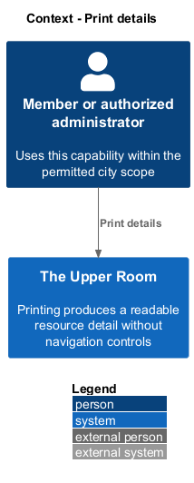
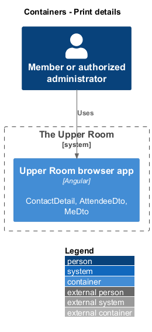
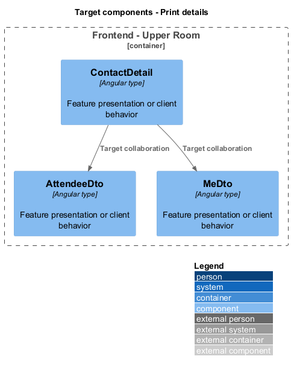
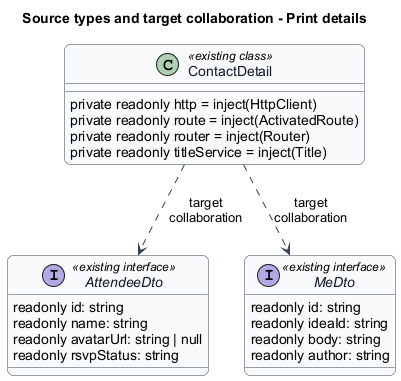
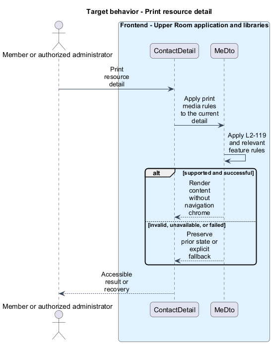

# Print details

## Overview

The Upper Room manages contacts, partners, ideas, events, locations, and boards in city-scoped workspaces.

Printing produces a readable resource detail without navigation controls. This capability supports paper copies of contact, event, and idea information.

## Description

### Existing implementation

The following source elements provide the current implementation points. Their presence does not establish complete requirement coverage.

| Source | Concrete elements | Observed surface |
|---|---|---|
| [frontend/projects/the-upper-room/src/app/contacts/contact-detail/contact-detail.ts](../../../../frontend/projects/the-upper-room/src/app/contacts/contact-detail/contact-detail.ts) | `ContactDetail` | private readonly http = inject(HttpClient); private readonly route = inject(ActivatedRoute); private readonly router = inject(Router) |
| [frontend/projects/the-upper-room/src/app/events/event-detail/event-detail.ts](../../../../frontend/projects/the-upper-room/src/app/events/event-detail/event-detail.ts) | `AttendeeDto`, `EventDetailDto`, `RsvpResponse`, `PendingRsvpDto`, `EventDetail` | readonly id: string; readonly name: string; readonly avatarUrl: string \| null |
| [frontend/projects/the-upper-room/src/app/ideas/idea-detail/idea-detail.ts](../../../../frontend/projects/the-upper-room/src/app/ideas/idea-detail/idea-detail.ts) | `MeDto`, `IdeaComment`, `PartnerSearchResult`, `IdeaDetail` | readonly id: string; readonly ideaId: string; readonly body: string |

### Target behavior and interfaces

A shared print stylesheet shall hide navigation, action controls, overlays, and feedback surfaces. Detail content shall expand to the printable width with black text on white. Print rules shall preserve meaningful headings and resource data without changing interactive screen styles.

- **Print resource detail:** Apply print media rules to the current detail. Render content without navigation chrome.

Diagrams show target collaborations. Existing source types retain their names. Participants marked as target roles or proposed responsibilities describe interfaces to introduce, not existing classes.

### Gaps and compatibility

The detail components exist. Their existence does not establish print conformance; print-preview verification shall cover each required detail screen.

Production implementation shall follow [AGENTS.md](../../../../AGENTS.md), including incremental acceptance testing. API integrations shall preserve documented behavior until an explicit compatibility change is approved.

## Requirements

The table preserves the opening requirement statement and all parent identifiers. The expandable source excerpts retain the complete normative text and acceptance criteria verbatim. Source wording is quoted rather than normalized to the design prose.

| L2 ID | Refines (L1) | Requirement |
|---|---|---|
| [L2-119](../../../specs/L2.md#l2-119-print-stylesheet) | `L1-026` | A `@media print` stylesheet must hide the top app bar, navigation drawer, footer, and all FABs/snackbars/dialogs scrims, and render content full-width with `body-medium` text and black-on-white colors. Detail pages must print cleanly (contact, event, idea). |

L2-119: Print Stylesheet — specification excerpt

A `@media print` stylesheet must hide the top app bar, navigation drawer, footer, and all FABs/snackbars/dialogs scrims, and render content full-width with `body-medium` text and black-on-white colors. Detail pages must print cleanly (contact, event, idea).

**Acceptance Criteria:**
1. Given the user prints a contact detail page, when previewed, then no nav chrome appears and the contact info is presented in plain readable form.

## Diagrams

### System context

The context identifies the people and application boundary used by this capability.

### Container view

The container view separates browser execution from any backend state responsibility. Provider choices remain subject to the stated gaps.

### Target component view

The component view shows target collaborations between the concrete implementation points and proposed application responsibilities.

### Type structure

The structure view lists source types with declared members where available. Dashed dependencies denote proposed collaboration rather than verified current dependency direction.

### Print resource detail

The target flow performs the following operation: Apply print media rules to the current detail. Its successful outcome is: Render content without navigation chrome. Alternate branches retain prior state or return recoverable failure.

