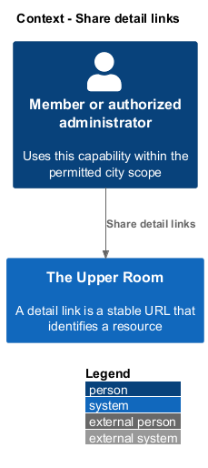
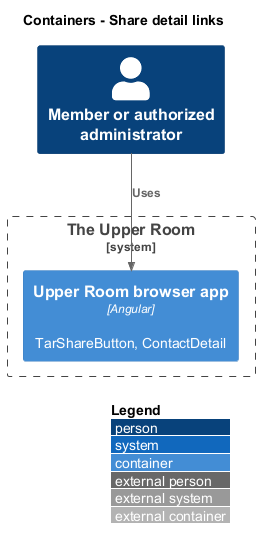
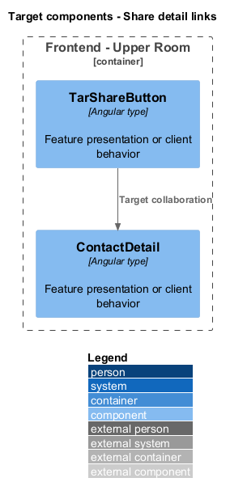
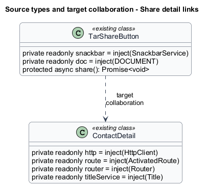
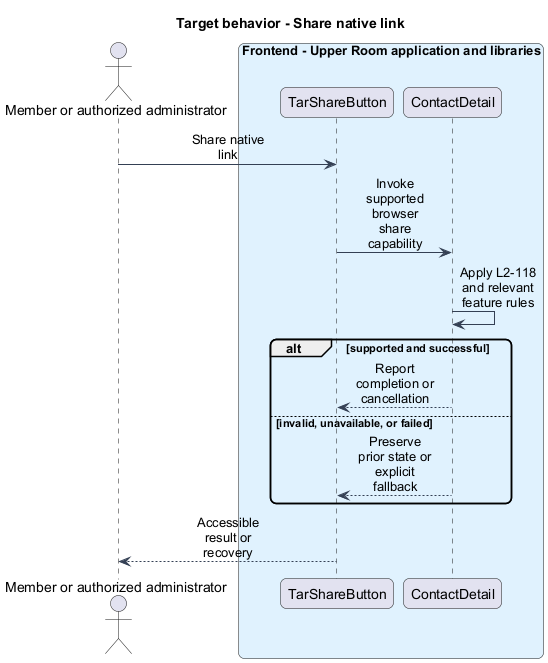
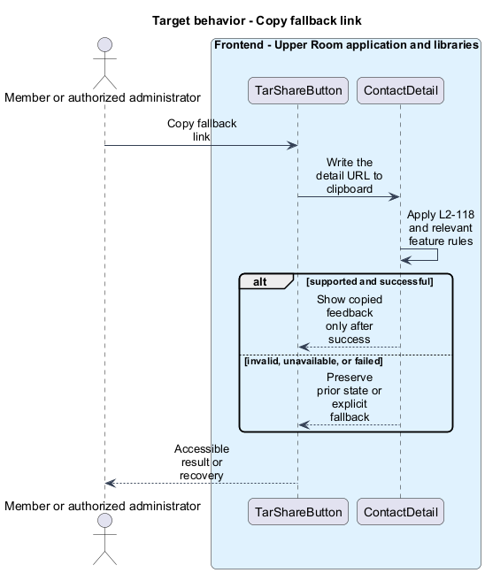

# Share detail links

## Overview

The Upper Room manages contacts, partners, ideas, events, locations, and boards in city-scoped workspaces.

A detail link is a stable URL that identifies a resource. Sharing passes that link without granting the recipient additional access.

## Description

### Existing implementation

The following source elements provide the current implementation points. Their presence does not establish complete requirement coverage.

| Source | Concrete elements | Observed surface |
|---|---|---|
| [frontend/projects/components/src/lib/share-button/share-button.ts](../../../../frontend/projects/components/src/lib/share-button/share-button.ts) | `TarShareButton` | private readonly snackbar = inject(SnackbarService); private readonly doc = inject(DOCUMENT); protected async share(): Promise<void> |
| [frontend/projects/the-upper-room/src/app/contacts/contact-detail/contact-detail.ts](../../../../frontend/projects/the-upper-room/src/app/contacts/contact-detail/contact-detail.ts) | `ContactDetail` | private readonly http = inject(HttpClient); private readonly route = inject(ActivatedRoute); private readonly router = inject(Router) |
| [frontend/projects/the-upper-room/src/app/app.routes.ts](../../../../frontend/projects/the-upper-room/src/app/app.routes.ts) | `routes` | Declarations and configuration in the linked source |

### Target behavior and interfaces

TarShareButton shall use the native share API when available and copy the current detail URL otherwise. Clipboard success shall produce feedback; rejection shall produce a recoverable error. Opening a shared URL shall pass through normal authentication and resource authorization.

- **Share native link:** Invoke supported browser share capability. Report completion or cancellation.
- **Copy fallback link:** Write the detail URL to clipboard. Show copied feedback only after success.

Diagrams show target collaborations. Existing source types retain their names. Participants marked as target roles or proposed responsibilities describe interfaces to introduce, not existing classes.

### Gaps and compatibility

The share button and resource routes exist. A stable URL is not an authorization token, and browser capability or permission failure shall not be presented as successful copying.

Production implementation shall follow [AGENTS.md](../../../../AGENTS.md), including incremental acceptance testing. API integrations shall preserve documented behavior until an explicit compatibility change is approved.

## Requirements

The table preserves the opening requirement statement and all parent identifiers. The expandable source excerpts retain the complete normative text and acceptance criteria verbatim. Source wording is quoted rather than normalized to the design prose.

| L2 ID | Refines (L1) | Requirement |
|---|---|---|
| [L2-118](../../../specs/L2.md#l2-118-deep-links-and-sharing) | `L1-026` | Every detail page has a stable URL (`/contacts/:id`, `/partners/:id`, `/events/:id`, `/ideas/:id`, `/locations/:id`, `/boards/:id`). A "Share" icon button on each detail page copies the URL to clipboard and shows a snackbar "Link copied to clipboard." Native share sheet (Web Share API) is used on supported browsers. |

L2-118: Deep Links and Sharing — specification excerpt

Every detail page has a stable URL (`/contacts/:id`, `/partners/:id`, `/events/:id`, `/ideas/:id`, `/locations/:id`, `/boards/:id`). A "Share" icon button on each detail page copies the URL to clipboard and shows a snackbar "Link copied to clipboard." Native share sheet (Web Share API) is used on supported browsers.

**Acceptance Criteria:**
1. Given the user clicks Share on a contact, when the Web Share API is unavailable, then `navigator.clipboard.writeText` is called and the snackbar appears.

## Diagrams

### System context

The context identifies the people and application boundary used by this capability.

### Container view

The container view separates browser execution from any backend state responsibility. Provider choices remain subject to the stated gaps.

### Target component view

The component view shows target collaborations between the concrete implementation points and proposed application responsibilities.

### Type structure

The structure view lists source types with declared members where available. Dashed dependencies denote proposed collaboration rather than verified current dependency direction.

### Share native link

The target flow performs the following operation: Invoke supported browser share capability. Its successful outcome is: Report completion or cancellation. Alternate branches retain prior state or return recoverable failure.

### Copy fallback link

The target flow performs the following operation: Write the detail URL to clipboard. Its successful outcome is: Show copied feedback only after success. Alternate branches retain prior state or return recoverable failure.

