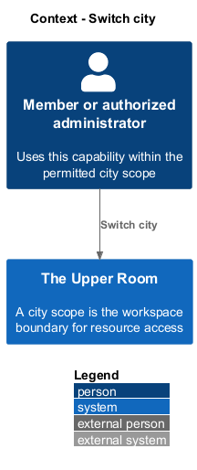
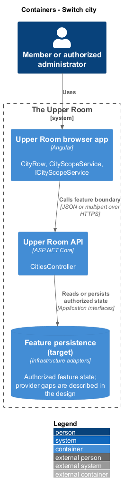
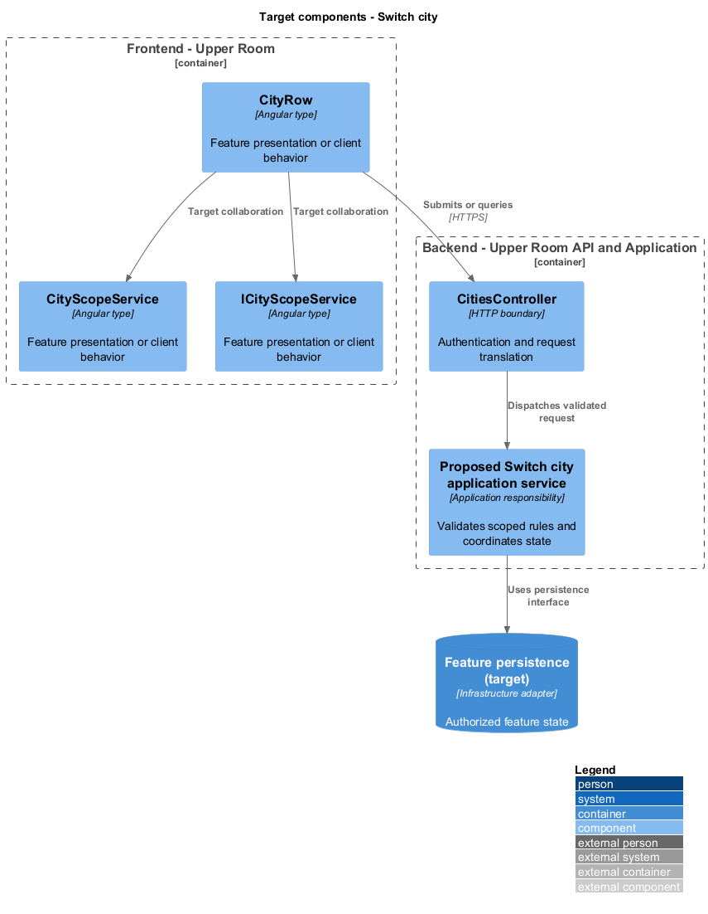
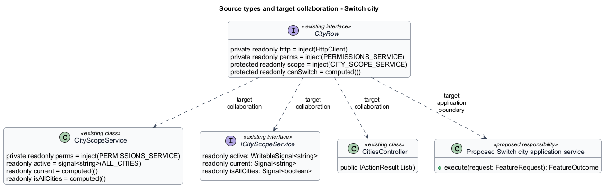
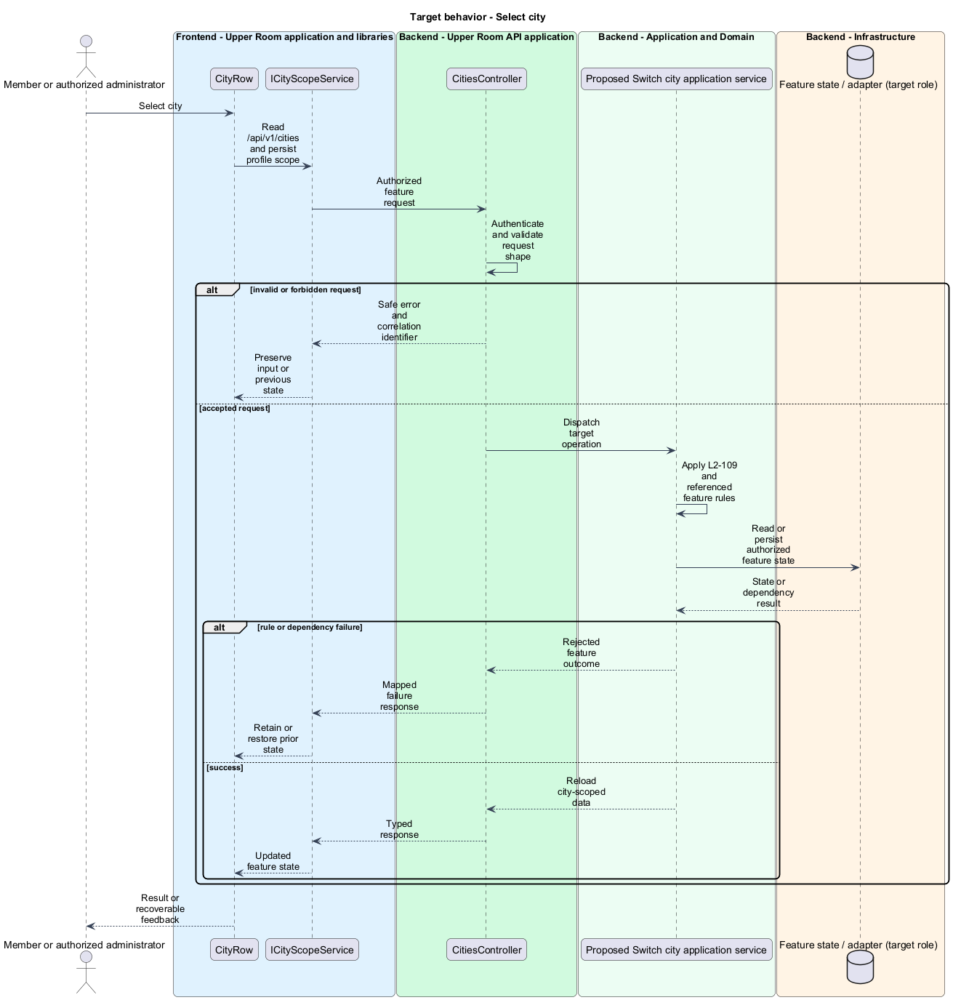
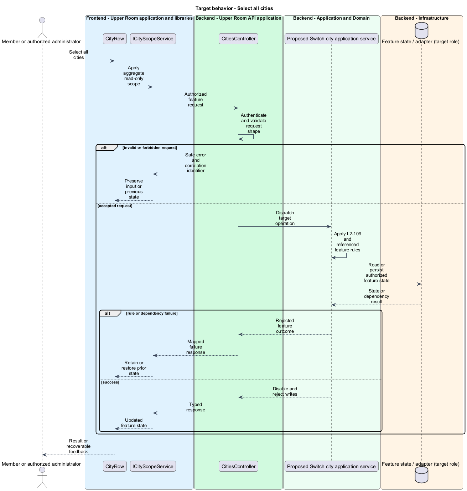

# Switch city

## Overview

The Upper Room manages contacts, partners, ideas, events, locations, and boards in city-scoped workspaces.

A city scope is the workspace boundary for resource access. System administrators select one city or a read-only aggregate across cities.

## Description

### Existing implementation

The following source elements provide the current implementation points. Their presence does not establish complete requirement coverage.

| Source | Concrete elements | Observed surface |
|---|---|---|
| [frontend/projects/domain/src/lib/cities/city-switcher/tar-city-switcher.ts](../../../../frontend/projects/domain/src/lib/cities/city-switcher/tar-city-switcher.ts) | `CityRow`, `TarCitySwitcher` | private readonly http = inject(HttpClient); private readonly perms = inject(PERMISSIONS_SERVICE); protected readonly scope = inject(CITY_SCOPE_SERVICE) |
| [frontend/projects/domain/src/lib/cities/city-scope.service.ts](../../../../frontend/projects/domain/src/lib/cities/city-scope.service.ts) | `CityScopeService` | private readonly perms = inject(PERMISSIONS_SERVICE); readonly active = signal<string>(ALL_CITIES); readonly current = computed(() |
| [frontend/projects/domain/src/lib/cities/city-scope.service.contract.ts](../../../../frontend/projects/domain/src/lib/cities/city-scope.service.contract.ts) | `ICityScopeService` | readonly active: WritableSignal<string>; readonly current: Signal<string>; readonly isAllCities: Signal<boolean> |
| [backend/src/TheUpperRoom.Api/Cities/CitiesController.cs](../../../../backend/src/TheUpperRoom.Api/Cities/CitiesController.cs) | `CitiesController` | Route api/v1/cities; HttpGet |

### Target behavior and interfaces

TarCitySwitcher shall delegate the selection to CityScopeService. The API shall validate administrator access and persist the selected scope in the profile. A scope change shall invalidate loaded feature data. All-cities mode shall disable mutations in the UI and reject them at the server boundary.

- **Select city:** Read /api/v1/cities and persist profile scope. Reload city-scoped data.
- **Select all cities:** Apply aggregate read-only scope. Disable and reject writes.

Diagrams show target collaborations. Existing source types retain their names. Participants marked as target roles or proposed responsibilities describe interfaces to introduce, not existing classes.

### Gaps and compatibility

City scope services and a city catalog endpoint exist. Client-side hiding is insufficient enforcement; every resource mutation shall validate its scope. Uniform scope propagation across all endpoints remains a verification gap.

Production implementation shall follow [AGENTS.md](../../../../AGENTS.md), including incremental acceptance testing. API integrations shall preserve documented behavior until an explicit compatibility change is approved.

## Requirements

The table preserves the opening requirement statement and all parent identifiers. The expandable source excerpts retain the complete normative text and acceptance criteria verbatim. Source wording is quoted rather than normalized to the design prose.

| L2 ID | Refines (L1) | Requirement |
|---|---|---|
| [L2-109](../../../specs/L2.md#l2-109-city-switcher) | `L1-013` | For SystemAdmin only, a city dropdown appears in the top app bar showing the current city; clicking it opens a `mat-menu` with searchable list of cities and an "All cities (read-only)" option. Switching reloads the data scope and persists the selection in the user's profile. |

L2-109: City Switcher — specification excerpt

For SystemAdmin only, a city dropdown appears in the top app bar showing the current city; clicking it opens a `mat-menu` with searchable list of cities and an "All cities (read-only)" option. Switching reloads the data scope and persists the selection in the user's profile.

**Acceptance Criteria:**
1. Given a SystemAdmin selects "All cities", when active, then list pages aggregate across cities and write actions are disabled with a banner "Switch to a single city to make changes.".

## Diagrams

### System context

The context identifies the people and application boundary used by this capability.

### Container view

The container view separates browser execution from any backend state responsibility. Provider choices remain subject to the stated gaps.

### Target component view

The component view shows target collaborations between the concrete implementation points and proposed application responsibilities.

### Type structure

The structure view lists source types with declared members where available. Dashed dependencies denote proposed collaboration rather than verified current dependency direction.

### Select city

The target flow performs the following operation: Read /api/v1/cities and persist profile scope. Its successful outcome is: Reload city-scoped data. Alternate branches retain prior state or return recoverable failure.

### Select all cities

The target flow performs the following operation: Apply aggregate read-only scope. Its successful outcome is: Disable and reject writes. Alternate branches retain prior state or return recoverable failure.

