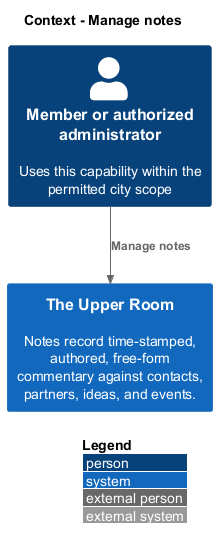
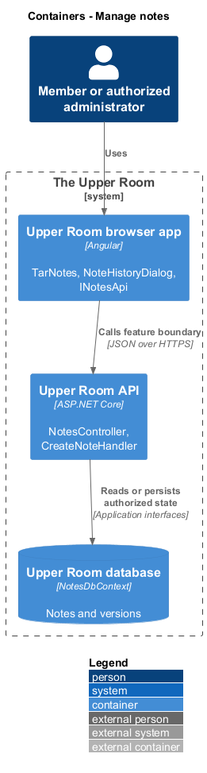
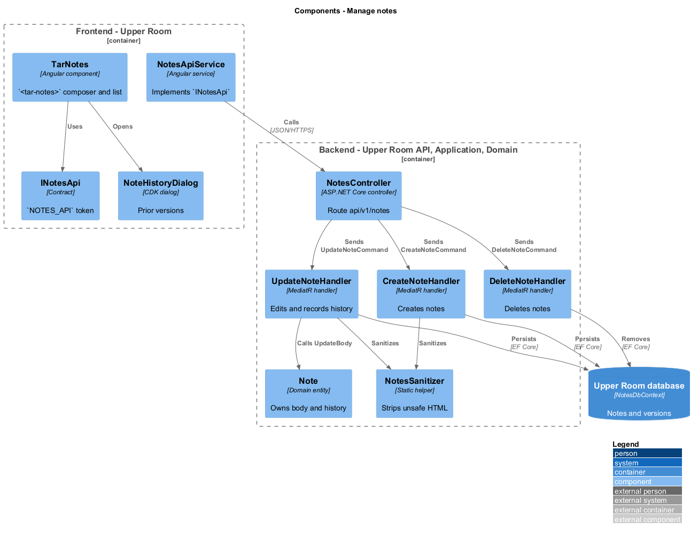
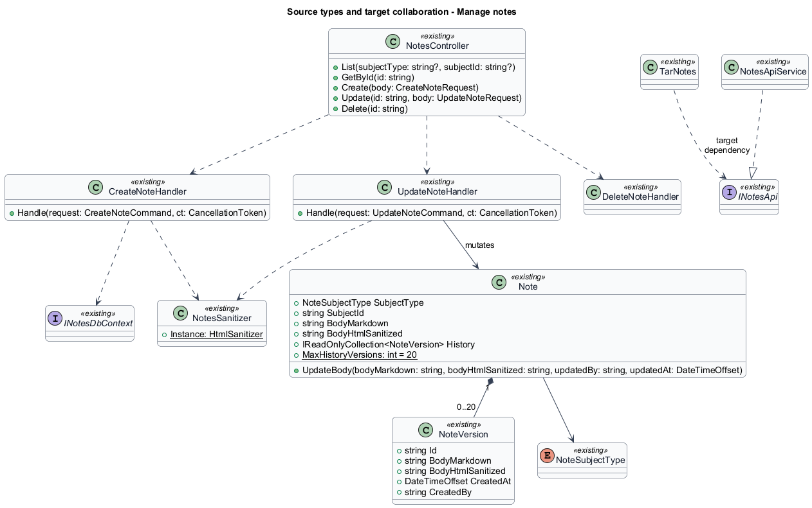
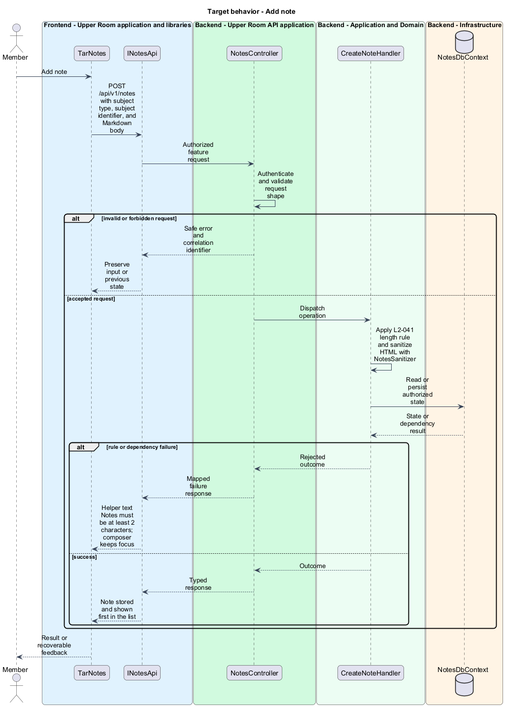
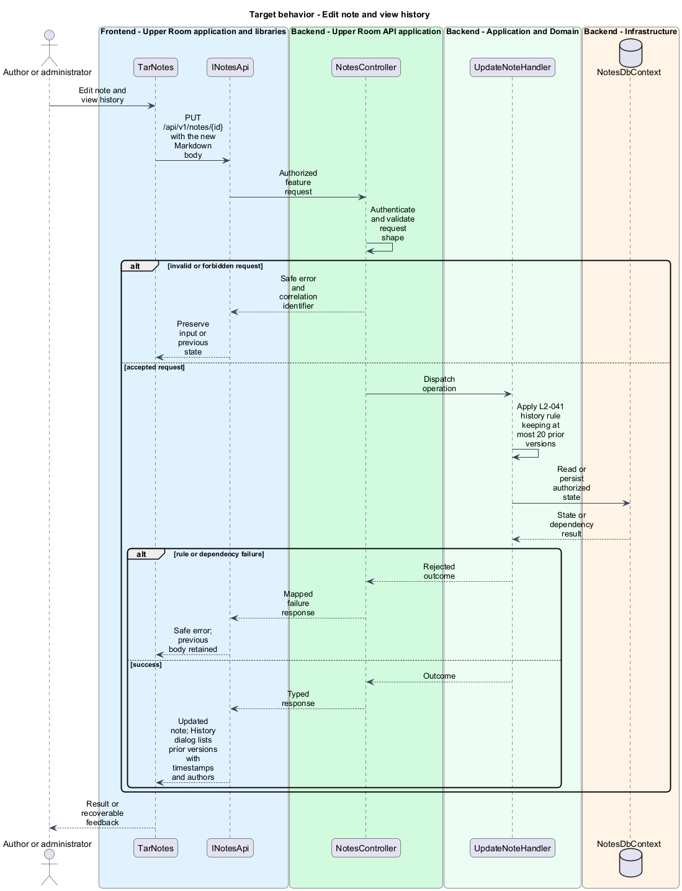
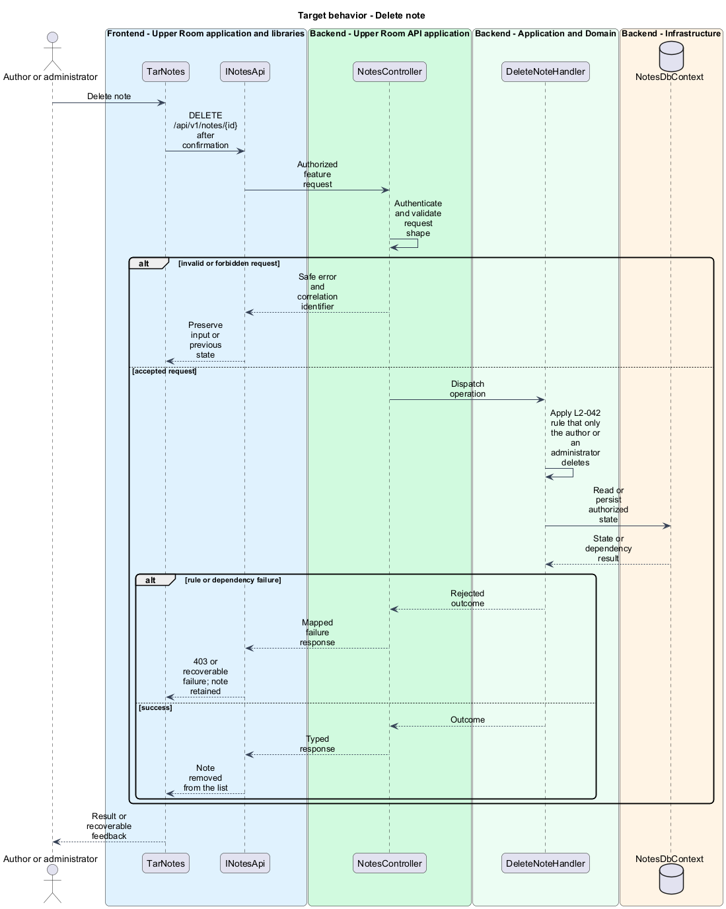

# Manage notes

## Overview

Notes record time-stamped, authored, free-form commentary against contacts, partners, ideas, and events.

**note** — Markdown entry attached to one subject, stored with a sanitized HTML rendering and a bounded edit history.

**subject** — contact, partner, idea, or event to which a note is attached.

The feature covers the note data model with its history and the reusable notes tab component.

## Description

### Existing implementation

The following source elements provide the current implementation points. Their presence does not establish complete requirement coverage.

| Source | Concrete elements | Observed surface |
|---|---|---|
| [backend/src/TheUpperRoom.Domain/Notes/Note.cs](../../../../backend/src/TheUpperRoom.Domain/Notes/Note.cs) | `Note`, `NoteVersion`, `NoteSubjectType` | `BodyMarkdown` up to 10000 characters; `MaxHistoryVersions = 20`; `UpdateBody` pushes the prior body into `History` |
| [backend/src/TheUpperRoom.Application/Notes/NotesSanitizer.cs](../../../../backend/src/TheUpperRoom.Application/Notes/NotesSanitizer.cs) | `NotesSanitizer` | HtmlSanitizer allow-list that strips scripts |
| [backend/src/TheUpperRoom.Application/Notes/CreateNoteHandler.cs](../../../../backend/src/TheUpperRoom.Application/Notes/CreateNoteHandler.cs) | `CreateNoteHandler`, `CreateNoteCommand`, `CreateNoteCommandValidator`, `CreateNoteRequest` | Creates a note |
| [backend/src/TheUpperRoom.Application/Notes/UpdateNoteHandler.cs](../../../../backend/src/TheUpperRoom.Application/Notes/UpdateNoteHandler.cs) | `UpdateNoteHandler`, `UpdateNoteCommand`, `UpdateNoteCommandValidator`, `UpdateNoteRequest` | Edits a note and records history |
| [backend/src/TheUpperRoom.Application/Notes/DeleteNoteHandler.cs](../../../../backend/src/TheUpperRoom.Application/Notes/DeleteNoteHandler.cs) | `DeleteNoteHandler`, `DeleteNoteCommand` | Deletes a note |
| [backend/src/TheUpperRoom.Application/Notes/ListNotesHandler.cs](../../../../backend/src/TheUpperRoom.Application/Notes/ListNotesHandler.cs) | `ListNotesHandler`, `GetNoteHandler`, `NoteDto`, `NoteVersionDto`, `NotesOutcome` | Query side |
| [backend/src/TheUpperRoom.Application/Notes/INotesDbContext.cs](../../../../backend/src/TheUpperRoom.Application/Notes/INotesDbContext.cs) | `INotesDbContext` | Persistence interface |
| [backend/src/TheUpperRoom.Infrastructure/Notes/NotesDbContext.cs](../../../../backend/src/TheUpperRoom.Infrastructure/Notes/NotesDbContext.cs) | `NotesDbContext` | EF Core implementation |
| [backend/src/TheUpperRoom.Api/Notes/NotesController.cs](../../../../backend/src/TheUpperRoom.Api/Notes/NotesController.cs) | `NotesController` | Route `api/v1/notes`; `HttpGet`, `HttpGet {id}`, `HttpPost`, `HttpPut {id}`, `HttpDelete {id}` |
| [frontend/projects/api/src/lib/notes/notes-api.contract.ts](../../../../frontend/projects/api/src/lib/notes/notes-api.contract.ts) | `INotesApi`, `NOTES_API` | Contract and injection token |
| [frontend/projects/api/src/lib/notes/notes-api.service.ts](../../../../frontend/projects/api/src/lib/notes/notes-api.service.ts) | `NotesApiService` | Implementation using `HttpClient` and `API_BASE_URL` |
| [frontend/projects/components/src/lib/notes/tar-notes.ts](../../../../frontend/projects/components/src/lib/notes/tar-notes.ts) | `TarNotes`, `NoteDto` | `<tar-notes>` composer and list; calls `DELETE /api/v1/notes/{id}` |
| [frontend/projects/components/src/lib/notes/note-history-dialog.ts](../../../../frontend/projects/components/src/lib/notes/note-history-dialog.ts) | `NoteHistoryDialog`, `NoteHistoryDialogData` | Lists prior versions |

### Target behavior and interfaces

`TarNotes` shall depend on `NOTES_API` rather than `HttpClient`. The create and update handlers shall validate the body, render sanitized HTML through `NotesSanitizer`, and keep at most 20 prior versions. Edit and delete shall be offered only to the author or an administrator.

- **Add note:** `POST /api/v1/notes` with subject type, subject identifier, and Markdown body.
- **Edit note and view history:** `PUT /api/v1/notes/{id}` and `GET /api/v1/notes/{id}` return the version list.
- **Delete note:** `DELETE /api/v1/notes/{id}`.

Diagrams show target collaborations. Existing source types retain their names. Participants marked as proposed or target roles describe interfaces to introduce, not existing classes.

### Gaps and compatibility

`TarNotes` injects `HttpClient` directly even though `INotesApi` exists. The minimum body length in the acceptance criteria (2 characters) differs from the validator rules, which are `<TO SUPPLY>` until `CreateNoteCommandValidator` is reconciled. The `NoteSubjectType` members and the `version` concurrency field require confirmation against the requirement (`<TO SUPPLY>`).

Production implementation shall follow [AGENTS.md](../../../../AGENTS.md), including incremental acceptance testing. API integrations shall preserve documented behavior until an explicit compatibility change is approved.

## Requirements

The table preserves each requirement statement and all parent identifiers. The expandable source excerpts retain the acceptance criteria verbatim.

| L2 ID | Refines (L1) | Requirement |
|---|---|---|
| [L2-041](../../../specs/L2.md#l2-041-note-data-model) | `L1-007` | A Note must have: `id`, `subjectType` (enum Contact/Partner/Idea/Event), `subjectId`, `bodyMarkdown` (1-10000 chars), `bodyHtmlSanitized` (server-rendered with DOMPurify equivalent), `createdAt`, `createdBy`, `updatedAt`, `updatedBy`, `version`. Notes have edit history (max last 20 versions kept). |
| [L2-042](../../../specs/L2.md#l2-042-notes-tab-component) | `L1-007` | A reusable `<tar-notes>` component appears on the Notes tab of Contact, Partner, Idea, Event. Layout: top row composer (`mat-form-field` outlined, multi-line, placeholder "Write a note... (Markdown supported)", helper text "Cmd+Enter to save", primary button "Add note"); below, notes list newest-first, each as a card with author avatar (32px), author name + relative time (`label-medium`), rendered HTML body, footer with "Edit", "History", "Delete" (only for author or admins). |

L2-041: Note Data Model — specification excerpt

A Note must have: `id`, `subjectType` (enum Contact/Partner/Idea/Event), `subjectId`, `bodyMarkdown` (1-10000 chars), `bodyHtmlSanitized` (server-rendered with DOMPurify equivalent), `createdAt`, `createdBy`, `updatedAt`, `updatedBy`, `version`. Notes have edit history (max last 20 versions kept).

**Acceptance Criteria:**
1. Given a note body containing ``, when stored, then the rendered HTML strips the script tag.
2. Given a note edited 5 times, when the user clicks "History", then 5 prior versions are listed with timestamps and authors.

L2-042: Notes Tab Component — specification excerpt

A reusable `<tar-notes>` component appears on the Notes tab of Contact, Partner, Idea, Event. Layout: top row composer (`mat-form-field` outlined, multi-line, placeholder "Write a note... (Markdown supported)", helper text "Cmd+Enter to save", primary button "Add note"); below, notes list newest-first, each as a card with author avatar (32px), author name + relative time (`label-medium`), rendered HTML body, footer with "Edit", "History", "Delete" (only for author or admins).

**Acceptance Criteria:**
1. Given a 1-character note, when "Add note" is clicked, then it is rejected with helper text "Notes must be at least 2 characters." and the composer keeps focus.
2. Given a note older than 7 days, when displayed, then the timestamp is shown as "Mar 5, 2026" (locale-aware), not relative.

## Diagrams

### System context

The context identifies the people and application boundary used by this capability.

### Container view

The container view separates browser execution from backend state responsibility.

### Target component view

The component view shows target collaborations between the concrete implementation points and proposed responsibilities.

### Type structure

The structure view lists source types with declared members where available. Types marked proposed describe interfaces to introduce.

### Add note

The flow performs the following operation: POST /api/v1/notes with subject type, subject identifier, and Markdown body. Its successful outcome is: Note stored and shown first in the list. The alternate branch yields: Helper text Notes must be at least 2 characters; composer keeps focus.

### Edit note and view history

The flow performs the following operation: PUT /api/v1/notes/{id} with the new Markdown body. Its successful outcome is: Updated note; History dialog lists prior versions with timestamps and authors. The alternate branch yields: Safe error; previous body retained.

### Delete note

The flow performs the following operation: DELETE /api/v1/notes/{id} after confirmation. Its successful outcome is: Note removed from the list. The alternate branch yields: 403 or recoverable failure; note retained.

