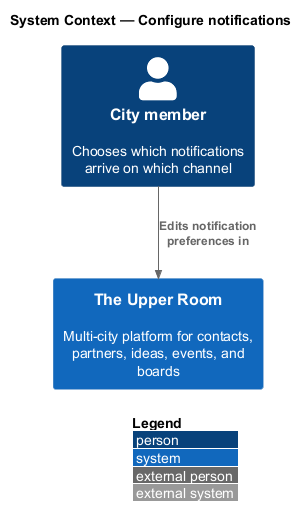
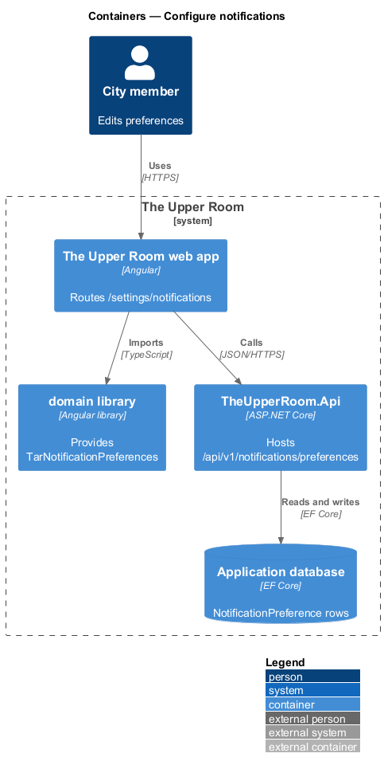
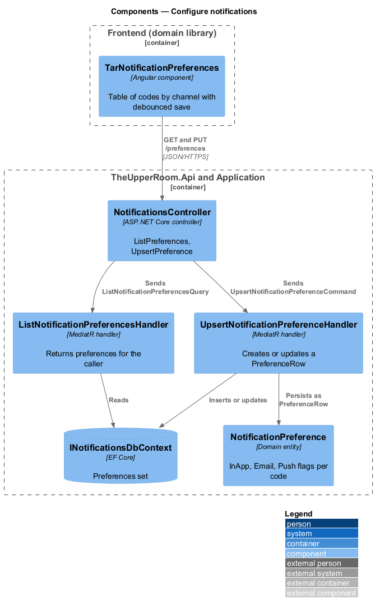
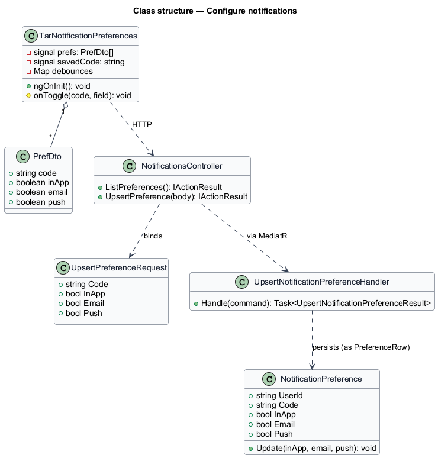
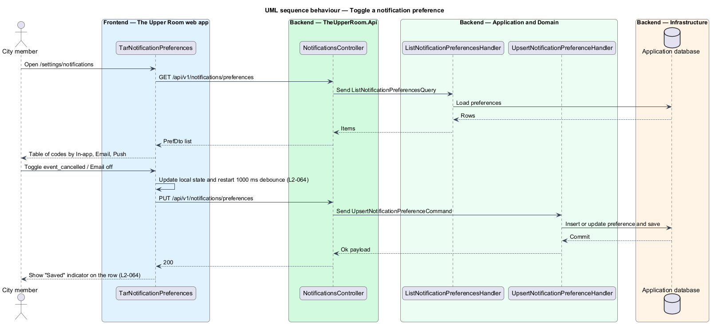

# Configure notifications

## Overview

The Upper Room manages contacts, partners, ideas, events, locations, and boards in city-scoped workspaces.

**notification channel** — delivery route for a notification: in-app inbox, email, or push

**notification preference** — per-user, per-code setting that enables or disables each notification channel

Each notification type can reach a user through three channels. The settings page lets a user turn each channel on or off per notification code. The dispatch pipeline reads these preferences before it creates an inbox entry, sends email, or queues a push message (see [Notification inbox](../notification-inbox/README.md)).

## Description

### Existing implementation

| Source | Concrete elements | Observed surface |
|---|---|---|
| [frontend/projects/domain/src/lib/notifications/notification-preferences/tar-notification-preferences.ts](../../../../frontend/projects/domain/src/lib/notifications/notification-preferences/tar-notification-preferences.ts) | `TarNotificationPreferences`, `PrefDto` | Signals `prefs`, `savedCode`, `pushSubscribed`, `digestFrequency`; `onToggle(code, field)` flips the flag and issues `PUT /api/v1/notifications/preferences` after a 1000 ms debounce per code; `savedCode` shows the saved indicator for 2000 ms |
| [frontend/projects/the-upper-room/src/app/app.routes.ts](../../../../frontend/projects/the-upper-room/src/app/app.routes.ts) | Route `settings/notifications` | Renders `TarNotificationPreferences` |
| [backend/src/TheUpperRoom.Api/Notifications/NotificationsController.cs](../../../../backend/src/TheUpperRoom.Api/Notifications/NotificationsController.cs) | `NotificationsController` | `HttpGet preferences`; `HttpPut preferences`; `HttpGet digest`; `HttpPut digest` |
| [backend/src/TheUpperRoom.Application/Notifications/UpsertNotificationPreferenceHandler.cs](../../../../backend/src/TheUpperRoom.Application/Notifications/UpsertNotificationPreferenceHandler.cs) | `UpsertNotificationPreferenceHandler`, `UpsertPreferenceRequest` | Inserts or updates the `PreferenceRow` for the caller and code |
| [backend/src/TheUpperRoom.Application/Notifications/ListNotificationPreferencesHandler.cs](../../../../backend/src/TheUpperRoom.Application/Notifications/ListNotificationPreferencesHandler.cs) | `ListNotificationPreferencesHandler` | Returns code, in-app, email, and push flags |
| [backend/src/TheUpperRoom.Domain/Notifications/NotificationPreference.cs](../../../../backend/src/TheUpperRoom.Domain/Notifications/NotificationPreference.cs) | `NotificationPreference` | `InApp`, `Email`, `Push`; `Update` |

### Target behavior and interfaces

The page shall list one row per notification code and one toggle per channel. A change shall save automatically after a 1 s debounce and show a "Saved" indicator beside the row.

### Gaps and compatibility

- The requirement names a `PATCH` request. The existing API exposes `PUT /api/v1/notifications/preferences`. Whether the contract changes to `PATCH` is `<TO SUPPLY>`.
- The existing component uses `TarCheckbox` cells. The requirement specifies `mat-slide-toggle`. The choice is `<TO SUPPLY>`.
- The existing page also edits push subscription and digest frequency, which `L2-064` does not specify.
- The requirement offers a "Save" button or debounced auto-save, and also names a snackbar "Notification preferences saved." The existing implementation uses debounced auto-save with a row indicator. Adding the snackbar is `<TO SUPPLY>`.

Production implementation shall follow [AGENTS.md](../../../../AGENTS.md), including incremental acceptance testing.

## Requirements

| L2 ID | Refines (L1) | Requirement |
|---|---|---|
| [L2-064](../../../specs/L2.md#l2-064-notification-settings-page) | `L1-016` | Route `/settings/notifications` shows a table: rows = notification codes, columns = channels (In-app, Email, Push). Each cell is a `mat-slide-toggle`. A "Save" button appears at the bottom; or auto-save with a debounced 1s and snackbar "Notification preferences saved.". |

L2-064: Notification Settings Page — specification excerpt

**Acceptance Criteria:**
1. Given the user toggles `event_cancelled`/Email off, when 1s passes, then a PATCH request stores the preference and a "Saved" indicator appears next to the row briefly.

## Diagrams

### System context

The context shows the city member who edits preferences.

### Container view

The preferences component runs in the web app and calls the API, which persists rows in the application database.

### Component view

`NotificationsController` serves the list and upsert endpoints through two MediatR handlers.

### Type structure

`PrefDto` mirrors the three flags of `NotificationPreference` per code.

### Toggle a preference

The sequence covers loading the table, the debounced save, and the "Saved" indicator.

