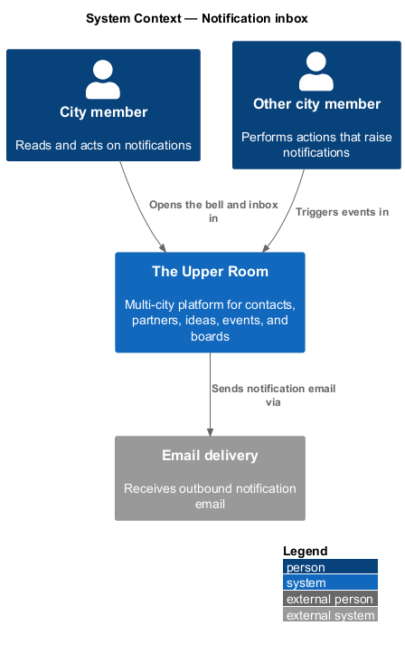
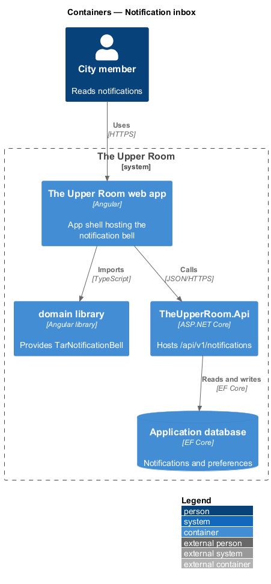
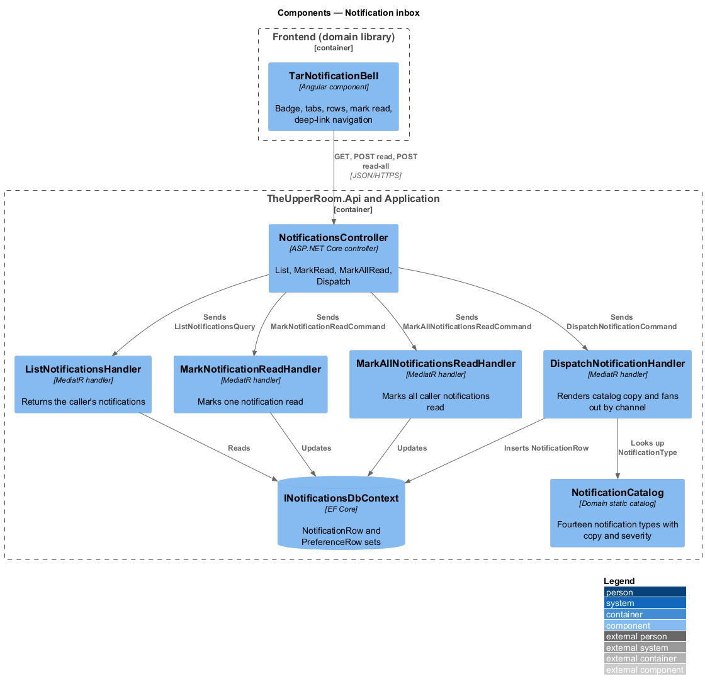
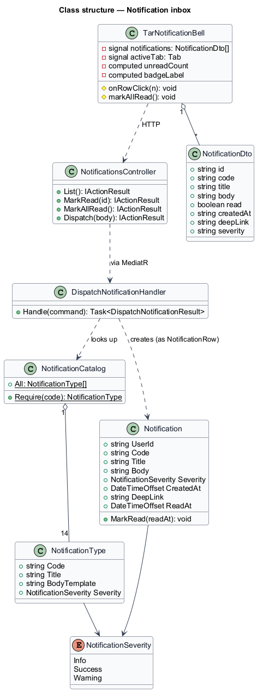
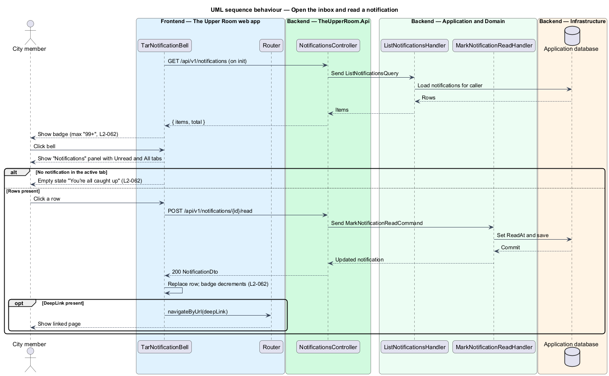
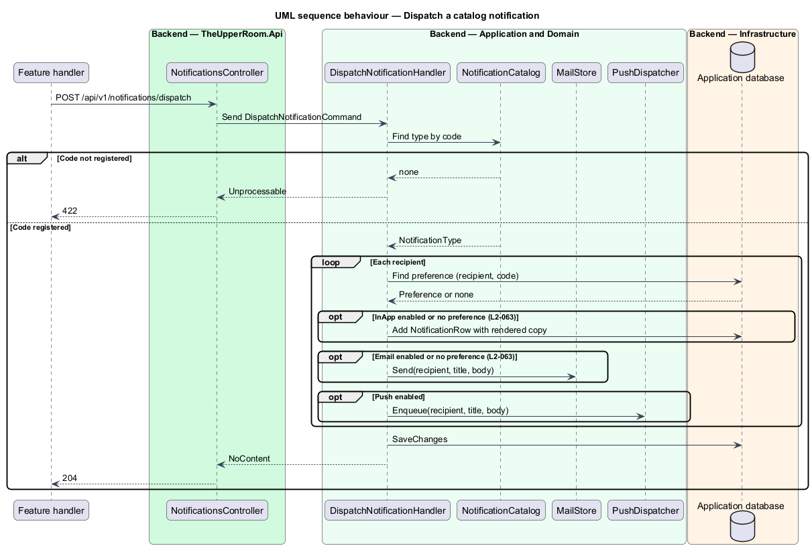

# Notification inbox

## Overview

The Upper Room manages contacts, partners, ideas, events, locations, and boards in city-scoped workspaces.

**notification** — persisted message addressed to one user that records an event relevant to that user

**notification code** — stable identifier of a notification type, such as `event_cancelled`

**inbox** — list of a user's notifications shown from the bell icon in the top app bar

Users receive notifications for events such as invitations, event reminders, idea votes, and security changes. The bell icon in the top app bar shows the count of unread notifications. Opening the bell shows the inbox, where each row can be read and followed to the related page. The platform emits the fixed set of notification types listed in the notification catalog.

## Description

### Existing implementation

| Source | Concrete elements | Observed surface |
|---|---|---|
| [frontend/projects/domain/src/lib/notifications/notification-bell/tar-notification-bell.ts](../../../../frontend/projects/domain/src/lib/notifications/notification-bell/tar-notification-bell.ts) | `TarNotificationBell`, `NotificationDto` | Signals `notifications`, `open`, `activeTab`; computed `unreadCount`, `badgeLabel` ("99+" above 99), `visibleRows`; tabs "Unread" and "All"; `onRowClick` posts to `/api/v1/notifications/{id}/read` and navigates to `deepLink`; `markAllRead` |
| [frontend/projects/domain/src/lib/notifications/notification-bell/tar-notification-bell.html](../../../../frontend/projects/domain/src/lib/notifications/notification-bell/tar-notification-bell.html) | Template | Panel with `role="dialog"`, empty state with icon `notifications_off` and text "You're all caught up" |
| [frontend/projects/the-upper-room/src/app/shell/app-shell/app-shell.ts](../../../../frontend/projects/the-upper-room/src/app/shell/app-shell/app-shell.ts) | `AppShell` | Imports `TarNotificationBell` into the top app bar |
| [backend/src/TheUpperRoom.Api/Notifications/NotificationsController.cs](../../../../backend/src/TheUpperRoom.Api/Notifications/NotificationsController.cs) | `NotificationsController` | Route `api/v1/notifications`; `HttpGet`; `HttpPost {id}/read`; `HttpPost read-all`; `HttpPost dispatch` |
| [backend/src/TheUpperRoom.Application/Notifications/ListNotificationsHandler.cs](../../../../backend/src/TheUpperRoom.Application/Notifications/ListNotificationsHandler.cs) | `ListNotificationsHandler`, `ListNotificationsQuery` | Returns the caller's notifications |
| [backend/src/TheUpperRoom.Application/Notifications/MarkNotificationReadHandler.cs](../../../../backend/src/TheUpperRoom.Application/Notifications/MarkNotificationReadHandler.cs) | `MarkNotificationReadHandler`, `MarkAllNotificationsReadHandler` | Marks one or all notifications read |
| [backend/src/TheUpperRoom.Application/Notifications/DispatchNotificationHandler.cs](../../../../backend/src/TheUpperRoom.Application/Notifications/DispatchNotificationHandler.cs) | `DispatchNotificationHandler`, `DispatchRequest`, `NotificationMapping.Render` | Looks up the type in `NotificationCatalog`, renders title and body from `data`, inserts `NotificationRow` when in-app is enabled, sends mail through `MailStore` when email is enabled, enqueues through `PushDispatcher` when push is enabled |
| [backend/src/TheUpperRoom.Domain/Notifications/NotificationCatalog.cs](../../../../backend/src/TheUpperRoom.Domain/Notifications/NotificationCatalog.cs) | `NotificationCatalog`, `NotificationType`, `NotificationSeverity`, `Notification` | Registers the fourteen types of `L2-063` with title, body template, and severity |

### Target behavior and interfaces

`TarNotificationBell` shall load notifications on init, show the unread badge, and list rows on the "Unread" and "All" tabs. Clicking a row shall mark the notification read, update the badge, and navigate to the deep link. `DispatchNotificationHandler` shall emit only the catalog codes and shall honor per-channel preferences, so that a disabled code emits no snackbar, inbox, or email output.

### Gaps and compatibility

- The panel is a custom element with `role="dialog"`. The requirement specifies a `mat-menu` panel of width `400px` (full width on XS). Adopting `mat-menu` is `<TO SUPPLY>`.
- The footer actions "Mark all as read" and "Notification settings", row preview ellipsis, and relative time are `<TO SUPPLY>` pending verification of the template beyond the rows.
- The empty state shows the heading; the body "We'll let you know when there's something new." is `<TO SUPPLY>` against the template.
- Showing a snackbar together with the inbox entry when an event reminder fires while the app is open is `<TO SUPPLY>`; no consumer of `SnackbarService` for incoming notifications exists in the observed source.
- The `deepLink` is read by the client, while the dispatch handler does not populate it. The deep-link source per catalog code is `<TO SUPPLY>`.
- Notification settings (`L2-064`) are designed in [Configure notifications](../configure-notifications/README.md).

Production implementation shall follow [AGENTS.md](../../../../AGENTS.md), including incremental acceptance testing.

## Requirements

| L2 ID | Refines (L1) | Requirement |
|---|---|---|
| [L2-062](../../../specs/L2.md#l2-062-notification-bell-and-inbox) | `L1-016` | The top-app-bar bell icon shows a badge (unread count, max "99+", color `--md-sys-color-error`). Clicking opens a `mat-menu` panel of width `400px` (full width on XS) titled "Notifications", with tabs "Unread" and "All". Each row has icon (severity-colored), title (`title-small`), preview (`body-small`, 2-line ellipsis), relative time, and a tap-target. Footer has "Mark all as read" and "Notification settings". |
| [L2-063](../../../specs/L2.md#l2-063-notification-catalog) | `L1-016` | The system must support and emit the following notification types with their copy: `welcome`, `email_verified`, `invite_sent`, `invite_accepted`, `event_created`, `event_reminder_24h`, `event_starting_soon`, `event_cancelled`, `idea_voted`, `idea_status_changed`, `kanban_assigned`, `note_mention`, `password_changed`, `signin_new_device` (full copy table in the excerpt below). |

L2-062: Notification Bell and Inbox — specification excerpt

**Acceptance Criteria:**
1. Given there are 0 unread notifications, when the bell is opened, then the empty state shows icon `notifications_off`, heading "You're all caught up", body "We'll let you know when there's something new.".
2. Given a notification is clicked, when handled, then it is marked read, the badge decrements, and the user navigates to the deep link.

L2-063: Notification Catalog — specification excerpt

The system must support and emit the following notification types with their copy:

| Code | Title | Body Template | Severity |
|------|-------|----------------|----------|
| `welcome` | Welcome to The Upper Room! | We're glad you're here. Take a quick tour to get started. | info |
| `email_verified` | Email verified | Your email is confirmed. You can now invite others. | success |
| `invite_sent` | Invitation sent | You invited {email} to join {city}. | success |
| `invite_accepted` | Invitation accepted | {name} joined your city. | success |
| `event_created` | Event created | "{title}" was added to the calendar. | info |
| `event_reminder_24h` | Event tomorrow | "{title}" starts in 24 hours at {time}. | info |
| `event_starting_soon` | Event starting soon | "{title}" starts in 15 minutes. | warning |
| `event_cancelled` | Event cancelled | "{title}" has been cancelled. | warning |
| `idea_voted` | Your idea got a vote | {name} upvoted "{title}". | info |
| `idea_status_changed` | Idea status changed | "{title}" moved to {status}. | info |
| `kanban_assigned` | New task assigned | You were assigned "{cardTitle}" on {boardName}. | info |
| `note_mention` | You were mentioned | {name} mentioned you on {subject}. | info |
| `password_changed` | Password changed | Your password was updated. If this wasn't you, secure your account now. | warning |
| `signin_new_device` | New sign-in | Your account was signed into from {device} in {location}. | warning |

**Acceptance Criteria:**
1. Given an event reminder fires, when the user has the app open, then the snackbar AND the inbox notification both appear.
2. Given the user disables `event_reminder_24h` in notification settings, when an event is 24h away, then no snackbar/inbox/email is emitted for that code.

## Diagrams

### System context

The context shows the city member who reads the inbox, other members whose actions raise notifications, and the email delivery system.

### Container view

The bell component lives in the `domain` library and runs in the web app. The API reads and writes notification rows in the application database.

### Component view

`NotificationsController` sends one MediatR request per endpoint. `DispatchNotificationHandler` resolves copy from `NotificationCatalog`.

### Type structure

The catalog holds `NotificationType` records. The `Notification` entity stores the rendered message, and `TarNotificationBell` consumes it as `NotificationDto`.

### Open the inbox and read a notification

The sequence covers loading, the badge, the empty state, and marking a row read followed by deep-link navigation.

### Dispatch a catalog notification

The sequence shows how a dispatch request becomes an inbox row, an email, or a push entry per recipient preference.

