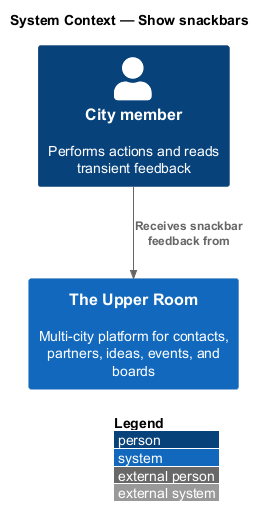
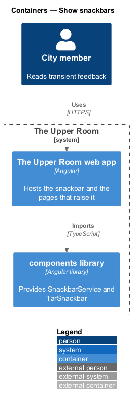
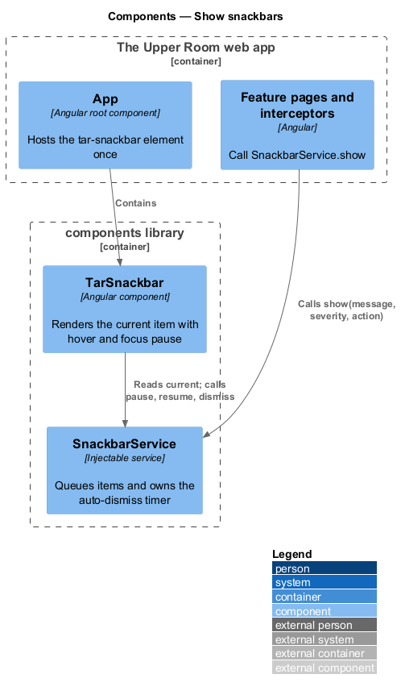
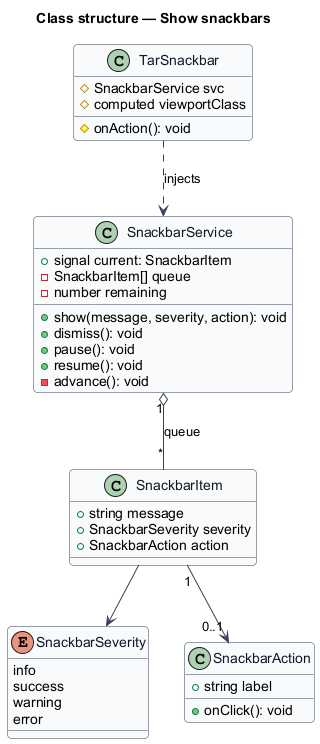
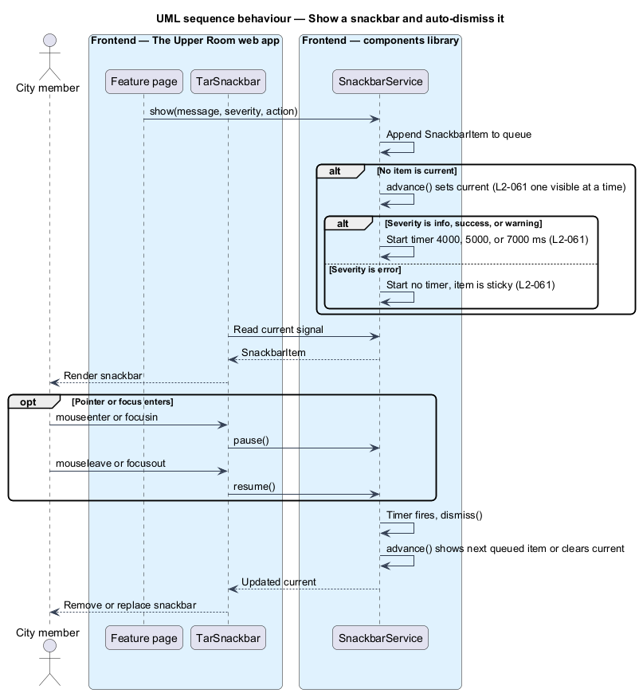
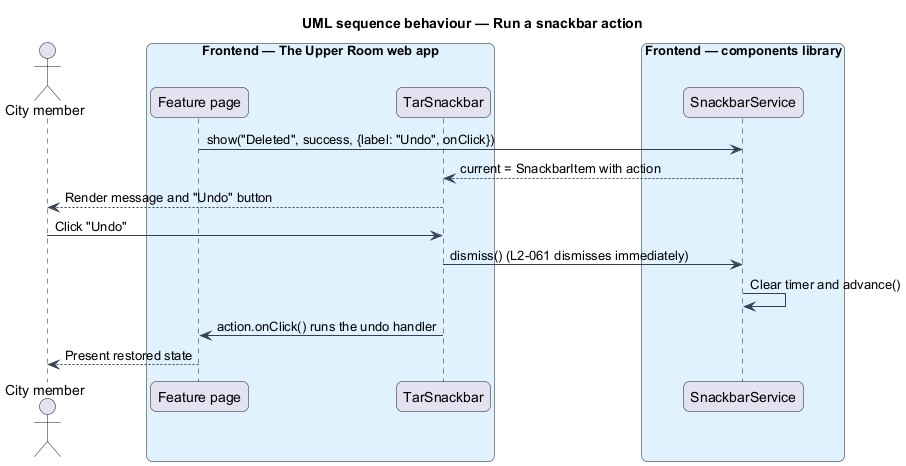

# Show snackbars

## Overview

The Upper Room manages contacts, partners, ideas, events, locations, and boards in city-scoped workspaces.

**snackbar** — transient message at the screen edge that confirms an action or reports a condition without blocking the page

**severity** — classification of a snackbar as info, success, warning, or error that selects its colors and duration

Snackbars give immediate feedback after actions such as saving, deleting, or failing a request. One snackbar is visible at a time, and additional messages wait in a queue. Error snackbars stay until dismissed so that the message cannot be missed.

## Description

### Existing implementation

| Source | Concrete elements | Observed surface |
|---|---|---|
| [frontend/projects/components/src/lib/snackbar/tar-snackbar.service.ts](../../../../frontend/projects/components/src/lib/snackbar/tar-snackbar.service.ts) | `SnackbarService`, `SnackbarItem`, `SnackbarAction`, `SnackbarSeverity` | `current` signal; `show(message, severity, action)`; `dismiss()`; `pause()`; `resume()`; durations info 4000 ms, success 5000 ms, warning 7000 ms, error 0 (sticky) |
| [frontend/projects/components/src/lib/snackbar/tar-snackbar.ts](../../../../frontend/projects/components/src/lib/snackbar/tar-snackbar.ts) | `TarSnackbar` | Renders `current` in a `mat-card`; `role="alert"` for error and `role="status"` otherwise; pauses on `mouseenter`/`focusin`; resumes on `mouseleave`/`focusout`; adds the `tar-snackbar--xs` class below 576 px |
| [frontend/projects/components/src/lib/snackbar/tar-snackbar.scss](../../../../frontend/projects/components/src/lib/snackbar/tar-snackbar.scss) | Severity modifier classes | Position, width, padding, and severity colors |
| [frontend/projects/the-upper-room/src/app/app.ts](../../../../frontend/projects/the-upper-room/src/app/app.ts) | `App` | Hosts one `<tar-snackbar />` beside the router outlet |

### Target behavior and interfaces

`SnackbarService.show` shall append an item to a first-in-first-out queue and display it when no item is current. `TarSnackbar` shall display the current item and call `pause` and `resume` on hover and focus changes. Activating the action button shall dismiss the snackbar and then run the action handler.

The existing implementation renders a custom `TarSnackbar` component rather than `MatSnackBar`. Whether the design retains the custom component or adopts `MatSnackBar` is `<TO SUPPLY>`.

### Gaps and compatibility

- Repositioning of floating action buttons while a snackbar is visible is `<TO SUPPLY>`; the observed source contains no coordination between `TarSnackbar` and floating action buttons.
- Verification of the severity color values, the 560 px / 288 px width bounds, and the `$space-6` edge offset against `tar-snackbar.scss` is `<TO SUPPLY>`.
- The existing component renders an additional dismiss icon button. The requirement does not mention it.

Production implementation shall follow [AGENTS.md](../../../../AGENTS.md), including incremental acceptance testing.

## Requirements

| L2 ID | Refines (L1) | Requirement |
|---|---|---|
| [L2-061](../../../specs/L2.md#l2-061-snackbar-specifications) | `L1-016` | Snackbars use `MatSnackBar` and must conform to: Position: bottom-center on XS, bottom-left on MD+, offset `$space-6` from edges, never above floating action buttons (FABs are repositioned upward when a snackbar is visible); Width: max `560px`, min `288px`; Padding: `$space-4`; Typography: message `body-medium`, action button `label-large`; Severity colors: Info `--md-sys-color-inverse-surface`/`inverse-on-surface`, Success `#1B5E20` bg `#FFFFFF` text, Warning `#E65100` bg `#FFFFFF` text, Error `--md-sys-color-error-container`/`on-error-container`; Durations: Info `4000ms`, Success `5000ms`, Warning `7000ms`, Error sticky (no auto-dismiss); Action button optional, and if present its label is uppercase-free with color `--md-sys-color-inverse-primary`; Maximum 1 snackbar visible at a time, with queued snackbars displayed sequentially; Hover or focus pauses the auto-dismiss timer, and leaving resumes it. |

L2-061: Snackbar Specifications — specification excerpt

**Acceptance Criteria:**
1. Given an error snackbar appears, when 10 seconds pass without interaction, then the snackbar is still visible.
2. Given a success snackbar with action "Undo", when the user clicks "Undo", then the snackbar dismisses immediately and the undo handler runs.

## Diagrams

### System context

The context shows the city member who reads snackbar feedback from the platform.

### Container view

The snackbar runs entirely in the browser. The web app imports `SnackbarService` and `TarSnackbar` from the `components` library.

### Component view

`App` hosts `TarSnackbar` once. Pages and interceptors call `SnackbarService.show`, and `TarSnackbar` reads `current` from the service.

### Type structure

`SnackbarService` owns the queue and the timer. `TarSnackbar` is a view over the service state.

### Show and auto-dismiss

The sequence shows queueing, the severity-dependent timer, the pause on hover or focus, and the advance to the next item.

### Run a snackbar action

The action button dismisses the snackbar first and then runs the handler, which satisfies acceptance criterion 2 of `L2-061`.

