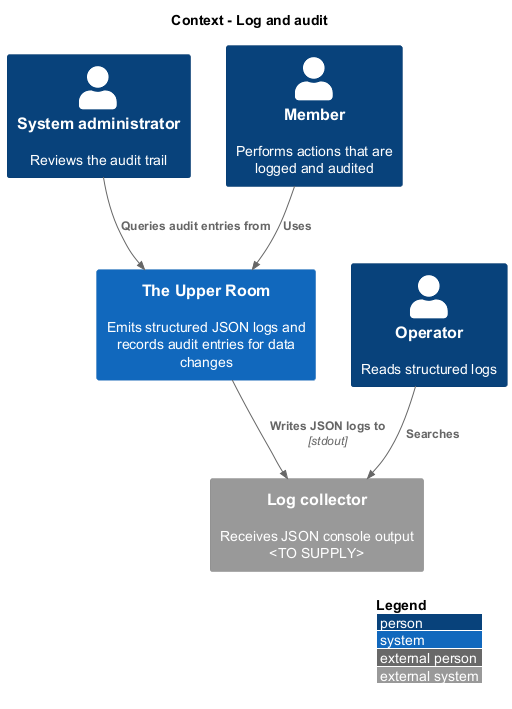
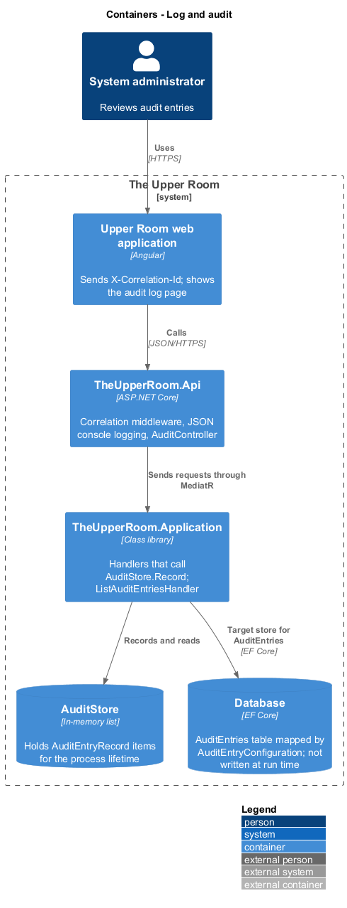
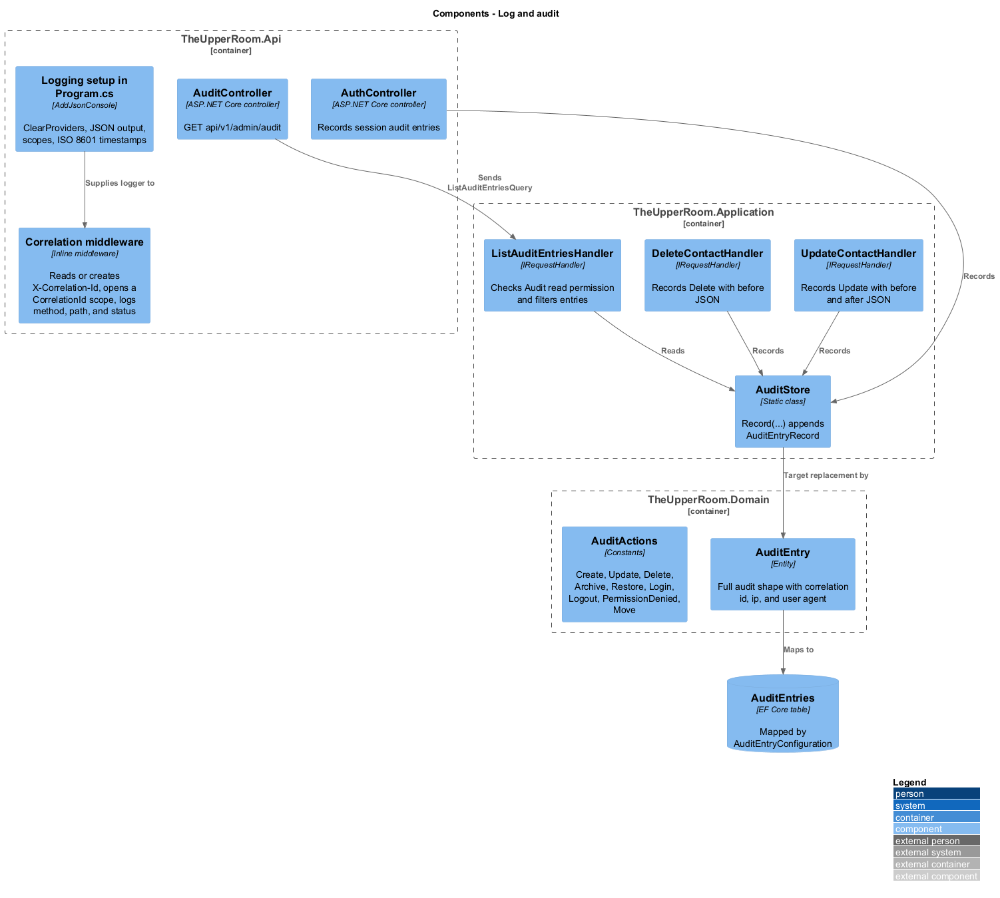
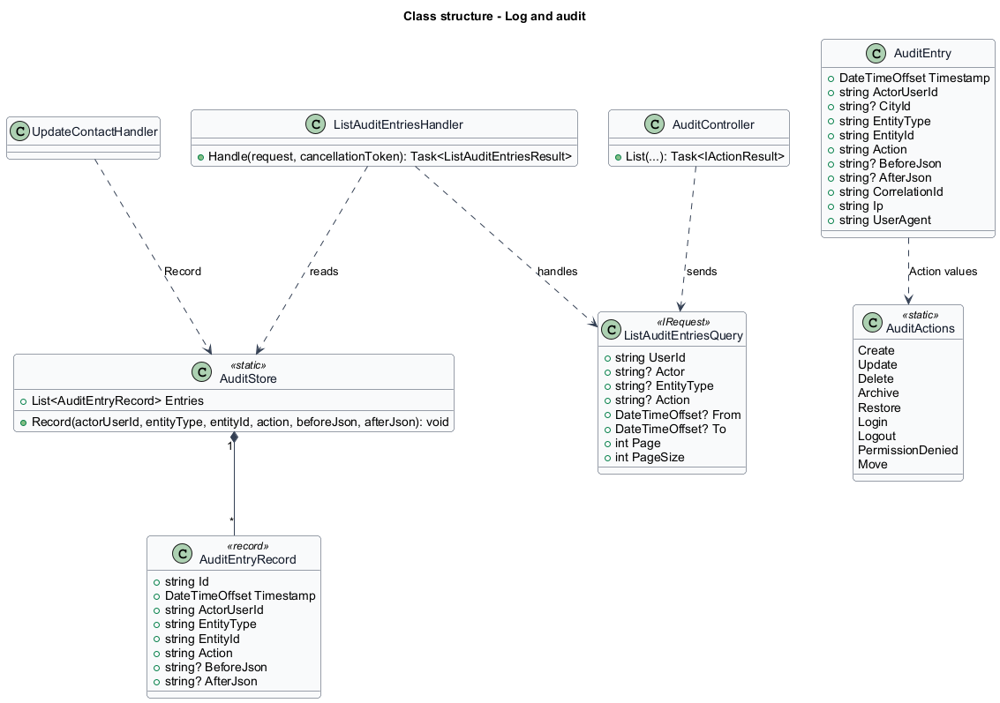
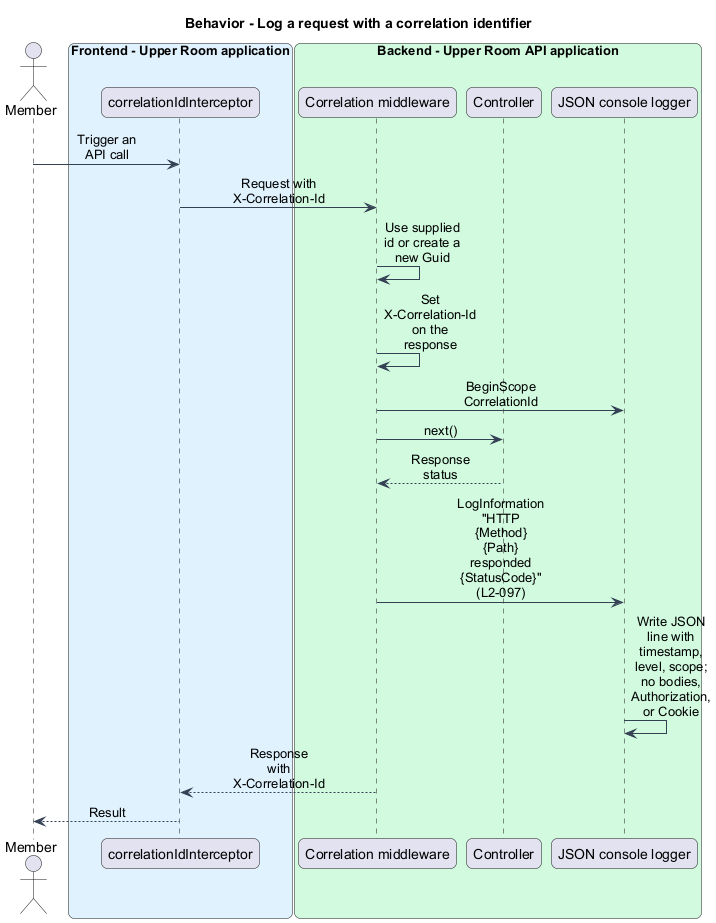
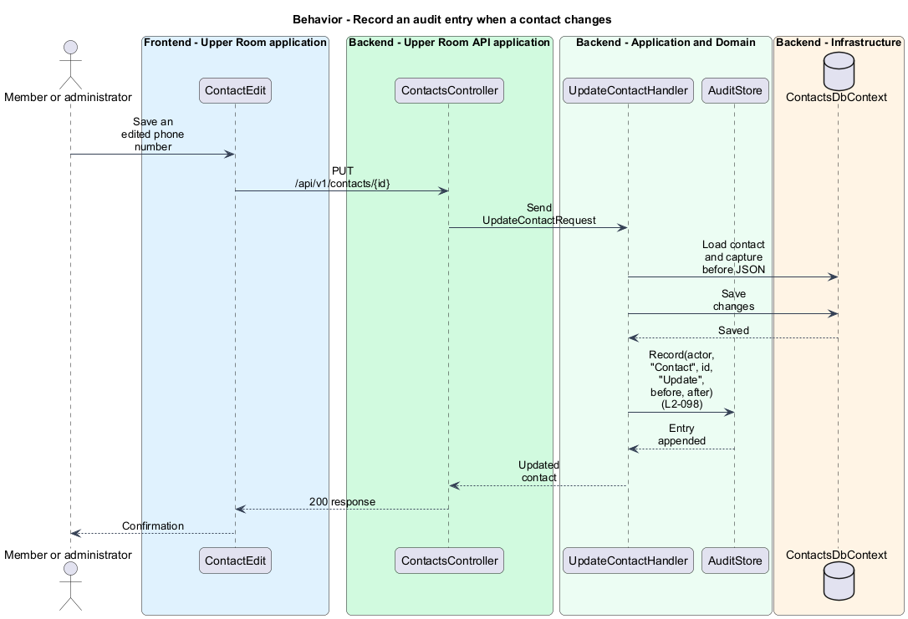
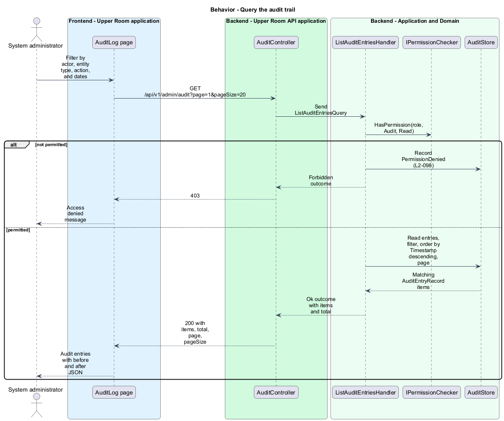

# Log and audit

## Overview

The Upper Room records two kinds of operational evidence: structured log lines that describe each request, and audit entries that describe each change to business data.

**structured log** — log line emitted as a JSON object with named fields instead of free text

**correlation identifier** — value carried in the `X-Correlation-Id` header that ties one request to its log lines and audit entries

**audit entry** — record of one create, update, delete, or similar action with the actor, the target, and the data before and after

This slice covers structured logging (L2-097) and the audit trail (L2-098).

## Description

### Existing implementation

| Source | Concrete elements | Observed surface |
|---|---|---|
| [backend/src/TheUpperRoom.Api/Program.cs](../../../../backend/src/TheUpperRoom.Api/Program.cs) | JSON console logging and correlation middleware | `ClearProviders`, `AddJsonConsole` with scopes and `O` timestamps; middleware reads or creates `X-Correlation-Id`, echoes it, opens a `CorrelationId` scope, and logs `HTTP {Method} {Path} responded {StatusCode}` |
| [backend/tests/TheUpperRoom.Application.Tests/LoggingScrubberTests.cs](../../../../backend/tests/TheUpperRoom.Application.Tests/LoggingScrubberTests.cs) | `LoggingScrubberTests` | Verifies log entries exclude sensitive words and that logger templates do not name sensitive values |
| [backend/tests/TheUpperRoom.Api.Tests/Logging/StructuredLoggingTests.cs](../../../../backend/tests/TheUpperRoom.Api.Tests/Logging/StructuredLoggingTests.cs) | `StructuredLoggingTests` | Verifies no in-memory log sink and no public log-reading endpoint |
| [backend/src/TheUpperRoom.Application/Audit/AuditStore.cs](../../../../backend/src/TheUpperRoom.Application/Audit/AuditStore.cs) | `AuditStore.Record` | Static in-memory list of `AuditEntryRecord` |
| [backend/src/TheUpperRoom.Application/Audit/AuditEntryRecord.cs](../../../../backend/src/TheUpperRoom.Application/Audit/AuditEntryRecord.cs) | `AuditEntryRecord` | `Id`, `Timestamp`, `ActorUserId`, `EntityType`, `EntityId`, `Action`, `BeforeJson`, `AfterJson` |
| [backend/src/TheUpperRoom.Domain/Audit/AuditEntry.cs](../../../../backend/src/TheUpperRoom.Domain/Audit/AuditEntry.cs) | `AuditEntry` | Full shape including `CityId`, `CorrelationId`, `Ip`, and `UserAgent` |
| [backend/src/TheUpperRoom.Domain/Audit/AuditActions.cs](../../../../backend/src/TheUpperRoom.Domain/Audit/AuditActions.cs) | `AuditActions` | `Create`, `Update`, `Delete`, `Archive`, `Restore`, `Login`, `Logout`, `PermissionDenied`, `Move` |
| [backend/src/TheUpperRoom.Infrastructure/Data/Configurations/AuditEntryConfiguration.cs](../../../../backend/src/TheUpperRoom.Infrastructure/Data/Configurations/AuditEntryConfiguration.cs) | `AuditEntryConfiguration` | Maps `AuditEntries` in `AppDbContext` |
| [backend/src/TheUpperRoom.Application/Contacts/UpdateContactHandler.cs](../../../../backend/src/TheUpperRoom.Application/Contacts/UpdateContactHandler.cs) | Contact handlers | `CreateContactHandler`, `UpdateContactHandler`, `PatchContactHandler`, `SetContactArchivedHandler`, and `DeleteContactHandler` call `AuditStore.Record` |
| [backend/src/TheUpperRoom.Api/Auth/AuthController.cs](../../../../backend/src/TheUpperRoom.Api/Auth/AuthController.cs) | `AuthController` | Records `Session` entries for sign-in and exchange outcomes |
| [backend/src/TheUpperRoom.Application/Audit/ListAuditEntriesHandler.cs](../../../../backend/src/TheUpperRoom.Application/Audit/ListAuditEntriesHandler.cs) | `ListAuditEntriesHandler` | Checks the `Audit` read permission, records `PermissionDenied` on refusal, filters by actor, entity type, action, and date range, and pages results |
| [backend/src/TheUpperRoom.Api/Audit/AuditController.cs](../../../../backend/src/TheUpperRoom.Api/Audit/AuditController.cs) | `AuditController` | `GET api/v1/admin/audit` |
| [backend/tests/TheUpperRoom.Application.Tests/AuditInterceptorTests.cs](../../../../backend/tests/TheUpperRoom.Application.Tests/AuditInterceptorTests.cs) | `AuditInterceptorTests` | Verifies a contact patch records before and after JSON and a login records an entry |

### Target behavior and interfaces

- **Logging:** Serilog writes JSON entries carrying `timestamp`, `level`, `message`, `correlationId`, `userId`, `cityId`, `sourceContext`, `requestPath`, `requestMethod`, `statusCode`, and `elapsedMs`. Bodies, `Authorization`, `Cookie`, and any field containing `password`, `token`, or `secret` are excluded (L2-097).
- **Audit:** Each create, update, and delete on the listed entity types writes an `AuditEntries` row with the fields enumerated in L2-098, including `before` and `after` JSON (L2-098).

### Gaps and compatibility

- The host uses `AddJsonConsole` from `Microsoft.Extensions.Logging`, not Serilog. Provider choice is `<TO SUPPLY>`.
- Request logs contain method, path, status, and the `CorrelationId` scope. `userId`, `cityId`, `elapsedMs`, and `sourceContext` as explicit fields are target additions. The middleware does not add a body or header to logs.
- The correlation middleware runs after exception handling, so `elapsedMs` and the final status of unhandled exceptions are `<TO SUPPLY>`.
- `AuditStore` is a process-local static list; entries do not survive restart and do not reach the `AuditEntries` table. Persistence is a target change.
- `AuditEntryRecord` omits `cityId`, `correlationId`, `ip`, and `userAgent`; `AuditStore.Record` takes no city or request context.
- Only contact handlers and authentication record entries. Partners, tags, notes, boards, columns, cards, ideas, events, locations, users, roles, and invitations are not yet audited.
- The existing action values include `Unarchive`, `Locked`, `Failure`, and `Success`, which are not in `AuditActions` or L2-098.
- `AuditController` and `ListAuditEntriesHandler` read the in-memory store.

Production implementation shall follow [AGENTS.md](../../../../AGENTS.md), including incremental acceptance testing.

## Requirements

The table preserves the requirement statement and parent identifier. Acceptance criteria remain in the linked specification.

| L2 ID | Refines (L1) | Requirement |
|---|---|---|
| [L2-097](../../../specs/L2.md#l2-097-structured-logging) | `L1-021` | Backend must use Serilog with JSON output. Every log entry must include `timestamp` (ISO 8601 UTC), `level`, `message`, `correlationId`, `userId` (if authenticated), `cityId` (if scoped), `sourceContext`, `requestPath`, `requestMethod`, `statusCode`, `elapsedMs`. Logs must NOT include request/response bodies, headers `Authorization`, `Cookie`, or any field containing `password`, `token`, `secret` (case-insensitive). |
| [L2-098](../../../specs/L2.md#l2-098-audit-trail) | `L1-021` | Every create/update/delete on Contact, Partner, Tag, Note, KanbanBoard, KanbanColumn, KanbanCard, Idea, Event, Location, User, Role, Invitation must produce an `AuditEntries` row containing `id`, `timestamp`, `actorUserId`, `cityId`, `entityType`, `entityId`, `action` (Create/Update/Delete/Archive/Restore/Login/Logout/PermissionDenied), `before` (json), `after` (json), `correlationId`, `ip`, `userAgent`. |

## Diagrams

### System context

The context shows the people who generate, read, and review logs and audit entries.

### Container view

The container view separates logging in the API from audit recording in the Application layer and the audit store.

### Component view

The component view shows the logging setup, correlation middleware, handlers that record audit entries, and the domain `AuditEntry` that the target table stores.

### Type structure

The structure view contrasts the existing `AuditEntryRecord` with the fuller domain `AuditEntry`.

### Log a request with a correlation identifier

The middleware assigns a correlation identifier, opens a logging scope, and writes one JSON line per request without bodies or credential headers.

### Record an audit entry when a contact changes

A contact update handler captures before and after JSON and records an entry after saving.

### Query the audit trail

An administrator lists entries through the audit endpoint. A caller without `Audit` read permission receives 403 and the refusal is itself recorded as `PermissionDenied`.

