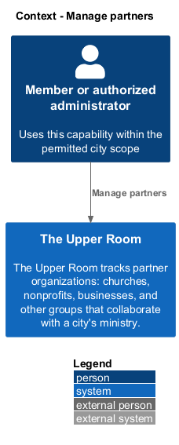
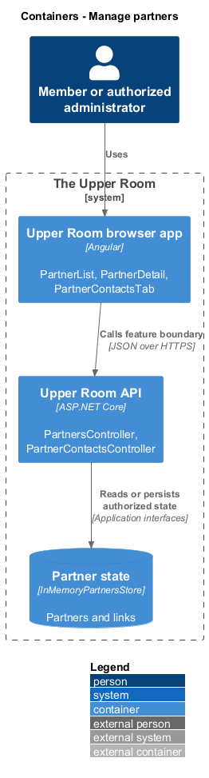
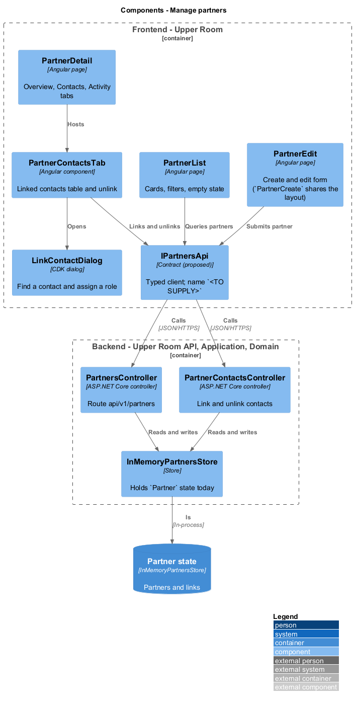
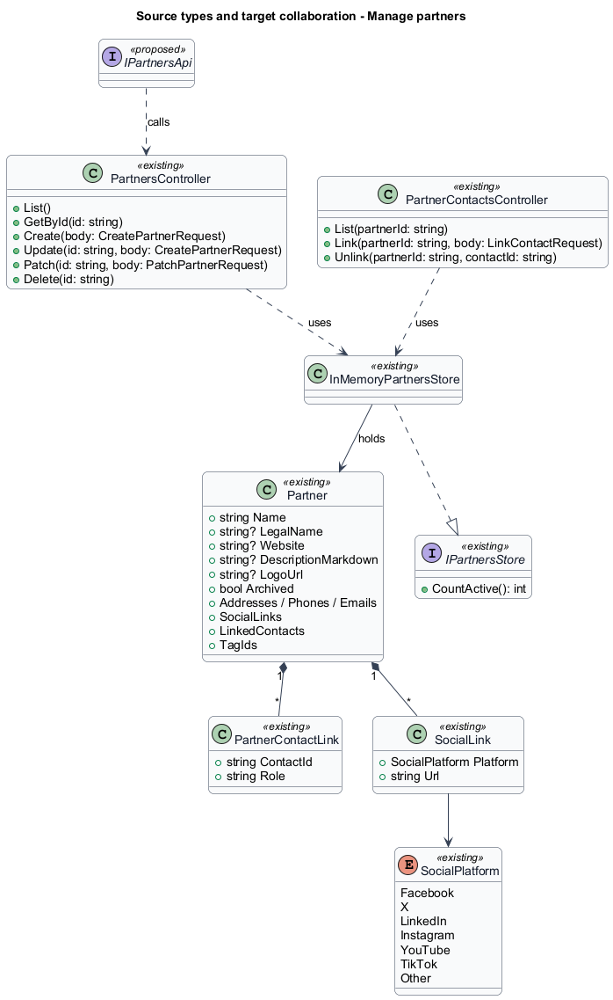
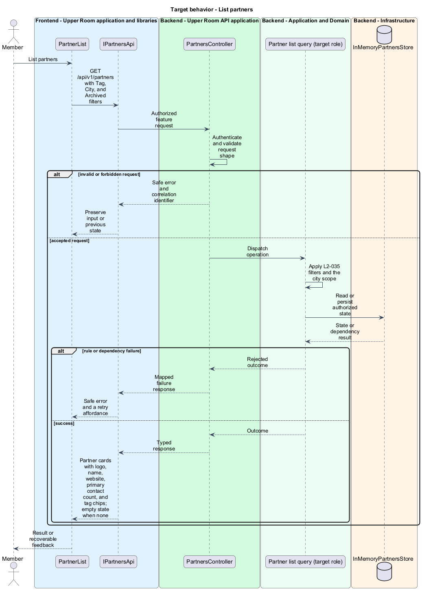
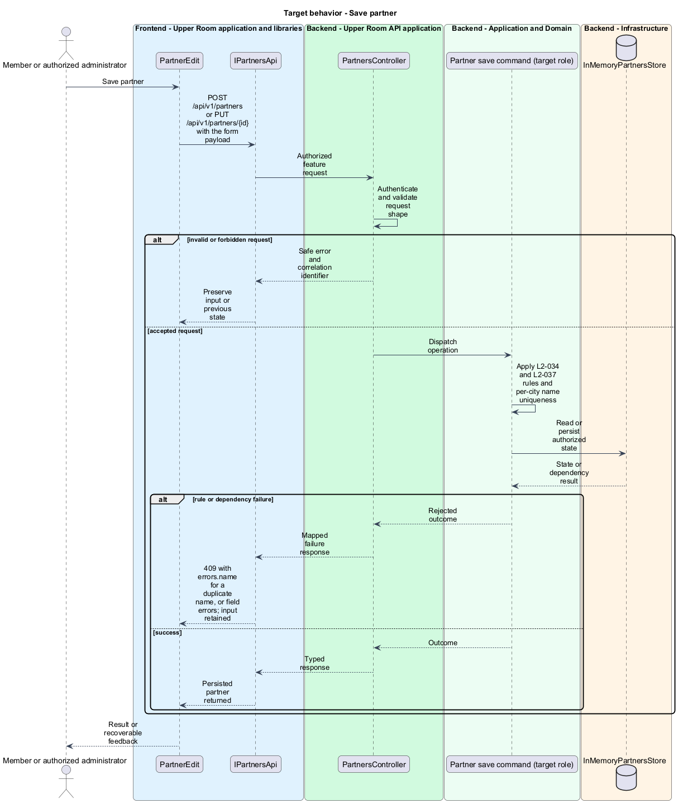
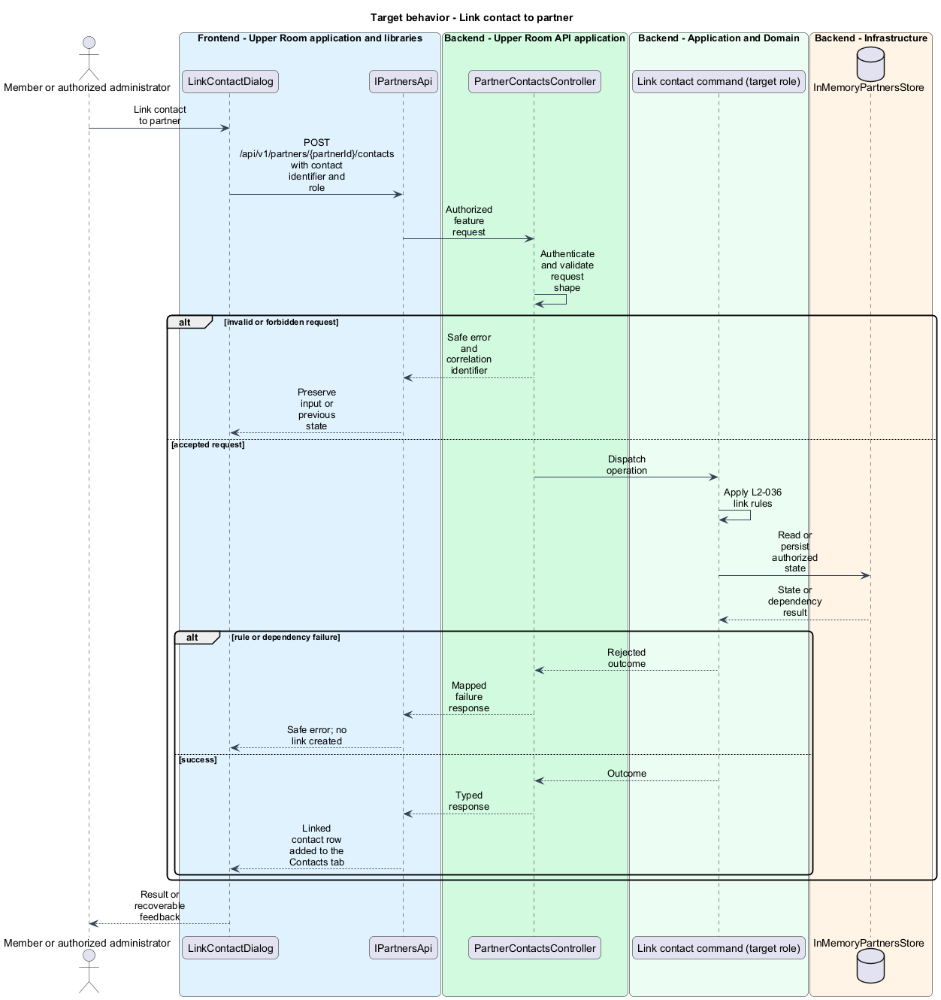
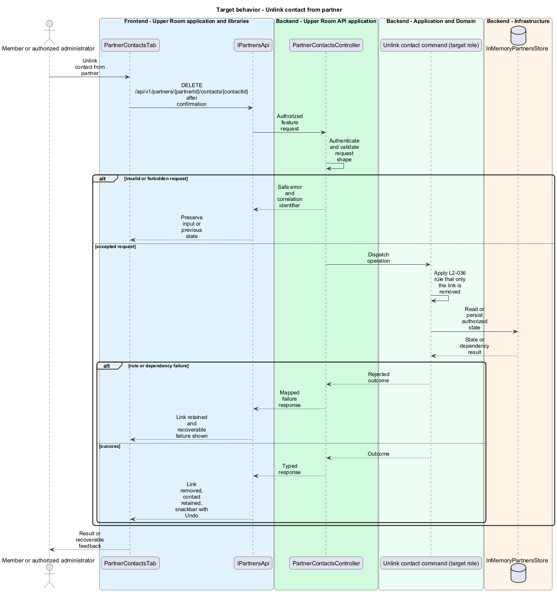

# Manage partners

## Overview

The Upper Room tracks partner organizations: churches, nonprofits, businesses, and other groups that collaborate with a city's ministry.

**partner** — city-scoped organization record with basic info, contact methods, social links, linked contacts, tags, and notes.

**linked contact** — association between a partner and an existing contact, carrying a role such as "Primary Contact".

The feature covers the partner data model, the list page, the detail page with its Contacts tab, and the create and edit form.

## Description

### Existing implementation

The following source elements provide the current implementation points. Their presence does not establish complete requirement coverage.

| Source | Concrete elements | Observed surface |
|---|---|---|
| [frontend/projects/the-upper-room/src/app/partners/partner-list/partner-list.ts](../../../../frontend/projects/the-upper-room/src/app/partners/partner-list/partner-list.ts) | `Partner`, `PartnerList` | Injects `HttpClient` and `PERMISSIONS_SERVICE`; renders cards, filters, and the empty state |
| [frontend/projects/the-upper-room/src/app/partners/partner-detail/partner-detail.ts](../../../../frontend/projects/the-upper-room/src/app/partners/partner-detail/partner-detail.ts) | `PartnerDetail` | Injects `HttpClient`, `ActivatedRoute`, `Router`, `Title`, `SnackbarService`, `ConfirmService` |
| [frontend/projects/the-upper-room/src/app/partners/partner-contacts-tab/partner-contacts-tab.ts](../../../../frontend/projects/the-upper-room/src/app/partners/partner-contacts-tab/partner-contacts-tab.ts) | `LinkedContact`, `PartnerContactsTab` | Lists linked contacts; calls `DELETE /api/v1/partners/{partnerId}/contacts/{contactId}` |
| [frontend/projects/the-upper-room/src/app/partners/link-contact-dialog/link-contact-dialog.ts](../../../../frontend/projects/the-upper-room/src/app/partners/link-contact-dialog/link-contact-dialog.ts) | `LinkContactDialogData`, `LinkContactDialog` | Searches contacts and assigns a role |
| [frontend/projects/the-upper-room/src/app/partners/partner-create/partner-create.ts](../../../../frontend/projects/the-upper-room/src/app/partners/partner-create/partner-create.ts) | `PartnerCreate` | Form page using `HttpClient`, `ConfirmService`, `SnackbarService` |
| [frontend/projects/the-upper-room/src/app/partners/partner-edit/partner-edit.ts](../../../../frontend/projects/the-upper-room/src/app/partners/partner-edit/partner-edit.ts) | `SOCIAL_PLATFORMS`, `PartnerEdit` | Edit form page with the social platform list |
| [backend/src/TheUpperRoom.Domain/Partners/Partner.cs](../../../../backend/src/TheUpperRoom.Domain/Partners/Partner.cs) | `Partner`, `PartnerContactLink`, `SocialLink`, `SocialPlatform` | City-scoped auditable entity; `Name` guarded to 200 characters; `SocialLink` requires an http or https URL |
| [backend/src/TheUpperRoom.Api/Partners/PartnersController.cs](../../../../backend/src/TheUpperRoom.Api/Partners/PartnersController.cs) | `PartnersController` | Route `api/v1/partners`; `HttpGet`, `HttpGet {id}`, `HttpPost`, `HttpPut {id}`, `HttpPatch {id}`, `HttpDelete {id}` |
| [backend/src/TheUpperRoom.Api/Partners/PartnerContactsController.cs](../../../../backend/src/TheUpperRoom.Api/Partners/PartnerContactsController.cs) | `PartnerContactsController` | Route `api/v1/partners/{partnerId}/contacts`; list, link, and unlink |
| [backend/src/TheUpperRoom.Api/Partners/InMemoryPartnersStore.cs](../../../../backend/src/TheUpperRoom.Api/Partners/InMemoryPartnersStore.cs) | `InMemoryPartnersStore`, `PartnerDto`, `CreatePartnerRequest`, `PatchPartnerRequest`, `LinkContactRequest`, `LinkedContactDto`, `SocialLinkDto`, `TagRef` | Current in-memory persistence hosted in the API project |
| [backend/src/TheUpperRoom.Application/Partners/IPartnersStore.cs](../../../../backend/src/TheUpperRoom.Application/Partners/IPartnersStore.cs) | `IPartnersStore` | Read surface exposing `CountActive()` to dashboard and search consumers |

### Target behavior and interfaces

`PartnerList`, `PartnerDetail`, `PartnerContactsTab`, `PartnerCreate`, and `PartnerEdit` shall call a typed partners API contract (`IPartnersApi` with an injection token, name `<TO SUPPLY>`) instead of `HttpClient`. The API shall enforce the `Partner` rules, including per-city name uniqueness, and shall return `409` with the prescribed message for a duplicate name.

- **List partners:** `GET /api/v1/partners` with tag, city, and archived filters.
- **Save partner:** `POST /api/v1/partners` and `PUT /api/v1/partners/{id}` validate the payload and persist the partner.
- **Link contact:** `POST /api/v1/partners/{partnerId}/contacts` stores the contact and role on the link.
- **Unlink contact:** `DELETE /api/v1/partners/{partnerId}/contacts/{contactId}` removes only the link.

Diagrams show target collaborations. Existing source types retain their names. Participants marked as proposed or target roles describe interfaces to introduce, not existing classes.

### Gaps and compatibility

Partners persist in `InMemoryPartnersStore` in the API project; a relational store behind an application-layer interface is a target change (`<TO SUPPLY>`). `PartnersController` has no MediatR handlers today, so business rules sit outside the application layer. The database-backed uniqueness check and `version` concurrency field are not verified in source.

Production implementation shall follow [AGENTS.md](../../../../AGENTS.md), including incremental acceptance testing. API integrations shall preserve documented behavior until an explicit compatibility change is approved.

## Requirements

The table preserves each requirement statement and all parent identifiers. The expandable source excerpts retain the acceptance criteria verbatim.

| L2 ID | Refines (L1) | Requirement |
|---|---|---|
| [L2-034](../../../specs/L2.md#l2-034-partner-data-model) | `L1-005` | A Partner must have: `id`, `cityId`, `name` (required, 1-200, unique within city), `legalName` (optional), `website` (optional, valid URL), `description` (optional, markdown, max 2000), `logoUrl`, `addresses`, `phones`, `emails`, `socialLinks` (0..n: platform enum [Facebook, X, LinkedIn, Instagram, YouTube, TikTok, Other], url), `linkedContacts` (m..n with role on the link, e.g. "Primary Contact"), `tags`, `notes`, `archived`, `createdAt`, `createdBy`, `updatedAt`, `updatedBy`, `version`. |
| [L2-035](../../../specs/L2.md#l2-035-partner-list-page) | `L1-005`, `L1-027` | Route `/partners` mirrors L2-030 with cards showing logo (48px), name, website, primary contact count, tag chips. Filters: Tag, City, Archived. Empty state icon `domain_disabled`, heading "No partners yet", body "Add a partner organization to track your collaborations.". |
| [L2-036](../../../specs/L2.md#l2-036-partner-detail-page) | `L1-005` | Route `/partners/:id` shows tabs "Overview", "Contacts", "Activity". The Contacts tab lists linked contacts in a `mat-table` (Name, Role on Partner, Primary Phone, Primary Email, Actions). A "Link contact" button opens a search dialog that lets the user find an existing contact and assign a role. |
| [L2-037](../../../specs/L2.md#l2-037-partner-create-edit-form) | `L1-005`, `L1-028` | Same layout as L2-032 with sections "Basic info", "Contact methods", "Addresses", "Social", "Linked contacts", "Tags & Notes". The website field validates against `^https?://` and shows a "Visit" trailing icon button that opens in a new tab once valid. |

L2-034: Partner Data Model — specification excerpt

A Partner must have: `id`, `cityId`, `name` (required, 1-200, unique within city), `legalName` (optional), `website` (optional, valid URL), `description` (optional, markdown, max 2000), `logoUrl`, `addresses`, `phones`, `emails`, `socialLinks` (0..n: platform enum [Facebook, X, LinkedIn, Instagram, YouTube, TikTok, Other], url), `linkedContacts` (m..n with role on the link, e.g. "Primary Contact"), `tags`, `notes`, `archived`, `createdAt`, `createdBy`, `updatedAt`, `updatedBy`, `version`.

**Acceptance Criteria:**
1. Given a partner name duplicating an existing partner in the same city, when submitted, then the API returns 409 with `{ "errors": { "name": ["A partner named '{name}' already exists in {city}."] } }`.

L2-035: Partner List Page — specification excerpt

Route `/partners` mirrors L2-030 with cards showing logo (48px), name, website, primary contact count, tag chips. Filters: Tag, City, Archived. Empty state icon `domain_disabled`, heading "No partners yet", body "Add a partner organization to track your collaborations.".

**Acceptance Criteria:**
1. Given a partner has no logo, when rendered, then the avatar slot displays the first letter of the partner's name on a `--md-sys-color-tertiary-container` background with `--md-sys-color-on-tertiary-container` text.

L2-036: Partner Detail Page — specification excerpt

Route `/partners/:id` shows tabs "Overview", "Contacts", "Activity". The Contacts tab lists linked contacts in a `mat-table` (Name, Role on Partner, Primary Phone, Primary Email, Actions). A "Link contact" button opens a search dialog that lets the user find an existing contact and assign a role.

**Acceptance Criteria:**
1. Given a partner has 5 linked contacts, when the Contacts tab is open, then all 5 rows are visible and clickable through to the contact detail page.
2. Given the user removes a contact link, when confirmed, then the contact itself is NOT deleted, only the link, and a snackbar "Contact unlinked from {partner name}" with "Undo" appears.

L2-037: Partner Create/Edit Form — specification excerpt

Same layout as L2-032 with sections "Basic info", "Contact methods", "Addresses", "Social", "Linked contacts", "Tags & Notes". The website field validates against `^https?://` and shows a "Visit" trailing icon button that opens in a new tab once valid.

**Acceptance Criteria:**
1. Given the website field has the value `example.com`, when the form is submitted, then a validation error "Website must start with http:// or https://" appears.

## Diagrams

### System context

The context identifies the people and application boundary used by this capability.

### Container view

The container view separates browser execution from backend state responsibility.

### Target component view

The component view shows target collaborations between the concrete implementation points and proposed responsibilities.

### Type structure

The structure view lists source types with declared members where available. Types marked proposed describe interfaces to introduce.

### List partners

The flow performs the following operation: GET /api/v1/partners with Tag, City, and Archived filters. Its successful outcome is: Partner cards with logo, name, website, primary contact count, and tag chips; empty state when none. The alternate branch yields: Safe error and a retry affordance.

### Save partner

The flow performs the following operation: POST /api/v1/partners or PUT /api/v1/partners/{id} with the form payload. Its successful outcome is: Persisted partner returned. The alternate branch yields: 409 with errors.name for a duplicate name, or field errors; input retained.

### Link contact to partner

The flow performs the following operation: POST /api/v1/partners/{partnerId}/contacts with contact identifier and role. Its successful outcome is: Linked contact row added to the Contacts tab. The alternate branch yields: Safe error; no link created.

### Unlink contact from partner

The flow performs the following operation: DELETE /api/v1/partners/{partnerId}/contacts/{contactId} after confirmation. Its successful outcome is: Link removed, contact retained, snackbar with Undo. The alternate branch yields: Link retained and recoverable failure shown.

