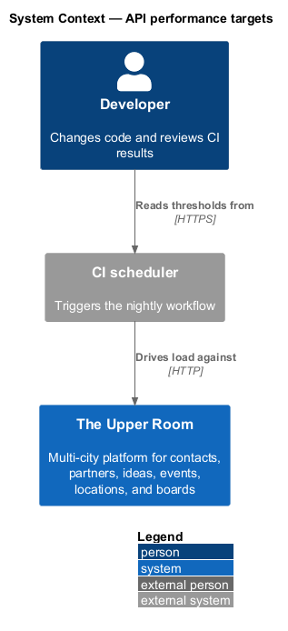
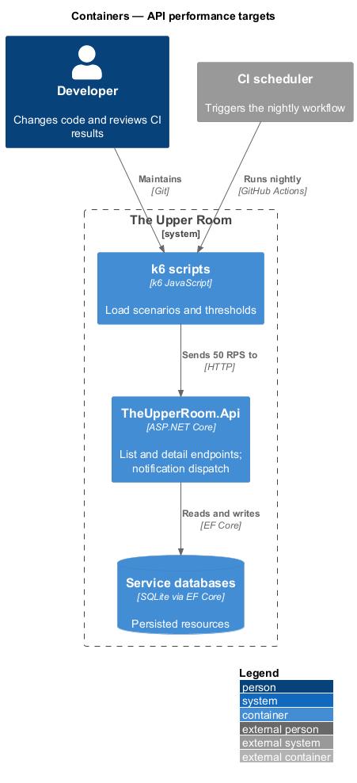
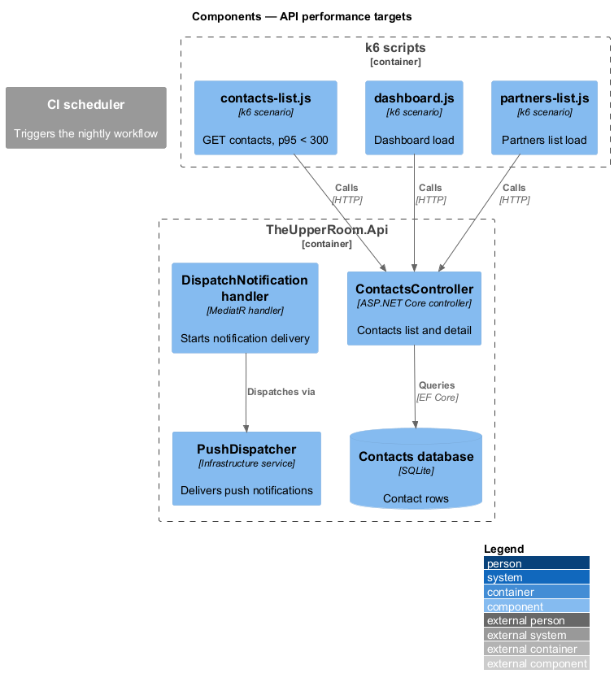
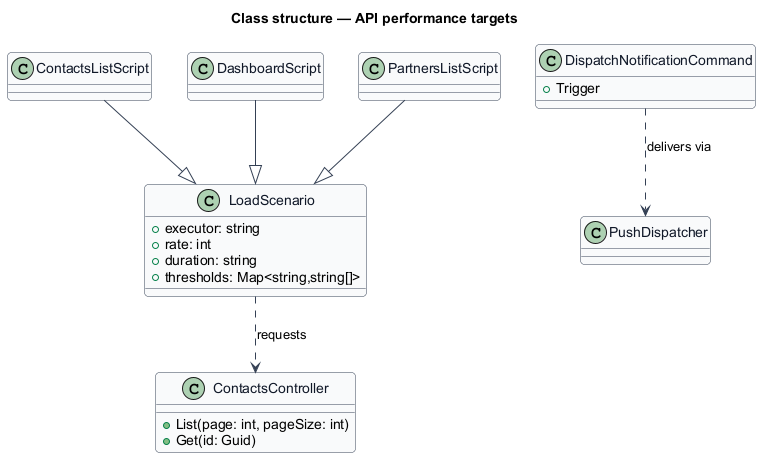
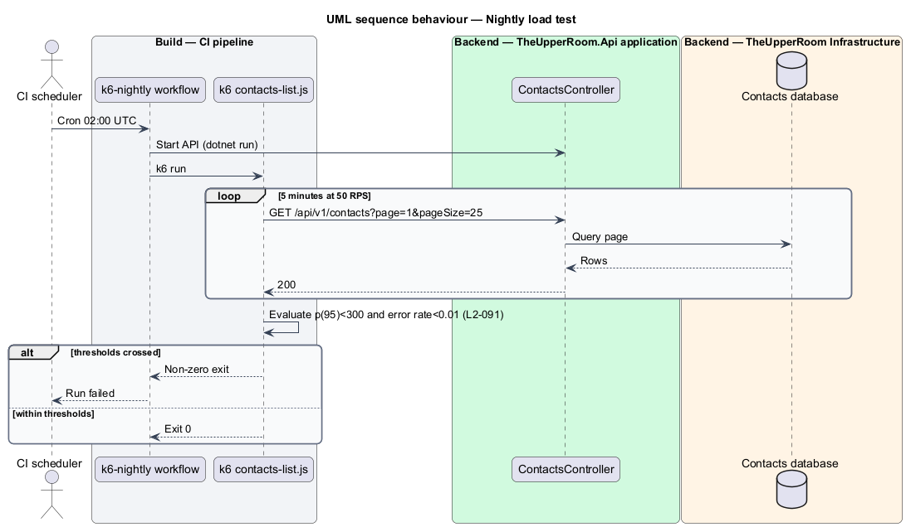
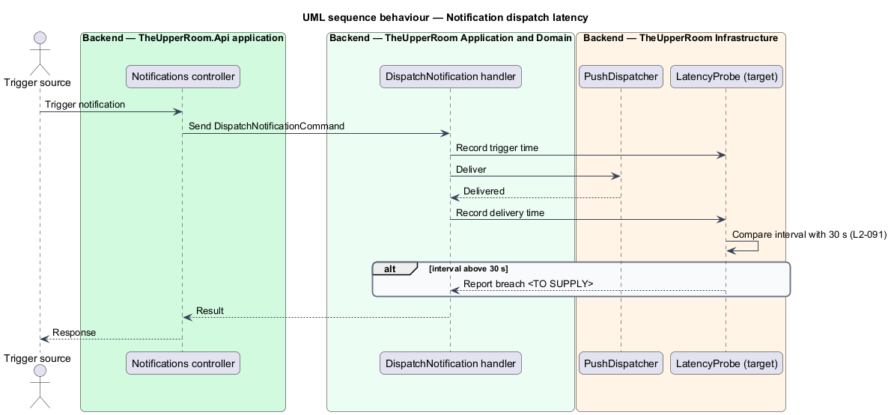

# API performance targets

## Overview

Members expect list and detail screens to respond quickly under shared load. This feature defines how the API response-time targets are measured with load tests and how notification dispatch latency is bounded.

**p95** — response time under which 95% of requests complete

**k6** — scriptable load-testing tool that drives HTTP scenarios and evaluates thresholds

The feature is a capability slice that spans the nightly load-test workflow, the list and detail endpoints, and the notification dispatch path.

## Description

### Existing implementation

The following source elements provide the current implementation points. Their presence does not establish complete requirement coverage.

| Source | Concrete elements | Observed surface |
|---|---|---|
| [k6/contacts-list.js](../../../../k6/contacts-list.js) | Scenario `steady_load` | Constant arrival rate 50/s for 5m; thresholds `http_req_duration p(95)<300`, `http_req_failed rate<0.01` |
| [k6/dashboard.js](../../../../k6/dashboard.js) | k6 scenario | Dashboard load script |
| [k6/partners-list.js](../../../../k6/partners-list.js) | k6 scenario | Partners list load script |
| [.github/workflows/k6-nightly.yml](../../../../.github/workflows/k6-nightly.yml) | Workflow `k6 Load Tests (Nightly)` | Cron `0 2 * * *` and manual dispatch; starts the API with `dotnet run`, installs k6, runs the scripts |
| [backend/src/TheUpperRoom.Application/Notifications/DispatchNotificationCommandValidator.cs](../../../../backend/src/TheUpperRoom.Application/Notifications/DispatchNotificationCommandValidator.cs) | Notification dispatch command validation | Dispatch entry point for notifications |
| [backend/src/TheUpperRoom.Infrastructure/Notifications](../../../../backend/src/TheUpperRoom.Infrastructure/Notifications) | `PushDispatcher`, `MailStore` | Delivery of push and mail notifications |

### Target behavior and interfaces

Each list endpoint shall return within 300 ms p95 and each detail endpoint within 200 ms p95 at 50 RPS in a load test. The error rate shall remain below 1%.

Notification dispatch shall complete within 30 s of its trigger. A trigger-to-delivery measurement `<TO SUPPLY>` shall report that interval.

### Gaps and compatibility

- Load scripts exist for contacts, dashboard, and partners lists only; remaining list endpoints and all detail endpoints have no script (`<TO SUPPLY>`).
- The detail-endpoint threshold of 200 ms is not asserted by any script.
- No automated check measures the 30 s notification dispatch bound.
- The nightly workflow runs against a locally started API with SQLite; the data volume `<TO SUPPLY>`.

Production implementation shall follow [AGENTS.md](../../../../AGENTS.md), including incremental acceptance testing. Existing behavior shall remain compatible until an explicit change is approved.

## Requirements

The table preserves the requirement statement and all parent identifiers. The expandable source excerpts retain the complete normative text and acceptance criteria verbatim.

| L2 ID | Refines (L1) | Requirement |
|---|---|---|
| [L2-091](../../../specs/L2.md#l2-091-api-performance-targets) | `L1-019` | Each list endpoint must return within 300ms p95 under 50 RPS in a load test. The detail endpoints within 200ms p95. Background jobs (notifications dispatch) must process within 30s of trigger. |

L2-091: API Performance Targets — specification excerpt

Each list endpoint must return within 300ms p95 under 50 RPS in a load test. The detail endpoints within 200ms p95. Background jobs (notifications dispatch) must process within 30s of trigger.

**Acceptance Criteria:**
1. Given a k6 load test of `GET /api/v1/contacts?page=1&pageSize=25` at 50 RPS for 5 minutes, when complete, then p95 <= 300ms and error rate < 1%.

## Diagrams

### System context

The context identifies the people and external systems around this capability.

### Container view

The container view separates browser, API, build, and data responsibilities for this capability.

### Component view

The component view shows the concrete implementation points and the target responsibilities that collaborate in this slice.

### Type structure

The structure view lists the types in this slice with members where known. Dashed dependencies denote target collaboration rather than verified current dependency direction.

### Nightly load test

The sequence shows the scheduled workflow starting the API, driving 50 RPS for five minutes, and failing when thresholds are crossed.

### Notification dispatch within 30 seconds

The sequence shows a trigger starting delivery and a target check comparing the delivery time with the 30 s bound.

