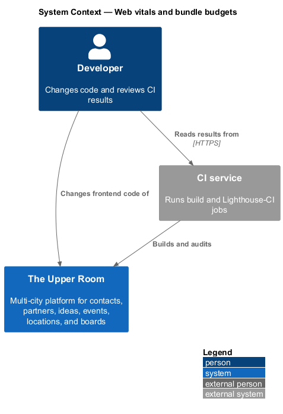
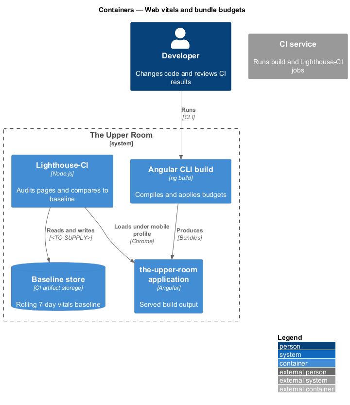
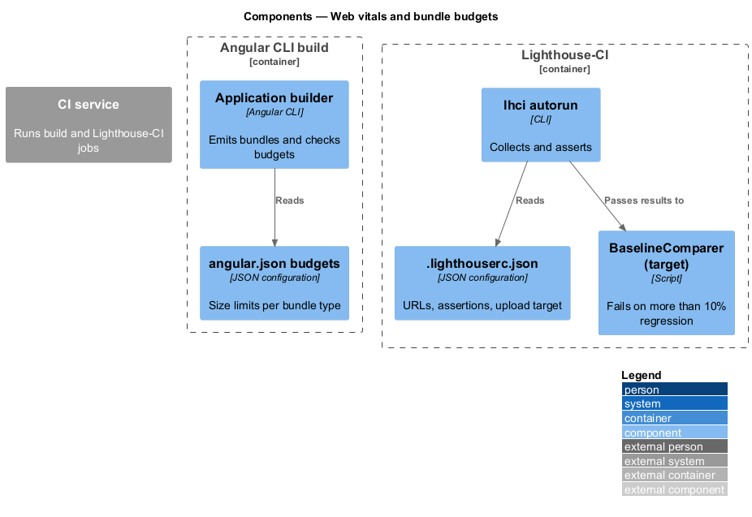
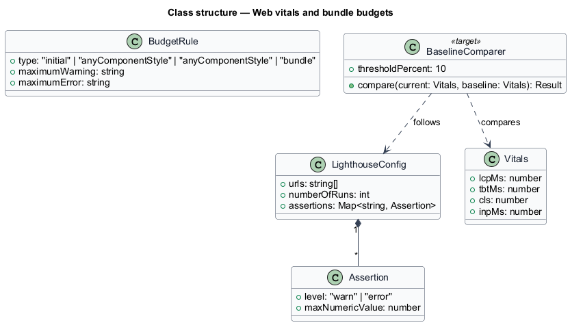
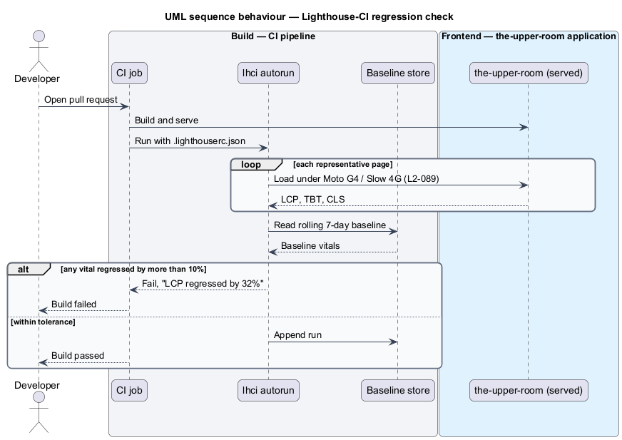
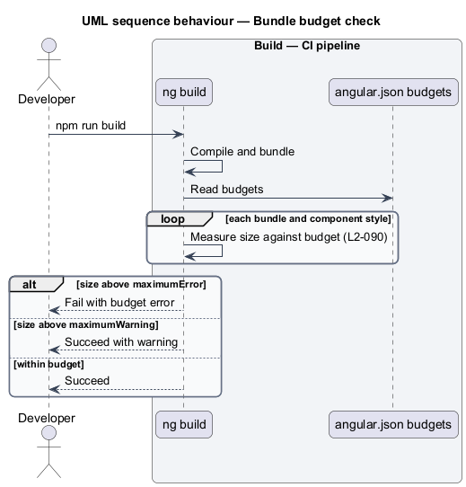

# Web vitals and bundle budgets

## Overview

Page load speed on low-end mobile devices determines whether members can use the application on a weak connection. This feature defines the automated checks that keep the frontend within its performance budgets.

**Core Web Vitals** — user-centered measures of load speed (LCP), responsiveness (INP), and visual stability (CLS)

**bundle budget** — Angular CLI size limit that raises a warning or fails the build when an output exceeds it

The feature is a build-time capability slice: Lighthouse-CI runs against served pages, and `ng build` enforces budgets declared in `angular.json`.

## Description

### Existing implementation

The following source elements provide the current implementation points. Their presence does not establish complete requirement coverage.

| Source | Concrete elements | Observed surface |
|---|---|---|
| [.lighthouserc.json](../../../../.lighthouserc.json) | Lighthouse-CI `collect`, `assert`, `upload` | Four URLs (`/`, `/contacts`, `/ideas`, `/boards`); one run; preset `lighthouse:recommended`; LCP 2500, TBT 300, CLS 0.1, interactive 5000 as `warn`; temporary public storage upload |
| [frontend/angular.json](../../../../frontend/angular.json) | `budgets` of the production configuration | `initial` warning 1MB, error 2MB; `anyComponentStyle` warning 8kB, error 16kB; `outputHashing: all` |
| [frontend/package.json](../../../../frontend/package.json) | Scripts `build`, `build:libs` | `ng build` runs the production configuration by default |

### Target behavior and interfaces

Lighthouse-CI shall run on sign-in, dashboard, contacts list, contact detail, calendar, and board view under the Moto G4 / Slow 4G mobile profile, and shall fail a build when a vital regresses by more than 10% from the rolling 7-day baseline.

`angular.json` shall enforce the initial bundle at warning `400kB` and error `600kB`, gzipped warning `120kB` and error `180kB`, component styles at `4kB` and `8kB`, and lazy route bundles at `200kB` and `300kB`.

### Gaps and compatibility

- Existing budgets (initial 1MB/2MB, component style 8kB/16kB) differ from the required values; no gzipped or lazy-route budget exists. Aligning them is a target change.
- Existing Lighthouse assertions use `warn`, cover four URLs, and set no baseline comparison; failure at 10% regression requires a stored baseline `<TO SUPPLY>`.
- No CI workflow runs Lighthouse-CI; the only workflow located is `k6-nightly.yml`. The workflow file and baseline store are `<TO SUPPLY>`.
- INP is a field metric; the lab proxy used by Lighthouse-CI `<TO SUPPLY>`.

Production implementation shall follow [AGENTS.md](../../../../AGENTS.md), including incremental acceptance testing. Existing behavior shall remain compatible until an explicit change is approved.

## Requirements

The table preserves the requirement statement and all parent identifiers. The expandable source excerpts retain the complete normative text and acceptance criteria verbatim.

| L2 ID | Refines (L1) | Requirement |
|---|---|---|
| [L2-089](../../../specs/L2.md#l2-089-core-web-vitals-budget) | `L1-019` | The `the-upper-room` app must meet on Moto G4 / Slow 4G (Lighthouse mobile profile): LCP <= 2500ms, INP <= 200ms, CLS <= 0.1, TBT <= 300ms. CI must run Lighthouse-CI on a representative set of pages (sign-in, dashboard, contacts list, contact detail, calendar, board view) and fail builds that regress any vital by >10% from the rolling 7-day baseline. |
| [L2-090](../../../specs/L2.md#l2-090-bundle-budgets) | `L1-019` | `angular.json` must enforce: initial bundle warning at `400kB` and error at `600kB` (gzipped: warning `120kB`, error `180kB`). Per-component-style warning `4kB`, error `8kB`. Lazy-loaded route bundles warning `200kB`, error `300kB`. |

L2-089: Core Web Vitals Budget — specification excerpt

The `the-upper-room` app must meet on Moto G4 / Slow 4G (Lighthouse mobile profile): LCP <= 2500ms, INP <= 200ms, CLS <= 0.1, TBT <= 300ms. CI must run Lighthouse-CI on a representative set of pages (sign-in, dashboard, contacts list, contact detail, calendar, board view) and fail builds that regress any vital by >10% from the rolling 7-day baseline.

**Acceptance Criteria:**
1. Given a PR introduces a 1MB synchronous JS chunk on the dashboard, when CI runs, then Lighthouse-CI fails with "LCP regressed by 32%".

L2-090: Bundle Budgets — specification excerpt

`angular.json` must enforce: initial bundle warning at `400kB` and error at `600kB` (gzipped: warning `120kB`, error `180kB`). Per-component-style warning `4kB`, error `8kB`. Lazy-loaded route bundles warning `200kB`, error `300kB`.

**Acceptance Criteria:**
1. Given the initial bundle exceeds 600kB, when `ng build` runs, then it fails with the budget error.

## Diagrams

### System context

The context identifies the people and external systems around this capability.

### Container view

The container view separates browser, API, build, and data responsibilities for this capability.

### Component view

The component view shows the concrete implementation points and the target responsibilities that collaborate in this slice.

### Type structure

The structure view lists the types in this slice with members where known. Dashed dependencies denote target collaboration rather than verified current dependency direction.

### Lighthouse-CI regression check

The sequence shows a pull request build auditing each page and failing when a vital regresses beyond the allowed percentage.

### Bundle budget check during build

The sequence shows `ng build` measuring each output against the configured budgets and failing at the error threshold.

