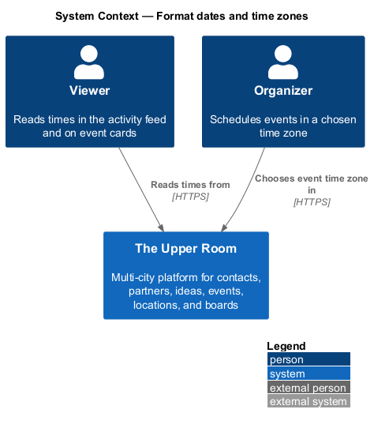
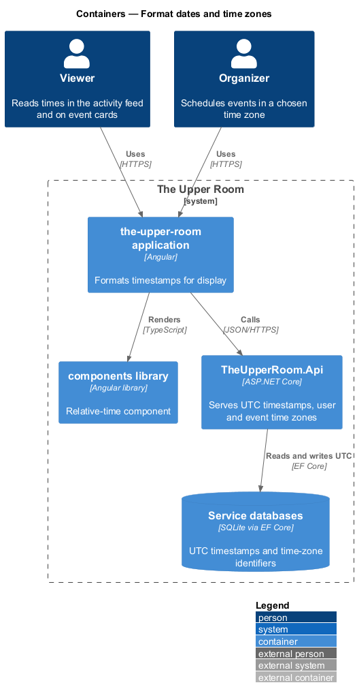
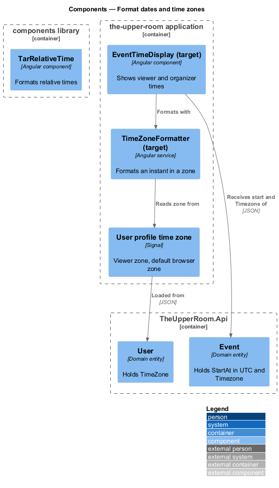
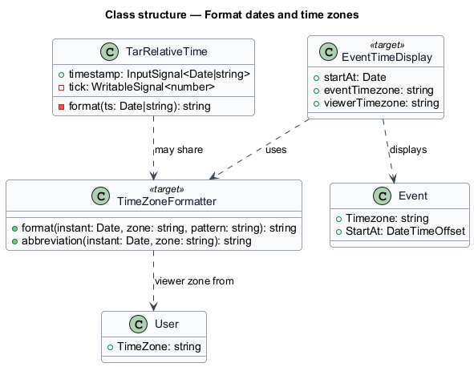
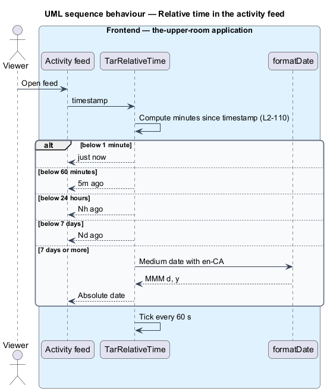
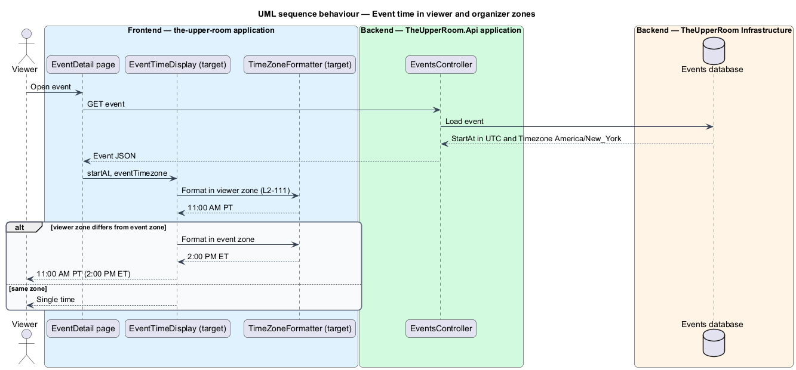

# Format dates and time zones

## Overview

Members read times in activity feeds and event cards, and events can span time zones. This feature defines how the application formats dates, numbers, and relative times, and how it converts stored UTC timestamps into the viewer and organizer zones.

**UTC** — Coordinated Universal Time, the single zone in which the server stores every timestamp

**relative time** — description of a past instant as an interval from now, such as "5m ago"

The feature is a frontend formatting capability backed by two stored values: the user profile `TimeZone` and the event `Timezone`.

## Description

### Existing implementation

The following source elements provide the current implementation points. Their presence does not establish complete requirement coverage.

| Source | Concrete elements | Observed surface |
|---|---|---|
| [frontend/projects/components/src/lib/relative-time/relative-time.ts](../../../../frontend/projects/components/src/lib/relative-time/relative-time.ts) | `TarRelativeTime` | Signal `tick` refreshed every 60 s outside the Angular zone; returns "just now", `{n}m ago`, `{n}h ago`, `{n}d ago`, else `formatDate(..., 'MMM d, y', LOCALE_ID)`; the day branch uses `days <= 7` |
| [frontend/projects/the-upper-room/src/app/i18n/dictionaries.ts](../../../../frontend/projects/the-upper-room/src/app/i18n/dictionaries.ts) | `DEFAULT_LOCALE` | `en-CA`; traces to L2-100 and L2-110 |
| [backend/src/TheUpperRoom.Domain/Users/User.cs](../../../../backend/src/TheUpperRoom.Domain/Users/User.cs) | `User.TimeZone` | Required string, default `UTC`, maximum 100 characters |
| [backend/src/TheUpperRoom.Domain/Events/Event.cs](../../../../backend/src/TheUpperRoom.Domain/Events/Event.cs) | `Event.Timezone` | Required string, maximum 100 characters |
| [frontend/projects/the-upper-room/e2e/tests/cross-cutting/timezones.spec.ts](../../../../frontend/projects/the-upper-room/e2e/tests/cross-cutting/timezones.spec.ts) | Time-zone e2e spec | Event with `startAt` `2026-06-15T19:00:00Z`; traces to L2-111 |
| [frontend/projects/the-upper-room/e2e/pages/EventDetailPage.ts](../../../../frontend/projects/the-upper-room/e2e/pages/EventDetailPage.ts) | `EventDetailPage` | Page Object used by the spec |

### Target behavior and interfaces

`DatePipe` shall format with `en-CA`: short `M/d/yy`, medium `MMM d, y`, long `MMMM d, y`, time `h:mm a`. `DecimalPipe` shall use `,` as thousands separator.

Relative times shall use "just now" below 1 minute, `{n}m ago` below 60 minutes, `{n}h ago` below 24 hours, `{n}d ago` below 7 days, and the absolute medium date otherwise.

The frontend shall format each timestamp in the user profile time zone, defaulting to the browser time zone. Event create and edit shall allow choosing the event time zone and event cards shall show organizer and viewer times when they differ, for example "11:00 AM PT (2:00 PM ET)".

### Gaps and compatibility

- `TarRelativeTime` uses English literals instead of transloco keys and treats 7 days as relative (`days <= 7`), while the requirement switches to absolute at 7 days.
- No shared time-zone formatting component was located; the viewer-and-organizer display `<TO SUPPLY>`.
- The time-zone picker in event create and edit `<TO SUPPLY>`.
- Abbreviation derivation ("PT", "ET") from IANA identifiers `<TO SUPPLY>`.

Production implementation shall follow [AGENTS.md](../../../../AGENTS.md), including incremental acceptance testing. Existing behavior shall remain compatible until an explicit change is approved.

## Requirements

The table preserves the requirement statement and all parent identifiers. The expandable source excerpts retain the complete normative text and acceptance criteria verbatim.

| L2 ID | Refines (L1) | Requirement |
|---|---|---|
| [L2-110](../../../specs/L2.md#l2-110-date-and-number-formatting) | `L1-025` | Dates are displayed via Angular's `DatePipe` configured for `en-CA`: short date `M/d/yy`, medium date `MMM d, y`, long date `MMMM d, y`, time `h:mm a`. Numbers via `DecimalPipe` with thousands separator `,`. Relative times via `transloco-locale` or `date-fns/formatDistanceToNow` with thresholds: <1m "just now", <60m "{n}m ago", <24h "{n}h ago", <7d "{n}d ago", else absolute medium date. |
| [L2-111](../../../specs/L2.md#l2-111-time-zones) | `L1-010` | Server stores all timestamps in UTC. Frontend formats based on the user's profile timezone (default browser timezone). Event create/edit allows picking the event's timezone explicitly (for events crossing zones) and shows both organizer and viewer times when they differ. |

L2-110: Date and Number Formatting — specification excerpt

Dates are displayed via Angular's `DatePipe` configured for `en-CA`: short date `M/d/yy`, medium date `MMM d, y`, long date `MMMM d, y`, time `h:mm a`. Numbers via `DecimalPipe` with thousands separator `,`. Relative times via `transloco-locale` or `date-fns/formatDistanceToNow` with thresholds: <1m "just now", <60m "{n}m ago", <24h "{n}h ago", <7d "{n}d ago", else absolute medium date.

**Acceptance Criteria:**
1. Given an event timestamp 5 minutes ago, when displayed in the activity feed, then it reads "5m ago".

L2-111: Time Zones — specification excerpt

Server stores all timestamps in UTC. Frontend formats based on the user's profile timezone (default browser timezone). Event create/edit allows picking the event's timezone explicitly (for events crossing zones) and shows both organizer and viewer times when they differ.

**Acceptance Criteria:**
1. Given an event scheduled in `America/New_York` at 14:00 and a viewer in `America/Vancouver`, when displayed, then the event card shows "11:00 AM PT (2:00 PM ET)".

## Diagrams

### System context

The context identifies the people and external systems around this capability.

### Container view

The container view separates browser, API, build, and data responsibilities for this capability.

### Component view

The component view shows the concrete implementation points and the target responsibilities that collaborate in this slice.

### Type structure

The structure view lists the types in this slice with members where known. Dashed dependencies denote target collaboration rather than verified current dependency direction.

### Relative time in the activity feed

The sequence shows a timestamp rendered as a relative interval and refreshed each minute.

### Event time in viewer and organizer zones

The sequence shows a UTC start converted to the viewer zone, with the organizer zone appended when the zones differ.

