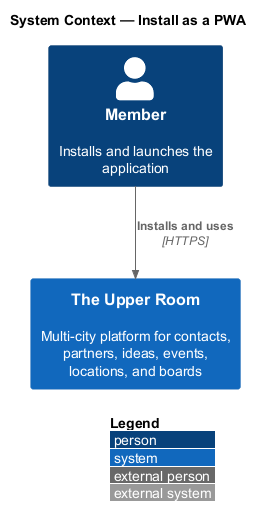
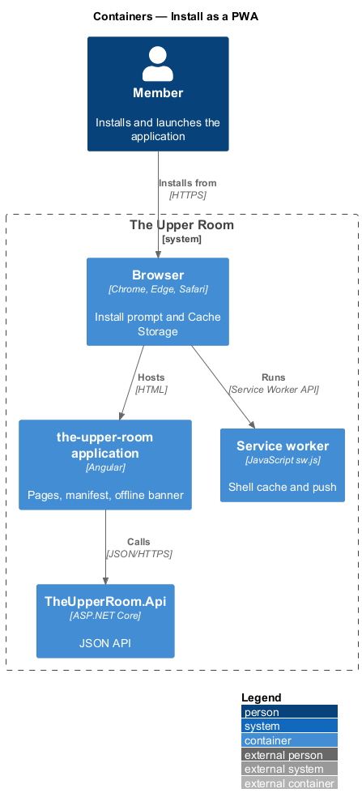
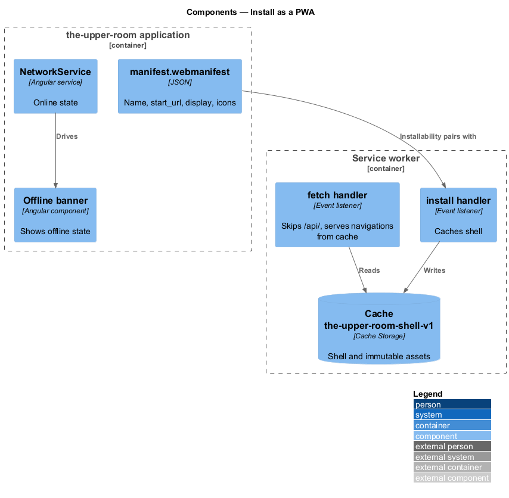
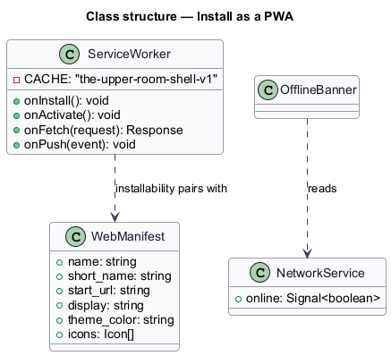
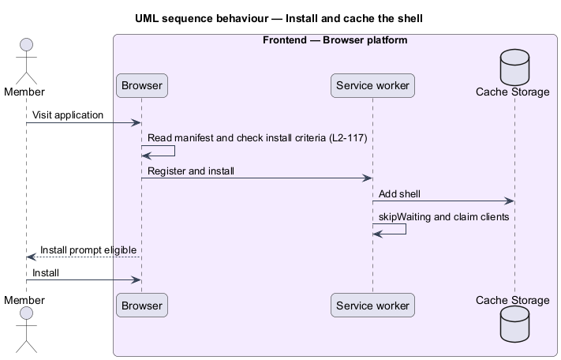
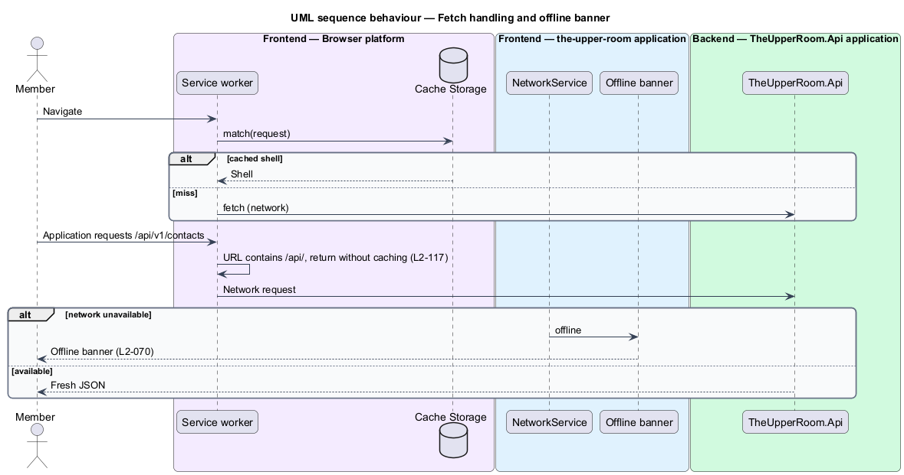

# Install as a PWA

## Overview

The Upper Room can be installed on a device like a native application. The installed application loads quickly because a service worker caches the application shell, and it never serves stale API data.

**PWA** — progressive web application installable from a browser through a manifest and a service worker

**application shell** — minimal HTML, scripts, and styles needed to start the interface

The feature is a browser-platform slice made of a web manifest, a service worker, and the offline banner.

## Description

### Existing implementation

The following source elements provide the current implementation points. Their presence does not establish complete requirement coverage.

| Source | Concrete elements | Observed surface |
|---|---|---|
| [frontend/projects/the-upper-room/public/manifest.webmanifest](../../../../frontend/projects/the-upper-room/public/manifest.webmanifest) | Web manifest | Name "The Upper Room"; `short_name` "Upper Room"; `start_url` `/dashboard`; `display` `standalone`; theme `#6750a4`; single `favicon.ico` icon |
| [frontend/projects/the-upper-room/public/sw.js](../../../../frontend/projects/the-upper-room/public/sw.js) | Service worker | Cache `the-upper-room-shell-v1`; install caches `/`; fetch handler ignores URLs containing `/api/` and serves navigations cache-first; push handler shows notifications |
| [frontend/projects/components/src/lib/network/network.service.ts](../../../../frontend/projects/components/src/lib/network/network.service.ts) | `NetworkService` | Online and offline state |
| [frontend/projects/components/src/lib/network/offline-banner/offline-banner.ts](../../../../frontend/projects/components/src/lib/network/offline-banner/offline-banner.ts) | Offline banner | Banner for L2-070 |

### Target behavior and interfaces

The manifest shall satisfy L2-116 and the browser install criteria. The service worker shall cache only the application shell and immutable assets and shall never cache API responses.

While offline the application shall show the offline banner and shall make no promise of offline editing.

### Gaps and compatibility

- The service worker caches only `/`; hashed immutable assets are not precached. A build-generated asset list `<TO SUPPLY>`.
- The service worker registration call was not located; `<TO SUPPLY>`.
- The manifest lists only `favicon.ico`; installability requires 192 px and 512 px icons from L2-116 `<TO SUPPLY>`.
- Navigation requests use a cache-first strategy with no versioned invalidation beyond the cache name.

Production implementation shall follow [AGENTS.md](../../../../AGENTS.md), including incremental acceptance testing. Existing behavior shall remain compatible until an explicit change is approved.

## Requirements

The table preserves the requirement statement and all parent identifiers. The expandable source excerpts retain the complete normative text and acceptance criteria verbatim.

| L2 ID | Refines (L1) | Requirement |
|---|---|---|
| [L2-117](../../../specs/L2.md#l2-117-pwa-installability-no-offline-editing-promise) | `L1-019`, `L1-026` | The app is installable as a PWA with the manifest in L2-116 and a minimal service worker that caches the app shell and immutable assets only. The service worker MUST NOT cache API responses (to avoid stale data); offline behavior is limited to the offline banner from L2-070. |

L2-117: PWA Installability (No Offline-Editing Promise) — specification excerpt

The app is installable as a PWA with the manifest in L2-116 and a minimal service worker that caches the app shell and immutable assets only. The service worker MUST NOT cache API responses (to avoid stale data); offline behavior is limited to the offline banner from L2-070.

**Acceptance Criteria:**
1. Given Chrome's install criteria are checked, when the user has visited and the manifest is correct, then the install prompt is eligible.

## Diagrams

### System context

The context identifies the people and external systems around this capability.

### Container view

The container view separates browser, API, build, and data responsibilities for this capability.

### Component view

The component view shows the concrete implementation points and the target responsibilities that collaborate in this slice.

### Type structure

The structure view lists the types in this slice with members where known. Dashed dependencies denote target collaboration rather than verified current dependency direction.

### Install and cache the shell

The sequence shows the browser checking installability and the service worker caching the application shell on install.

### Fetch handling and offline banner

The sequence shows navigations answered from the shell cache, API calls bypassing the worker, and the offline banner appearing without cached data.

