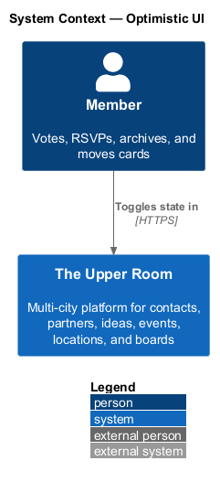
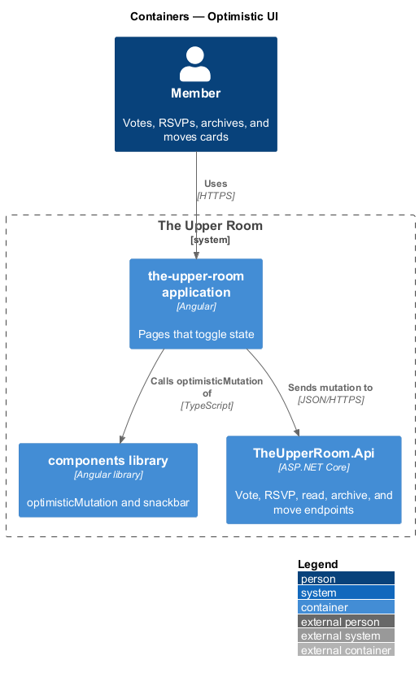
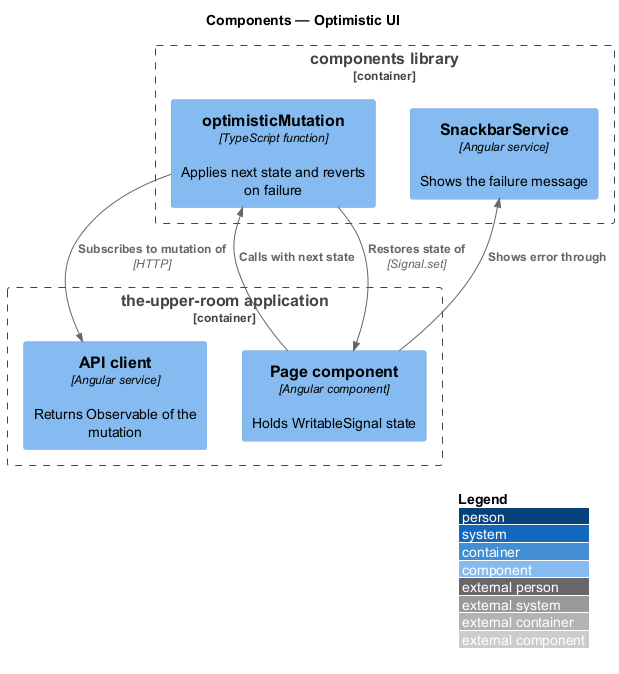
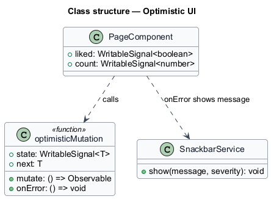
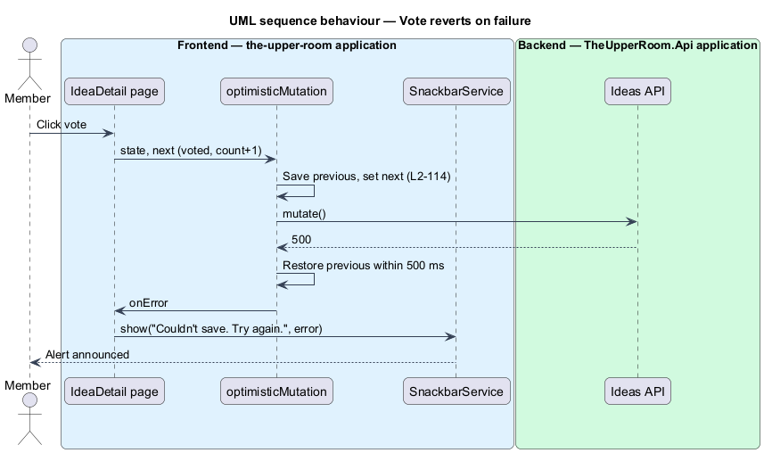
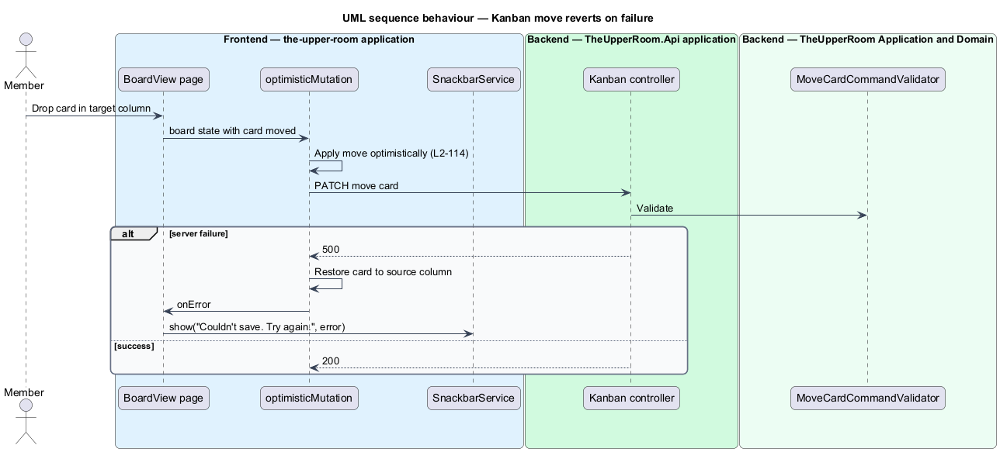

# Optimistic UI

## Overview

Toggle actions and card moves feel immediate when the interface changes before the server responds. When the server fails, the interface restores the prior state and tells the member.

**optimistic update** — interface change applied before the server confirms the operation

**revert** — restoration of the previous state after the server rejects or fails the operation

The feature is a frontend capability implemented once in the components library and used by vote, RSVP, mark-as-read, archive, and Kanban move actions.

## Description

### Existing implementation

The following source elements provide the current implementation points. Their presence does not establish complete requirement coverage.

| Source | Concrete elements | Observed surface |
|---|---|---|
| [frontend/projects/components/src/lib/optimistic-mutation/optimistic-mutation.ts](../../../../frontend/projects/components/src/lib/optimistic-mutation/optimistic-mutation.ts) | `optimisticMutation` | Stores the previous value, sets the next value, subscribes to the mutation; on error with no status or status of 500 or above, restores the value and calls `onError` |
| [frontend/projects/components/src/lib/snackbar/tar-snackbar.service.ts](../../../../frontend/projects/components/src/lib/snackbar/tar-snackbar.service.ts) | `SnackbarService` | `show(message, severity)` queue used for the failure message |
| [e2e/tests/cross-cutting/optimistic-ui.spec.ts](../../../../e2e/tests/cross-cutting/optimistic-ui.spec.ts) | e2e spec | Verifies optimistic behavior |
| [backend/src/TheUpperRoom.Application/Kanban/MoveCardCommandValidator.cs](../../../../backend/src/TheUpperRoom.Application/Kanban/MoveCardCommandValidator.cs) | `MoveCardCommandValidator` | Server side of the Kanban move |

### Target behavior and interfaces

Vote, RSVP, mark-as-read, and archive shall call `optimisticMutation` with the next state. The Kanban board shall apply a card move before the response.

On failure the state shall revert within 500 ms and the snackbar shall show "Couldn't save. Try again." through a translation key.

### Gaps and compatibility

- `optimisticMutation` reverts only for a missing status or status of 500 or above; 4xx failures keep the optimistic value. The requirement states revert on failure, so the 4xx policy `<TO SUPPLY>`.
- `onError` is supplied by each caller; a shared error handler that shows the required text `<TO SUPPLY>`.
- Which pages already call `optimisticMutation` `<TO SUPPLY>`.

Production implementation shall follow [AGENTS.md](../../../../AGENTS.md), including incremental acceptance testing. Existing behavior shall remain compatible until an explicit change is approved.

## Requirements

The table preserves the requirement statement and all parent identifiers. The expandable source excerpts retain the complete normative text and acceptance criteria verbatim.

| L2 ID | Refines (L1) | Requirement |
|---|---|---|
| [L2-114](../../../specs/L2.md#l2-114-optimistic-ui-patterns) | `L1-019`, `L1-029` | Toggle actions (vote, RSVP, mark-as-read, archive) update the UI optimistically and revert on failure with a snackbar "Couldn't save. Try again." Drag-and-drop on Kanban applies the move optimistically; failure reverts and shows the snackbar. |

L2-114: Optimistic UI Patterns — specification excerpt

Toggle actions (vote, RSVP, mark-as-read, archive) update the UI optimistically and revert on failure with a snackbar "Couldn't save. Try again." Drag-and-drop on Kanban applies the move optimistically; failure reverts and shows the snackbar.

**Acceptance Criteria:**
1. Given the user clicks vote and the API returns 500, when handled, then the heart icon reverts to unfilled and the count decrements within `500ms`.

## Diagrams

### System context

The context identifies the people and external systems around this capability.

### Container view

The container view separates browser, API, build, and data responsibilities for this capability.

### Component view

The component view shows the concrete implementation points and the target responsibilities that collaborate in this slice.

### Type structure

The structure view lists the types in this slice with members where known. Dashed dependencies denote target collaboration rather than verified current dependency direction.

### Vote reverts on failure

The sequence shows the vote icon filling immediately, the API failing with 500, and the icon and count reverting with a snackbar.

### Kanban move reverts on failure

The sequence shows a card dropped into another column immediately and returned to its source column when the server fails.

