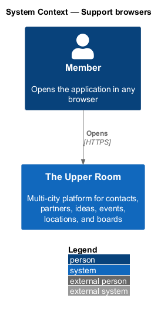
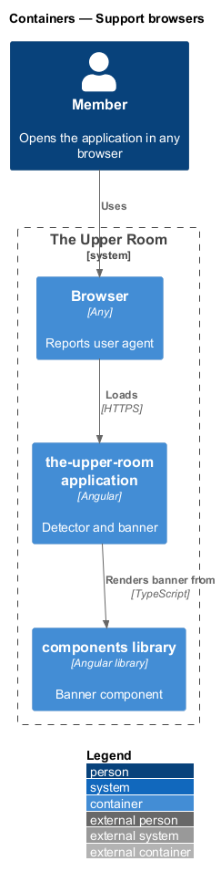
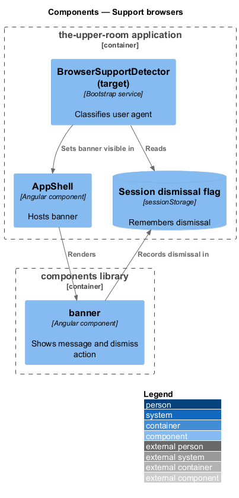
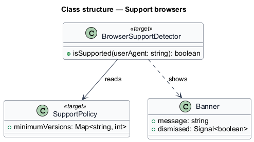
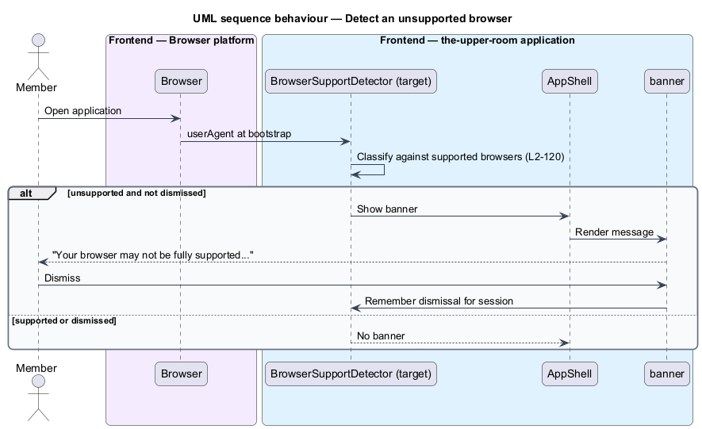

# Support browsers

## Overview

The application targets current browsers. Members on an unsupported browser receive a clear notice that some features may not work.

**supported browser** — Chrome, Edge, Firefox, or Safari on desktop, or Chrome or Safari on mobile, in the latest 2 stable versions

**user agent** — string by which a browser identifies itself in requests and in `navigator.userAgent`

The feature is a frontend capability that evaluates the user agent at start-up and shows a dismissible banner before first paint of the page content.

## Description

### Existing implementation

The following source elements provide the current implementation points. Their presence does not establish complete requirement coverage.

| Source | Concrete elements | Observed surface |
|---|---|---|
| [frontend/projects/the-upper-room/e2e/tests/cross-cutting/browser-support.spec.ts](../../../../frontend/projects/the-upper-room/e2e/tests/cross-cutting/browser-support.spec.ts) | e2e spec | IE11 user agent shows `browser-support-banner`; modern Chrome hides it; banner is dismissable and stays dismissed in the session |
| [frontend/projects/components/src/lib/banner/banner.ts](../../../../frontend/projects/components/src/lib/banner/banner.ts) | `banner` component | Shared banner presentation |
| [frontend/projects/the-upper-room/src/index.html](../../../../frontend/projects/the-upper-room/src/index.html) | Document shell | Host page for pre-bootstrap detection |
| [frontend/projects/the-upper-room/src/main.ts](../../../../frontend/projects/the-upper-room/src/main.ts) | Bootstrap | Application entry point |

### Target behavior and interfaces

A detector (name `<TO SUPPLY>`) shall evaluate the user agent before bootstrap and shall show the banner with the text "Your browser may not be fully supported. For the best experience, use the latest Chrome, Firefox, Safari, or Edge." when the browser is unsupported.

Dismissing the banner shall hide it for the rest of the session.

### Gaps and compatibility

- No detector implementation or `browser-support-banner` markup was located in the source; only the e2e spec exists, so the behavior is a target change.
- Version thresholds for "latest 2 stable versions" `<TO SUPPLY>`.
- The text shall use a translation key per L2-100.
- `playwright.config.ts` also lists a `webkit` project, which AGENTS.md does not permit for frontend testing.

Production implementation shall follow [AGENTS.md](../../../../AGENTS.md), including incremental acceptance testing. Existing behavior shall remain compatible until an explicit change is approved.

## Requirements

The table preserves the requirement statement and all parent identifiers. The expandable source excerpts retain the complete normative text and acceptance criteria verbatim.

| L2 ID | Refines (L1) | Requirement |
|---|---|---|
| [L2-120](../../../specs/L2.md#l2-120-browser-support) | `L1-019` | Supported browsers (latest 2 stable versions): Chrome, Edge, Firefox, Safari (desktop), Chrome and Safari (mobile). Unsupported browsers see a banner "Your browser may not be fully supported. For the best experience, use the latest Chrome, Firefox, Safari, or Edge.". |

L2-120: Browser Support — specification excerpt

Supported browsers (latest 2 stable versions): Chrome, Edge, Firefox, Safari (desktop), Chrome and Safari (mobile). Unsupported browsers see a banner "Your browser may not be fully supported. For the best experience, use the latest Chrome, Firefox, Safari, or Edge.".

**Acceptance Criteria:**
1. Given the user-agent is IE11, when detected, then the unsupported banner appears immediately on first paint.

## Diagrams

### System context

The context identifies the people and external systems around this capability.

### Container view

The container view separates browser, API, build, and data responsibilities for this capability.

### Component view

The component view shows the concrete implementation points and the target responsibilities that collaborate in this slice.

### Type structure

The structure view lists the types in this slice with members where known. Dashed dependencies denote target collaboration rather than verified current dependency direction.

### Detect an unsupported browser

The sequence shows the user agent evaluated at start-up and the banner shown immediately, or not shown for a supported browser or after dismissal.

