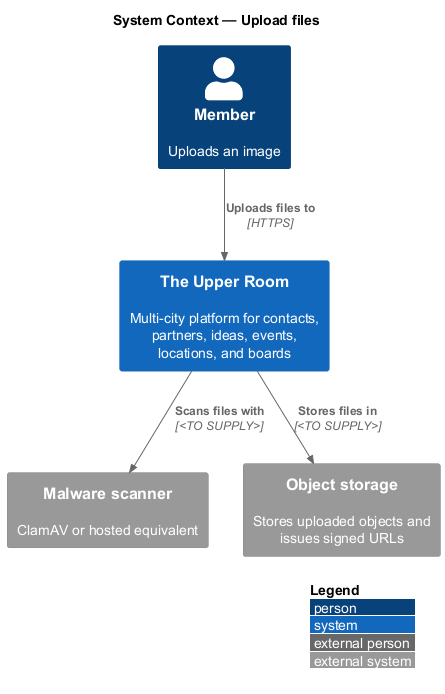
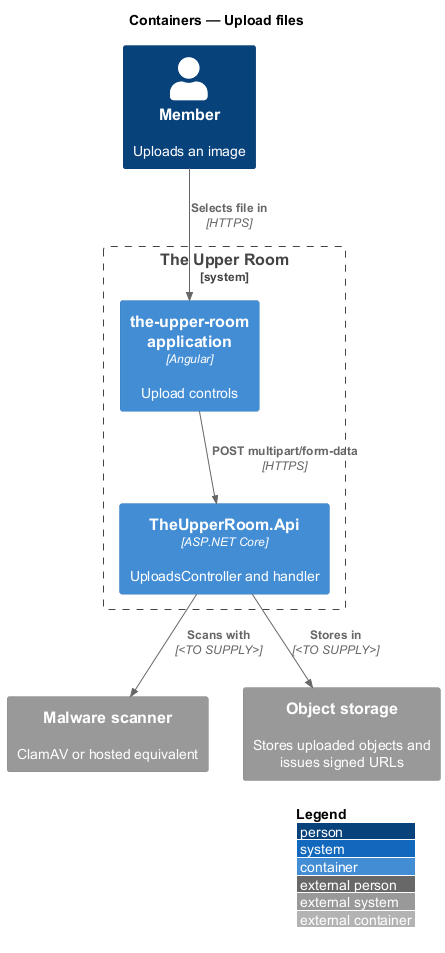
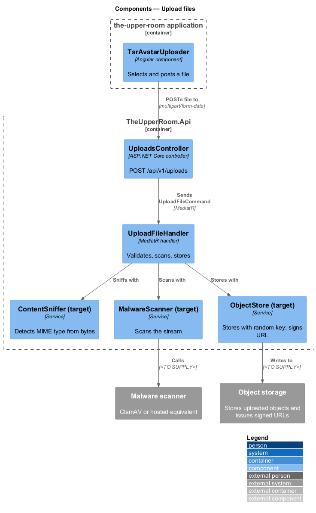
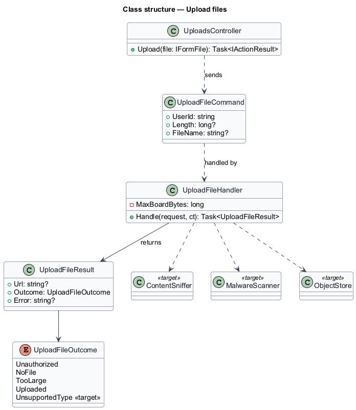
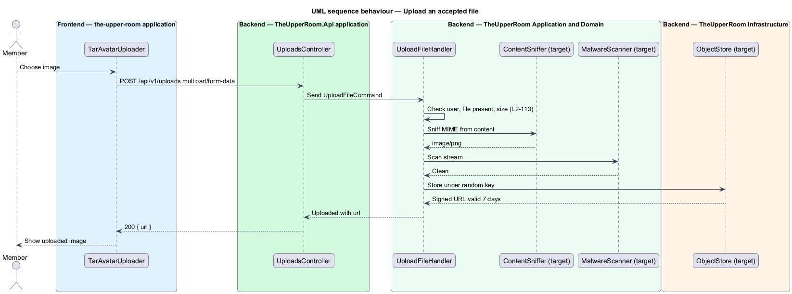
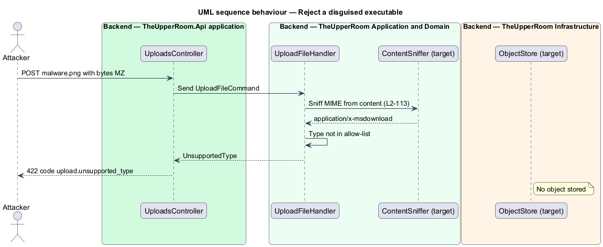

# Upload files

## Overview

Members upload images such as avatars and board covers. Uploaded files are untrusted input, so the server shall verify, scan, and store them before returning a reference.

**content sniffing** — detection of a file type from its leading bytes instead of its declared header or extension

**signed URL** — time-limited address that grants access to a stored object

The feature is a vertical slice from an upload control in the UI through `POST /api/v1/uploads` to object storage.

## Description

### Existing implementation

The following source elements provide the current implementation points. Their presence does not establish complete requirement coverage.

| Source | Concrete elements | Observed surface |
|---|---|---|
| [backend/src/TheUpperRoom.Api/Uploads/UploadsController.cs](../../../../backend/src/TheUpperRoom.Api/Uploads/UploadsController.cs) | `UploadsController` | Route `api/v1/uploads`; `[Authorize]`; `POST` with `[FromForm] IFormFile`; maps outcomes to 401, 400, 422, 200 `{ url }` |
| [backend/src/TheUpperRoom.Application/Uploads/UploadFileHandler.cs](../../../../backend/src/TheUpperRoom.Application/Uploads/UploadFileHandler.cs) | `UploadFileHandler`, `UploadFileCommand`, `UploadFileOutcome`, `UploadFileResult` | Checks user, presence, size above 10 MB; returns a placeholder `https://uploads.example.com/{Guid}{extension}` |
| [frontend/projects/components/src/lib/avatar/tar-avatar-uploader.ts](../../../../frontend/projects/components/src/lib/avatar/tar-avatar-uploader.ts) | `TarAvatarUploader` | Upload control for avatars |
| [frontend/projects/the-upper-room/e2e/components/AvatarUploader.ts](../../../../frontend/projects/the-upper-room/e2e/components/AvatarUploader.ts) | `AvatarUploader` | Component object used by e2e tests |
| [backend/tests/TheUpperRoom.Application.Tests/UploadFileHandlerTests.cs](../../../../backend/tests/TheUpperRoom.Application.Tests/UploadFileHandlerTests.cs) | Handler tests | Existing coverage for size and presence rules |

### Target behavior and interfaces

The handler shall sniff the MIME type from content, enforce the maximum size of L2-051 and L2-106, scan the stream with ClamAV or a hosted equivalent, store the object under a randomized key without the original filename, and return a signed URL valid for 7 days.

A rejected type shall produce `upload.unsupported_type` and no stored object. A scanner detection shall produce a rejection and no stored object.

### Gaps and compatibility

- Content sniffing, malware scanning, object storage, and signed URLs are not implemented; the handler returns a placeholder URL (`<TO SUPPLY>` for provider choices).
- Existing error responses use `{ error }` with free text; `upload.unsupported_type` and the L2-066 error envelope `<TO SUPPLY>`.
- The existing size limit is a single constant of 10 MB; per-resource limits from L2-051 and L2-106 `<TO SUPPLY>`.

Production implementation shall follow [AGENTS.md](../../../../AGENTS.md), including incremental acceptance testing. Existing behavior shall remain compatible until an explicit change is approved.

## Requirements

The table preserves the requirement statement and all parent identifiers. The expandable source excerpts retain the complete normative text and acceptance criteria verbatim.

| L2 ID | Refines (L1) | Requirement |
|---|---|---|
| [L2-113](../../../specs/L2.md#l2-113-file-upload-constraints) | `L1-020` | All uploads go through `POST /api/v1/uploads` with multipart/form-data. Server validates MIME type by content sniffing (not just header), enforces max size per L2-051/L2-106, scans with ClamAV (or hosted equivalent) before storage, stores in object storage with a randomized key (no original filename), and returns a signed URL valid for 7 days. |

L2-113: File Upload Constraints — specification excerpt

All uploads go through `POST /api/v1/uploads` with multipart/form-data. Server validates MIME type by content sniffing (not just header), enforces max size per L2-051/L2-106, scans with ClamAV (or hosted equivalent) before storage, stores in object storage with a randomized key (no original filename), and returns a signed URL valid for 7 days.

**Acceptance Criteria:**
1. Given an attacker uploads `malware.png` whose magic bytes are `MZ` (PE executable), when scanned, then the upload is rejected with `upload.unsupported_type` and the file is not stored.

## Diagrams

### System context

The context identifies the people and external systems around this capability.

### Container view

The container view separates browser, API, build, and data responsibilities for this capability.

### Component view

The component view shows the concrete implementation points and the target responsibilities that collaborate in this slice.

### Type structure

The structure view lists the types in this slice with members where known. Dashed dependencies denote target collaboration rather than verified current dependency direction.

### Upload an accepted file

The sequence shows a file passing size, type, and scan checks and being stored under a random key with a 7-day signed URL.

### Reject a disguised executable

The sequence shows a file named like an image whose magic bytes identify an executable being rejected before storage.

