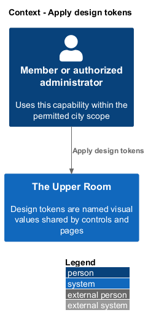
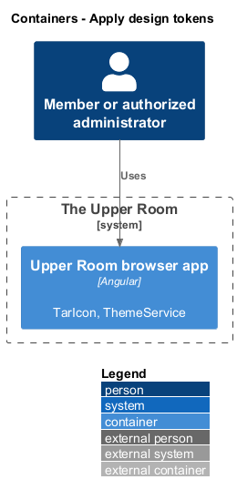
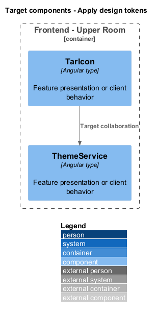
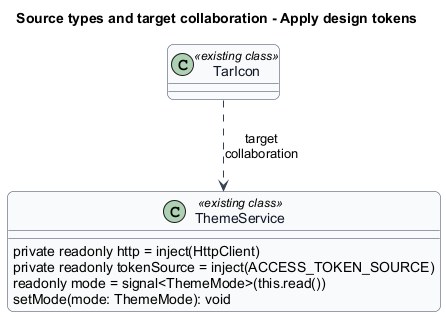
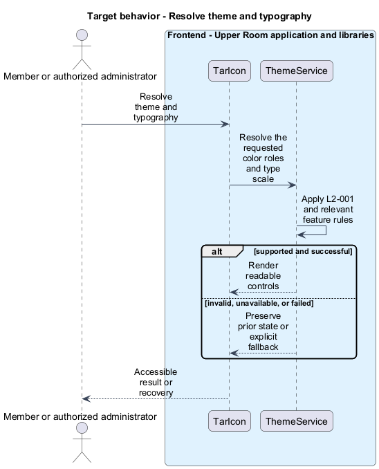
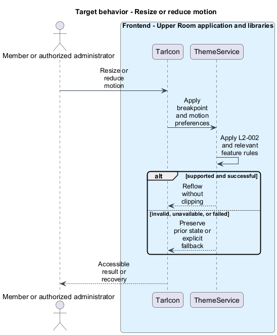

# Apply design tokens

## Overview

The Upper Room manages contacts, partners, ideas, events, locations, and boards in city-scoped workspaces.

Design tokens are named visual values shared by controls and pages. Consistent color, typography, spacing, shape, motion, and breakpoints keep the application readable across screen sizes.

## Description

### Existing implementation

The following source elements provide the current implementation points. Their presence does not establish complete requirement coverage.

| Source | Concrete elements | Observed surface |
|---|---|---|
| [frontend/projects/components/src/lib/tokens/_tokens.scss](../../../../frontend/projects/components/src/lib/tokens/_tokens.scss) | Configuration or style asset | Declarations and configuration in the linked source |
| [frontend/projects/components/src/lib/icon/icon.ts](../../../../frontend/projects/components/src/lib/icon/icon.ts) | `TarIcon` | Declarations and configuration in the linked source |
| [frontend/projects/components/src/lib/icon/icon-aliases.ts](../../../../frontend/projects/components/src/lib/icon/icon-aliases.ts) | `ICON_ALIASES` | Declarations and configuration in the linked source |
| [frontend/projects/domain/src/lib/theme/theme.service.ts](../../../../frontend/projects/domain/src/lib/theme/theme.service.ts) | `ThemeService` | private readonly http = inject(HttpClient); private readonly tokenSource = inject(ACCESS_TOKEN_SOURCE); readonly mode = signal<ThemeMode>(this.read()) |

### Target behavior and interfaces

The components token stylesheet shall own the required visual roles and scales. Feature styles shall reference those roles. TarIcon shall resolve semantic aliases and preserve a readable fallback when the font is unavailable. Responsive overrides shall extend the smallest layout, and reduced-motion preferences shall suppress animation.

- **Resolve theme and typography:** Resolve the requested color roles and type scale. Render readable controls.
- **Resize or reduce motion:** Apply breakpoint and motion preferences. Reflow without clipping.

Diagrams show target collaborations. Existing source types retain their names. Participants marked as target roles or proposed responsibilities describe interfaces to introduce, not existing classes.

### Gaps and compatibility

The token stylesheet and icon wrapper exist. Literal Material component names in the specs do not establish that the custom Tar controls are Material components. The target shall preserve accessible behavior and the required visual roles; Material-versus-custom control parity remains <TO SUPPLY>.

Production implementation shall follow [AGENTS.md](../../../../AGENTS.md), including incremental acceptance testing. API integrations shall preserve documented behavior until an explicit compatibility change is approved.

## Requirements

The table preserves the opening requirement statement and all parent identifiers. The expandable source excerpts retain the complete normative text and acceptance criteria verbatim. Source wording is quoted rather than normalized to the design prose.

| L2 ID | Refines (L1) | Requirement |
|---|---|---|
| [L2-001](../../../specs/L2.md#l2-001-m3-color-tokens) | `L1-015` | The application must define an M3 light and dark theme using SCSS tokens generated from the source seed color `#6750A4` (Material default purple), with the following role tokens exposed as CSS custom properties: |
| [L2-002](../../../specs/L2.md#l2-002-m3-typography-scale) | `L1-015` | The application must implement the M3 type scale using `Roboto` (web font, with `Roboto Flex` as a progressive-enhancement) at the following sizes/line-heights/weights, exposed as `.md-typescale-*` SCSS mixins and CSS classes: |
| [L2-003](../../../specs/L2.md#l2-003-4dp-spacing-grid) | `L1-015` | The application must use a 4dp spacing scale exclusively, defined as SCSS variables `$space-0: 0`, `$space-1: 4px`, `$space-2: 8px`, `$space-3: 12px`, `$space-4: 16px`, `$space-5: 20px`, `$space-6: 24px`, `$space-7: 28px`, `$space-8: 32px`, `$space-10: 40px`, `$space-12: 48px`, `$space-16: 64px`, `$space-20: 80px`, `$space-24: 96px`. Components must NOT use raw px values for margin/padding; all spacing must reference these tokens. |
| [L2-004](../../../specs/L2.md#l2-004-elevation-levels) | `L1-015` | The application must define five elevation levels per M3 (`level0` through `level5`) as SCSS mixins emitting `box-shadow` with the official M3 shadow recipes (key shadow + ambient shadow), and a `--md-sys-elevation-level-X` CSS variable for each. |
| [L2-005](../../../specs/L2.md#l2-005-shape-tokens) | `L1-015` | The application must expose corner-radius tokens: `--md-sys-shape-corner-none: 0`, `extra-small: 4px`, `small: 8px`, `medium: 12px`, `large: 16px`, `extra-large: 28px`, `full: 9999px`. Buttons use `full`, cards use `medium`, dialogs use `extra-large`, text fields use `extra-small` (filled) or `extra-small` (outlined), FAB uses `large`. |
| [L2-006](../../../specs/L2.md#l2-006-motion-tokens) | `L1-015` | The application must define motion tokens for duration (`short1: 50ms`, `short2: 100ms`, `short3: 150ms`, `short4: 200ms`, `medium1: 250ms`, `medium2: 300ms`, `medium3: 350ms`, `medium4: 400ms`, `long1: 450ms`, `long2: 500ms`, `long3: 550ms`, `long4: 600ms`) and easing (`emphasized: cubic-bezier(0.2, 0.0, 0, 1.0)`, `emphasized-decelerate: cubic-bezier(0.05, 0.7, 0.1, 1.0)`, `standard: cubic-bezier(0.2, 0.0, 0, 1.0)`, `linear: linear`). |
| [L2-007](../../../specs/L2.md#l2-007-iconography) | `L1-015` | The application must use Material Symbols Rounded (variable font, weight 400, fill 0, grade 0, optical size 24) loaded from Google Fonts, registered through `MatIconRegistry` with the alias namespace `mat`. Icon size tokens: `--icon-size-xs: 16px`, `sm: 20px`, `md: 24px` (default), `lg: 32px`, `xl: 40px`. Specific feature-to-icon mapping: |
| [L2-008](../../../specs/L2.md#l2-008-breakpoint-tokens) | `L1-014` | The application must expose Sass mixins `xs`, `sm`, `md`, `lg`, `xl`, `xxl` matching: XS `<576px`, SM `>=576px`, MD `>=768px`, LG `>=992px`, XL `>=1200px`, XXL `>=1400px`. The default styling is the XS rules; larger breakpoints add overrides via min-width media queries (mobile-first). |

L2-001: M3 Color Tokens — specification excerpt

The application must define an M3 light and dark theme using SCSS tokens generated from the source seed color `#6750A4` (Material default purple), with the following role tokens exposed as CSS custom properties:

`--md-sys-color-primary`, `--md-sys-color-on-primary`, `--md-sys-color-primary-container`, `--md-sys-color-on-primary-container`, `--md-sys-color-secondary`, `--md-sys-color-on-secondary`, `--md-sys-color-secondary-container`, `--md-sys-color-on-secondary-container`, `--md-sys-color-tertiary`, `--md-sys-color-on-tertiary`, `--md-sys-color-tertiary-container`, `--md-sys-color-on-tertiary-container`, `--md-sys-color-error` (`#B3261E`), `--md-sys-color-on-error`, `--md-sys-color-error-container` (`#F9DEDC`), `--md-sys-color-on-error-container` (`#410E0B`), `--md-sys-color-background`, `--md-sys-color-on-background`, `--md-sys-color-surface`, `--md-sys-color-on-surface`, `--md-sys-color-surface-variant`, `--md-sys-color-on-surface-variant`, `--md-sys-color-outline`, `--md-sys-color-outline-variant`, `--md-sys-color-shadow`, `--md-sys-color-scrim`, `--md-sys-color-inverse-surface`, `--md-sys-color-inverse-on-surface`, `--md-sys-color-inverse-primary`, `--md-sys-color-surface-container-lowest`, `--md-sys-color-surface-container-low`, `--md-sys-color-surface-container`, `--md-sys-color-surface-container-high`, `--md-sys-color-surface-container-highest`.

**Acceptance Criteria:**
1. Given a fresh build, when the Sass theme is compiled, then every CSS variable above resolves to a non-empty hex value in both `:root` (light) and `[data-theme="dark"]` (dark).
2. Given the user's OS prefers dark, when no override is set, then `prefers-color-scheme: dark` activates the dark token set.
3. Given any text on any background, when measured, then text/background contrast is >= 4.5:1 for body text and >= 3:1 for >=18pt or bold >=14pt text.

L2-002: M3 Typography Scale — specification excerpt

The application must implement the M3 type scale using `Roboto` (web font, with `Roboto Flex` as a progressive-enhancement) at the following sizes/line-heights/weights, exposed as `.md-typescale-*` SCSS mixins and CSS classes:

- `display-large`: 57/64/400, tracking -0.25
- `display-medium`: 45/52/400, tracking 0
- `display-small`: 36/44/400, tracking 0
- `headline-large`: 32/40/400, tracking 0
- `headline-medium`: 28/36/400, tracking 0
- `headline-small`: 24/32/400, tracking 0
- `title-large`: 22/28/400, tracking 0
- `title-medium`: 16/24/500, tracking 0.15
- `title-small`: 14/20/500, tracking 0.1
- `body-large`: 16/24/400, tracking 0.5
- `body-medium`: 14/20/400, tracking 0.25
- `body-small`: 12/16/400, tracking 0.4
- `label-large`: 14/20/500, tracking 0.1
- `label-medium`: 12/16/500, tracking 0.5
- `label-small`: 11/16/500, tracking 0.5

**Acceptance Criteria:**
1. Given any page, when inspected, then no inline `font-size`/`line-height` declarations exist outside the typescale mixins.
2. Given a user has set the OS root font-size to 200%, when the page renders, then text scales proportionally and no content is cut off or overlaps.

L2-003: 4dp Spacing Grid — specification excerpt

The application must use a 4dp spacing scale exclusively, defined as SCSS variables `$space-0: 0`, `$space-1: 4px`, `$space-2: 8px`, `$space-3: 12px`, `$space-4: 16px`, `$space-5: 20px`, `$space-6: 24px`, `$space-7: 28px`, `$space-8: 32px`, `$space-10: 40px`, `$space-12: 48px`, `$space-16: 64px`, `$space-20: 80px`, `$space-24: 96px`. Components must NOT use raw px values for margin/padding; all spacing must reference these tokens.

**Acceptance Criteria:**
1. Given a stylelint scan of `**/*.scss`, when run, then any `margin` or `padding` declaration with a literal `px` value (other than `0` or `1px` borders) fails the lint rule `the-upper-room/spacing-token-only`.
2. Given a card component, when rendered, then internal padding equals `$space-4` (16px) on XS/SM and `$space-6` (24px) on MD+.

L2-004: Elevation Levels — specification excerpt

The application must define five elevation levels per M3 (`level0` through `level5`) as SCSS mixins emitting `box-shadow` with the official M3 shadow recipes (key shadow + ambient shadow), and a `--md-sys-elevation-level-X` CSS variable for each.

**Acceptance Criteria:**
1. Given a `mat-card` at rest, when inspected, then it uses `level1` elevation (1dp).
2. Given a top app bar that has scrolled content beneath it, when scrollY > 0, then it uses `level2` elevation (3dp); otherwise `level0`.
3. Given a FAB, when at rest, then `level3` (6dp); when pressed, then `level4` (8dp).

L2-005: Shape Tokens — specification excerpt

The application must expose corner-radius tokens: `--md-sys-shape-corner-none: 0`, `extra-small: 4px`, `small: 8px`, `medium: 12px`, `large: 16px`, `extra-large: 28px`, `full: 9999px`. Buttons use `full`, cards use `medium`, dialogs use `extra-large`, text fields use `extra-small` (filled) or `extra-small` (outlined), FAB uses `large`.

**Acceptance Criteria:**
1. Given any rendered button, when inspected, then `border-radius` is `9999px`.
2. Given a `mat-card`, when inspected, then `border-radius` is `12px`.

L2-006: Motion Tokens — specification excerpt

The application must define motion tokens for duration (`short1: 50ms`, `short2: 100ms`, `short3: 150ms`, `short4: 200ms`, `medium1: 250ms`, `medium2: 300ms`, `medium3: 350ms`, `medium4: 400ms`, `long1: 450ms`, `long2: 500ms`, `long3: 550ms`, `long4: 600ms`) and easing (`emphasized: cubic-bezier(0.2, 0.0, 0, 1.0)`, `emphasized-decelerate: cubic-bezier(0.05, 0.7, 0.1, 1.0)`, `standard: cubic-bezier(0.2, 0.0, 0, 1.0)`, `linear: linear`).

**Acceptance Criteria:**
1. Given a route transition, when triggered, then it uses `medium2` (300ms) with `emphasized` easing.
2. Given the user has `prefers-reduced-motion: reduce`, when any transition fires, then duration is forced to `0ms` and easing to `linear`.

L2-007: Iconography — specification excerpt

The application must use Material Symbols Rounded (variable font, weight 400, fill 0, grade 0, optical size 24) loaded from Google Fonts, registered through `MatIconRegistry` with the alias namespace `mat`. Icon size tokens: `--icon-size-xs: 16px`, `sm: 20px`, `md: 24px` (default), `lg: 32px`, `xl: 40px`. Specific feature-to-icon mapping:

- Contacts: `person`
- Partners: `domain`
- Tags: `sell`
- Notes: `sticky_note_2`
- Kanban: `view_kanban`
- Ideas: `lightbulb`
- Events: `event`
- Calendar: `calendar_month`
- Locations: `location_on`
- Search: `search`
- Filter: `filter_list`
- Sort: `swap_vert`
- Settings: `settings`
- Profile: `account_circle`
- Sign out: `logout`
- Add: `add`
- Edit: `edit`
- Delete: `delete`
- Archive: `archive`
- Restore: `unarchive`
- Close: `close`
- Back: `arrow_back`
- Forward: `arrow_forward`
- Up: `expand_less`
- Down: `expand_more`
- Menu: `menu`
- More: `more_vert`
- Success: `check_circle`
- Error: `error`
- Warning: `warning`
- Info: `info`
- Help: `help`
- Visibility on: `visibility`
- Visibility off: `visibility_off`
- Drag handle: `drag_indicator`

**Acceptance Criteria:**
1. Given any page, when icons are rendered, then no SVGs are inlined except via `<mat-icon>`.
2. Given the icon font is unavailable, when the page loads, then a fallback to icon-name text labels does not break layout.

L2-008: Breakpoint Tokens — specification excerpt

The application must expose Sass mixins `xs`, `sm`, `md`, `lg`, `xl`, `xxl` matching: XS `<576px`, SM `>=576px`, MD `>=768px`, LG `>=992px`, XL `>=1200px`, XXL `>=1400px`. The default styling is the XS rules; larger breakpoints add overrides via min-width media queries (mobile-first).

**Acceptance Criteria:**
1. Given the viewport is 375px wide, when any page is rendered, then the layout matches the XS specification with no horizontal scrollbar.
2. Given the viewport is resized from 320px to 1920px, when scrolled, then no element ever causes a horizontal scrollbar.

## Diagrams

### System context

The context identifies the people and application boundary used by this capability.

### Container view

The container view separates browser execution from any backend state responsibility. Provider choices remain subject to the stated gaps.

### Target component view

The component view shows target collaborations between the concrete implementation points and proposed application responsibilities.

### Type structure

The structure view lists source types with declared members where available. Dashed dependencies denote proposed collaboration rather than verified current dependency direction.

### Resolve theme and typography

The target flow performs the following operation: Resolve the requested color roles and type scale. Its successful outcome is: Render readable controls. Alternate branches retain prior state or return recoverable failure.

### Resize or reduce motion

The target flow performs the following operation: Apply breakpoint and motion preferences. Its successful outcome is: Reflow without clipping. Alternate branches retain prior state or return recoverable failure.

