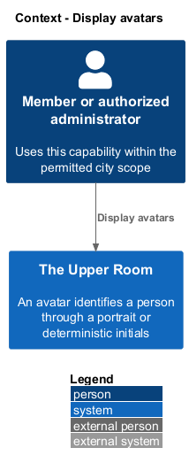
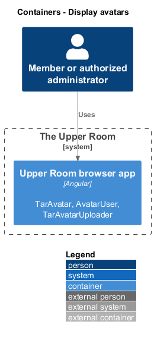
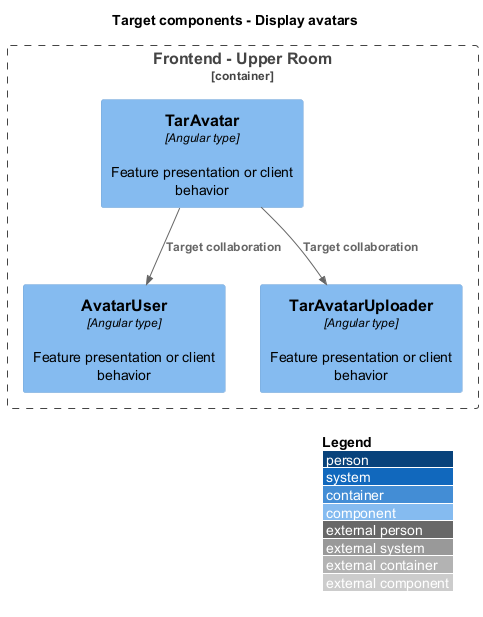
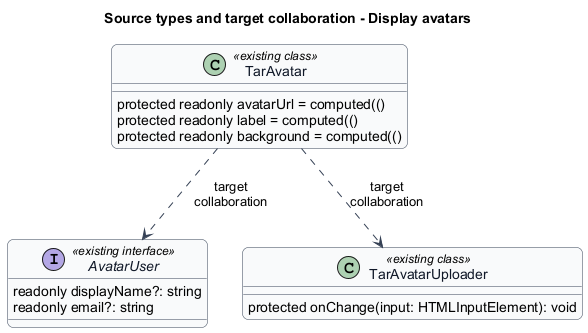
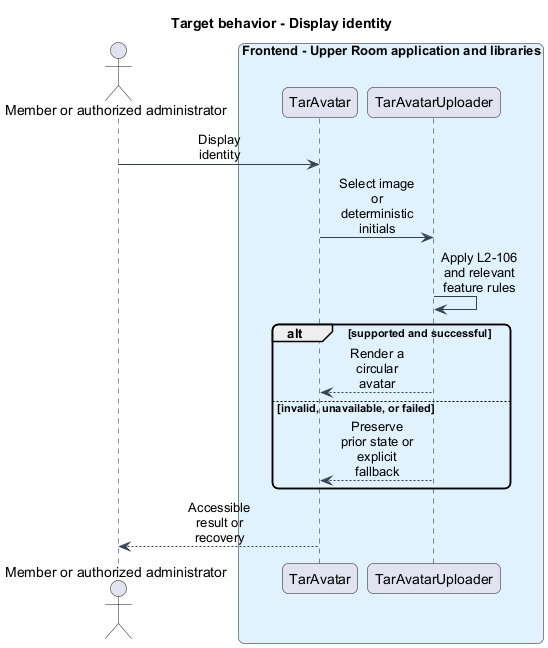
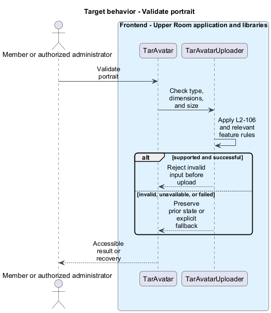

# Display avatars

## Overview

The Upper Room manages contacts, partners, ideas, events, locations, and boards in city-scoped workspaces.

An avatar identifies a person through a portrait or deterministic initials. The fallback keeps identity visible when an image is missing or fails.

## Description

### Existing implementation

The following source elements provide the current implementation points. Their presence does not establish complete requirement coverage.

| Source | Concrete elements | Observed surface |
|---|---|---|
| [frontend/projects/components/src/lib/avatar/tar-avatar.ts](../../../../frontend/projects/components/src/lib/avatar/tar-avatar.ts) | `TarAvatar` | protected readonly avatarUrl = computed((); protected readonly label = computed((); protected readonly background = computed(() |
| [frontend/projects/components/src/lib/avatar/initials.ts](../../../../frontend/projects/components/src/lib/avatar/initials.ts) | `AvatarUser` | readonly displayName?: string; readonly email?: string |
| [frontend/projects/components/src/lib/avatar/tar-avatar-uploader.ts](../../../../frontend/projects/components/src/lib/avatar/tar-avatar-uploader.ts) | `TarAvatarUploader` | protected onChange(input: HTMLInputElement): void |

### Target behavior and interfaces

TarAvatar shall select the supplied image or initials and the configured size. The uploader shall validate image format, size, and dimensions before requesting the shared upload capability. Server validation remains authoritative. Cropping shall produce a square portrait before profile assignment.

- **Display identity:** Select image or deterministic initials. Render a circular avatar.
- **Validate portrait:** Check type, dimensions, and size. Reject invalid input before upload.

Diagrams show target collaborations. Existing source types retain their names. Participants marked as target roles or proposed responsibilities describe interfaces to introduce, not existing classes.

### Gaps and compatibility

The avatar and uploader components exist. A valid preview is not evidence of server-side scanning or storage; the upload design owns those gaps.

Production implementation shall follow [AGENTS.md](../../../../AGENTS.md), including incremental acceptance testing. API integrations shall preserve documented behavior until an explicit compatibility change is approved.

## Requirements

The table preserves the opening requirement statement and all parent identifiers. The expandable source excerpts retain the complete normative text and acceptance criteria verbatim. Source wording is quoted rather than normalized to the design prose.

| L2 ID | Refines (L1) | Requirement |
|---|---|---|
| [L2-106](../../../specs/L2.md#l2-106-avatar-component) | `L1-002`, `L1-015` | A `<tar-avatar [user]="user" [size]="48">` renders: image if `avatarUrl` set; otherwise initials (first letter of first + last name) on a deterministic color from the M3 tonal palette derived by hashing `user.id`. Sizes 24/32/40/48/64/96/128. `border-radius: 50%`. Image uploads validated: types JPG/PNG/WEBP, max 5MB, min 256x256, auto-cropped to square. |

L2-106: Avatar Component — specification excerpt

A `<tar-avatar [user]="user" [size]="48">` renders: image if `avatarUrl` set; otherwise initials (first letter of first + last name) on a deterministic color from the M3 tonal palette derived by hashing `user.id`. Sizes 24/32/40/48/64/96/128. `border-radius: 50%`. Image uploads validated: types JPG/PNG/WEBP, max 5MB, min 256x256, auto-cropped to square.

**Acceptance Criteria:**
1. Given a user with no avatar, when rendered at size 48, then a 48px circle with the initials in `title-medium` typography appears.

## Diagrams

### System context

The context identifies the people and application boundary used by this capability.

### Container view

The container view separates browser execution from any backend state responsibility. Provider choices remain subject to the stated gaps.

### Target component view

The component view shows target collaborations between the concrete implementation points and proposed application responsibilities.

### Type structure

The structure view lists source types with declared members where available. Dashed dependencies denote proposed collaboration rather than verified current dependency direction.

### Display identity

The target flow performs the following operation: Select image or deterministic initials. Its successful outcome is: Render a circular avatar. Alternate branches retain prior state or return recoverable failure.

### Validate portrait

The target flow performs the following operation: Check type, dimensions, and size. Its successful outcome is: Reject invalid input before upload. Alternate branches retain prior state or return recoverable failure.

