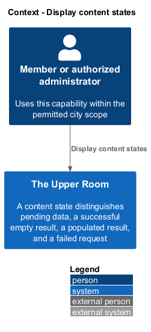
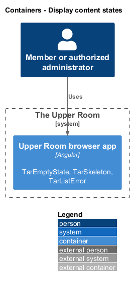
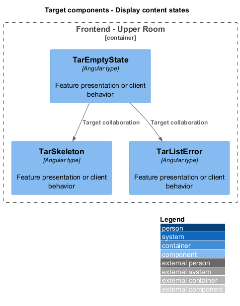
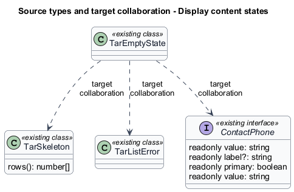
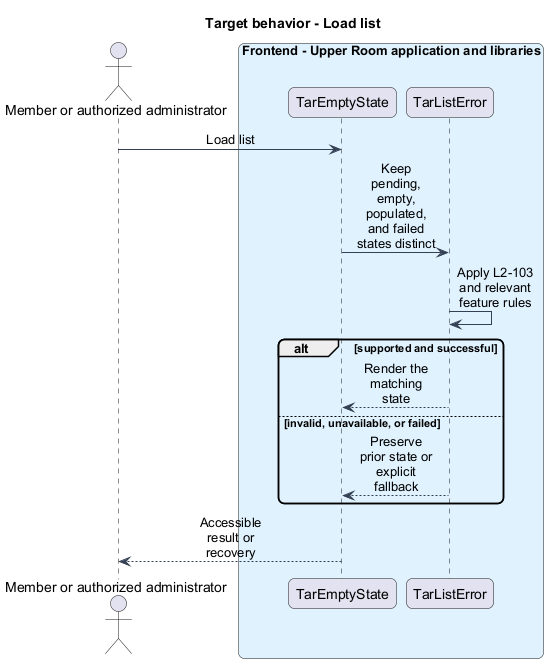
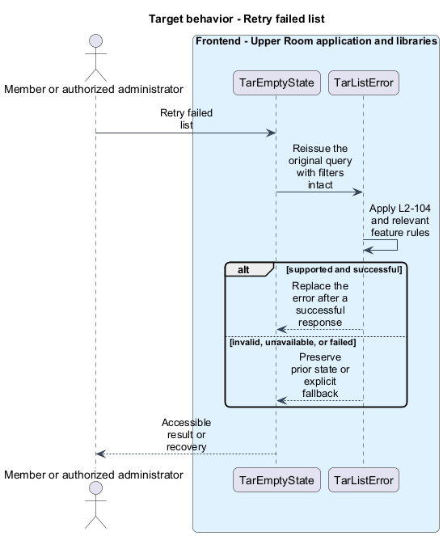

# Display content states

## Overview

The Upper Room manages contacts, partners, ideas, events, locations, and boards in city-scoped workspaces.

A content state distinguishes pending data, a successful empty result, a populated result, and a failed request. This distinction prevents errors from appearing as empty lists.

## Description

### Existing implementation

The following source elements provide the current implementation points. Their presence does not establish complete requirement coverage.

| Source | Concrete elements | Observed surface |
|---|---|---|
| [frontend/projects/components/src/lib/states/tar-empty-state.ts](../../../../frontend/projects/components/src/lib/states/tar-empty-state.ts) | `TarEmptyState` | Declarations and configuration in the linked source |
| [frontend/projects/components/src/lib/states/tar-skeleton.ts](../../../../frontend/projects/components/src/lib/states/tar-skeleton.ts) | `TarSkeleton` | rows(): number[] |
| [frontend/projects/components/src/lib/states/tar-list-error.ts](../../../../frontend/projects/components/src/lib/states/tar-list-error.ts) | `TarListError` | Declarations and configuration in the linked source |
| [frontend/projects/the-upper-room/src/app/contacts/contact-list/contact-list.ts](../../../../frontend/projects/the-upper-room/src/app/contacts/contact-list/contact-list.ts) | `ContactPhone`, `ContactEmail`, `Contact`, `ContactList` | readonly value: string; readonly label?: string; readonly primary: boolean |

### Target behavior and interfaces

List pages shall keep request state separate from their items. Pending requests shall render skeletons sized to the expected rows. Empty success shall render the feature action. Failure shall preserve the original query and correlation identifier for retry. Reduced motion shall disable skeleton shimmer.

- **Load list:** Keep pending, empty, populated, and failed states distinct. Render the matching state.
- **Retry failed list:** Reissue the original query with filters intact. Replace the error after a successful response.

Diagrams show target collaborations. Existing source types retain their names. Participants marked as target roles or proposed responsibilities describe interfaces to introduce, not existing classes.

### Gaps and compatibility

Shared state components exist; adoption shall be checked per consuming page. Existing components alone do not establish the specified layout-shift budget.

Production implementation shall follow [AGENTS.md](../../../../AGENTS.md), including incremental acceptance testing. API integrations shall preserve documented behavior until an explicit compatibility change is approved.

## Requirements

The table preserves the opening requirement statement and all parent identifiers. The expandable source excerpts retain the complete normative text and acceptance criteria verbatim. Source wording is quoted rather than normalized to the design prose.

| L2 ID | Refines (L1) | Requirement |
|---|---|---|
| [L2-103](../../../specs/L2.md#l2-103-empty-state-component) | `L1-030` | A reusable `<tar-empty-state>` component renders centered content: icon (size `xl`, color `--md-sys-color-on-surface-variant`), heading (`headline-small`), body (`body-medium`, `on-surface-variant`, max-width `360px`, text-align center), optional primary action button. Vertical padding `$space-12 $space-4`. |
| [L2-104](../../../specs/L2.md#l2-104-skeleton-loaders) | `L1-030` | A reusable `<tar-skeleton>` component renders animated rectangles using `--md-sys-color-surface-container-high` with a `1.4s` linear shimmer (disabled under `prefers-reduced-motion`). List skeletons render N rows matching the final card heights so layout doesn't shift (CLS=0). |
| [L2-105](../../../specs/L2.md#l2-105-list-error-state) | `L1-030`, `L1-017` | When a list endpoint fails, the empty area is replaced by an error card: icon `error_outline` (xl, `--md-sys-color-error`), heading "We couldn't load this", body "{userMessage} (ID: {correlationId})", "Try again" button (filled). The button re-issues the original request. |

L2-103: Empty State Component — specification excerpt

A reusable `<tar-empty-state>` component renders centered content: icon (size `xl`, color `--md-sys-color-on-surface-variant`), heading (`headline-small`), body (`body-medium`, `on-surface-variant`, max-width `360px`, text-align center), optional primary action button. Vertical padding `$space-12 $space-4`.

**Acceptance Criteria:**
1. Given any list endpoint returns `data: []`, when rendered, then the appropriate empty state per L2-030/L2-035/L2-049 etc. is shown.

L2-104: Skeleton Loaders — specification excerpt

A reusable `<tar-skeleton>` component renders animated rectangles using `--md-sys-color-surface-container-high` with a `1.4s` linear shimmer (disabled under `prefers-reduced-motion`). List skeletons render N rows matching the final card heights so layout doesn't shift (CLS=0).

**Acceptance Criteria:**
1. Given a list page is loading, when measured, then CLS contribution from the list area is <= 0.01.

L2-105: List Error State — specification excerpt

When a list endpoint fails, the empty area is replaced by an error card: icon `error_outline` (xl, `--md-sys-color-error`), heading "We couldn't load this", body "{userMessage} (ID: {correlationId})", "Try again" button (filled). The button re-issues the original request.

**Acceptance Criteria:**
1. Given a list endpoint returns 500, when rendered, then the error card above appears with a clickable "Try again" that retries.

## Diagrams

### System context

The context identifies the people and application boundary used by this capability.

### Container view

The container view separates browser execution from any backend state responsibility. Provider choices remain subject to the stated gaps.

### Target component view

The component view shows target collaborations between the concrete implementation points and proposed application responsibilities.

### Type structure

The structure view lists source types with declared members where available. Dashed dependencies denote proposed collaboration rather than verified current dependency direction.

### Load list

The target flow performs the following operation: Keep pending, empty, populated, and failed states distinct. Its successful outcome is: Render the matching state. Alternate branches retain prior state or return recoverable failure.

### Retry failed list

The target flow performs the following operation: Reissue the original query with filters intact. Its successful outcome is: Replace the error after a successful response. Alternate branches retain prior state or return recoverable failure.

